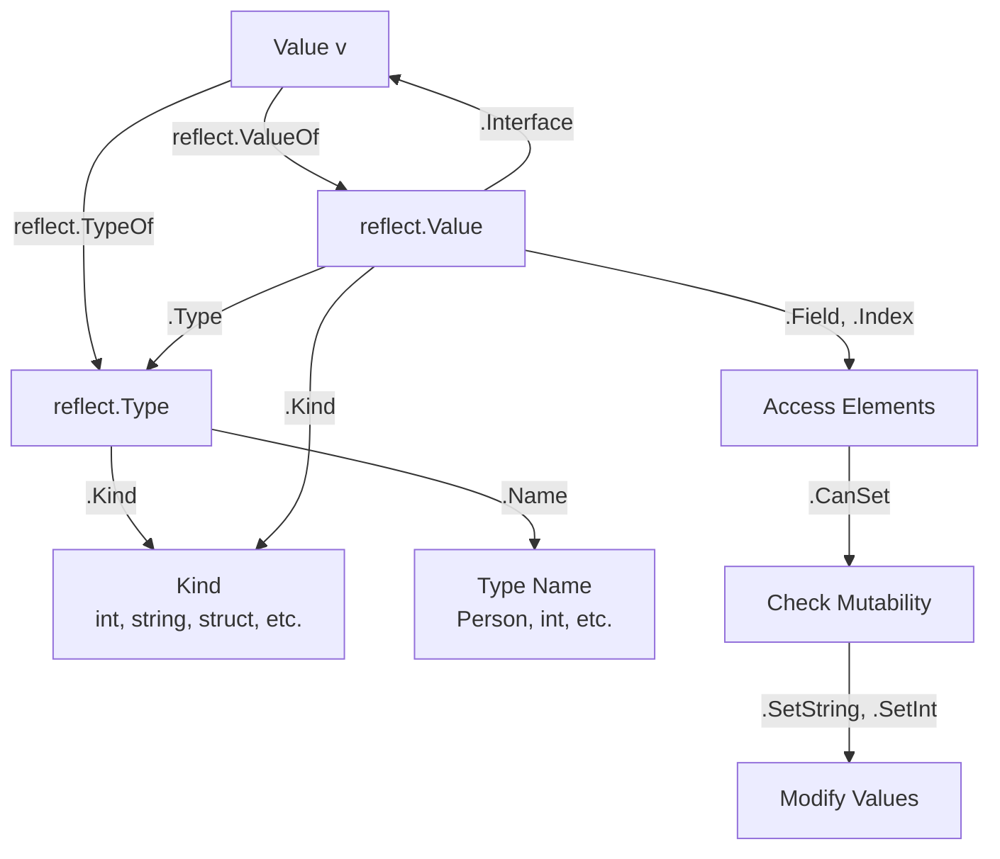
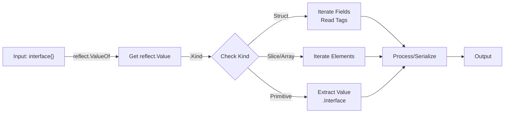
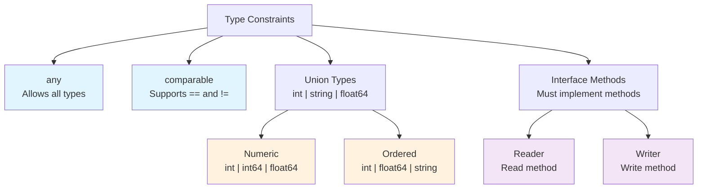
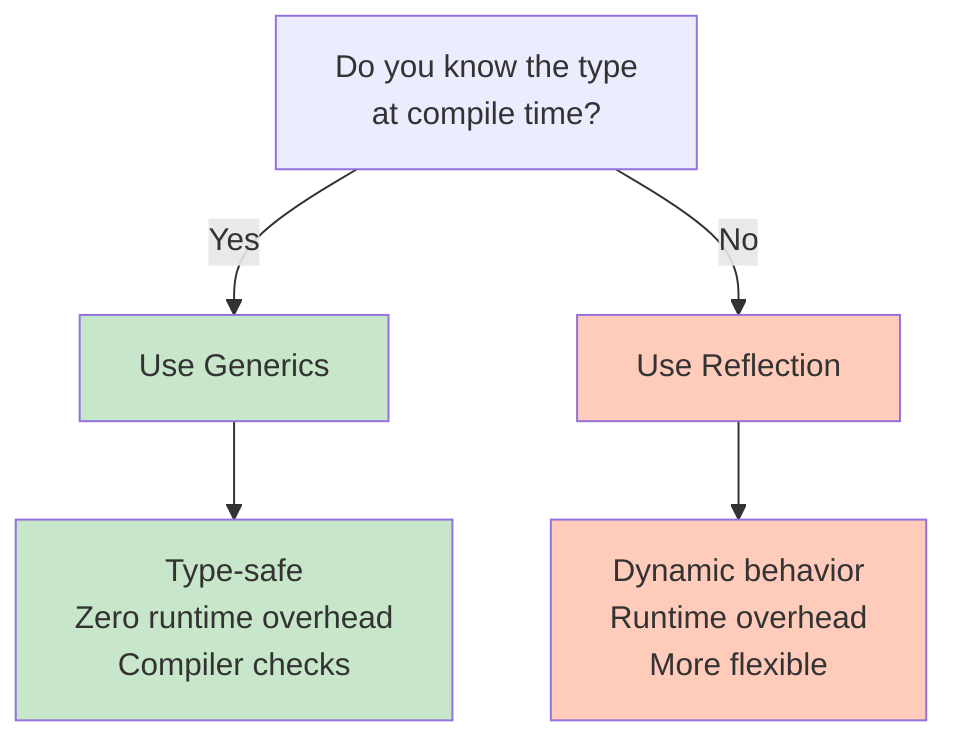

# Day 10: Reflection and Generics

## Learning Objectives

- Understand the reflect package for runtime type inspection
- Inspect and manipulate values at runtime
- Use reflection for flexible code
- Understand Go generics and type constraints
- Write generic functions and types
- Apply generics for type-safe, reusable code

---

## 1. Reflection Basics

### What is Reflection?

Reflection allows you to inspect and manipulate values at runtime. The `reflect` package provides tools to examine types and values dynamically. This is a powerful feature that enables writing flexible, generic code that can work with any type—but it comes at a performance cost since type information must be examined at runtime rather than compile time.

At its core, reflection bridges the gap between static typing (Go's compile-time type system) and dynamic typing (runtime type information). When you pass a value to a function as an `interface{}`, you lose compile-time type information. Reflection lets you recover that information at runtime.

**Key Functions**:
- `reflect.TypeOf(v)` - Get the type of a value (returns `reflect.Type`)
- `reflect.ValueOf(v)` - Get the value as a reflect.Value (returns `reflect.Value`)
- `v.Kind()` - Get the kind (int, string, struct, etc.) - this is the underlying category
- `v.Type()` - Get the full type information including package and name

**Understanding Type vs Kind**: The distinction between `Type()` and `Kind()` is important. `Type()` returns the exact type (e.g., `main.Person`), while `Kind()` returns the underlying category (e.g., `struct`). This is useful because you can check if something is a struct without knowing its exact type.

### The Reflection Flow



### Inspecting Types

Type inspection is the foundation of reflection. When you call `reflect.TypeOf()`, you get metadata about a value's type that you can query at runtime.

See `main.go` lines 9-12 for the `inspectType` function example. This function demonstrates:
- Getting the type with `reflect.TypeOf()`
- Extracting the Kind (the underlying category)
- Printing both the full type and its kind

The key insight is that `TypeOf()` works with any value, even if you don't know its type at compile time. This is why it accepts `interface{}` as a parameter.

### Inspecting Values

While `TypeOf()` gives you type metadata, `ValueOf()` gives you the actual value wrapped in a way that lets you inspect and manipulate it.

See `main.go` lines 15-18 for the `inspectValue` function example. This demonstrates:
- Getting the value with `reflect.ValueOf()`
- Accessing the value itself with `.Interface()`
- Getting both type and kind from a `reflect.Value`

The difference from `TypeOf()` is that `ValueOf()` preserves the actual data, allowing you to extract it later with `.Interface()` or access individual elements.

### Working with Structs

Structs are particularly useful with reflection because you can iterate over their fields and access them by name or index.

See `main.go` lines 21-37 for the `inspectStruct` function example. This demonstrates:
- Using `NumField()` to count fields
- Getting field metadata with `Field(i)`
- Accessing field values with `Field(i)` on the value
- Printing field names, values, and types

The `Person` struct (lines 21-24) is used throughout the reflection examples. This pattern is the foundation for serialization libraries like JSON marshalers.

### Modifying Values

One of the most powerful aspects of reflection is the ability to modify values at runtime. However, this requires careful handling of pointers and mutability checks.

See `main.go` lines 40-49 for the `modifyValue` function example. Key points:
- You must pass a **pointer** to modify a value (hence `.Elem()` to dereference)
- Always check `IsValid()` before accessing a field
- Always check `CanSet()` before modifying a field
- Use type-specific setters like `SetString()`, `SetInt()`, etc.

**Important**: Attempting to modify an unexported field (lowercase name) or a read-only value will panic. The `CanSet()` check prevents this.

---

## 2. Reflection Use Cases

Reflection shines in scenarios where you need to handle multiple types uniformly. Here are the most common real-world applications:

### Generic Printer

A generic printer function demonstrates how reflection enables writing code that works with any type. This is particularly useful for debugging, logging, and pretty-printing data structures.

The key insight is using `Kind()` to branch on the underlying type category, then handling each case appropriately. For structs, you iterate fields; for slices, you iterate elements; for primitives, you print directly.

The pattern is to:
1. Get the `reflect.Value` with `reflect.ValueOf()`
2. Check the `Kind()` to determine the type category
3. Handle each kind appropriately (Struct, Slice, primitive, etc.)
4. For structs, iterate fields with `NumField()` and `Field(i)`
5. For slices, iterate elements with `Len()` and `Index(i)`

This pattern is the foundation for:
- Pretty-printing in debuggers
- Custom logging formatters
- Generic serialization helpers

**Why this matters**: Without reflection, you'd need to write separate functions for each type. With reflection, one function handles them all.

### Serialization and Deserialization

Reflection is essential for JSON marshaling/unmarshaling. Libraries like `encoding/json` use reflection to:
- Iterate struct fields and read their tags (e.g., `json:"fieldName"`)
- Convert between JSON types and Go types
- Handle nested structures recursively

This is why JSON tags exist: they provide metadata that reflection can read at runtime to customize serialization behavior.

### Type Checking at Runtime

Sometimes you need to verify that a value is of a specific type at runtime. While type assertions (`v.(Type)`) are preferred when possible, reflection allows checking types dynamically.

**Example use case**: A function that accepts `interface{}` and needs to validate its type before processing.

### Reflection Workflow Diagram



**Performance Note**: Reflection has overhead. For performance-critical code, consider:
- Code generation instead of runtime reflection
- Type-specific implementations for hot paths
- Caching reflection metadata if doing repeated operations

---

## 3. Go Generics

Generics (introduced in Go 1.18) provide a way to write type-safe, reusable code without reflection. Instead of using `interface{}` and losing type information, generics let you write functions and types that work with multiple types while maintaining compile-time type safety.

### The Problem Generics Solve

Before generics, Go developers had three options:
1. **Write separate functions for each type** - Lots of code duplication
2. **Use `interface{}`** - Lose type safety, need runtime type assertions
3. **Use reflection** - Flexible but slow and error-prone

Generics provide a fourth option: write once, use with many types, all type-safe.

### Generic Functions

A generic function uses **type parameters** (written in square brackets) to accept any type that satisfies a constraint.

See `main.go` lines 52-59 for the `Min` function example. This demonstrates:
- Type parameter syntax: `[T interface { int | int64 | float64 | string }]`
- Using the type parameter in the function signature and body
- The compiler generates a separate version for each concrete type used

**Key insight**: The compiler performs "monomorphization" - it generates a separate function for `Min[int]`, `Min[float64]`, etc. This means generics have zero runtime overhead compared to writing the functions by hand.

### Type Constraints

A **constraint** specifies which types are allowed for a type parameter. Constraints are interfaces that use the `|` (union) operator to list allowed types.

**Built-in constraints**:
- `any` - Allows any type (equivalent to `interface{}`)
- `comparable` - Allows types that support `==` and `!=`

**Custom constraints** let you define which types are valid:

See `main.go` lines 85-91 for the `Numeric` constraint and `Add` function. This demonstrates:
- Defining a constraint as an interface with union types
- Using the constraint in a generic function
- The constraint ensures only `int`, `int64`, or `float64` can be used

### Generic Type Constraints Hierarchy



### Generic Types

You can also make structs, interfaces, and methods generic.

See `main.go` lines 62-82 for the `Stack[T]` type example. This demonstrates:
- Generic struct definition: `type Stack[T any] struct`
- Generic methods: `func (s *Stack[T]) Push(item T)`
- Using the type parameter in method signatures
- The zero value pattern: `var zero T` for returning empty values

**Why this matters**: A single `Stack` implementation works for `Stack[int]`, `Stack[string]`, `Stack[any custom type]` - all type-safe.

### When to Use Generics

Use generics when:
- You're building **collections** (lists, stacks, queues, maps)
- You have **algorithms** that work the same way regardless of type
- You want **type safety** without reflection overhead
- The type is **known at compile time**

**Example scenarios**:
- Generic slice utilities: `Filter[T]`, `Map[T]`, `Reduce[T]`
- Generic data structures: `LinkedList[T]`, `BinaryTree[T]`
- Generic algorithms: `Sort[T]`, `Search[T]`

### Avoiding Over-Generalization

A common mistake is making code too generic. Consider:

```go
// Too generic - loses clarity
func Process[T any](data T) T { ... }

// Better - specific constraint
func Process[T Numeric](data T) T { ... }

// Even better - specific types if only a few
func ProcessInt(data int) int { ... }
func ProcessFloat(data float64) float64 { ... }
```

**Rule of thumb**: Use generics when you have 3+ types that need the same logic. For 1-2 types, write specific functions.

---

## 4. Reflection vs Generics

Both reflection and generics enable flexible, reusable code, but they solve different problems and have different tradeoffs.

### Decision Tree: When to Use Each



### Detailed Comparison

| Aspect | Reflection | Generics |
|--------|-----------|----------|
| **Type Safety** | Runtime checks needed | Compile-time checks |
| **Performance** | Slower (runtime overhead) | Zero overhead (monomorphization) |
| **Flexibility** | Very flexible (any type) | Limited by constraints |
| **Complexity** | More complex, error-prone | Simpler, compiler helps |
| **Compile Time** | Fast | Slower (generates code) |
| **Binary Size** | Smaller | Larger (multiple versions) |

### When to Use Reflection

Use reflection when:
- **Type is unknown at compile time** - You're working with `interface{}` from user input or external sources
- **Serialization/deserialization** - JSON, XML, Protocol Buffers all use reflection
- **Introspection and metaprogramming** - Examining struct tags, field names, method signatures
- **Framework code** - Dependency injection, ORM, testing frameworks
- **Dynamic dispatch** - Calling methods by name at runtime

**Example**: A JSON unmarshaler must handle any struct type, so it uses reflection to read field tags and set values.

### When to Use Generics

Use generics when:
- **Type is known at compile time** - You're writing library code that will be used with specific types
- **Collections and data structures** - Lists, stacks, queues, trees
- **Algorithms** - Sorting, searching, filtering that work the same way for multiple types
- **Type safety is important** - You want compiler help catching errors
- **Performance matters** - You can't afford reflection overhead

**Example**: A `Filter[T]` function that works with `[]int`, `[]string`, etc. - the type is known when you call it.

### Example Comparison

See `main.go` for these patterns:

**Reflection approach** (lines 26-37 for `inspectStruct`):
- Works with any struct type
- Must check `IsValid()` and `CanSet()` at runtime
- Slower due to reflection overhead
- More flexible but error-prone

**Generics approach** (lines 62-82 for `Stack[T]`):
- Type-safe: compiler ensures you're using it correctly
- Zero runtime overhead
- Less flexible: only works with types that match the constraint
- Simpler and safer

### Performance Implications

Reflection has measurable overhead:
- Each `reflect.ValueOf()` call allocates memory
- Type assertions and field lookups are slower than direct access
- Not suitable for tight loops or performance-critical code

Generics have no runtime overhead:
- The compiler generates specialized code for each type
- Like writing the function by hand for each type
- Suitable for any performance-critical code

**Trade-off**: Generics increase compile time and binary size because the compiler generates multiple versions of the code.

---

## 5. Best Practices

### Reflection Best Practices

**Do's**:
- **Check before accessing**: Always call `IsValid()` before accessing a field or element
- **Check before modifying**: Always call `CanSet()` before attempting to modify a value
- **Use type-specific setters**: Use `SetString()`, `SetInt()`, etc. instead of generic `Set()`
- **Document reflection usage**: Make it clear why reflection is necessary
- **Cache reflection metadata**: If doing repeated reflection on the same type, cache the `reflect.Type`
- **Handle panics**: Wrap reflection code in error handling since panics can occur

**Don'ts**:
- **Don't use reflection for performance-critical code**: The overhead is significant
- **Don't ignore error cases**: Reflection can panic if you access invalid fields
- **Don't modify unexported fields**: Even with reflection, you can't modify lowercase fields
- **Don't use reflection when generics would work**: Prefer generics for type-safe code

**Example pattern**:
```go
// Good: Check validity and mutability
val := reflect.ValueOf(ptr).Elem()
field := val.FieldByName("Name")
if field.IsValid() && field.CanSet() {
    field.SetString("value")
}

// Bad: No checks, will panic on invalid field
field := val.FieldByName("Name")
field.SetString("value")  // Panics if field doesn't exist
```

### Generics Best Practices

**Do's**:
- **Use meaningful type parameter names**: `T` for single type, `K`/`V` for key/value, `E` for element
- **Define specific constraints**: Use `Numeric`, `Ordered`, etc. instead of `any` when possible
- **Keep generic code simple**: Complex generic code is hard to understand and debug
- **Document constraints**: Explain what types are allowed and why
- **Test with multiple types**: Ensure your generic code works with all intended types

**Don'ts**:
- **Don't over-generalize**: Not every function needs to be generic
- **Don't use `any` when a specific constraint would work**: `any` loses type safety
- **Don't create complex constraint hierarchies**: Keep constraints simple and understandable
- **Don't ignore compile-time errors**: The compiler is your friend; fix all warnings

**Example pattern**:
```go
// Good: Specific constraint, clear intent
func Filter[T comparable](items []T, target T) []T {
    // ...
}

// Bad: Too generic, loses clarity
func Process[T any](data T) T {
    // ...
}
```

### Common Pitfalls

**Reflection Pitfalls**:
1. **Panicking on invalid operations** - Forgetting to check `IsValid()` or `CanSet()`
2. **Type mismatches** - Using `SetInt()` on a string field
3. **Unexported field access** - Trying to modify lowercase fields
4. **Performance degradation** - Using reflection in tight loops
5. **Nil pointer dereference** - Not checking for nil before calling `.Elem()`

**Generics Pitfalls**:
1. **Over-constraining** - Making constraints too restrictive
2. **Under-constraining** - Using `any` when you need specific behavior
3. **Constraint confusion** - Misunderstanding what a constraint allows
4. **Monomorphization explosion** - Creating too many type instantiations
5. **Circular dependencies** - Generic types referencing themselves incorrectly

---

## Key Takeaways

1. **Reflection enables runtime introspection** - Inspect types and values dynamically using `TypeOf()` and `ValueOf()`
2. **Type vs Kind distinction** - `Type()` is exact, `Kind()` is the underlying category
3. **Reflection requires safety checks** - Always verify `IsValid()` and `CanSet()` before operations
4. **Reflection has performance cost** - Avoid in tight loops and performance-critical code
5. **Generics provide compile-time type safety** - Reusable code without reflection overhead
6. **Type constraints limit flexibility** - Use `any` for maximum flexibility, specific constraints for safety
7. **Monomorphization** - Compiler generates separate code for each type, zero runtime overhead
8. **Choose based on when type is known** - Generics if known at compile time, reflection if unknown
9. **Reflection for frameworks** - JSON, ORM, DI containers rely on reflection
10. **Generics for collections** - Use for lists, stacks, queues, and algorithms
11. **Document your choice** - Make clear why you chose reflection or generics
12. **Test thoroughly** - Both need careful testing with multiple types

---

## Practice Exercises

To solidify your understanding, implement the functions in `exercise.go`:

1. **ExerciseTypeInspection** - Use `reflect.TypeOf()` to get the Kind of a value
2. **ExerciseStructFields** - Count struct fields using reflection
3. **ExerciseModifyStructField** - Modify a struct field using reflection
4. **ExerciseGenericMin** - Write a generic function with type constraints
5. **ExerciseGenericStack** - Create and use a generic Stack type
6. **ExerciseGenericFilter** - Write a generic filter function with predicates

Run tests with: `go test -v`

---

## Further Reading

- [Go Reflection Documentation](https://pkg.go.dev/reflect) - Official reflect package reference
- [Go Generics Tutorial](https://go.dev/doc/tutorial/generics) - Getting started with generics
- [Go Generics Proposal](https://go.googlesource.com/proposal/+/refs/heads/master/design/43651-type-parameters.md) - Design details and rationale
- [Laws of Reflection](https://go.dev/blog/laws-of-reflection) - Deep dive into reflection principles
- [Generics Best Practices](https://go.dev/blog/intro-generics) - Official introduction and patterns
