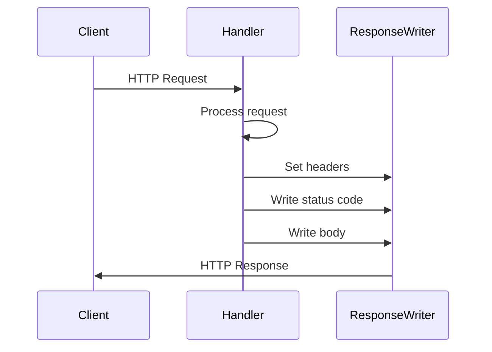
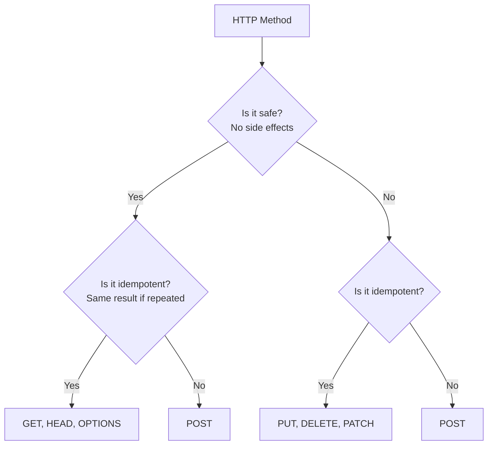
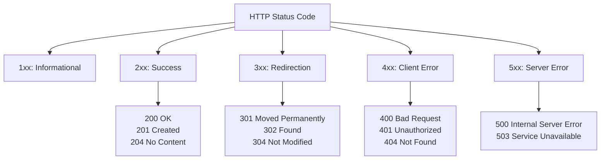
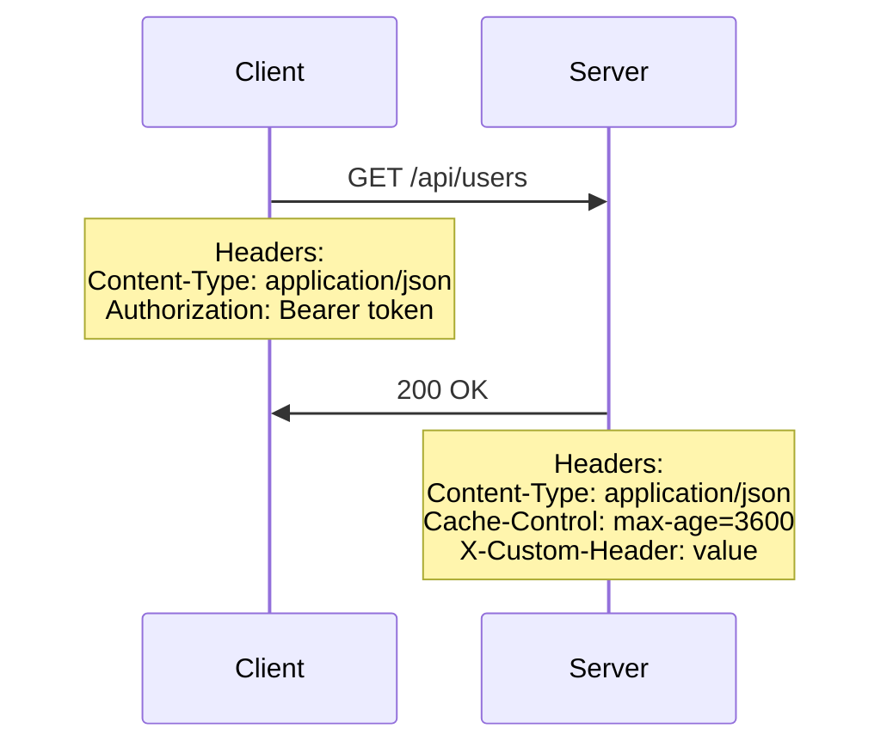
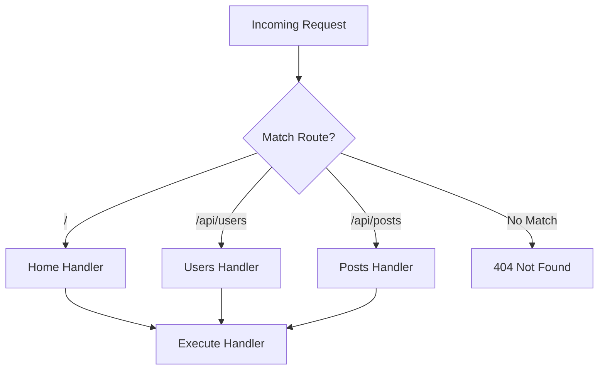
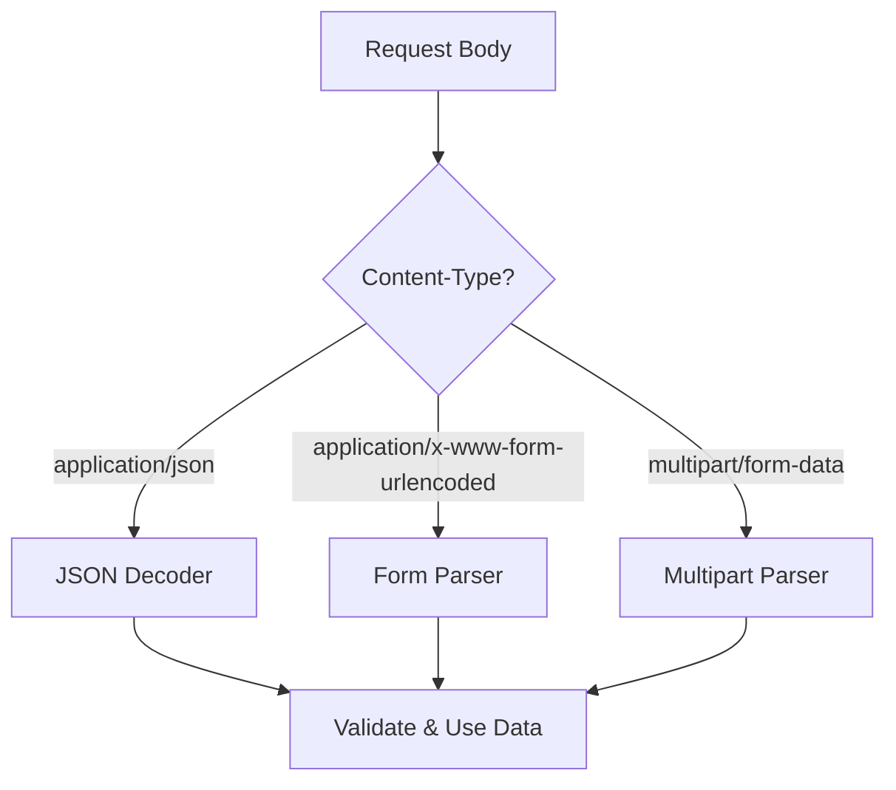
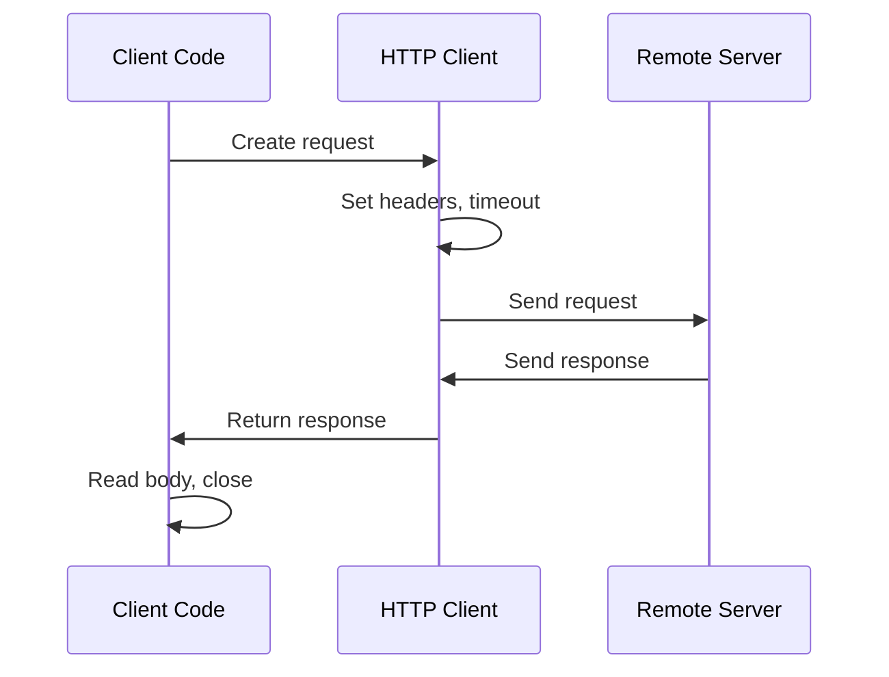
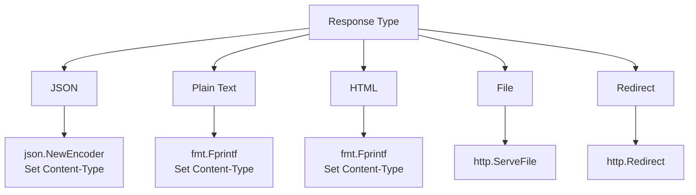

# Day 11: Web Fundamentals and HTTP

## Learning Objectives

- Build HTTP servers with the net/http package
- Handle HTTP requests and responses
- Understand HTTP methods, status codes, and headers
- Build HTTP clients for making requests
- Parse URLs and query parameters
- Work with request bodies and response writing
- Implement error handling patterns for HTTP
- Test HTTP handlers effectively

---

## 1. HTTP Server Basics

### Understanding the Request-Response Cycle

HTTP is a **stateless, request-response protocol**. When a client sends an HTTP request to a server, the server processes it and sends back a response. Go's `net/http` package provides built-in support for both building servers and making client requests.

Here's how the cycle works:



### Handler Functions

A handler function implements the `http.Handler` interface by accepting two parameters:
- `http.ResponseWriter` - Used to write the response
- `*http.Request` - Contains all request data

**Why handlers?** Handlers decouple request processing logic from the HTTP server, making code testable and reusable.

**Handler signature:**
```go
func(http.ResponseWriter, *http.Request)
```

**ResponseWriter interface** - Used to construct HTTP responses:
- `Header()` - Returns a map of response headers
- `Write([]byte)` - Writes response body data
- `WriteHeader(statusCode)` - Sets the HTTP status code

See main.go lines 14-18 for a simple handler example:

```go
func handler(w http.ResponseWriter, r *http.Request) {
    w.Header().Set("Content-Type", "text/plain")
    w.WriteHeader(http.StatusOK)
    fmt.Fprintf(w, "Hello, World!")
}
```

**Request object** - Contains all information about the incoming request:
```go
func handler(w http.ResponseWriter, r *http.Request) {
    method := r.Method           // GET, POST, etc.
    path := r.URL.Path           // /api/users
    query := r.URL.Query()       // ?id=123&name=alice
    body := r.Body               // Request body (io.ReadCloser)
    headers := r.Header          // Request headers
}
```

#### Common Pitfalls

**Pitfall 1: Calling WriteHeader multiple times**
```go
// ❌ WRONG - Only the first WriteHeader call takes effect
w.WriteHeader(http.StatusOK)
w.WriteHeader(http.StatusInternalServerError)  // Ignored!
```
**Solution:** Call `WriteHeader` exactly once, before writing the body.

**Pitfall 2: Writing headers after the body**
```go
// ❌ WRONG - Headers must be set before writing body
fmt.Fprintf(w, "Response body")
w.Header().Set("Content-Type", "text/plain")  // Too late!
```
**Solution:** Always set headers before calling `Write` or `WriteHeader`.

**Pitfall 3: Not closing request bodies**
When reading request bodies, always defer close to avoid resource leaks:
```go
// ✓ CORRECT
defer r.Body.Close()
body, err := io.ReadAll(r.Body)
```

---

## 2. HTTP Methods

### Understanding HTTP Methods

HTTP methods define the **semantic intent** of a request. Each method has specific meaning and expected behavior:



**Safe methods** (read-only, no side effects): GET, HEAD, OPTIONS
**Idempotent methods** (same result if repeated): GET, HEAD, PUT, DELETE, OPTIONS

See main.go lines 21-34 for method handling example:

```go
func methodHandler(w http.ResponseWriter, r *http.Request) {
    switch r.Method {
    case http.MethodGet:
        fmt.Fprintf(w, "GET request received")
    case http.MethodPost:
        fmt.Fprintf(w, "POST request received")
    case http.MethodPut:
        fmt.Fprintf(w, "PUT request received")
    case http.MethodDelete:
        fmt.Fprintf(w, "DELETE request received")
    default:
        http.Error(w, "Method not allowed", http.StatusMethodNotAllowed)
    }
}
```

**Method semantics:**
- **GET** - Retrieve a resource (safe, idempotent)
- **POST** - Create a new resource or trigger an action (not idempotent)
- **PUT** - Replace an entire resource (idempotent)
- **DELETE** - Remove a resource (idempotent)
- **PATCH** - Partially update a resource (may or may not be idempotent)
- **HEAD** - Like GET but without response body (safe, idempotent)
- **OPTIONS** - Describe communication options (safe, idempotent)

#### Common Pitfalls

**Pitfall: Using GET for state-changing operations**
```go
// ❌ WRONG - GET should never modify state
http.HandleFunc("/delete-user", func(w http.ResponseWriter, r *http.Request) {
    deleteUserFromDB(r.URL.Query().Get("id"))  // Bad!
})
```
**Solution:** Use POST, PUT, or DELETE for operations that modify state.

**Pitfall: Not respecting method semantics**
```go
// ❌ WRONG - POST should not be idempotent
func createHandler(w http.ResponseWriter, r *http.Request) {
    // If called twice, creates two users instead of one
    createUser(r.Body)
}
```
**Solution:** Design POST handlers to be idempotent when possible, or document non-idempotent behavior.

---

## 3. Status Codes

### Understanding HTTP Status Codes

Status codes communicate the **outcome of a request**. They're grouped into five categories:



See main.go lines 87-107 for status code handling:

```go
func statusHandler(w http.ResponseWriter, r *http.Request) {
    status := r.URL.Query().Get("code")
    
    switch status {
    case "201":
        w.WriteHeader(http.StatusCreated)
        fmt.Fprintf(w, "Resource created")
    case "400":
        w.WriteHeader(http.StatusBadRequest)
        fmt.Fprintf(w, "Bad request")
    case "404":
        w.WriteHeader(http.StatusNotFound)
        fmt.Fprintf(w, "Not found")
    case "500":
        w.WriteHeader(http.StatusInternalServerError)
        fmt.Fprintf(w, "Server error")
    default:
        w.WriteHeader(http.StatusOK)
        fmt.Fprintf(w, "OK")
    }
}
```

**Common status codes:**
- **200 OK** - Request succeeded
- **201 Created** - Resource created successfully
- **204 No Content** - Success but no response body
- **400 Bad Request** - Client sent invalid data
- **401 Unauthorized** - Authentication required
- **403 Forbidden** - Authenticated but not authorized
- **404 Not Found** - Resource doesn't exist
- **500 Internal Server Error** - Server error
- **503 Service Unavailable** - Server temporarily unavailable

#### Common Pitfalls

**Pitfall: Always returning 200 OK**
```go
// ❌ WRONG - Returns 200 even when user not found
func getUser(w http.ResponseWriter, r *http.Request) {
    user := findUser(r.URL.Query().Get("id"))
    if user == nil {
        fmt.Fprintf(w, "User not found")  // Still 200!
        return
    }
    json.NewEncoder(w).Encode(user)
}
```
**Solution:** Set appropriate status codes before writing the body.

**Pitfall: Returning 500 for client errors**
```go
// ❌ WRONG - Returns 500 for invalid input
w.WriteHeader(http.StatusInternalServerError)
fmt.Fprintf(w, "Invalid email format")
```
**Solution:** Return 400 for client errors, 500 only for server errors.

---

## 4. Headers

### Understanding HTTP Headers

Headers provide **metadata** about requests and responses. They're key-value pairs that communicate important information like content type, authentication, and caching directives.



See main.go lines 110-118 for header handling:

```go
func headersHandler(w http.ResponseWriter, r *http.Request) {
    contentType := r.Header.Get("Content-Type")
    userAgent := r.Header.Get("User-Agent")
    
    w.Header().Set("Content-Type", "text/plain")
    w.Header().Set("X-Custom-Header", "custom-value")
    
    fmt.Fprintf(w, "Content-Type: %s\nUser-Agent: %s\n", contentType, userAgent)
}
```

**Common request headers:**
- `Content-Type` - Format of request body (e.g., `application/json`)
- `Authorization` - Authentication credentials
- `User-Agent` - Client software identification
- `Accept` - Desired response format
- `Accept-Encoding` - Compression support

**Common response headers:**
- `Content-Type` - Format of response body
- `Content-Length` - Size of response body
- `Cache-Control` - Caching directives
- `Set-Cookie` - Set cookies on client
- `Location` - Redirect destination

#### Common Pitfalls

**Pitfall: Forgetting to set Content-Type**
```go
// ❌ WRONG - Client doesn't know it's JSON
w.Header().Set("Content-Type", "application/json")  // Too late!
json.NewEncoder(w).Encode(data)
```
**Solution:** Set Content-Type before writing the body.

**Pitfall: Not validating Content-Type in requests**
```go
// ❌ WRONG - Assumes JSON without checking
func handler(w http.ResponseWriter, r *http.Request) {
    var data map[string]interface{}
    json.NewDecoder(r.Body).Decode(&data)  // May fail silently
}
```
**Solution:** Check Content-Type header before parsing.

---

## 5. Routing

### Understanding URL Routing

Routing maps incoming URLs to handler functions. Go's `http.ServeMux` provides basic pattern matching for URL paths.



See main.go lines 121-133 for routing setup:

```go
func setupRoutes() *http.ServeMux {
    mux := http.NewServeMux()
    
    mux.HandleFunc("/", simpleHandler)
    mux.HandleFunc("/method", methodHandler)
    mux.HandleFunc("/query", queryHandler)
    mux.HandleFunc("/json-request", jsonRequestHandler)
    mux.HandleFunc("/json-response", jsonResponseHandler)
    mux.HandleFunc("/status", statusHandler)
    mux.HandleFunc("/headers", headersHandler)
    
    return mux
}
```

**Route patterns:**
- Exact match: `/api/users` matches only `/api/users`
- Prefix match: `/api/` matches `/api/users`, `/api/posts`, etc.
- Root: `/` matches all paths not matched by other patterns

#### Common Pitfalls

**Pitfall: Route ordering with overlapping patterns**
```go
// ❌ WRONG - Order matters! "/" matches everything
mux.HandleFunc("/", homeHandler)
mux.HandleFunc("/api/users", usersHandler)  // Never reached!
```
**Solution:** Register more specific routes before general ones.

**Pitfall: Not handling trailing slashes**
```go
// ❌ WRONG - "/api/users" and "/api/users/" are different
mux.HandleFunc("/api/users", handler)
// Request to "/api/users/" returns 404
```
**Solution:** Be consistent with trailing slashes or handle both.

---

## 6. Request Body

### Parsing Request Bodies

Request bodies contain data sent by the client. Common formats are JSON and form data.



**JSON parsing** - See main.go lines 57-71:

```go
type User struct {
    Name  string `json:"name"`
    Email string `json:"email"`
}

func jsonRequestHandler(w http.ResponseWriter, r *http.Request) {
    if r.Method != http.MethodPost {
        http.Error(w, "Method not allowed", http.StatusMethodNotAllowed)
        return
    }
    
    var user User
    if err := json.NewDecoder(r.Body).Decode(&user); err != nil {
        http.Error(w, "Invalid JSON", http.StatusBadRequest)
        return
    }
    
    w.Header().Set("Content-Type", "text/plain")
    fmt.Fprintf(w, "Created user: %s (%s)", user.Name, user.Email)
}
```

**Form parsing:**
```go
func formHandler(w http.ResponseWriter, r *http.Request) {
    if err := r.ParseForm(); err != nil {
        http.Error(w, "Parse error", http.StatusBadRequest)
        return
    }
    
    name := r.FormValue("name")
    email := r.FormValue("email")
    
    fmt.Fprintf(w, "Name: %s, Email: %s", name, email)
}
```

#### Common Pitfalls

**Pitfall: Not validating JSON structure**
```go
// ❌ WRONG - Assumes all fields are present
var user User
json.NewDecoder(r.Body).Decode(&user)
fmt.Fprintf(w, "Name: %s", user.Name)  // Empty if not provided!
```
**Solution:** Validate required fields after decoding.

**Pitfall: Not handling EOF errors**
```go
// ❌ WRONG - Empty body causes error
var user User
if err := json.NewDecoder(r.Body).Decode(&user); err != nil {
    http.Error(w, "Invalid JSON", http.StatusBadRequest)  // Misleading!
}
```
**Solution:** Distinguish between EOF (empty body) and parse errors.

**Pitfall: Not checking Content-Type**
```go
// ❌ WRONG - Assumes JSON without checking
var user User
json.NewDecoder(r.Body).Decode(&user)  // May fail for form data
```
**Solution:** Validate Content-Type before parsing.

---

## 7. HTTP Client

### Making HTTP Requests

Go's `net/http` package provides both simple functions and a customizable client for making requests.



**Simple GET request** - See main.go lines 136-153:

```go
func exampleGetRequest() (string, error) {
    resp, err := http.Get("https://api.example.com/users")
    if err != nil {
        return "", err
    }
    defer resp.Body.Close()
    
    body, err := io.ReadAll(resp.Body)
    if err != nil {
        return "", err
    }
    
    return string(body), nil
}
```

**POST request** - See main.go lines 156-180:

```go
func examplePostRequest() (string, error) {
    user := User{Name: "Alice", Email: "alice@example.com"}
    jsonData, _ := json.Marshal(user)
    
    resp, err := http.Post(
        "https://api.example.com/users",
        "application/json",
        bytes.NewBuffer(jsonData),
    )
    if err != nil {
        return "", err
    }
    defer resp.Body.Close()
    
    body, err := io.ReadAll(resp.Body)
    return string(body), err
}
```

**Custom client with timeout** - See main.go lines 183-206:

```go
func exampleCustomClient() (string, error) {
    client := &http.Client{
        Timeout: 10 * time.Second,
    }
    
    req, _ := http.NewRequest("GET", "https://api.example.com/users", nil)
    req.Header.Set("Authorization", "Bearer token")
    
    resp, err := client.Do(req)
    if err != nil {
        return "", err
    }
    defer resp.Body.Close()
    
    body, err := io.ReadAll(resp.Body)
    return string(body), err
}
```

#### Common Pitfalls

**Pitfall: Not setting timeouts**
```go
// ❌ WRONG - Will hang indefinitely if server doesn't respond
resp, err := http.Get("https://slow-server.com/api")
```
**Solution:** Always set a timeout on the client.

**Pitfall: Not closing response bodies**
```go
// ❌ WRONG - Resource leak, connection not returned to pool
resp, _ := http.Get(url)
body, _ := io.ReadAll(resp.Body)
// Body never closed!
```
**Solution:** Always defer close the response body.

**Pitfall: Not reusing HTTP client**
```go
// ❌ WRONG - Creates new client for each request, no connection pooling
for _, url := range urls {
    client := &http.Client{}  // New client each time!
    resp, _ := client.Get(url)
    resp.Body.Close()
}
```
**Solution:** Reuse a single client instance for multiple requests.

---

## 8. Response Writing

### Writing Different Response Types

Responses can contain different types of data. Choose the appropriate method based on content type.



**JSON response** - See main.go lines 74-84:

```go
func jsonResponseHandler(w http.ResponseWriter, r *http.Request) {
    data := map[string]interface{}{
        "status": "success",
        "data": map[string]string{
            "message": "Hello from API",
        },
    }
    
    w.Header().Set("Content-Type", "application/json")
    json.NewEncoder(w).Encode(data)
}
```

**File response:**
```go
func fileHandler(w http.ResponseWriter, r *http.Request) {
    http.ServeFile(w, r, "file.txt")
}
```

**Redirect:**
```go
func redirectHandler(w http.ResponseWriter, r *http.Request) {
    http.Redirect(w, r, "/new-path", http.StatusMovedPermanently)
}
```

#### Common Pitfalls

**Pitfall: Writing to response after WriteHeader**
```go
// ❌ WRONG - Headers already sent
w.WriteHeader(http.StatusOK)
w.Header().Set("X-Custom", "value")  // Too late!
```
**Solution:** Set all headers before calling WriteHeader.

**Pitfall: Not streaming large responses**
```go
// ❌ WRONG - Loads entire file into memory
data, _ := ioutil.ReadFile("large-file.bin")
w.Write(data)
```
**Solution:** Use `io.Copy` or stream directly to ResponseWriter.

---

## 9. Query Parameters

Query parameters are key-value pairs in the URL after the `?` character. They're commonly used for filtering, sorting, and pagination.

See main.go lines 37-49 for query parameter handling:

```go
func queryHandler(w http.ResponseWriter, r *http.Request) {
    query := r.URL.Query()
    name := query.Get("name")
    age := query.Get("age")
    
    if name == "" {
        http.Error(w, "name parameter required", http.StatusBadRequest)
        return
    }
    
    w.Header().Set("Content-Type", "text/plain")
    fmt.Fprintf(w, "Name: %s, Age: %s", name, age)
}
```

**Accessing query parameters:**
```go
query := r.URL.Query()

// Get single value (returns empty string if not present)
name := query.Get("name")

// Get all values for a parameter
tags := query["tag"]  // Returns []string

// Check if parameter exists
if _, ok := query["filter"]; ok {
    fmt.Fprintf(w, "Filter applied")
}
```

---

## 10. Error Handling Patterns

### HTTP Error Responses

Proper error handling ensures clients understand what went wrong.

**Validation errors:**
```go
func createUserHandler(w http.ResponseWriter, r *http.Request) {
    var user User
    if err := json.NewDecoder(r.Body).Decode(&user); err != nil {
        http.Error(w, "Invalid JSON: "+err.Error(), http.StatusBadRequest)
        return
    }
    
    if user.Email == "" {
        http.Error(w, "Email is required", http.StatusBadRequest)
        return
    }
}
```

**Resource not found:**
```go
func getUserHandler(w http.ResponseWriter, r *http.Request) {
    user := findUser(r.URL.Query().Get("id"))
    if user == nil {
        http.Error(w, "User not found", http.StatusNotFound)
        return
    }
    
    w.Header().Set("Content-Type", "application/json")
    json.NewEncoder(w).Encode(user)
}
```

**Server errors:**
```go
func processHandler(w http.ResponseWriter, r *http.Request) {
    result, err := expensiveOperation()
    if err != nil {
        http.Error(w, "Internal server error", http.StatusInternalServerError)
        log.Printf("Error in processHandler: %v", err)
        return
    }
    
    json.NewEncoder(w).Encode(result)
}
```

---

## 11. Testing HTTP Handlers

### Using httptest Package

Go's `httptest` package provides utilities for testing HTTP handlers without a real server.

**Testing a simple handler:**
```go
func TestSimpleHandler(t *testing.T) {
    req := httptest.NewRequest("GET", "/", nil)
    w := httptest.NewRecorder()
    
    simpleHandler(w, req)
    
    if w.Code != http.StatusOK {
        t.Errorf("Expected 200, got %d", w.Code)
    }
    
    if w.Body.String() != "Hello, World!" {
        t.Errorf("Unexpected body: %s", w.Body.String())
    }
}
```

**Testing with a test server:**
```go
func TestWithServer(t *testing.T) {
    mux := setupRoutes()
    server := httptest.NewServer(mux)
    defer server.Close()
    
    resp, err := http.Get(server.URL + "/json-response")
    if err != nil {
        t.Fatal(err)
    }
    defer resp.Body.Close()
    
    if resp.StatusCode != http.StatusOK {
        t.Errorf("Expected 200, got %d", resp.StatusCode)
    }
}
```

See exercise_test.go for comprehensive test examples.

---

## Key Takeaways

1. **HTTP handlers** - Functions that process requests and write responses
2. **Request-response cycle** - Understand the flow of data between client and server
3. **HTTP methods** - Each method has semantic meaning (GET, POST, PUT, DELETE)
4. **Status codes** - Communicate request outcome (2xx success, 4xx client error, 5xx server error)
5. **Headers** - Metadata that provides context about requests and responses
6. **Routing** - Map URLs to handler functions using ServeMux
7. **Request body parsing** - Extract and validate JSON and form data
8. **HTTP client** - Make requests to other servers with proper timeout and resource management
9. **Response writing** - Send JSON, HTML, files, or redirects to clients
10. **Error handling** - Return appropriate status codes and error messages
11. **Testing** - Use httptest to test handlers without a real server

---

## Further Reading

- [Go by Example: HTTP Server](https://gobyexample.com/http-servers) - Server basics
- [Go by Example: HTTP Client](https://gobyexample.com/http-clients) - Client basics
- [net/http Documentation](https://pkg.go.dev/net/http) - Official documentation
- [Effective Go: HTTP](https://golang.org/doc/effective_go#web) - Best practices
- [HTTP Status Codes](https://developer.mozilla.org/en-US/docs/Web/HTTP/Status) - Complete status code reference
