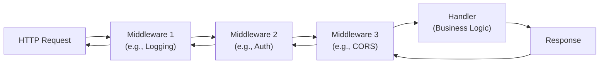
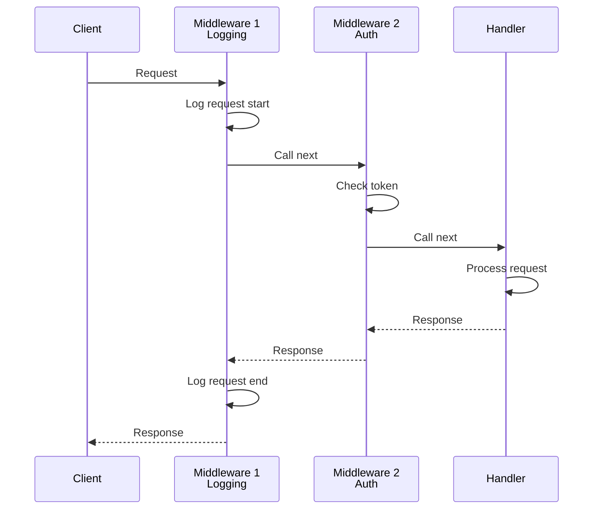

# Day 12: Routing and Middleware

## Learning Objectives

- Understand how HTTP routing directs requests to appropriate handlers
- Learn the middleware pattern for composing cross-cutting concerns
- Build reusable middleware chains for logging, authentication, and CORS
- Master context propagation through middleware layers
- Design and implement custom routers for specific application needs
- Apply advanced patterns like conditional and recovery middleware

---

## Introduction: Why Routing and Middleware Matter

In web applications, two critical concerns emerge:

1. **Routing**: Directing incoming HTTP requests to the correct handler based on the URL path
2. **Middleware**: Adding cross-cutting functionality (logging, authentication, error handling) that applies to multiple routes

Rather than duplicating this logic in every handler, we use middleware to wrap handlers and apply transformations. This follows the **separation of concerns** principle—each middleware handles one responsibility, and they compose together to form a complete request pipeline.

---

## 1. Custom Routers

### Why Custom Routers?

Go's standard library provides `http.ServeMux`, which handles basic routing. However, custom routers give you control over:
- How paths are matched (exact, prefix, regex patterns)
- Route registration and organization
- Error handling for unmatched routes
- Performance optimizations for your specific use case

### Basic Router Implementation

A simple router maps URL paths to handlers. The key insight is that a router itself is an `http.Handler`—it implements `ServeHTTP(w http.ResponseWriter, r *http.Request)`. This means a router can be passed to `http.ListenAndServe()` just like any other handler.

See `main.go` lines 12-33 for a complete Router implementation. The router:
- Stores routes in a map for O(1) lookup
- Implements `ServeHTTP` to match incoming requests against registered paths
- Returns 404 for unmatched paths

**Key insight**: By implementing the `http.Handler` interface, your custom router becomes composable with middleware and other handlers.

### Pattern-Based Routing

For more sophisticated routing, you can extend the basic router to support patterns:
- Prefix matching: `/api/*` matches `/api/users`, `/api/posts`, etc.
- Parameter extraction: `/users/:id` captures the ID from the URL
- Regex matching: `/posts/[0-9]+` matches numeric post IDs

The trade-off is complexity: pattern matching is slower than exact matching, so choose the approach that fits your needs.

---

## 2. Middleware Fundamentals

### What is Middleware?

Middleware is a function that wraps an HTTP handler to add behavior before and/or after the handler executes. Think of it as a decorator or interceptor pattern.

The middleware type signature is:
```
type Middleware func(http.Handler) http.Handler
```

This reads as: "a middleware takes an http.Handler and returns an http.Handler." The returned handler typically:
1. Performs some pre-processing
2. Calls the wrapped handler
3. Performs some post-processing

### Why Middleware?

Middleware solves a critical problem: **how do you add functionality to multiple handlers without duplicating code?**

For example, every handler might need to:
- Log the request
- Verify authentication
- Add CORS headers
- Generate a request ID for tracing

Without middleware, you'd write this code in every handler. With middleware, you write it once and compose it.

### Basic Middleware Pattern

See `main.go` lines 38-46 for the `loggingMiddleware` example. Notice the structure:

```
loggingMiddleware(next http.Handler) http.Handler
  ↓
  returns http.HandlerFunc (which is an http.Handler)
    ↓
    inside the handler function:
      1. Do something before: log the request
      2. Call next.ServeHTTP(w, r) to invoke the wrapped handler
      3. Do something after: log the duration
```

This pattern allows middleware to observe and modify the request/response lifecycle.

---

## 3. Middleware Chaining: Composing Behavior

### The Power of Composition

A single middleware adds one concern. But real applications need multiple concerns applied to the same handler. This is where chaining comes in.

### How Middleware Chaining Works



When you chain middlewares, each one wraps the next. The request flows through them in order, and the response flows back through them in reverse order.

**Important**: The order matters! Authentication should typically come before business logic, but after logging (so you log all requests, including failed auth attempts).

### Implementation

See `main.go` lines 95-100 for the `chain` function. It takes a handler and a list of middlewares, then wraps them in reverse order:

```
chain(handler, m1, m2, m3)
  ↓
  m3(m2(m1(handler)))
```

Why reverse order? Because we want the first middleware in the list to execute first on the request. By wrapping in reverse, we achieve this.

### Request Lifecycle Through a Chain



---

## 4. Common Middleware Patterns

### Logging Middleware

**Purpose**: Track all requests and responses for debugging and monitoring.

**How it works**: Record the request method, path, and client IP before the handler executes. After the handler completes, record the duration.

See `main.go` lines 38-46 for implementation. Logging middleware:
- Captures the start time before calling the handler
- Logs request details (method, path, client address)
- Measures and logs the duration after the handler completes

**When to use**: Apply logging to all routes to maintain an audit trail.

### Authentication Middleware

**Purpose**: Verify that the client is authorized before allowing access to protected resources.

**How it works**: Check for an authorization token in the request headers. If missing or invalid, return a 401 Unauthorized response. Otherwise, allow the request to proceed.

See `main.go` lines 48-67 for implementation. Authentication middleware:
- Extracts the token from the `Authorization` header
- Validates the token (in real applications, this might check a database or JWT signature)
- Returns 401 if validation fails
- Calls the handler only if validation succeeds

**When to use**: Apply to routes that require authentication (e.g., `/api/user/profile`, `/api/admin/settings`).

### CORS Middleware

**Purpose**: Handle Cross-Origin Resource Sharing (CORS) to allow browsers to make requests from different domains.

**How it works**: Set CORS headers on the response to indicate which origins, methods, and headers are allowed. Handle preflight OPTIONS requests.

See `main.go` lines 69-82 for implementation. CORS middleware:
- Sets `Access-Control-Allow-Origin` to permit cross-origin requests
- Sets `Access-Control-Allow-Methods` to list allowed HTTP methods
- Sets `Access-Control-Allow-Headers` to list allowed request headers
- Responds to OPTIONS requests immediately (preflight requests)

**When to use**: Apply to API routes that need to be accessible from web browsers on different domains.

### Request ID Middleware

**Purpose**: Generate a unique identifier for each request to enable request tracing across logs and services.

**How it works**: Generate a unique ID, add it to the request context, and set it as a response header.

See `main.go` lines 84-92 for implementation. Request ID middleware:
- Generates a unique ID (using timestamp in this example; UUID is better in production)
- Stores the ID in the request context
- Sets the ID as an HTTP response header (`X-Request-ID`)
- Passes the modified context to the handler

**When to use**: Apply to all routes in distributed systems where you need to correlate logs across services.

---

## 5. Context Propagation

### What is Context?

Go's `context.Context` is a mechanism for passing request-scoped data through a chain of function calls. In the context of HTTP middleware, it allows you to:
- Store user information extracted during authentication
- Pass request-specific data (request ID, user role, etc.)
- Implement cancellation and timeouts

### Why Context Matters

Without context, you'd need to:
- Add parameters to every function in the call chain
- Use global variables (bad practice)
- Store data in the request body (not appropriate for metadata)

Context solves this elegantly: middleware can add data, and handlers can retrieve it.

### How Context Flows Through Middleware

Middleware can modify the request's context using `context.WithValue()` and pass it to the next handler using `r.WithContext()`.

See `main.go` lines 103-117 for an example:
- `contextMiddleware` (lines 103-110) adds user and role to the context
- `contextAwareHandler` (lines 112-117) retrieves these values from the context

**Important**: Context values are immutable. `context.WithValue()` returns a new context; it doesn't modify the original.

### Type Assertions and Safety

When retrieving values from context, you must use type assertions:
```go
user := r.Context().Value("user").(string)
```

This can panic if the value is not a string. In production code, use a safer approach:
```go
user, ok := r.Context().Value("user").(string)
if !ok {
    // Handle missing or wrong type
}
```

Or use custom types as keys to avoid string collisions:
```go
type userKey string
const userContextKey userKey = "user"
ctx := context.WithValue(r.Context(), userContextKey, "alice")
user := r.Context().Value(userContextKey).(string)
```

---

## 6. Advanced Middleware Patterns

### Conditional Middleware

**Purpose**: Apply middleware only when a condition is met.

**Use case**: Apply authentication only to admin routes, or apply rate limiting only to public APIs.

The pattern is to wrap a middleware in a function that checks a condition before applying it.

### Recovery Middleware

**Purpose**: Catch panics in handlers and return a graceful error response instead of crashing the server.

**How it works**: Use `defer` and `recover()` to catch panics. Log the panic and return a 500 Internal Server Error.

See `main.go` lines 120-131 for implementation. Recovery middleware:
- Uses `defer` to set up a panic handler
- Calls `recover()` to catch any panic
- Logs the panic for debugging
- Returns a 500 error response to the client

**When to use**: Apply to all routes to prevent a single panicking handler from crashing the entire server.

---

## 7. Best Practices and Design Principles

### Single Responsibility

Each middleware should do one thing well. Don't create a "mega middleware" that handles logging, auth, CORS, and recovery. Instead, compose multiple focused middlewares.

### Order Matters

The order in which you chain middlewares affects behavior:
- **Recovery** should be outermost (catches panics from all inner middlewares)
- **Logging** should be early (logs all requests, including failed auth)
- **Authentication** should be before business logic
- **CORS** can be early (applies to all responses)

A typical order: `recovery → logging → CORS → auth → handler`

### Context Safety

- Use custom types as context keys to avoid collisions
- Always check type assertions in production code
- Document what values your middleware adds to context

### Error Handling

Middleware should handle errors gracefully:
- Don't panic; return appropriate HTTP status codes
- Log errors for debugging
- Return meaningful error messages to clients (without exposing internals)

---

## Key Takeaways

1. **Custom routers** implement `http.Handler` to control how requests are matched and dispatched
2. **Middleware** wraps handlers to add cross-cutting concerns without code duplication
3. **Middleware chaining** composes multiple middlewares to build complex request pipelines
4. **Logging** tracks requests and responses for debugging and monitoring
5. **Authentication** verifies user identity before allowing access
6. **CORS** enables cross-origin requests from browsers
7. **Request IDs** enable request tracing across distributed systems
8. **Context propagation** passes request-scoped data through the middleware chain
9. **Recovery middleware** prevents panics from crashing the server
10. **Composition** is the key to building maintainable, reusable middleware

---

## Further Reading

- [Go HTTP Handlers](https://pkg.go.dev/net/http) - Standard library documentation
- [Middleware Patterns](https://www.alexedwards.net/blog/making-and-using-middleware) - Design patterns and best practices
- [Context Package](https://pkg.go.dev/context) - Context propagation and cancellation
