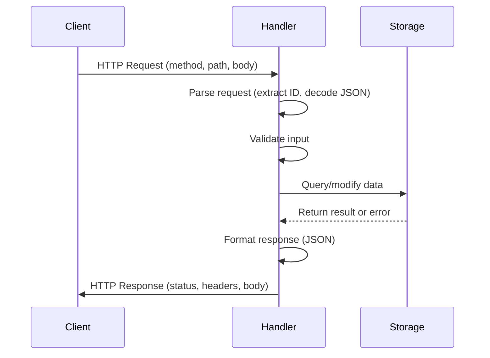
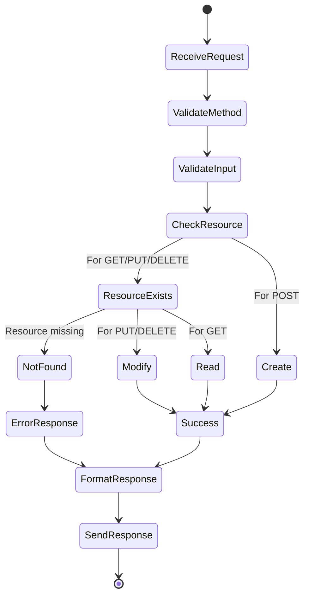
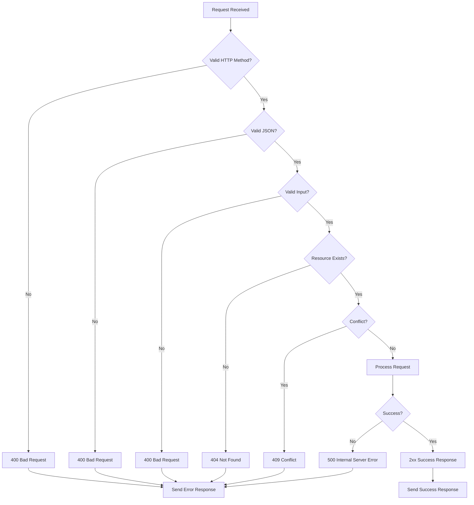
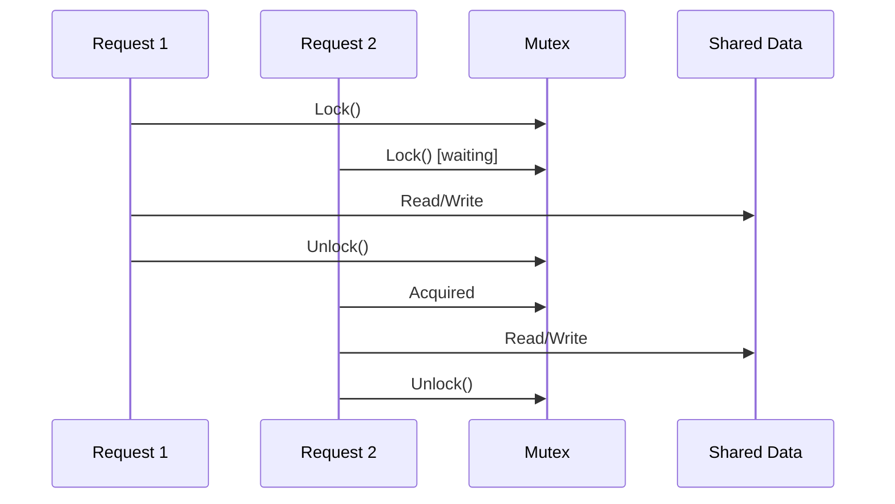
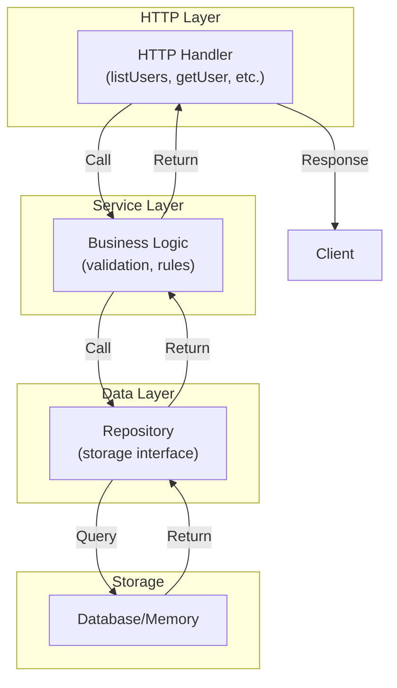

# Day 13: REST API Design

## Learning Objectives

- Design RESTful APIs following best practices
- Implement HTTP handlers for CRUD operations
- Implement error handling and validation
- Build scalable API architectures
- Understand concurrency and thread safety in APIs
- Apply advanced patterns for production systems

---

## 1. REST API Fundamentals

### What is REST?

REST (Representational State Transfer) is an architectural style for designing networked applications. It uses HTTP as a protocol and organizes functionality around **resources** rather than **actions**. A resource is any entity your API manages: users, posts, comments, products, etc.

### Resource-Based Design

REST APIs are built around resources, not procedures. Each resource has a unique identifier (URI) and can be manipulated using standard HTTP methods.

**Good REST design:**
- `/users` - Collection of users
- `/users/123` - Specific user with ID 123
- `/users/123/posts` - Posts belonging to user 123

**Poor design (RPC-style):**
- `/getUser?id=123` - Action-oriented, not resource-oriented
- `/createPost` - Verb in URL
- `/deleteComment` - Mixes actions with resources

### HTTP Methods and Semantics

Each HTTP method has specific semantics and should be used correctly:

- **GET**: Retrieve a resource (safe, idempotent, cacheable)
- **POST**: Create a new resource (not idempotent, not cacheable)
- **PUT**: Replace an entire resource (idempotent, not cacheable)
- **PATCH**: Partially update a resource (not always idempotent)
- **DELETE**: Remove a resource (idempotent, not cacheable)

**Idempotency** is crucial: calling the same operation multiple times should produce the same result. GET, PUT, and DELETE are idempotent; POST is not. This matters for retries and error recovery.

### HTTP Status Codes

Status codes communicate the result of an API request. They fall into five categories:

- **1xx (Informational)**: Request received, processing continues
- **2xx (Success)**: Request succeeded
  - `200 OK`: Request succeeded, response body contains data
  - `201 Created`: Resource created successfully
  - `204 No Content`: Request succeeded, no response body
- **3xx (Redirection)**: Further action needed
- **4xx (Client Error)**: Client made an invalid request
  - `400 Bad Request`: Malformed request syntax
  - `404 Not Found`: Resource doesn't exist
  - `409 Conflict`: Request conflicts with current state
- **5xx (Server Error)**: Server failed to fulfill valid request
  - `500 Internal Server Error`: Unexpected server error

### JSON as Standard Format

JSON (JavaScript Object Notation) is the de facto standard for REST APIs:
- Human-readable and machine-parseable
- Language-agnostic
- Supports nested structures
- Always set `Content-Type: application/json` header

### HTTP Request/Response Lifecycle



---

## 2. CRUD Operations

CRUD stands for Create, Read, Update, Delete—the four fundamental operations on resources. Each maps to HTTP methods and status codes.

### Create (POST)

**Purpose**: Create a new resource.

**Characteristics**:
- HTTP method: POST
- URL: `/users` (collection endpoint)
- Request body: JSON representation of new resource
- Response status: `201 Created`
- Response body: Created resource with assigned ID
- Idempotent: No (multiple POSTs create multiple resources)

**Implementation**: See main.go lines 94-113 for the `createUser` function. Note how it:
1. Validates HTTP method
2. Decodes JSON request body
3. Assigns a unique ID
4. Stores the resource
5. Returns the created resource with `201 Created` status

### Read (GET)

**Purpose**: Retrieve one or more resources.

**Characteristics**:
- HTTP method: GET
- URL: `/users` (list) or `/users/123` (single)
- Request body: None
- Response status: `200 OK`
- Response body: Resource(s) as JSON
- Idempotent: Yes (safe to call multiple times)
- Cacheable: Yes

**Implementation**: See main.go lines 54-68 for `listUsers` and lines 70-92 for `getUser`. Both:
1. Validate HTTP method
2. Extract ID from URL (if needed)
3. Retrieve from storage
4. Return `200 OK` with resource(s) or `404 Not Found`

### Update (PUT)

**Purpose**: Replace an entire resource.

**Characteristics**:
- HTTP method: PUT
- URL: `/users/123` (specific resource)
- Request body: Complete resource representation
- Response status: `200 OK` or `204 No Content`
- Idempotent: Yes (same request produces same result)
- Full replacement: All fields must be provided

**Implementation**: See main.go lines 115-145 for `updateUser`. It:
1. Validates HTTP method and ID
2. Decodes complete resource from request body
3. Replaces entire resource
4. Returns updated resource with `200 OK`

**PUT vs PATCH**: PUT replaces the entire resource; PATCH applies partial updates. PUT is idempotent; PATCH may not be.

### Delete (DELETE)

**Purpose**: Remove a resource.

**Characteristics**:
- HTTP method: DELETE
- URL: `/users/123` (specific resource)
- Request body: None
- Response status: `204 No Content` (no body) or `200 OK`
- Idempotent: Yes (deleting twice has same effect as once)

**Implementation**: See main.go lines 147-164 for `deleteUser`. It:
1. Validates HTTP method and ID
2. Removes resource from storage
3. Returns `204 No Content` (no response body)

### CRUD Operation Flow



---

## 3. Error Handling & Validation

### Consistent Error Responses

All errors should follow a consistent structure. See main.go lines 18-21 for the `APIError` type and lines 29-36 for `respondError` helper.

**Error response format:**
```json
{
  "code": 400,
  "message": "Invalid JSON"
}
```

**Benefits of consistency:**
- Clients can parse errors predictably
- Easier debugging and logging
- Professional API appearance

### Input Validation

Validation prevents invalid data from entering your system. Always validate:
- **Type correctness**: Is the input the right type?
- **Format correctness**: Does it match expected patterns?
- **Business logic**: Does it satisfy domain constraints?

**Validation strategy:**
1. Decode request body
2. Validate each field
3. Return `400 Bad Request` if invalid
4. Proceed only if all validations pass

**Example validations:**
- Email format (contains `@`, valid domain)
- Name length (non-empty, reasonable maximum)
- ID format (positive integer)
- Uniqueness (no duplicate emails)

### Error Handling Decision Tree



### Best Practices

- **Fail fast**: Validate input before touching storage
- **Clear messages**: Error messages should guide clients to fix issues
- **Appropriate codes**: Use correct HTTP status codes
- **Logging**: Log errors for debugging (not shown in response)
- **Security**: Don't expose internal details in error messages

---

## 4. Concurrency & Thread Safety

### The Concurrency Problem

When multiple requests arrive simultaneously, they may access shared data (the `users` map) concurrently. Without synchronization, this causes **race conditions**: unpredictable behavior from concurrent access.

**Race condition example:**
1. Request A reads user count: 5
2. Request B reads user count: 5
3. Request A creates user, writes count: 6
4. Request B creates user, writes count: 6 (should be 7!)

### Mutex for Synchronization

A mutex (mutual exclusion lock) ensures only one goroutine accesses shared data at a time. See main.go lines 23-26 for the mutex declaration and usage throughout the handlers.

**Two types of locks:**
- **Lock()**: Exclusive lock (write access)
- **RLock()**: Read lock (multiple readers allowed)

**Pattern:**
```go
mu.Lock()
defer mu.Unlock()
// Critical section: modify shared data
```

The `defer` ensures the lock is released even if a panic occurs.

### Concurrent Request Handling



### Lock Granularity

**Fine-grained locking** (lock only what you need):
```go
mu.Lock()
user, ok := users[id]
mu.Unlock()
// Can do other work without lock
```

**Coarse-grained locking** (lock larger sections):
```go
mu.Lock()
user, ok := users[id]
// ... more operations ...
mu.Unlock()
```

Fine-grained locking allows better concurrency but is harder to get right. The main.go implementation uses appropriate granularity for each operation.

### Race Detection

Go's race detector finds data races:
```bash
go test -race ./...
go run -race main.go
```

Always test with `-race` to catch concurrency bugs early.

---

## 5. Scalable API Architecture

### Layered Architecture

Production APIs separate concerns into layers:



### Repository Pattern

The repository pattern abstracts data access behind an interface. This allows:
- Swapping implementations (in-memory → database)
- Testing with mock repositories
- Changing storage without changing handlers

**Interface definition:**
```go
type UserRepository interface {
    GetUser(id int) (*User, error)
    CreateUser(user *User) error
    UpdateUser(user *User) error
    DeleteUser(id int) error
    ListUsers() ([]User, error)
}
```

**Benefits:**
- Handlers don't know about storage details
- Easy to test handlers with mock repositories
- Easy to migrate from in-memory to database

### Dependency Injection

Instead of handlers accessing global variables, pass dependencies as parameters:

```go
type UserHandler struct {
    repo UserRepository
}

func (h *UserHandler) GetUser(w http.ResponseWriter, r *http.Request) {
    user, err := h.repo.GetUser(id)
    // ...
}
```

**Benefits:**
- Testable (inject mock repository)
- Flexible (swap implementations)
- Clear dependencies

### Handler Composition

Middleware wraps handlers to add cross-cutting concerns:

```go
func loggingMiddleware(next http.Handler) http.Handler {
    return http.HandlerFunc(func(w http.ResponseWriter, r *http.Request) {
        log.Printf("%s %s", r.Method, r.URL.Path)
        next.ServeHTTP(w, r)
    })
}

mux := http.NewServeMux()
mux.Handle("/users", loggingMiddleware(http.HandlerFunc(listUsers)))
```

---

## 6. API Versioning

### Why Version?

APIs evolve over time. Versioning allows you to:
- Introduce breaking changes safely
- Support multiple client versions
- Deprecate old endpoints gradually
- Maintain backward compatibility

### Versioning Strategies

**URL-based versioning:**
```
GET /v1/users
GET /v2/users
```
- Pros: Clear, easy to route, visible in logs
- Cons: Duplicate code, more endpoints

**Header-based versioning:**
```
GET /users
Accept-Version: 1.0
```
- Pros: Cleaner URLs, single endpoint
- Cons: Less visible, harder to test manually

**Query parameter versioning:**
```
GET /users?version=2
```
- Pros: Simple to implement
- Cons: Easy to forget, not RESTful

**Recommendation**: Use URL-based versioning for clarity and simplicity.

### Deprecation Strategy

1. Release new version alongside old
2. Announce deprecation timeline
3. Log warnings when old version is used
4. Remove after sufficient notice period

---

## 7. Advanced Topics

### Pagination

For large datasets, return results in pages:

```go
type ListRequest struct {
    Page     int `json:"page"`
    PageSize int `json:"page_size"`
}

type ListResponse struct {
    Data       []User `json:"data"`
    Total      int    `json:"total"`
    Page       int    `json:"page"`
    PageSize   int    `json:"page_size"`
    TotalPages int    `json:"total_pages"`
}
```

**Best practices:**
- Default page size (e.g., 20)
- Maximum page size limit (e.g., 100)
- Include total count for UI pagination
- Support sorting

### Filtering and Searching

Allow clients to filter results:

```go
// GET /users?name=alice&email=alice@example.com
type FilterRequest struct {
    Name  string `json:"name"`
    Email string `json:"email"`
}
```

**Considerations:**
- Support partial matching
- Case-insensitive searches
- Multiple filter combinations
- Efficient database queries

### Rate Limiting

Prevent abuse by limiting requests per client:

```go
type RateLimiter struct {
    requests map[string][]time.Time
    mu       sync.Mutex
}

func (rl *RateLimiter) Allow(clientID string) bool {
    // Check if client exceeded limit
}
```

**Strategies:**
- Per-IP rate limiting
- Per-user rate limiting
- Token bucket algorithm
- Sliding window

### Caching

Cache frequently accessed data:

```go
type CachedRepository struct {
    repo  UserRepository
    cache map[int]*User
    mu    sync.RWMutex
}
```

**Cache invalidation:**
- Time-based (TTL)
- Event-based (invalidate on update)
- Manual (explicit invalidation)

### CORS (Cross-Origin Resource Sharing)

Allow requests from different domains:

```go
func corsMiddleware(next http.Handler) http.Handler {
    return http.HandlerFunc(func(w http.ResponseWriter, r *http.Request) {
        w.Header().Set("Access-Control-Allow-Origin", "*")
        w.Header().Set("Access-Control-Allow-Methods", "GET, POST, PUT, DELETE")
        w.Header().Set("Access-Control-Allow-Headers", "Content-Type")
        
        if r.Method == http.MethodOptions {
            w.WriteHeader(http.StatusOK)
            return
        }
        
        next.ServeHTTP(w, r)
    })
}
```

### Security Headers

Protect against common attacks:

```go
w.Header().Set("X-Content-Type-Options", "nosniff")
w.Header().Set("X-Frame-Options", "DENY")
w.Header().Set("X-XSS-Protection", "1; mode=block")
w.Header().Set("Strict-Transport-Security", "max-age=31536000")
```

---

## 8. Testing REST APIs

### Unit Testing Handlers

Test handlers in isolation with mock repositories:

```go
func TestGetUser(t *testing.T) {
    mockRepo := &MockUserRepository{
        users: map[int]*User{1: {ID: 1, Name: "Alice"}},
    }
    
    handler := &UserHandler{repo: mockRepo}
    
    req := httptest.NewRequest("GET", "/users/1", nil)
    w := httptest.NewRecorder()
    
    handler.GetUser(w, req)
    
    if w.Code != http.StatusOK {
        t.Errorf("expected 200, got %d", w.Code)
    }
}
```

### Integration Testing

Test the full API stack:

```go
func TestCreateAndRetrieveUser(t *testing.T) {
    repo := NewInMemoryRepository()
    handler := &UserHandler{repo: repo}
    
    // Create user
    createReq := httptest.NewRequest("POST", "/users", 
        strings.NewReader(`{"name":"Bob","email":"bob@example.com"}`))
    createW := httptest.NewRecorder()
    handler.CreateUser(createW, createReq)
    
    // Retrieve user
    getReq := httptest.NewRequest("GET", "/users/1", nil)
    getW := httptest.NewRecorder()
    handler.GetUser(getW, getReq)
    
    if getW.Code != http.StatusOK {
        t.Errorf("expected 200, got %d", getW.Code)
    }
}
```

### Table-Driven Tests

Test multiple scenarios efficiently:

```go
func TestValidateEmail(t *testing.T) {
    tests := []struct {
        name    string
        email   string
        want    bool
    }{
        {"valid email", "user@example.com", true},
        {"missing @", "userexample.com", false},
        {"empty", "", false},
    }
    
    for _, tt := range tests {
        t.Run(tt.name, func(t *testing.T) {
            if got := ValidateEmail(tt.email); got != tt.want {
                t.Errorf("got %v, want %v", got, tt.want)
            }
        })
    }
}
```

---

## Key Takeaways

1. **Resource-based design** - Build APIs around resources, not actions
2. **HTTP semantics** - Use correct methods and status codes
3. **Consistent errors** - Structure error responses consistently
4. **Input validation** - Validate all input before processing
5. **Thread safety** - Use mutexes to protect concurrent access
6. **Layered architecture** - Separate concerns (HTTP, business logic, data)
7. **Versioning** - Plan for API evolution from the start
8. **Testing** - Test handlers, integration, and edge cases
9. **Security** - Validate input, use HTTPS, set security headers
10. **Performance** - Implement pagination, caching, rate limiting

---

## Further Reading

- [REST API Best Practices](https://restfulapi.net) - Design guidelines
- [HTTP Status Codes](https://httpwg.org/specs/rfc7231.html#status.codes) - Official specification
- [Go HTTP Handlers](https://pkg.go.dev/net/http) - Standard library documentation
- [Designing APIs](https://swagger.io/resources/articles/best-practices-in-api-design/) - API design principles
- [Go Concurrency Patterns](https://go.dev/blog/pipelines) - Advanced concurrency
