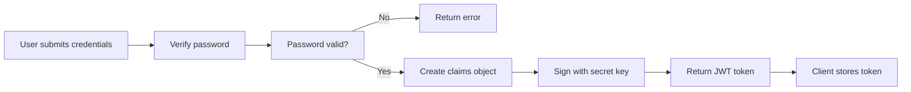
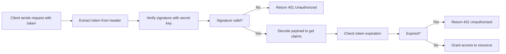
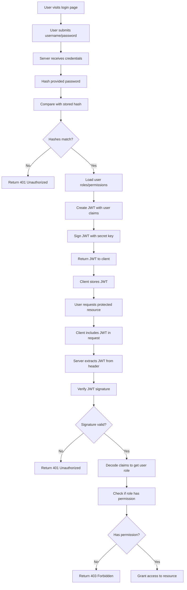

# Day 14: Authentication and Authorization

## Learning Objectives

- Understand the fundamentals of authentication and authorization
- Implement secure password hashing and verification
- Generate and validate JWT tokens for stateless authentication
- Implement role-based access control (RBAC)
- Design secure authentication flows
- Apply security best practices to protect user credentials and sessions

---

## 1. Authentication vs Authorization

Before diving into implementation details, it's important to understand the distinction between these two concepts:

**Authentication** is the process of verifying who a user is. It answers the question: "Are you who you claim to be?" This typically involves validating credentials like username and password.

**Authorization** is the process of determining what an authenticated user is allowed to do. It answers the question: "What are you allowed to access?" This is typically based on roles, permissions, or access control lists.

In a typical web application flow:
1. User provides credentials (username/password)
2. System authenticates the user by verifying credentials
3. System generates a token or session to represent the authenticated user
4. For each subsequent request, the system authorizes the user based on their role/permissions

---

## 2. Password Security

### Why Password Hashing Matters

Passwords should never be stored in plaintext. If a database is compromised, attackers would have direct access to all user passwords. Instead, passwords should be hashed using a cryptographic hash function that is:

- **One-way**: Impossible to reverse the hash back to the original password
- **Deterministic**: The same password always produces the same hash
- **Slow**: Computationally expensive to prevent brute-force attacks
- **Salted**: Each password hash includes random data to prevent rainbow table attacks

### Hashing and Verification

The process of password security involves two operations:

1. **Hashing**: When a user creates an account or changes their password, the plaintext password is hashed and the hash is stored in the database.
2. **Verification**: When a user logs in, the provided password is hashed and compared against the stored hash. If they match, the password is correct.

See `main.go` lines 28-34 for example implementations of `hashPassword()` and `verifyPassword()`.

### Best Practices

- **Use bcrypt or Argon2**: These algorithms are specifically designed for password hashing with built-in salting and configurable cost factors
- **Never log passwords**: Ensure passwords are never printed or logged
- **Use HTTPS**: Always transmit passwords over encrypted connections
- **Implement rate limiting**: Limit login attempts to prevent brute-force attacks
- **Consider multi-factor authentication**: Add an extra layer of security beyond passwords

---

## 3. Session Management

### Stateful vs Stateless Authentication

**Stateful Authentication (Sessions)**:
- Server maintains state about authenticated users
- User receives a session ID (typically in a cookie)
- Server stores session data (user ID, roles, etc.) in memory or database
- Each request includes the session ID, which the server uses to look up user data
- Advantages: Can revoke sessions immediately, store rich user context
- Disadvantages: Requires server-side storage, doesn't scale well across multiple servers

**Stateless Authentication (Tokens)**:
- Server does not maintain state about authenticated users
- User receives a signed token containing user information
- Token is cryptographically signed so it cannot be tampered with
- Each request includes the token, which the server validates and decodes
- Advantages: Scales easily across multiple servers, no server-side storage needed
- Disadvantages: Cannot revoke tokens immediately, token contains all user data

### Cookie Security

When using session-based authentication with cookies, several security flags should be set:

- **HttpOnly**: Prevents JavaScript from accessing the cookie, protecting against XSS attacks
- **Secure**: Cookie is only sent over HTTPS connections
- **SameSite**: Prevents the cookie from being sent with cross-site requests, protecting against CSRF attacks
- **Max-Age/Expires**: Sets the cookie expiration time

### Session Lifecycle

A typical session lifecycle includes:
1. **Creation**: User logs in, server creates a session and sends session ID to client
2. **Usage**: Client includes session ID in subsequent requests
3. **Validation**: Server validates session ID and retrieves user data
4. **Expiration**: Session expires after a period of inactivity or at a fixed time
5. **Destruction**: User logs out or session expires, server invalidates the session

---

## 4. JWT (JSON Web Tokens)

### What is a JWT?

A JWT is a compact, URL-safe token that contains encoded claims (statements about an entity). It consists of three parts separated by dots:

```
header.payload.signature
```

**Header**: Contains metadata about the token, such as the signing algorithm (e.g., HS256)

**Payload**: Contains claims - statements about the user (e.g., user ID, username, role, expiration time). Claims can be standard (registered) or custom.

**Signature**: A cryptographic signature that proves the token hasn't been tampered with. It's created by signing the header and payload with a secret key.

### JWT Generation Flow



See `main.go` lines 36-38 for an example of `generateToken()` that creates a token with user information.

### JWT Validation Flow



See `main.go` lines 40-51 for an example of `verifyToken()` that validates and extracts claims from a token.

### Key JWT Concepts

**Claims**: The data encoded in the token. Standard claims include:
- `iss` (issuer): Who created the token
- `sub` (subject): Who the token is about
- `exp` (expiration): When the token expires
- `iat` (issued at): When the token was created

**Expiration**: Tokens should have a limited lifetime. After expiration, the token is invalid and the user must authenticate again.

**Signature Verification**: The signature ensures that the token hasn't been modified. Only the server with the secret key can create valid signatures.

### Best Practices for JWT

- **Keep tokens short-lived**: Use expiration times of minutes to hours, not days or weeks
- **Store tokens securely**: In web applications, store in httpOnly cookies or secure storage (not localStorage)
- **Refresh tokens**: Implement a separate refresh token with longer expiration to obtain new access tokens
- **Include minimal data**: Only include necessary claims in the token to keep it small
- **Use strong signing algorithms**: HS256 (HMAC) or RS256 (RSA) are common choices
- **Protect the secret key**: Never expose the secret key used to sign tokens

---

## 5. Role-Based Access Control (RBAC)

### Understanding RBAC

Role-Based Access Control is an authorization model where users are assigned roles, and roles have permissions. Instead of assigning permissions directly to users, permissions are grouped into roles, making it easier to manage access at scale.

**Components**:
- **Users**: Entities that need access to resources
- **Roles**: Collections of permissions (e.g., "admin", "user", "moderator")
- **Permissions**: Specific actions a role can perform (e.g., "read", "write", "delete")
- **Resources**: Protected endpoints or data that require authorization

### Simple Role Checking

See `main.go` lines 62-64 for an example of `authorizeRole()` that checks if a user has a required role.

### Authorization Middleware Pattern

In web applications, authorization is typically enforced through middleware - a function that runs before the actual handler. The middleware:

1. Extracts the token from the request (usually from the Authorization header)
2. Validates the token signature and expiration
3. Decodes the claims to get the user's role
4. Checks if the user's role has permission for the requested resource
5. Either grants access or returns a 403 Forbidden error

This pattern allows you to protect multiple endpoints with a single authorization check.

### RBAC Best Practices

- **Principle of least privilege**: Users should have only the minimum permissions needed for their role
- **Role hierarchy**: Consider organizing roles in a hierarchy (e.g., admin > moderator > user)
- **Audit logging**: Log authorization decisions for security auditing
- **Regular reviews**: Periodically review user roles and permissions to ensure they're still appropriate
- **Separation of concerns**: Keep authentication (verifying identity) separate from authorization (checking permissions)

---

## 6. Complete Authentication Flow

The following diagram shows how all components work together in a typical authentication and authorization flow:



See `main.go` lines 66-105 for a complete example demonstrating password hashing, authentication, token generation, token verification, and role-based access control.

---

## 7. Security Best Practices

### HTTPS is Essential

Always use HTTPS (TLS/SSL) for authentication flows. Without encryption:
- Credentials can be intercepted in transit
- Tokens can be stolen by network eavesdropping
- Attackers can perform man-in-the-middle attacks

### Token Storage

- **Web applications**: Store tokens in httpOnly cookies (inaccessible to JavaScript) or secure session storage
- **Mobile applications**: Use secure storage mechanisms provided by the platform
- **Never use localStorage**: It's vulnerable to XSS attacks

### Token Refresh Strategy

Instead of using long-lived access tokens:
1. Issue short-lived access tokens (15 minutes to 1 hour)
2. Issue separate refresh tokens with longer expiration (days or weeks)
3. When access token expires, use refresh token to obtain a new access token
4. Refresh tokens should be stored securely and rotated periodically

### Logout Mechanisms

For stateful sessions:
- Invalidate the session on the server immediately
- Clear the session cookie on the client

For stateless tokens:
- Tokens cannot be revoked immediately (they're valid until expiration)
- Implement a token blacklist/denylist on the server for immediate revocation
- Use short expiration times to limit the window of vulnerability

### Common Vulnerabilities to Avoid

- **Credential stuffing**: Implement rate limiting on login endpoints
- **Brute force attacks**: Limit login attempts per IP address or username
- **Token theft**: Use httpOnly cookies, HTTPS, and short expiration times
- **Replay attacks**: Include timestamps and nonces in tokens
- **Cross-site scripting (XSS)**: Sanitize user input and use httpOnly cookies
- **Cross-site request forgery (CSRF)**: Use SameSite cookie flag and CSRF tokens

---

## Key Takeaways

1. **Authentication vs Authorization**: Authentication verifies identity; authorization determines access
2. **Password hashing**: Use bcrypt or Argon2 with proper salting and cost factors
3. **Session management**: Stateful approach with server-side storage and cookie security
4. **JWT tokens**: Stateless approach with cryptographic signatures and expiration
5. **Token validation**: Always verify signature and expiration before granting access
6. **RBAC**: Organize permissions into roles for scalable access control
7. **Authorization middleware**: Enforce permissions at the handler level
8. **HTTPS requirement**: Always use encrypted connections for authentication
9. **Token refresh**: Implement short-lived access tokens with refresh token rotation
10. **Security-first design**: Consider security implications at every step of the authentication flow

---

## Further Reading

- [bcrypt Documentation](https://pkg.go.dev/golang.org/x/crypto/bcrypt) - Password hashing library
- [JWT Documentation](https://pkg.go.dev/github.com/golang-jwt/jwt) - JWT implementation in Go
- [OAuth2 Documentation](https://pkg.go.dev/golang.org/x/oauth2) - OAuth2 protocol implementation
- [OWASP Authentication Cheat Sheet](https://cheatsheetseries.owasp.org/cheatsheets/Authentication_Cheat_Sheet.html) - Security best practices
- [OWASP Authorization Cheat Sheet](https://cheatsheetseries.owasp.org/cheatsheets/Authorization_Cheat_Sheet.html) - Authorization patterns and practices
