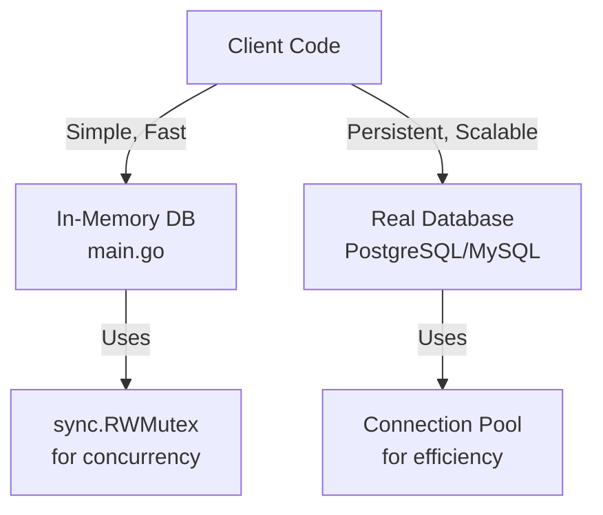
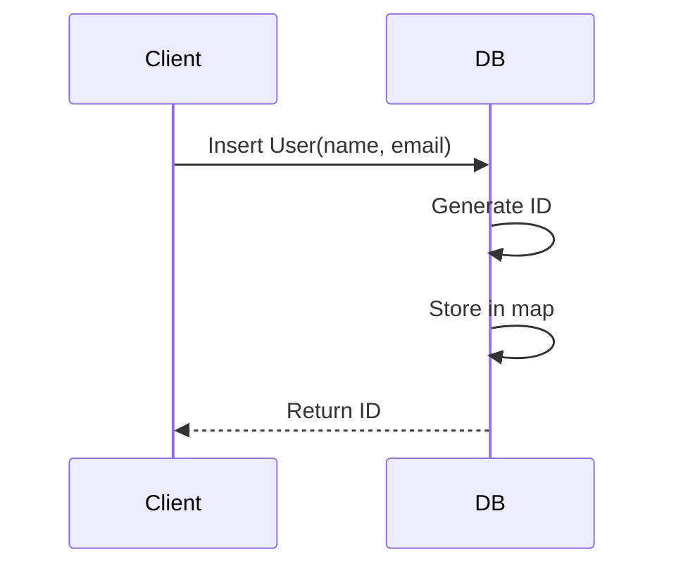
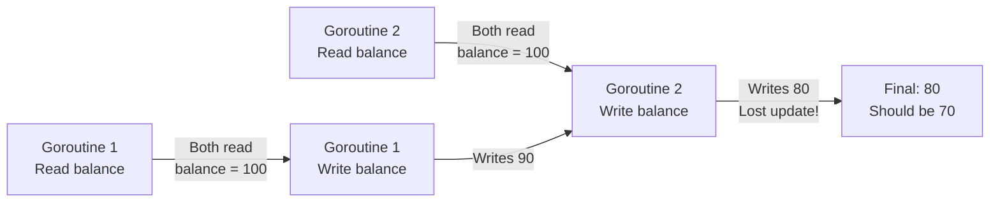
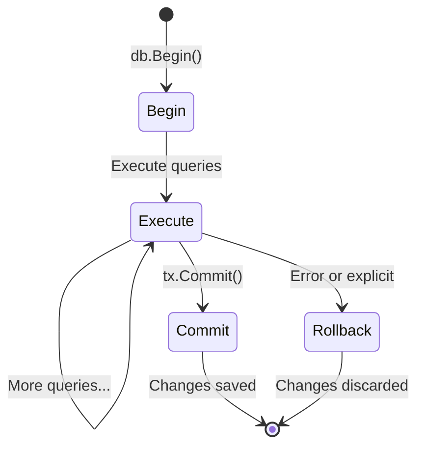
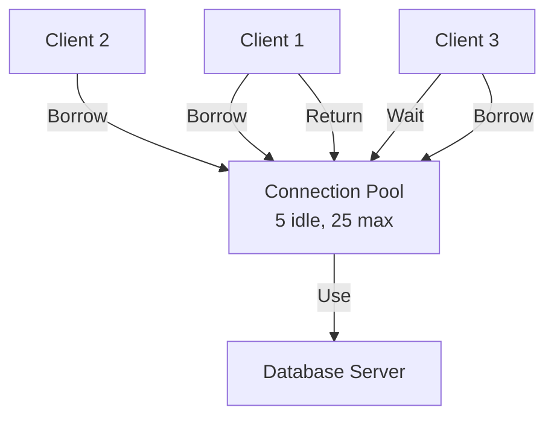

# Day 15: Databases and ORM

## Learning Objectives

- Understand database fundamentals and CRUD operations
- Implement thread-safe in-memory data storage with synchronization
- Learn real-world database/sql patterns and best practices
- Handle concurrent access and data consistency
- Understand transactions and error handling
- Design scalable database interactions

---

## 1. What is a Database?

A database is a structured system for storing, retrieving, and managing data. At its core, every database must solve three fundamental problems:

1. **Persistence** - Data survives program restarts
2. **Concurrency** - Multiple clients can access data simultaneously without corruption
3. **Consistency** - Data remains valid even when operations fail

In this lesson, we'll explore these concepts through two approaches:
- **In-memory implementation** (main.go) - A simplified model using Go's synchronization primitives
- **Real-world databases** (database/sql) - Production-grade systems like PostgreSQL

### Architecture Overview



---

## 2. CRUD Operations: The Foundation

CRUD stands for **Create, Read, Update, Delete** - the four basic operations on data. Every database system must implement these efficiently and safely.

### Create (Insert)

**Concept**: Add new data to the database and assign a unique identifier.



**In-memory example**: See `main.go` lines 42-50 for `insertUser()` implementation.

**Real-world pattern**: With database/sql, you'd use prepared statements to prevent SQL injection:
```go
// Pattern (not from main.go):
stmt, _ := db.Prepare("INSERT INTO users (name, email) VALUES ($1, $2) RETURNING id")
var id int
stmt.QueryRow(name, email).Scan(&id)
```

### Read (Query)

**Concept**: Retrieve data from the database by ID or other criteria.

**Single row**: See `main.go` lines 20-29 for `queryUser()` implementation.

**Multiple rows**: See `main.go` lines 31-40 for `queryAllUsers()` implementation.

**Real-world pattern**: database/sql distinguishes between single and multiple row queries:
- `QueryRow()` for single results (more efficient)
- `Query()` for multiple results (returns iterator)

### Update

**Concept**: Modify existing data while maintaining data integrity.

See `main.go` lines 52-61 for `updateUser()` implementation.

**Key insight**: The in-memory version uses a write lock to ensure no other goroutine can read or modify data during the update.

### Delete

**Concept**: Remove data from the database.

See `main.go` lines 63-72 for `deleteUser()` implementation.

---

## 3. Concurrency: The Hard Problem

The biggest challenge in database design is handling **concurrent access** - multiple clients reading and writing simultaneously without corrupting data.

### The Problem



### The Solution: Locks

Go provides `sync.RWMutex` (Read-Write Mutex) to protect shared data:

- **Read Lock** (`RLock`) - Multiple goroutines can read simultaneously
- **Write Lock** (`Lock`) - Only one goroutine can write, blocks all readers

**In-memory implementation**: See `main.go` - every function uses either `dbMu.RLock()` or `dbMu.Lock()` to protect the `db` map.

**Real-world databases**: Handle this internally with sophisticated locking mechanisms (row locks, page locks, MVCC).

---

## 4. Transactions: Atomic Operations

A **transaction** is a sequence of operations that either all succeed or all fail - there's no partial success.

### Why Transactions Matter

Imagine transferring money between accounts:
1. Deduct from Account A
2. Add to Account B

If step 1 succeeds but step 2 fails, money disappears! Transactions prevent this.

### Transaction Lifecycle



**In-memory example**: See `main.go` lines 74-84 for transaction functions (simplified for learning).

**Real-world pattern**: database/sql transactions:
```go
// Pattern (not from main.go):
tx, _ := db.Begin()
defer tx.Rollback()  // Rollback if Commit isn't called
tx.Exec("UPDATE accounts SET balance = balance - $1 WHERE id = $2", amount, fromID)
tx.Exec("UPDATE accounts SET balance = balance + $1 WHERE id = $2", amount, toID)
tx.Commit()  // All-or-nothing
```

---

## 5. Data Consistency Models

Different databases offer different consistency guarantees:

### In-Memory (main.go)

- **Consistency**: Strong - locks ensure no dirty reads
- **Durability**: None - data lost on restart
- **Use case**: Caches, temporary data, learning

### Real Databases (database/sql)

- **Consistency**: Configurable (ACID properties)
- **Durability**: Guaranteed - data persists to disk
- **Use case**: Production systems, financial data, user accounts

---

## 6. Error Handling: Expect Failure

Databases fail in many ways. Robust code handles them gracefully.

### Common Database Errors

```go
// Pattern (not from main.go):
if err == sql.ErrNoRows {
    // No matching record found
} else if err == sql.ErrConnDone {
    // Connection closed
} else if err != nil {
    // Other database error
}
```

**In-memory approach**: See `main.go` - functions return errors for "not found" cases.

**Best practice**: Always check errors and handle them explicitly. Never ignore database errors.

---

## 7. Connection Pooling: Efficiency at Scale

When using real databases, creating a new connection for each query is expensive. Connection pooling reuses connections.

### How It Works



**Configuration** (real-world pattern):
```go
// Pattern (not from main.go):
db.SetMaxOpenConns(25)      // Max concurrent connections
db.SetMaxIdleConns(5)       // Keep 5 idle for reuse
db.SetConnMaxLifetime(5 * time.Minute)  // Refresh old connections
```

**In-memory**: No pooling needed - everything is in-process.

---

## 8. Performance Considerations

### When to Use In-Memory (main.go approach)

✅ Caches and temporary data  
✅ Learning and prototyping  
✅ Single-process applications  
✅ Data that fits in RAM  

❌ Data that must survive restarts  
❌ Multi-process systems  
❌ Large datasets  

### When to Use Real Databases

✅ Production systems  
✅ Data persistence required  
✅ Multiple services accessing data  
✅ Complex queries and reporting  
✅ ACID guarantees needed  

❌ Simple in-memory caches  
❌ Extremely latency-sensitive code  

---

## 9. Common Pitfalls and Solutions

| Pitfall | Problem | Solution |
|---------|---------|----------|
| Forgetting locks | Data corruption | Always use RLock/Lock in in-memory DBs |
| Not closing connections | Resource leak | Use `defer db.Close()` |
| Ignoring errors | Silent failures | Check every error explicitly |
| No transactions | Partial updates | Wrap related operations in transactions |
| Hardcoded SQL | SQL injection | Use prepared statements with parameters |

---

## 10. Key Takeaways

1. **CRUD operations** are the foundation of all databases
2. **Concurrency control** (locks, transactions) prevents data corruption
3. **In-memory databases** (main.go) are fast but not persistent
4. **Real databases** (database/sql) add persistence and scalability
5. **Transactions** ensure all-or-nothing semantics
6. **Error handling** is critical - databases fail frequently
7. **Connection pooling** improves efficiency at scale
8. **Choose the right tool** - in-memory for caches, real DBs for production

---

## Further Reading

- [database/sql Documentation](https://pkg.go.dev/database/sql) - Standard library
- [Go Database/SQL Tutorial](https://go.dev/doc/database/sql-overview) - Official guide
- [GORM Documentation](https://gorm.io) - Popular ORM for Go
- [Database Internals](https://www.databass.dev/) - Deep dive into how databases work
