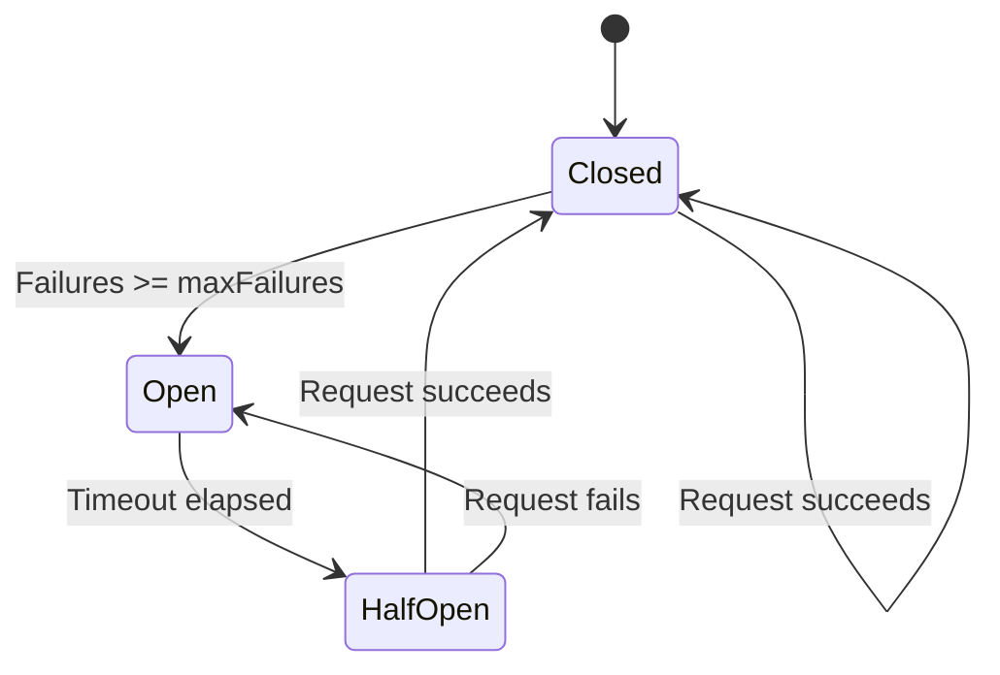
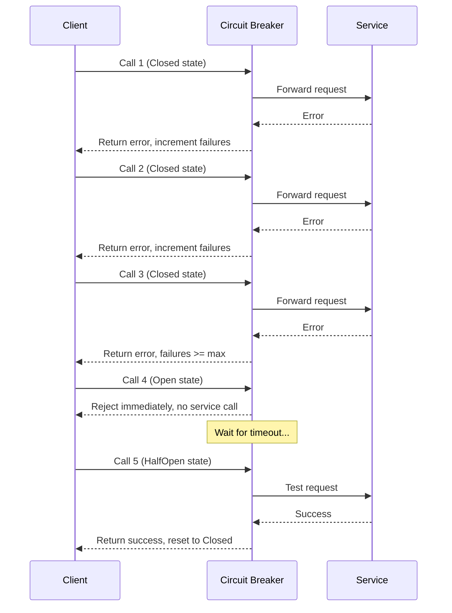
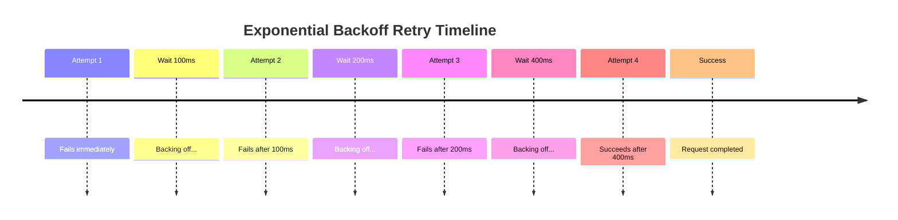
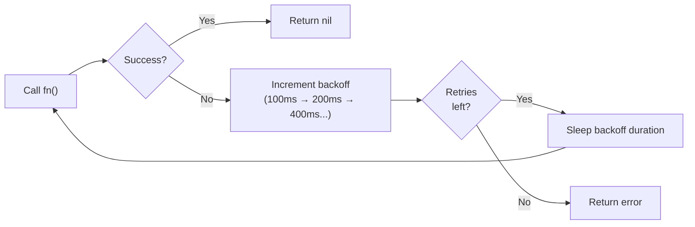
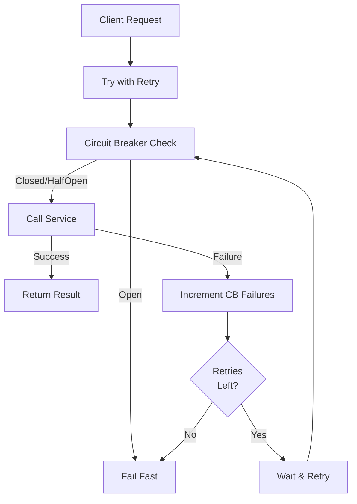

# Day 16: Microservices and gRPC

## Learning Objectives

- Understand resilience patterns that prevent cascading failures in distributed systems
- Implement the Circuit Breaker pattern to gracefully handle service failures
- Implement retry logic with exponential backoff for transient failures
- Design microservices architectures with proper separation of concerns
- Discover and route to services dynamically
- Enable distributed tracing for observability
- Handle service communication patterns (synchronous and asynchronous)

---

## 1. Introduction to Resilience Patterns

In distributed systems, failures are inevitable. A single service outage can cascade through your entire system, causing widespread unavailability. **Resilience patterns** are techniques that help systems degrade gracefully when failures occur, rather than failing catastrophically.

This lesson focuses on two fundamental resilience patterns:
1. **Circuit Breaker** - Prevents cascading failures by stopping requests to failing services
2. **Retry with Exponential Backoff** - Handles transient failures by retrying with increasing delays

These patterns work together to build robust, fault-tolerant systems.

---

## 2. The Circuit Breaker Pattern

### What is a Circuit Breaker?

A **Circuit Breaker** is a design pattern that monitors for failures and temporarily blocks requests to a failing service. It works like an electrical circuit breaker: when too many failures occur, it "trips" and stops sending requests, allowing the service time to recover.

### Why Use a Circuit Breaker?

**Problem it solves:**
- **Cascading Failures**: When Service A calls Service B and B is down, A wastes resources waiting for timeouts. If many clients call A, those resources are exhausted, and A fails too.
- **Resource Exhaustion**: Repeated failed requests consume connection pools, memory, and CPU.
- **Slow Degradation**: Without a circuit breaker, your system slowly grinds to a halt as failures accumulate.

**Benefits:**
- Fail fast instead of waiting for timeouts
- Free up resources for healthy requests
- Give failing services time to recover
- Provide better user experience (fast failure vs. slow hang)

### Circuit Breaker States

A circuit breaker has three states:



**State Descriptions:**

- **Closed** (normal operation): Requests pass through to the service. Failures are counted.
  - When failures reach `maxFailures`, transition to Open.
  
- **Open** (service down): Requests are immediately rejected without calling the service.
  - After `timeout` duration, transition to HalfOpen to test if service recovered.
  
- **HalfOpen** (testing recovery): A limited number of requests are allowed through to test if the service is healthy.
  - If a request succeeds, transition back to Closed.
  - If a request fails, transition back to Open.

### Implementation Reference

See `main.go` lines 8-56 for the complete Circuit Breaker implementation, including:
- `NewCircuitBreaker()` constructor (lines 16-22)
- `Call()` method that enforces state transitions (lines 24-52)
- `State()` getter for monitoring (lines 54-56)

### Example Execution Flow



### Best Practices

- **Set appropriate thresholds**: `maxFailures` should reflect your service's expected error rate. Too low = false positives; too high = delayed detection.
- **Configure timeout wisely**: The timeout should give the service enough time to recover (typically 30-60 seconds for most services).
- **Monitor state transitions**: Log when the circuit breaker opens/closes to detect problems early.
- **Combine with retries**: Use circuit breaker for long-term failures and retries for transient failures.
- **Fail gracefully**: When open, return a meaningful error or fallback response, not a generic timeout.

---

## 3. Retry with Exponential Backoff

### What is Exponential Backoff?

**Exponential backoff** is a retry strategy where you wait progressively longer between retry attempts. Instead of retrying immediately (which can overwhelm a struggling service), you wait: 100ms, 200ms, 400ms, 800ms, etc.

### Why Use Exponential Backoff?

**Problem it solves:**
- **Transient Failures**: Network hiccups, temporary service overload, or brief maintenance windows cause failures that resolve quickly.
- **Thundering Herd**: If all clients retry immediately, they create a spike that prevents recovery.
- **Resource Waste**: Immediate retries consume resources without giving the service time to stabilize.

**Benefits:**
- Handles temporary failures transparently
- Reduces load on struggling services
- Increases success rate without manual intervention
- Prevents retry storms

### How Exponential Backoff Works



Each retry waits twice as long as the previous one. This gives the service exponentially more time to recover.

### Implementation Reference

See `main.go` lines 58-75 for the `retryWithBackoff()` function, which:
- Takes a function to retry and maximum retry count
- Starts with 100ms backoff
- Doubles the backoff after each failure
- Returns the error if all retries fail, nil if successful

### Example Execution



### Best Practices

- **Set reasonable max retries**: 3-5 retries is typical. Too many = long delays; too few = low success rate.
- **Start with small backoff**: 100ms is a good starting point for most services.
- **Add jitter**: In production, add randomness to backoff to prevent synchronized retries across clients.
- **Combine with circuit breaker**: Use retries for transient failures, circuit breaker for persistent failures.
- **Log retry attempts**: Track which requests are being retried to identify problematic services.
- **Set timeout limits**: Even with retries, set an overall timeout so requests don't hang indefinitely.

### Jitter in Production

In real systems, add randomness to prevent the "thundering herd" problem:

```go
// Pseudocode: add jitter to backoff
jitter := time.Duration(rand.Intn(int(backoff/2))) // ±50% randomness
time.Sleep(backoff + jitter)
```

---

## 4. Combining Circuit Breaker and Retry

These patterns work best together:



**Strategy:**
1. **First attempt**: Try the request through the circuit breaker
2. **Transient failure**: If it fails and retries remain, wait and retry
3. **Persistent failure**: If failures accumulate, circuit breaker opens
4. **Recovery**: Circuit breaker enters half-open state to test recovery
5. **Success**: Once service recovers, circuit breaker closes and normal operation resumes

---

## 5. Key Concepts

- **Failure Mode**: The way a system fails (fast vs. slow, cascading vs. isolated)
- **Transient Failure**: A temporary failure that resolves on its own (network blip, brief overload)
- **Persistent Failure**: A failure that won't resolve without intervention (service crashed, database down)
- **Graceful Degradation**: System continues operating with reduced functionality instead of failing completely
- **Observability**: Ability to understand system behavior through logs, metrics, and traces

---

## 6. Common Pitfalls

- **Circuit breaker timeout too short**: Service doesn't have time to recover; circuit keeps opening
- **Retry without backoff**: Immediate retries overwhelm struggling services
- **No circuit breaker with retries**: Retries can amplify failures instead of helping
- **Ignoring transient vs. persistent failures**: Some errors shouldn't be retried (auth failures, validation errors)
- **Not monitoring state changes**: Circuit breaker opens silently; no one notices until users complain

---

## 7. Testing Resilience Patterns

When testing circuit breaker and retry logic:

- **Test state transitions**: Verify closed → open → half-open → closed flow
- **Test failure counting**: Ensure failures are counted correctly
- **Test timeout behavior**: Verify half-open transition happens after timeout
- **Test backoff timing**: Ensure exponential backoff increases correctly
- **Test edge cases**: What happens at exactly `maxFailures`? What if service recovers mid-retry?

See `exercise_test.go` for test cases that verify these behaviors.

---

## 8. Key Takeaways

1. **Circuit Breaker prevents cascading failures** - Fail fast and give services time to recover
2. **Exponential Backoff handles transient failures** - Retry with increasing delays
3. **Combine patterns for robustness** - Use both together for best results
4. **Monitoring is critical** - Track state changes and retry attempts
5. **Graceful degradation** - Systems should fail gracefully, not catastrophically
6. **Understand failure types** - Distinguish between transient and persistent failures
7. **Test resilience** - Verify patterns work under failure conditions
8. **Configuration matters** - Thresholds and timeouts must match your service characteristics

---

## 9. Further Reading

- [Circuit Breaker Pattern](https://martinfowler.com/bliki/CircuitBreaker.html) - Martin Fowler's definitive guide
- [Microservices Patterns](https://microservices.io/) - Comprehensive pattern catalog
- [Resilience4j](https://resilience4j.readme.io/) - Popular Java resilience library (concepts apply to Go)
- [gRPC Documentation](https://grpc.io/docs/) - Service communication
- [OpenTelemetry](https://opentelemetry.io/) - Observability framework for distributed systems
