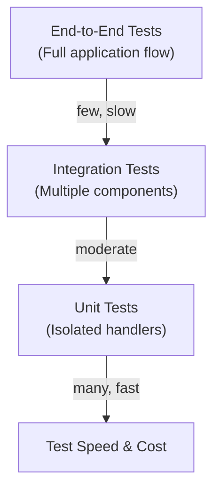
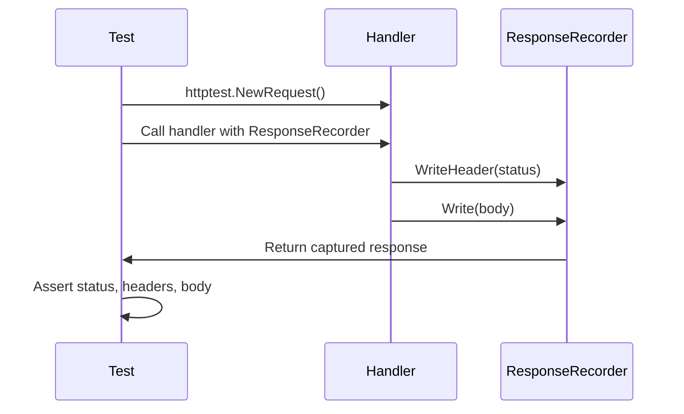
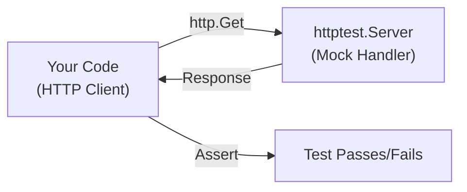
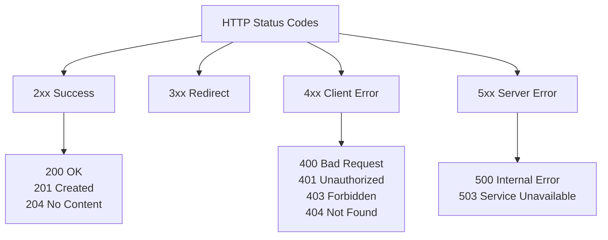
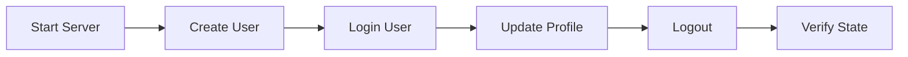
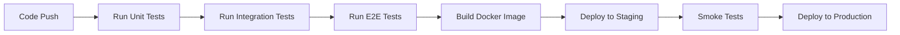

# Day 17: Testing Web Applications

## Learning Objectives

- Understand HTTP testing fundamentals and the testing pyramid
- Test HTTP handlers with `httptest.ResponseRecorder` for unit testing
- Test HTTP clients with `httptest.Server` for integration testing
- Implement table-driven tests for comprehensive API coverage
- Test response headers, JSON validation, and error handling
- Test concurrent and middleware-based handlers
- Implement end-to-end testing strategies
- Set up CI/CD pipelines for automated web application testing
- Use benchmarking to measure handler performance
- Apply best practices for maintainable, isolated tests

---

## Part 1: HTTP Testing Fundamentals

### The Testing Pyramid

HTTP testing follows a pyramid structure: many fast unit tests at the base, fewer integration tests in the middle, and minimal slow end-to-end tests at the top.



**Why this matters:**
- **Unit tests** (ResponseRecorder) are fast and catch bugs early
- **Integration tests** (httptest.Server) verify components work together
- **E2E tests** validate complete user workflows but are slower

### Request/Response Flow in Testing



---

## Part 2: Unit Testing with httptest.ResponseRecorder

### What is ResponseRecorder?

`httptest.ResponseRecorder` is an in-memory `http.ResponseWriter` that captures everything a handler writes: status code, headers, and body. It eliminates network overhead and makes tests fast and deterministic.

**Key advantages:**
- No actual network calls
- Instant feedback
- Deterministic behavior (no timeouts or flakiness)
- Easy to inspect all response details

### Basic Handler Testing

See `main.go` lines 15-18 for the `helloHandler` example. To test it:

1. Create a request with `httptest.NewRequest(method, path, body)`
2. Create a ResponseRecorder with `httptest.NewRecorder()`
3. Call the handler with the recorder
4. Assert on `w.Code` (status), `w.Header()` (headers), and `w.Body` (response body)

See `main.go` lines 39-44 for a complete example of testing the hello handler.

### Testing Different Response Types

Handlers can return different types of responses. Test each type:

**Text responses:** Check `w.Body.String()` (see `main.go` lines 39-44)

**JSON responses:** Parse the body and validate structure (see `main.go` lines 48-54). Best practice: unmarshal into a struct to catch malformed JSON early.

**Error responses:** Verify both status code and error message (see `main.go` lines 58-63)

### Best Practices for Unit Tests

- **Test one thing per test function** - Makes failures clear
- **Use descriptive test names** - `TestHandlerReturnsJSON` is better than `TestHandler`
- **Test both success and failure paths** - Valid input AND invalid input
- **Verify headers when relevant** - Content-Type, caching headers, security headers
- **Don't test the standard library** - Trust that `http.StatusOK` works; focus on your logic

---

## Part 3: Integration Testing with httptest.Server

### When to Use httptest.Server

Use `httptest.Server` when testing code that **makes HTTP requests** to external services. It provides a real HTTP server on a random port, allowing you to test your client code without hitting real endpoints.

**Use cases:**
- Testing code that calls external APIs
- Testing client-side retry logic
- Testing timeout handling
- Testing redirect following

### Creating and Using a Mock Server

See `main.go` lines 67-79 for a complete example. The pattern:

1. Create a server with `httptest.NewServer(handler)`
2. The server runs on a random port accessible via `server.URL`
3. Make requests to `server.URL` with your HTTP client
4. Always `defer server.Close()` to clean up
5. Assert on the response



### Testing Client Behavior

Mock servers let you test how your client handles different scenarios:

- **Success responses** - Verify correct parsing and handling
- **Error responses** - Verify error handling and logging
- **Slow responses** - Test timeout behavior
- **Unexpected responses** - Test resilience to malformed data

---

## Part 4: Table-Driven Tests for API Coverage

### Why Table-Driven Tests?

Table-driven tests reduce duplication and improve coverage by testing multiple scenarios with the same test logic. Instead of writing 10 similar test functions, write one test with 10 test cases.

**Benefits:**
- Less code duplication
- Easy to add new test cases
- Clear to see all scenarios at a glance
- Easier to maintain

### Table-Driven Test Structure

The pattern:

1. Define a slice of structs, each containing inputs and expected outputs
2. Loop through the test cases
3. Use `t.Run(name, func)` to run each case as a subtest
4. Assert the same way for each case

**Example structure:**
```
tests := []struct {
    name           string        // Describes the scenario
    input          string        // What we're testing
    expectedStatus int           // What we expect
    expectedBody   string        // What we expect
}{
    // Test case 1
    // Test case 2
    // ...
}

for _, tt := range tests {
    t.Run(tt.name, func(t *testing.T) {
        // Run test with tt.input, assert tt.expectedStatus, tt.expectedBody
    })
}
```

This pattern is demonstrated in the exercise functions - implement them to practice table-driven testing.

---

## Part 5: Testing Headers and Metadata

### Why Test Headers?

HTTP headers control caching, security, content negotiation, and more. Testing them ensures your API behaves correctly.

**Common headers to test:**
- `Content-Type` - Ensures correct format (JSON, HTML, etc.)
- `Cache-Control` - Verifies caching behavior
- `Authorization` - Checks authentication requirements
- `X-Custom-Header` - Application-specific metadata

### Testing Response Headers

Access headers with `w.Header().Get(name)` or `w.Header()` to get all headers.

See the exercise function `ExerciseTestHandlerHeader` - implement it to practice header testing. The test in `exercise_test.go` lines 42-50 shows what's expected.

---

## Part 6: JSON Response Validation

### Testing JSON Responses

JSON is the standard for modern APIs. Proper testing catches:
- Malformed JSON (syntax errors)
- Missing required fields
- Wrong data types
- Incorrect field values

### Validation Strategy

1. **Verify Content-Type header** - Should be `application/json`
2. **Unmarshal into a struct** - Catches malformed JSON
3. **Assert field values** - Verify correct data
4. **Test edge cases** - Null values, empty arrays, special characters

See `main.go` lines 20-27 for a JSON handler example. The exercise function `ExerciseTestHandlerJSON` requires you to validate JSON responses - see `exercise_test.go` lines 53-62 for the test.

---

## Part 7: Error Handling and Status Codes

### Testing Error Responses

Proper error handling is critical for API reliability. Test:

- **Correct status codes** - 400 for bad request, 401 for unauthorized, 500 for server error
- **Error messages** - Clear, actionable messages for clients
- **Error format** - Consistent structure (JSON, plain text, etc.)

See `main.go` lines 29-32 for an error handler example.

### HTTP Status Code Categories



### Best Practices for Error Testing

- Test both the status code AND the error message
- Verify errors are logged (if applicable)
- Test that errors don't leak sensitive information
- Ensure error responses have appropriate headers

---

## Part 8: Testing Concurrent Handlers

### Why Test Concurrency?

Web handlers often run concurrently. Testing concurrent behavior catches race conditions and synchronization bugs.

### Race Condition Detection

Run tests with the `-race` flag to detect data races:

```bash
go test -race ./...
```

This instruments the code to detect concurrent access to shared memory.

### Testing Concurrent Handler Calls

Create multiple goroutines that call the handler simultaneously:

```go
func TestConcurrentHandlers(t *testing.T) {
    var wg sync.WaitGroup
    for i := 0; i < 100; i++ {
        wg.Add(1)
        go func() {
            defer wg.Done()
            req := httptest.NewRequest("GET", "/path", nil)
            w := httptest.NewRecorder()
            myHandler(w, req)
            if w.Code != http.StatusOK {
                t.Errorf("expected 200, got %d", w.Code)
            }
        }()
    }
    wg.Wait()
}
```

**Key points:**
- Use `sync.WaitGroup` to wait for all goroutines
- Run with `-race` flag to detect issues
- Test with high concurrency (100+) to increase likelihood of catching bugs

---

## Part 9: Testing Middleware and Handler Chains

### What is Middleware?

Middleware wraps handlers to add cross-cutting concerns: logging, authentication, CORS, compression, etc.

### Testing Middleware

Middleware should be tested in isolation and as part of a chain:

**Unit test the middleware:**
```go
func TestLoggingMiddleware(t *testing.T) {
    var logged bool
    middleware := func(next http.Handler) http.Handler {
        return http.HandlerFunc(func(w http.ResponseWriter, r *http.Request) {
            logged = true
            next.ServeHTTP(w, r)
        })
    }
    
    handler := middleware(http.HandlerFunc(func(w http.ResponseWriter, r *http.Request) {
        w.WriteHeader(http.StatusOK)
    }))
    
    req := httptest.NewRequest("GET", "/", nil)
    w := httptest.NewRecorder()
    handler.ServeHTTP(w, req)
    
    if !logged {
        t.Error("middleware did not log")
    }
}
```

**Test the chain:**
```go
func TestHandlerChain(t *testing.T) {
    handler := middleware1(middleware2(myHandler))
    // Test the combined behavior
}
```

---

## Part 10: Benchmarking HTTP Handlers

### Why Benchmark?

Benchmarking measures handler performance: response time, memory allocation, etc. Identify bottlenecks and regressions.

### Writing Benchmarks

Benchmarks follow the pattern `BenchmarkXxx(b *testing.B)`:

```go
func BenchmarkHelloHandler(b *testing.B) {
    req := httptest.NewRequest("GET", "/hello", nil)
    
    b.ResetTimer()
    for i := 0; i < b.N; i++ {
        w := httptest.NewRecorder()
        helloHandler(w, req)
    }
}
```

Run benchmarks with:
```bash
go test -bench=. -benchmem ./...
```

**Output interpretation:**
- `BenchmarkHelloHandler-8    1000000    1234 ns/op` - 1 million iterations, 1234 nanoseconds per operation
- `1234 B/op` - 1234 bytes allocated per operation
- `12 allocs/op` - 12 memory allocations per operation

**Best practices:**
- Benchmark realistic scenarios
- Use `b.ReportAllocs()` to measure memory
- Compare benchmarks before/after optimizations
- Don't over-optimize; focus on correctness first

---

## Part 11: End-to-End Testing

### What is E2E Testing?

E2E tests verify complete workflows across multiple endpoints and components. They're slower but catch integration issues.

### E2E Test Strategy



### Implementing E2E Tests

1. Start a real server (or use `httptest.Server`)
2. Make a series of requests that form a workflow
3. Verify state changes at each step
4. Clean up after the test

```go
func TestUserWorkflow(t *testing.T) {
    server := httptest.NewServer(http.HandlerFunc(myRouter))
    defer server.Close()
    
    // Step 1: Create user
    createResp, _ := http.Post(server.URL+"/users", "application/json", body)
    if createResp.StatusCode != http.StatusCreated {
        t.Fatal("failed to create user")
    }
    
    // Step 2: Login
    loginResp, _ := http.Post(server.URL+"/login", "application/json", body)
    if loginResp.StatusCode != http.StatusOK {
        t.Fatal("failed to login")
    }
    
    // Step 3: Verify state
    getResp, _ := http.Get(server.URL + "/users/1")
    if getResp.StatusCode != http.StatusOK {
        t.Fatal("user not found")
    }
}
```

**Best practices:**
- Test critical user workflows only
- Use realistic data
- Clean up state between tests (database reset, file cleanup)
- Keep E2E tests separate from unit tests

---

## Part 12: CI/CD Integration

### Automated Testing in CI/CD

CI/CD pipelines automatically run tests on every commit, catching bugs before they reach production.

### CI/CD Pipeline for Web Applications



### Common CI/CD Checks

1. **Unit tests** - `go test ./...`
2. **Race detection** - `go test -race ./...`
3. **Code coverage** - `go test -cover ./...`
4. **Linting** - `golangci-lint run`
5. **Formatting** - `go fmt ./...`
6. **Vetting** - `go vet ./...`

### Example GitHub Actions Workflow

```yaml
name: Tests
on: [push, pull_request]
jobs:
  test:
    runs-on: ubuntu-latest
    steps:
      - uses: actions/checkout@v2
      - uses: actions/setup-go@v2
      - run: go test -race -cover ./...
      - run: go vet ./...
```

---

## Part 13: Testing Best Practices Summary

### Do's

- ✅ **Test in isolation** - Mock external dependencies
- ✅ **Use table-driven tests** - Reduce duplication
- ✅ **Test error paths** - Not just happy paths
- ✅ **Use descriptive names** - Test names should explain what's being tested
- ✅ **Run with -race flag** - Catch concurrency bugs
- ✅ **Keep tests fast** - Avoid sleep, real network calls, file I/O
- ✅ **Test headers and status codes** - Don't just check the body
- ✅ **Use httptest** - Never make real HTTP calls in tests

### Don'ts

- ❌ **Don't test the standard library** - Trust `http.StatusOK` works
- ❌ **Don't use sleep for synchronization** - Use channels, WaitGroup, or context
- ❌ **Don't make real network calls** - Use httptest.Server
- ❌ **Don't ignore errors** - Always check error returns
- ❌ **Don't test implementation details** - Test behavior instead
- ❌ **Don't skip tests** - Remove or fix them instead
- ❌ **Don't write tests after code** - Write tests first (TDD) or alongside

---

## Part 14: Common Testing Patterns

### Pattern 1: Testing Query Parameters

```go
req := httptest.NewRequest("GET", "/search?q=golang&limit=10", nil)
w := httptest.NewRecorder()
handler(w, req)
// Assert based on query params
```

### Pattern 2: Testing Request Headers

```go
req := httptest.NewRequest("GET", "/api", nil)
req.Header.Set("Authorization", "Bearer token123")
w := httptest.NewRecorder()
handler(w, req)
// Assert authorization was checked
```

### Pattern 3: Testing Request Body

```go
body := strings.NewReader(`{"name":"Alice"}`)
req := httptest.NewRequest("POST", "/users", body)
req.Header.Set("Content-Type", "application/json")
w := httptest.NewRecorder()
handler(w, req)
// Assert user was created
```

### Pattern 4: Testing Redirects

```go
req := httptest.NewRequest("GET", "/old-path", nil)
w := httptest.NewRecorder()
handler(w, req)
if w.Code != http.StatusMovedPermanently {
    t.Error("expected redirect")
}
if w.Header().Get("Location") != "/new-path" {
    t.Error("wrong redirect target")
}
```

---

## Exercises

The `exercise.go` file contains functions to implement:

1. **ExerciseTestHandler** - Test a handler and return status code
2. **ExerciseTestHandlerBody** - Test a handler and return response body
3. **ExerciseTestMockServer** - Create a mock server and test a client
4. **ExerciseTestTableDriven** - Implement table-driven tests
5. **ExerciseTestHandlerHeader** - Test response headers
6. **ExerciseTestHandlerJSON** - Validate JSON responses

Each function has a corresponding test in `exercise_test.go`. Implement the functions to make the tests pass.

---

## Key Takeaways

1. **Use ResponseRecorder for unit tests** - Fast, isolated, deterministic
2. **Use httptest.Server for integration tests** - Test client code and service interactions
3. **Table-driven tests reduce duplication** - Test many scenarios efficiently
4. **Test headers, status codes, and bodies** - Don't just check one aspect
5. **Run with -race flag** - Catch concurrency bugs early
6. **Keep tests fast and isolated** - No real network, file I/O, or sleep
7. **Test error paths** - Verify your code handles failures gracefully
8. **Use CI/CD to automate testing** - Catch bugs before production
9. **Benchmark critical paths** - Measure performance and catch regressions
10. **Mock external services** - Never depend on external APIs in tests

---

## Further Reading

- [httptest Package Documentation](https://pkg.go.dev/net/http/httptest)
- [Go Testing Best Practices](https://golang.org/doc/effective_go#testing)
- [Table-Driven Tests](https://github.com/golang/go/wiki/TableDrivenTests)
- [Testing with httptest](https://golang.org/pkg/net/http/httptest/)
- [Go Benchmarking](https://golang.org/pkg/testing/#hdr-Benchmarks)
- [Race Detector](https://golang.org/doc/articles/race_detector)
