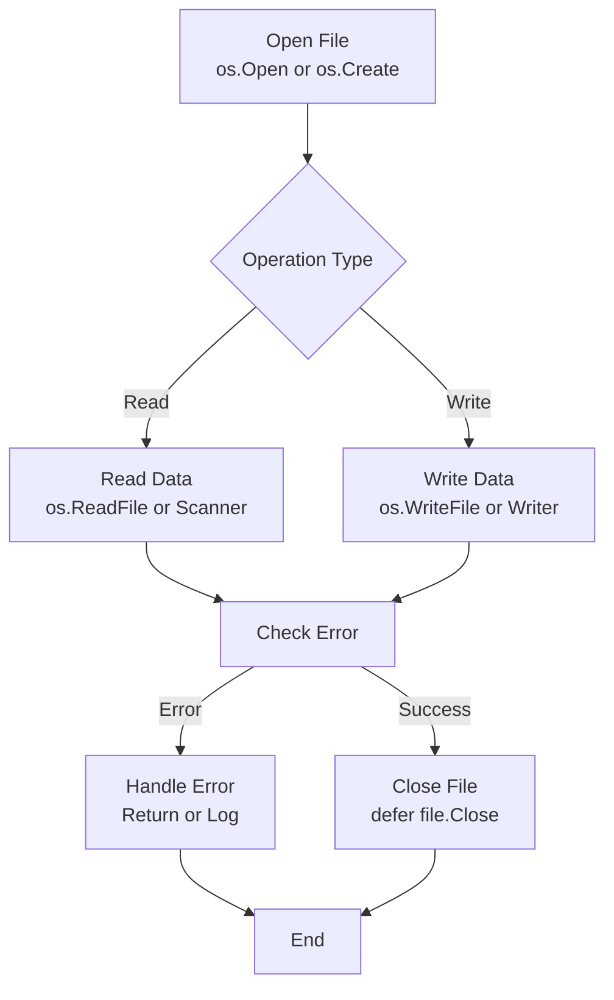
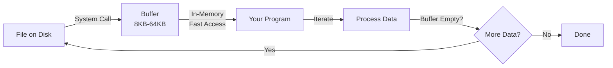
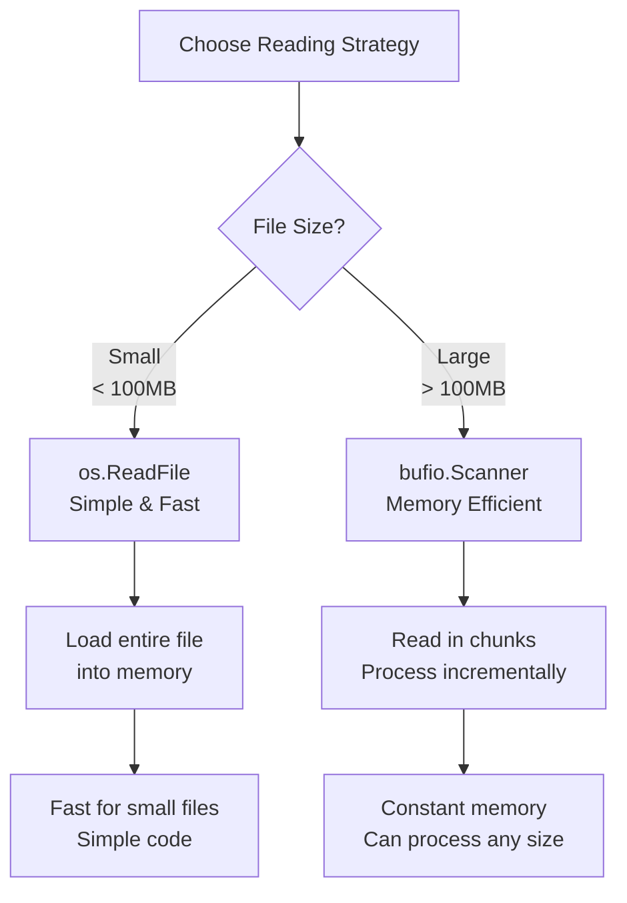
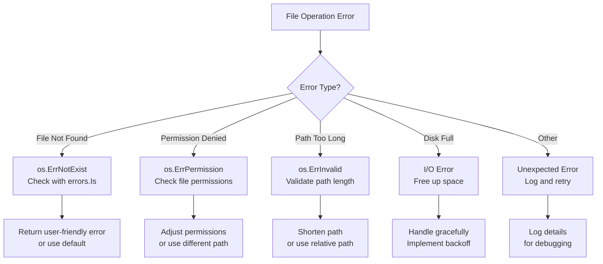

# Day 18: File and IO Operations

## Learning Objectives

- Work with files using the os package
- Implement efficient buffered IO with bufio
- Handle file paths and directory operations
- Work with readers and writers
- Implement file walking and directory traversal
- Handle temporary files and cleanup

---

## Introduction: Why File I/O Matters

File I/O is fundamental to most real-world applications. Whether you're reading configuration files, processing logs, or persisting data, understanding how to work with files efficiently is critical. Go provides powerful abstractions through the `os`, `bufio`, and `filepath` packages that make file operations safe, efficient, and idiomatic.

This tutorial covers:
- **Basic file operations**: Reading, writing, and checking file existence
- **Buffered I/O**: Efficient reading of large files and line-by-line processing
- **File metadata**: Checking file properties and sizes
- **Directory traversal**: Walking directory trees recursively
- **Resource management**: Proper cleanup patterns and temporary files
- **Error handling**: Recovering gracefully from file operation failures

---

## Part 1: File Operations Fundamentals

### The File I/O Lifecycle

Every file operation follows a predictable lifecycle: open the file, perform operations, and close the file. Understanding this flow is essential for writing correct and efficient code.



### Writing Files

The simplest way to write data to a file is using `os.WriteFile`, which handles opening, writing, and closing in one call. See `main.go` lines 10-13 for the `writeFile` function example.

**When to use `os.WriteFile`:**
- Writing small to medium-sized files (entire content fits in memory)
- You don't need to write incrementally
- You want the simplest, most readable code

**Key points:**
- `os.WriteFile` overwrites the entire file if it exists
- The third parameter (0644) sets file permissions: readable by owner and others, writable by owner only
- Always check the error return value to detect write failures

### Reading Files

Reading files can be done in two ways: all at once with `os.ReadFile`, or line-by-line with `bufio.Scanner`. The choice depends on file size and your processing needs.

**All-at-once reading** with `os.ReadFile` (see `main.go` lines 15-21):
- Loads the entire file into memory as a byte slice
- Simple and straightforward for small files
- Not suitable for very large files (memory constraints)

**Key points:**
- Returns `([]byte, error)` - convert to string with `string(data)` if needed
- Returns `os.ErrNotExist` if the file doesn't exist
- Returns `os.ErrPermission` if you lack read permissions

### Checking File Existence

Before operating on a file, you often need to check if it exists. See `main.go` lines 23-26 for the `fileExists` function.

**The pattern:**
- Use `os.Stat` to get file information
- Check if the returned error is `os.ErrNotExist`
- Or use a simpler approach: try to open/read and handle the error

The `fileExists` function in main.go demonstrates the map-based approach used in this learning module.

### File Metadata and Information

The `os.Stat` function returns a `FileInfo` interface with properties like:
- `Name()` - just the filename, not the full path
- `Size()` - file size in bytes
- `ModTime()` - last modification time
- `IsDir()` - whether it's a directory
- `Mode()` - file permissions and type

This is useful for:
- Checking file sizes before processing
- Validating file types
- Implementing conditional logic based on modification time

---

## Part 2: Buffered I/O and Efficient Reading

### Why Buffering Matters

When reading files, especially large ones, buffering dramatically improves performance. Instead of reading one byte at a time (which requires a system call for each byte), buffering reads chunks of data into memory, reducing system call overhead.



### Buffered Reading with bufio.Scanner

The `bufio.Scanner` is the idiomatic way to read files line-by-line in Go. It handles buffering automatically and provides a clean API.

**Basic pattern:**
1. Open the file with `os.Open`
2. Create a scanner with `bufio.NewScanner(file)`
3. Loop with `scanner.Scan()` to read each line
4. Access the line with `scanner.Text()` or `scanner.Bytes()`
5. Always check `scanner.Err()` after the loop
6. Close the file with `defer file.Close()`

See `main.go` lines 53-59 for the `readLines` function, which demonstrates reading and splitting lines.

**Advantages of Scanner:**
- Handles buffering automatically (default 64KB buffer)
- Handles different line endings (Unix `\n`, Windows `\r\n`)
- Provides clean iteration with `Scan()`
- Automatically detects and reports errors

**When to use Scanner:**
- Reading large files that don't fit in memory
- Processing files line-by-line
- You need to handle different line endings gracefully

### Comparison: All-at-Once vs. Line-by-Line



---

## Part 3: File Manipulation Operations

### Appending to Files

Sometimes you need to add content to an existing file without overwriting it. See `main.go` lines 44-51 for the `appendToFile` function.

**Key pattern:**
1. Read the existing content
2. Concatenate the new content
3. Write the combined content back

**Note:** This approach loads the entire file into memory. For very large files, use `os.OpenFile` with `os.O_APPEND` flag for true appending.

### Getting File Size

The `getFileSize` function (see `main.go` lines 36-42) demonstrates checking file size without reading the entire content.

**Real-world usage:**
- Validating file size before processing
- Implementing size-based quotas
- Deciding between different processing strategies

### Deleting Files

The `deleteFile` function (see `main.go` lines 28-34) shows how to remove files. In real Go code, you'd use `os.Remove(filename)`.

**Error handling:**
- Check if the file exists before deleting
- Handle `os.ErrNotExist` gracefully
- Verify deletion succeeded

---

## Part 4: Directory Operations and Traversal

### Understanding Directory Structures

Directories are hierarchical containers for files. Go provides tools to:
- List directory contents
- Walk directory trees recursively
- Get directory metadata

### Walking Directory Trees with filepath.Walk

The `filepath.Walk` function recursively visits every file and directory in a tree. This is essential for:
- Finding all files matching a pattern
- Analyzing directory structures
- Implementing backup or sync tools

**Basic pattern:**
```go
filepath.Walk(startPath, func(path string, info os.FileInfo, err error) error {
    if err != nil {
        return err  // Skip this path on error
    }
    
    if info.IsDir() {
        // Handle directory
    } else {
        // Handle file
    }
    
    return nil  // Continue walking
})
```

**Key points:**
- The callback function is called for every file and directory
- Return `filepath.SkipDir` to skip a directory and its contents
- Return a non-nil error to stop the walk
- `info.IsDir()` distinguishes files from directories

**Common use cases:**
- Finding all `.go` files in a project
- Calculating total directory size
- Implementing recursive file deletion
- Building file indexes

---

## Part 5: Temporary Files and Resource Management

### Why Temporary Files Matter

Temporary files are useful for:
- Writing data safely before moving to final location (atomic writes)
- Processing large files without holding everything in memory
- Creating scratch space for intermediate results

### Creating Temporary Files

Go provides `ioutil.TempFile` (or `os.CreateTemp` in newer versions) to safely create temporary files:

```go
tmpFile, err := os.CreateTemp("", "prefix-*.txt")
if err != nil {
    return err
}
defer os.Remove(tmpFile.Name())  // Clean up
defer tmpFile.Close()

// Write to tmpFile
tmpFile.WriteString("data")

// Use tmpFile.Name() to get the path
```

**Best practices:**
- Always use `defer` to ensure cleanup
- Use meaningful prefixes to identify temporary files
- Consider where temporary files are created (often `/tmp` on Unix)

### The defer Pattern for Resource Cleanup

The `defer` statement ensures cleanup code runs even if errors occur. This is critical for file handling:

```go
file, err := os.Open("file.txt")
if err != nil {
    return err
}
defer file.Close()  // Guaranteed to run

// If an error occurs here, file.Close() still runs
data, err := io.ReadAll(file)
```

**Why defer is essential:**
- Prevents file descriptor leaks
- Simplifies error handling (no need for manual cleanup)
- Makes code more readable
- Works even when panics occur

---

## Part 6: Error Handling Patterns

### Common File Errors

File operations can fail in many ways. Understanding and handling these errors gracefully is crucial.



### Error Checking Best Practices

**Always check errors:**
```go
data, err := os.ReadFile("file.txt")
if err != nil {
    // Handle error - don't ignore it
    return fmt.Errorf("failed to read file: %w", err)
}
```

**Use `errors.Is` for specific error types:**
```go
if errors.Is(err, os.ErrNotExist) {
    // File doesn't exist - handle specifically
} else if errors.Is(err, os.ErrPermission) {
    // Permission denied - handle specifically
}
```

**Wrap errors with context:**
```go
return fmt.Errorf("failed to process %s: %w", filename, err)
```

---

## Part 7: Best Practices for File I/O

### Performance Optimization

1. **Choose the right reading strategy:**
   - Use `os.ReadFile` for small files (< 100MB)
   - Use `bufio.Scanner` for large files
   - Use `io.Copy` for streaming without buffering

2. **Minimize system calls:**
   - Buffering reduces system call overhead
   - Batch operations when possible
   - Use appropriate buffer sizes

3. **Memory efficiency:**
   - Don't load entire large files into memory
   - Process data in chunks
   - Clean up resources promptly

### Security Considerations

1. **Path traversal attacks:**
   - Validate file paths carefully
   - Use `filepath.Clean` to normalize paths
   - Avoid constructing paths from untrusted input

2. **File permissions:**
   - Set appropriate permissions (0644 for files, 0755 for directories)
   - Don't make sensitive files world-readable
   - Respect umask settings

3. **Resource limits:**
   - Set limits on file sizes before processing
   - Implement timeouts for file operations
   - Handle disk full errors gracefully

### Code Organization

1. **Separate I/O from business logic:**
   - Create helper functions for file operations
   - Pass data, not file handles, between functions
   - Makes code testable and reusable

2. **Use interfaces:**
   - Accept `io.Reader` instead of `*os.File`
   - Accept `io.Writer` for output
   - Makes code flexible and testable

3. **Error handling:**
   - Check errors immediately after operations
   - Wrap errors with context
   - Use structured error types for complex scenarios

---

## Part 8: Working with Readers and Writers

### The io.Reader and io.Writer Interfaces

Go's `io` package defines two fundamental interfaces:

```go
type Reader interface {
    Read(p []byte) (n int, err error)
}

type Writer interface {
    Write(p []byte) (n int, err error)
}
```

**Why these matter:**
- Many functions accept `io.Reader` or `io.Writer`
- Files, buffers, network connections all implement these
- Makes code flexible and composable

**Common implementations:**
- `*os.File` - implements both Reader and Writer
- `*bufio.Scanner` - implements Reader
- `*bufio.Writer` - implements Writer
- `bytes.Buffer` - implements both
- Network connections - implement both

### Composing I/O Operations

The power of interfaces is composition:

```go
// Copy from file to compressed writer
file, _ := os.Open("data.txt")
defer file.Close()

gzipWriter := gzip.NewWriter(os.Stdout)
defer gzipWriter.Close()

io.Copy(gzipWriter, file)  // Works with any Reader/Writer
```

This pattern works because:
- `os.File` implements `io.Reader`
- `gzip.Writer` implements `io.Writer`
- `io.Copy` works with any Reader/Writer combination

---

## Key Takeaways

1. **File I/O Lifecycle** - Always open, operate, and close files properly
2. **os.ReadFile** - Use for small files that fit in memory
3. **bufio.Scanner** - Use for large files and line-by-line processing
4. **Error Handling** - Always check errors and handle them gracefully
5. **Resource Management** - Use `defer` to ensure cleanup
6. **File Metadata** - Use `os.Stat` to check file properties
7. **Directory Traversal** - Use `filepath.Walk` for recursive operations
8. **Temporary Files** - Create with `os.CreateTemp` and clean up with `defer`
9. **Buffering** - Understand how buffering improves performance
10. **Interfaces** - Accept `io.Reader`/`io.Writer` for flexible code

---

## Further Reading

- [os Package Documentation](https://pkg.go.dev/os)
- [bufio Package Documentation](https://pkg.go.dev/bufio)
- [filepath Package Documentation](https://pkg.go.dev/path/filepath)
- [io Package Documentation](https://pkg.go.dev/io)
- [Effective Go: Defer](https://golang.org/doc/effective_go#defer)
- [Go File I/O Best Practices](https://golang.org/doc/effective_go#files)
