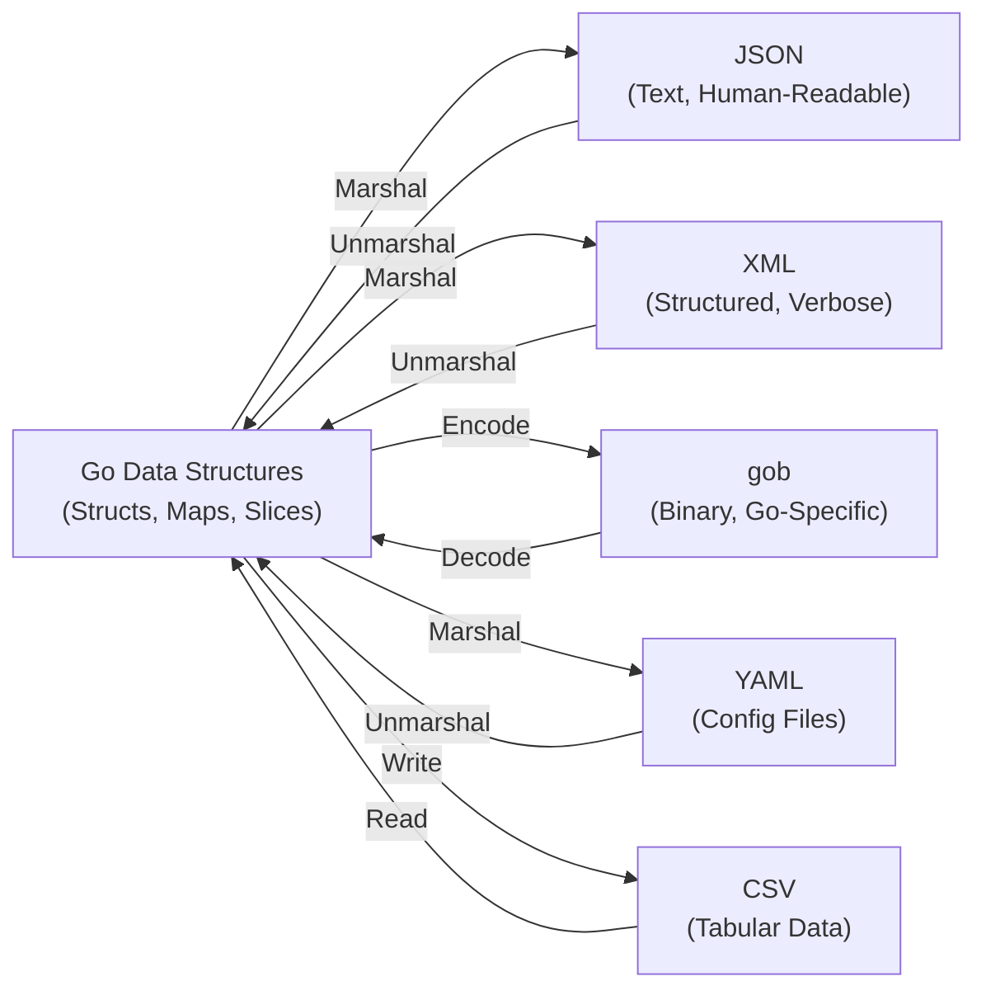
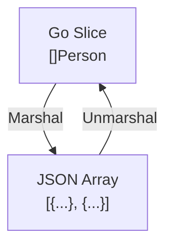
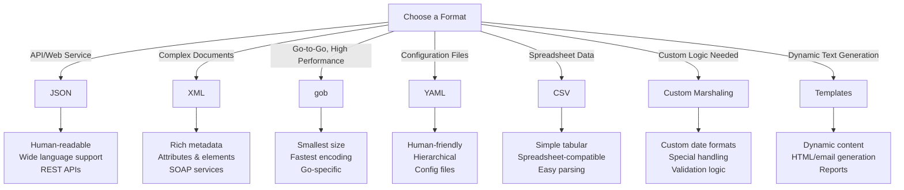
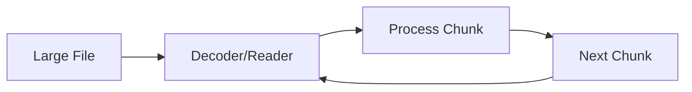

# Day 19: Serialization and Encoding

## Learning Objectives

- Understand serialization concepts and when to use different formats
- Serialize and deserialize data with encoding/json
- Work with XML encoding and decoding
- Use encoding/gob for binary serialization
- Implement custom marshaling and unmarshaling
- Work with text/template for template generation
- Handle YAML and CSV formats

---

## Overview: What is Serialization?

**Serialization** is the process of converting data structures (like Go structs) into a format that can be stored, transmitted, or reconstructed later. **Deserialization** is the reverse process—reading serialized data and reconstructing the original structures.

Go provides multiple serialization formats, each optimized for different use cases:



---

## 1. JSON Encoding and Decoding

### Why JSON?

JSON (JavaScript Object Notation) is the most widely used serialization format for APIs and data exchange. It's human-readable, language-agnostic, and natively supported by web browsers and most programming languages.

**Best for:**
- REST APIs and web services
- Configuration files (when human-readability is important)
- Data interchange between systems
- Logging structured data

### Basic Marshaling and Unmarshaling

**Marshaling** converts Go structs to JSON bytes. **Unmarshaling** parses JSON bytes back into Go structs.

See `main.go` lines 20-26 for a `marshalJSON` helper function that demonstrates the basic pattern.

The key is using struct tags to control field mapping:

```go
type Person struct {
    Name  string `json:"name"`        // Maps to "name" in JSON
    Age   int    `json:"age"`         // Maps to "age" in JSON
    Email string `json:"email"`       // Maps to "email" in JSON
}
```

See `main.go` lines 44-46 for a complete example of marshaling a `Person` struct.

### Struct Tags: Controlling Serialization

Struct tags are metadata annotations that tell the JSON encoder/decoder how to handle each field:

| Tag | Meaning | Example |
|-----|---------|---------|
| `json:"fieldname"` | Map to this JSON key | `json:"name"` |
| `json:"fieldname,omitempty"` | Omit field if empty | `json:"price,omitempty"` |
| `json:"-"` | Never serialize this field | `json:"-"` |
| `json:"fieldname,string"` | Convert to/from string | `json:"count,string"` |

See `main.go` lines 14-18 for the `Product` struct demonstrating the `omitempty` tag. Lines 59-66 show how `omitempty` prevents empty fields from appearing in JSON output.

### Pretty-Printing JSON

For debugging and human inspection, use `json.MarshalIndent` to add formatting:

See `main.go` lines 32-38 for the `marshalJSONIndent` helper function. Lines 48-50 demonstrate the output with proper indentation.

### Streaming JSON: Encoder and Decoder

For large files or streaming scenarios, use `json.Encoder` and `json.Decoder` instead of `Marshal`/`Unmarshal`. These work directly with `io.Reader` and `io.Writer`, avoiding the need to load entire files into memory.

**Pattern:**
```go
// Writing to a file
encoder := json.NewEncoder(file)
encoder.Encode(data)

// Reading from a file
decoder := json.NewDecoder(file)
decoder.Decode(&data)
```

### Validating JSON

Before unmarshaling, you can validate that a string is valid JSON:

```go
var obj interface{}
err := json.Unmarshal([]byte(jsonStr), &obj)
if err != nil {
    // Invalid JSON
}
```

See `exercise.go` for the `ExerciseValidateJSON` function to implement.

### Working with Arrays

JSON arrays map to Go slices. See `main.go` lines 68-74 for an example of marshaling a slice of `Person` structs into a JSON array.



---

## 2. XML Encoding and Decoding

### Why XML?

XML (Extensible Markup Language) is a structured, verbose format useful for complex documents and configurations. It supports attributes, nested elements, and namespaces.

**Best for:**
- Complex document structures
- Configuration files with hierarchies
- SOAP web services
- Data with rich metadata (attributes)

### Basic XML Marshaling

XML requires an `XMLName` field to specify the root element:

```go
type Book struct {
    XMLName xml.Name `xml:"book"`    // Root element name
    Title   string   `xml:"title"`   // Nested element
    Author  string   `xml:"author"`  // Nested element
    Year    int      `xml:"year"`    // Nested element
}
```

Use `xml.MarshalIndent` for formatted output (similar to JSON).

### XML Tags: Elements vs Attributes

XML supports both elements and attributes:

```go
type Product struct {
    XMLName xml.Name `xml:"product"`
    ID      int      `xml:"id,attr"`      // Becomes an attribute: id="123"
    Name    string   `xml:"name"`         // Becomes an element: <name>...</name>
    Price   float64  `xml:"price,attr"`   // Becomes an attribute: price="99.99"
}
```

This produces:
```xml
<product id="123" price="99.99">
    <name>Laptop</name>
</product>
```

### XML Unmarshaling

Parse XML back into structs using `xml.Unmarshal`:

```go
var book Book
err := xml.Unmarshal(xmlBytes, &book)
```

The struct tags must match the XML structure exactly.

### Streaming XML: Encoder and Decoder

Similar to JSON, use `xml.Encoder` and `xml.Decoder` for streaming:

```go
encoder := xml.NewEncoder(file)
encoder.Indent("", "  ")
encoder.Encode(data)
```

---

## 3. Binary Serialization with gob

### Why gob?

**gob** is Go's native binary serialization format. It's more efficient than JSON/XML (smaller size, faster encoding/decoding) but only works with Go.

**Best for:**
- Go-to-Go communication
- High-performance serialization
- Storing Go data structures efficiently
- RPC (Remote Procedure Call) protocols

### Advantages and Disadvantages

| Aspect | gob | JSON | XML |
|--------|-----|------|-----|
| **Size** | Smallest | Medium | Largest |
| **Speed** | Fastest | Medium | Slowest |
| **Human-readable** | No | Yes | Yes |
| **Language support** | Go only | All languages | All languages |
| **Type information** | Included | No | No |

### Basic gob Encoding and Decoding

Use `gob.Encoder` and `gob.Decoder` with a buffer or file:

```go
var buf bytes.Buffer
encoder := gob.NewEncoder(&buf)
err := encoder.Encode(data)

decoder := gob.NewDecoder(&buf)
err := decoder.Decode(&data)
```

Unlike JSON, gob doesn't require struct tags. It automatically handles all exported fields.

### gob with Files

For persistent storage:

```go
// Save
file, _ := os.Create("data.gob")
defer file.Close()
gob.NewEncoder(file).Encode(data)

// Load
file, _ := os.Open("data.gob")
defer file.Close()
gob.NewDecoder(file).Decode(&data)
```

---

## 4. Custom Marshaling and Unmarshaling

### When to Implement Custom Marshaling

Sometimes the default serialization doesn't match your needs. Implement the `Marshaler` and `Unmarshaler` interfaces to customize the process.

### JSON Custom Marshaling

Implement `MarshalJSON() ([]byte, error)` and `UnmarshalJSON([]byte) error`:

**Use case:** Custom date formatting

```go
type CustomTime struct {
    time.Time
}

func (ct CustomTime) MarshalJSON() ([]byte, error) {
    // Format as YYYY-MM-DD instead of RFC3339
    return []byte(`"` + ct.Time.Format("2006-01-02") + `"`), nil
}

func (ct *CustomTime) UnmarshalJSON(data []byte) error {
    str := string(data)
    str = str[1 : len(str)-1]  // Remove quotes
    t, err := time.Parse("2006-01-02", str)
    if err != nil {
        return err
    }
    ct.Time = t
    return nil
}
```

### XML Custom Marshaling

Implement `MarshalXML` and `UnmarshalXML` for custom XML handling:

```go
func (p Price) MarshalXML(e *xml.Encoder, start xml.StartElement) error {
    // Add currency as an attribute
    start.Attr = append(start.Attr, xml.Attr{
        Name:  xml.Name{Local: "currency"},
        Value: p.Currency,
    })
    return e.EncodeElement(p.Amount, start)
}
```

### gob Custom Marshaling

Implement `GobEncode() ([]byte, error)` and `GobDecode([]byte) error` for custom binary serialization.

---

## 5. Text Templates

### Why Templates?

Templates allow you to generate text or HTML dynamically by combining a template string with data. They're useful for generating reports, emails, HTML pages, and configuration files.

**Best for:**
- Generating HTML/email content
- Creating configuration files dynamically
- Producing formatted reports
- Code generation

### Basic Template Usage

```go
tmpl, err := template.New("test").Parse("Hello {{.Name}}, you are {{.Age}} years old")
if err != nil {
    log.Fatal(err)
}

data := map[string]interface{}{
    "Name": "Alice",
    "Age":  30,
}

tmpl.Execute(os.Stdout, data)
// Output: Hello Alice, you are 30 years old
```

### Template Actions

Templates use `{{...}}` syntax for dynamic content:

| Syntax | Meaning |
|--------|---------|
| `{{.FieldName}}` | Insert field value |
| `{{range .Items}}...{{end}}` | Loop over slice/map |
| `{{if .Condition}}...{{end}}` | Conditional output |
| `{{with .Value}}...{{end}}` | Scope to a value |

### Loops and Conditionals

```go
tmpl, _ := template.New("list").Parse(`
{{range .Items}}
- {{.Name}}: ${{.Price}}
{{end}}
`)

data := map[string]interface{}{
    "Items": []map[string]interface{}{
        {"Name": "Apple", "Price": 1.50},
        {"Name": "Banana", "Price": 0.75},
    },
}

tmpl.Execute(os.Stdout, data)
```

### Template Functions

Add custom functions to templates:

```go
funcMap := template.FuncMap{
    "upper": strings.ToUpper,
    "add": func(a, b int) int { return a + b },
}

tmpl, _ := template.New("test").Funcs(funcMap).Parse(
    "{{upper .Name}} - Total: {{add .A .B}}",
)
```

### Loading Templates from Files

```go
tmpl, err := template.ParseFiles("template.html")
if err != nil {
    log.Fatal(err)
}

file, _ := os.Create("output.html")
defer file.Close()

tmpl.Execute(file, data)
```

---

## 6. YAML and CSV Formats

### YAML: Configuration Files

YAML is human-friendly and commonly used for configuration files. It requires an external package:

```go
import "gopkg.in/yaml.v3"

type Config struct {
    Server struct {
        Host string `yaml:"host"`
        Port int    `yaml:"port"`
    } `yaml:"server"`
    Database struct {
        URL string `yaml:"url"`
    } `yaml:"database"`
}

var config Config
err := yaml.Unmarshal(yamlBytes, &config)
data, _ := yaml.Marshal(config)
```

**Best for:**
- Configuration files (Kubernetes, Docker Compose, etc.)
- Human-editable data files
- Application settings

### CSV: Tabular Data

CSV (Comma-Separated Values) is built into the standard library for tabular data:

```go
import "encoding/csv"

// Writing CSV
writer := csv.NewWriter(file)
writer.WriteAll([][]string{
    {"Name", "Age", "City"},
    {"Alice", "30", "New York"},
})
writer.Flush()

// Reading CSV
reader := csv.NewReader(file)
records, err := reader.ReadAll()
```

**Best for:**
- Spreadsheet data
- Data exports and imports
- Simple tabular formats

---

## Format Comparison and Selection Guide



---

## Error Handling Best Practices

Always check for errors when serializing/deserializing:

```go
// Marshaling
data, err := json.Marshal(v)
if err != nil {
    // Handle error - could be unsupported type, circular reference, etc.
    return err
}

// Unmarshaling
err := json.Unmarshal(jsonBytes, &v)
if err != nil {
    // Handle error - could be invalid JSON, type mismatch, etc.
    return err
}
```

Common errors:
- **Invalid JSON/XML**: Malformed input data
- **Type mismatch**: Trying to unmarshal into incompatible type
- **Unsupported types**: Channels, functions, etc. can't be marshaled
- **Circular references**: Struct contains pointer to itself

---

## Streaming Large Data

For files larger than available memory, use streaming instead of loading everything at once:



**JSON Streaming:**
```go
decoder := json.NewDecoder(file)
for decoder.More() {
    var item Item
    decoder.Decode(&item)
    // Process item
}
```

**XML Streaming:**
```go
decoder := xml.NewDecoder(file)
for {
    token, err := decoder.Token()
    if err != nil {
        break
    }
    // Process token
}
```

---

## Key Takeaways

1. **Format Selection** - Choose based on use case: JSON for APIs, XML for documents, gob for Go-to-Go, YAML for config, CSV for tables
2. **Struct Tags** - Control serialization with `json:"name"`, `xml:"name"`, etc.
3. **Marshaling/Unmarshaling** - Convert between Go types and serialized formats
4. **Streaming** - Use Encoder/Decoder for large files to avoid memory issues
5. **Custom Marshaling** - Implement interfaces for special handling (custom dates, validation, etc.)
6. **Error Handling** - Always check for parsing errors
7. **Omitempty** - Skip empty fields in JSON output with the `omitempty` tag
8. **Type Safety** - Go's type system prevents many serialization bugs
9. **Templates** - Generate dynamic text/HTML with data binding
10. **Performance** - gob is fastest, JSON is most compatible, XML is most verbose

---

## Further Reading

- [encoding/json Documentation](https://pkg.go.dev/encoding/json)
- [encoding/xml Documentation](https://pkg.go.dev/encoding/xml)
- [encoding/gob Documentation](https://pkg.go.dev/encoding/gob)
- [text/template Documentation](https://pkg.go.dev/text/template)
- [encoding/csv Documentation](https://pkg.go.dev/encoding/csv)
- [gopkg.in/yaml.v3 Documentation](https://pkg.go.dev/gopkg.in/yaml.v3)
