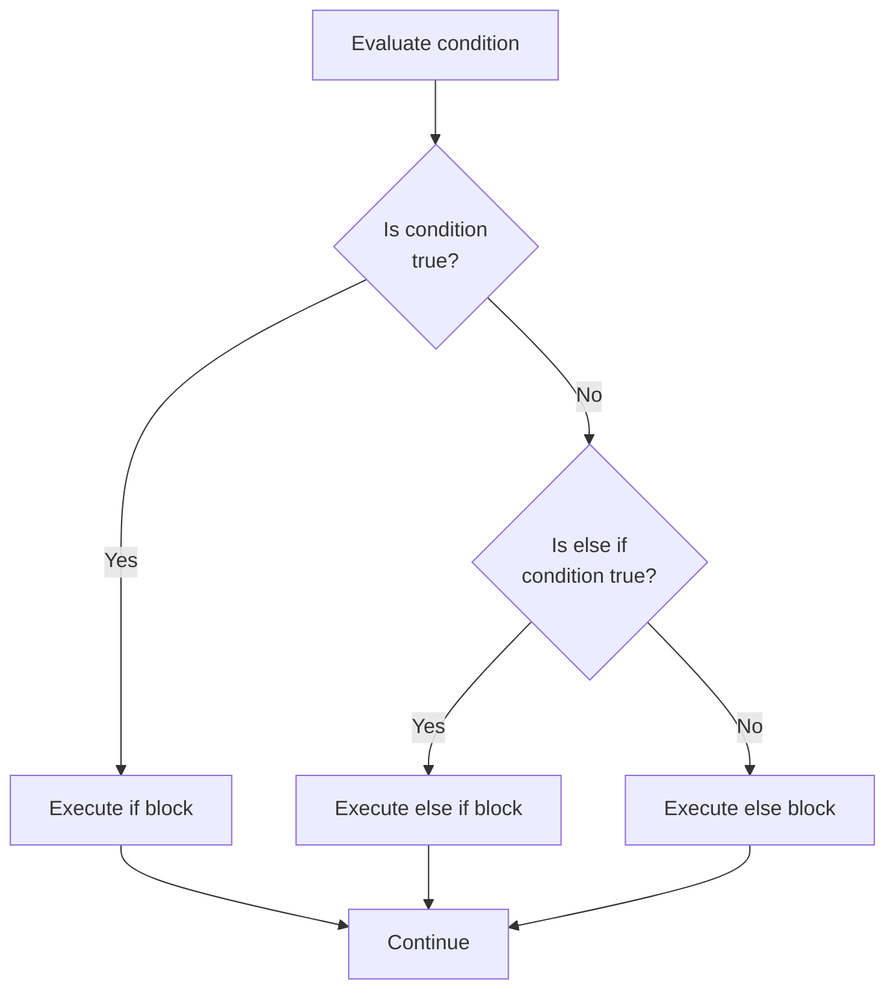
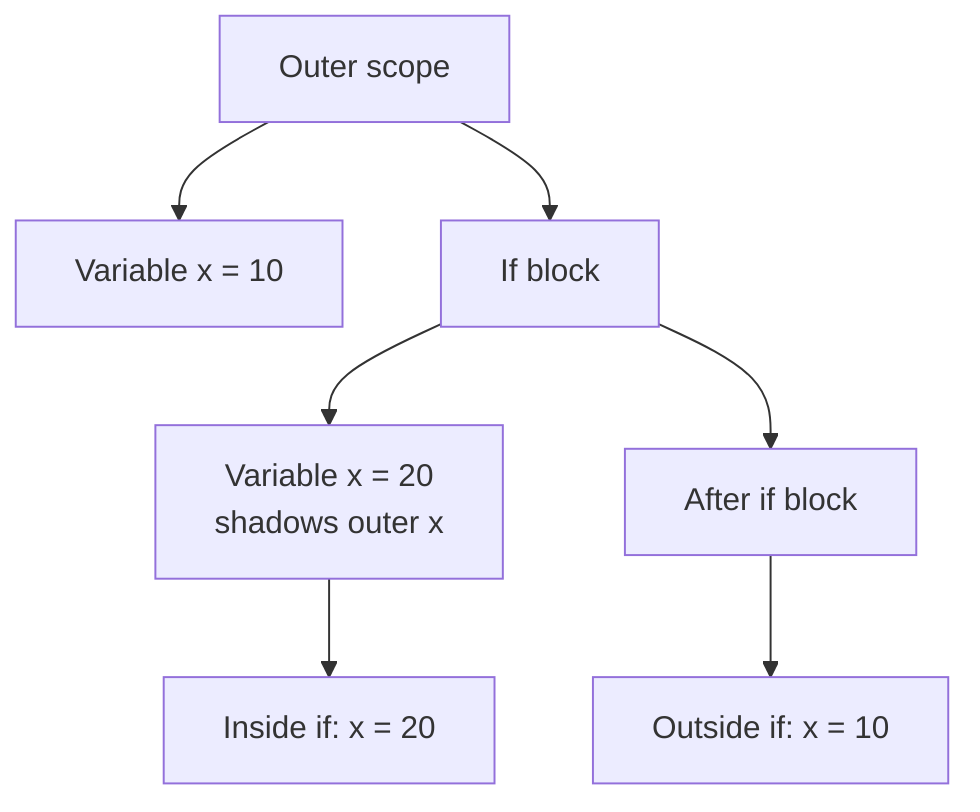
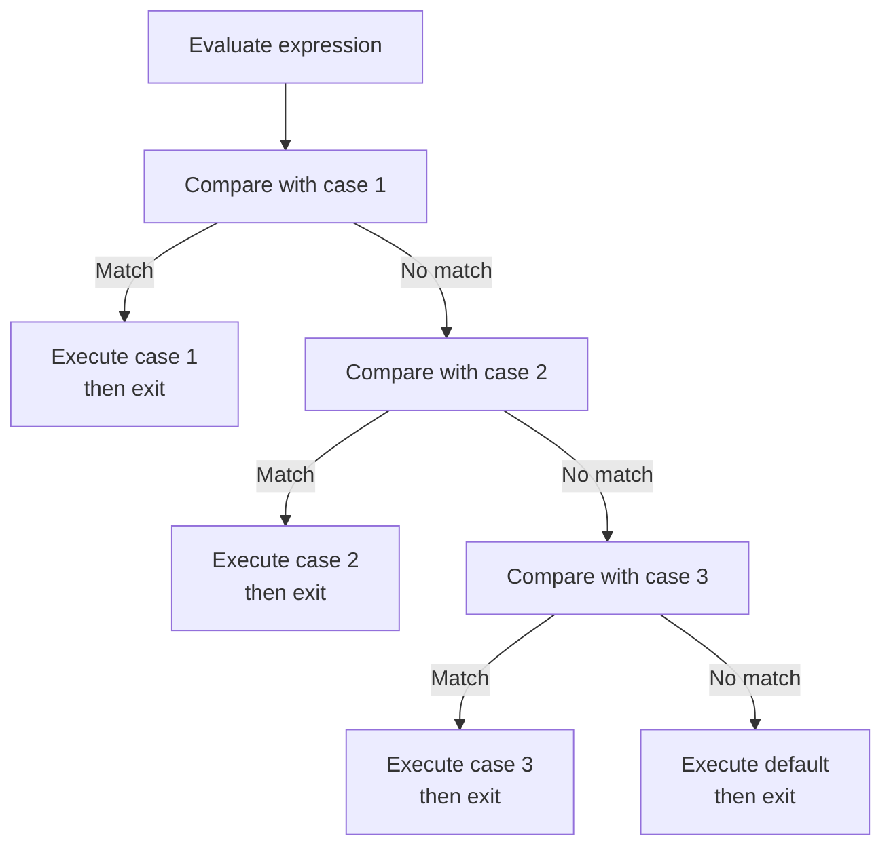
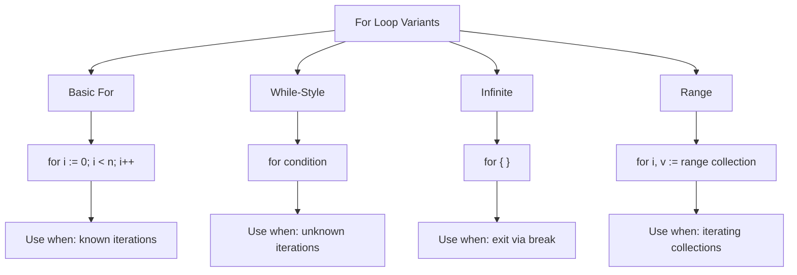
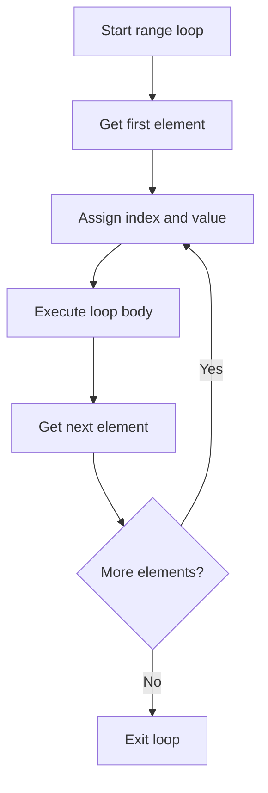
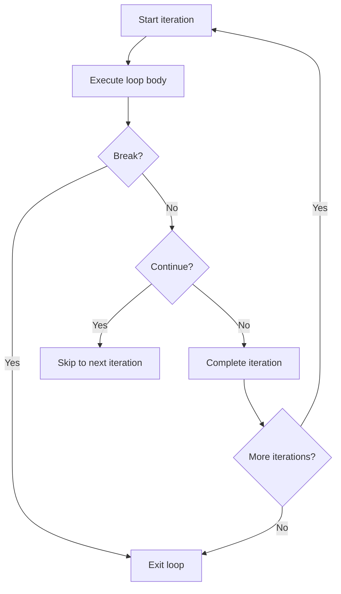
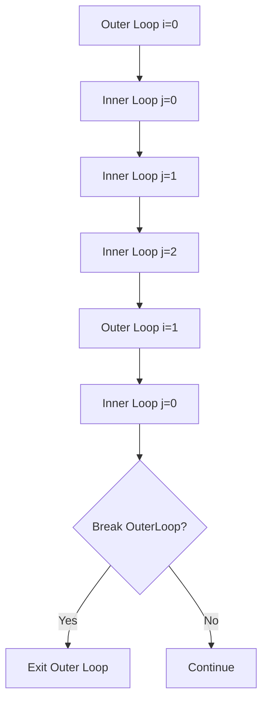

# Day 2: Control Structures and Collections

## Learning Objectives

- Master if/else, switch, and for loops with proper syntax and scoping
- Use break, continue, and labels for advanced loop control
- Write conditional logic idiomatically in Go
- Understand arrays (fixed) vs slices (dynamic)
- Master slice operations and memory management
- Work with maps and key-value collections
- Learn best practices and avoid common pitfalls

---

## Part 1: Control Structures

### What are Control Structures?

Control structures are the fundamental building blocks that determine the flow of execution in a program. They allow you to make decisions (if/switch), repeat actions (for loops), and control loop behavior (break/continue). Go provides a minimal but powerful set of control structures designed for clarity and simplicity.

**Key Principles**:
- No parentheses required around conditions
- Braces are mandatory (enforces consistent style)
- Variables can be scoped to control structures
- Go has only one loop construct: `for`

---

## 1. If/Else Statements

### What are If/Else Statements?

If/else statements allow your program to make decisions and execute different code blocks based on conditions. Go's syntax is clean and requires no parentheses around conditions, but braces are mandatory.

### Basic If/Else Syntax

If/else statements allow conditional execution. See `main.go` lines 13-18 for a simple if/else example, and lines 20-29 for an if/else if/else chain with multiple conditions.

### Decision Flow Diagram

### Examples with Different Conditions

See `main.go` lines 39-48 for examples of numeric comparisons and logical operators (AND, OR, NOT).

Go allows declaring variables in the condition itself, scoped to the if/else block. See `main.go` lines 32-36 for an example of variable declaration in a condition.

**Benefits**:
- Limits variable scope to where it's needed
- Prevents accidental reuse of variable names
- Makes code more readable and self-contained

### Variable Scoping in If Blocks

**Shadowing Example**:
See `main.go` lines 32-36 for an example of variable shadowing in an if block, where a variable declared in the condition shadows any outer variable with the same name.

### Practical Patterns

**Pattern 1: Guard Clause** (early return):
Guard clauses check for invalid conditions at the start of a function and return early, avoiding deep nesting. This pattern improves readability by handling edge cases first.

**Pattern 2: Nested Conditions**:
See `main.go` lines 13-18 for an example of nested if/else blocks that check multiple conditions in sequence.

**Pattern 3: Complex Conditions**:
See `main.go` lines 39-48 for examples of complex conditions using logical operators (AND, OR) to combine multiple checks.

### Common Mistakes

**Mistake 1: Parentheses Around Condition**:
Go doesn't require parentheses around conditions (unlike C or Java). Omit them for idiomatic Go code.

**Mistake 2: Missing Braces**:
Braces are mandatory in Go. Every if/else block must have braces, even for single statements.

**Mistake 3: Confusing = with ==**:
Use `==` for comparison and `=` for assignment. Using `=` in a condition assigns a value instead of comparing it.

---

## 2. Switch Statements

### What are Switch Statements?

A switch statement is a cleaner alternative to multiple if/else chains. It evaluates an expression once and compares it against multiple cases. Switch statements are more readable when you have many branches.

### Basic Switch Syntax

A switch statement evaluates an expression once and compares it against multiple cases. The basic syntax has:
- A `switch` keyword followed by an expression
- Multiple `case` labels with values to compare
- An optional `default` case for unmatched values

**Key Characteristics**:
- Cases don't fall through by default (unlike C/Java)
- Use `fallthrough` keyword to explicitly continue to next case
- `default` case is optional
- Expression can be any comparable type

### Switch with Different Types

Switch statements work with integers, strings, and other comparable types. You can have multiple values per case. See `main.go` lines 55-73 for an integer switch example, lines 76-86 for a string switch, and lines 89-97 for multiple values per case.

### Switch Evaluation Flow

An expressionless switch is equivalent to `switch true`, with each case containing a boolean expression. See `main.go` lines 104-131 for examples of expressionless switch statements with complex conditions.

**When to Use Expressionless Switch**:
- Complex conditions that don't fit a simple expression
- Multiple independent boolean checks
- More readable than chained if/else statements

By default, switch cases don't fall through. Use `fallthrough` to explicitly continue to the next case. See `main.go` lines 138-150 for an example of fallthrough behavior.

**Important**: `fallthrough` is rarely used in idiomatic Go. Use multiple values per case instead (see lines 89-97 for an example of multiple values per case).

### Practical Patterns

**Pattern 1: Type Switch** (introduced later, but shown for completeness):
Type switches allow you to check the type of an interface value and execute different code based on the type. This is useful when working with empty interfaces or polymorphic code.

**Pattern 2: Status Handling**:
Switch statements are ideal for handling status codes or enumerated values. Group related cases together and use a default case for unexpected values.

### Common Mistakes

**Mistake 1: Expecting Fallthrough by Default**:
Unlike C or Java, Go switch cases don't fall through by default. Each case automatically exits after execution. Use multiple values per case (e.g., `case 1, 2:`) if you want to handle multiple values with the same code.

**Mistake 2: Using Non-Comparable Types**:
Only comparable types can be used in switch expressions. Slices and maps are not comparable, so you cannot switch on them directly. Use if/else statements or compare individual elements instead.

---

## 3. For Loops

### For Loop Variants

Go has four for loop patterns: basic (C-style), while-style, infinite, and range loops.

**Pattern 1: Basic For Loop** (traditional C-style):
See `main.go` lines 157-164 for basic for loops with single and multiple variables.

**Pattern 2: While-Style For Loop**:
See `main.go` lines 172-175 for while-style loops (omitting init and post components).

**Pattern 3: Infinite For Loop**:
See `main.go` lines 183-189 for infinite loops with break conditions.

**Pattern 4: Range Loop** (for collections):
See `main.go` lines 197-209 for range loops with slices, lines 217-219 for range loops with strings, and lines 232-234 for range loops with maps.

### For Loop Variants Comparison

The basic for loop has three components: init, condition, and post. See `main.go` lines 157-164 for examples of basic for loops with single and multiple variables.

Omit the init and post to create a while-style loop. See `main.go` lines 172-175 for an example of a while-style for loop.

**Use Cases**:
- When iteration count is unknown
- When condition depends on external state
- When increment logic is complex

An infinite for loop continues until a `break` statement is executed. See `main.go` lines 183-189 for an example of an infinite loop with a break condition.

The range loop iterates over arrays, slices, strings, maps, and channels. See `main.go` lines 197-209 for range loops with slices, lines 217-219 for range loops with strings, and lines 232-234 for range loops with maps.

### Range Loop Mechanics

See `main.go` lines 278-283 for a practical example of nested loops (multiplication table) and lines 291-302 for finding prime numbers.

---

## 4. Loop Control: Break, Continue, and Labels

### What is Loop Control?

Loop control statements allow you to alter the normal flow of loops. They provide fine-grained control over when to exit a loop or skip iterations.

The `break` statement immediately exits the current loop. See `main.go` lines 250-255 for an example of a break statement.

**Use Cases**:
- Exit when a condition is met
- Stop searching when item is found
- Exit infinite loops

The `continue` statement skips the rest of the current iteration and moves to the next. See `main.go` lines 242-247 for an example of a continue statement.

**Use Cases**:
- Skip invalid items
- Skip processing when condition is met
- Filter iterations

### Break vs Continue Flow

### Labeled Loops

Labels allow you to break or continue to a specific outer loop in nested loop scenarios. See `main.go` lines 262-271 for an example of labeled loops with break.

**Label Syntax**:
A label is placed directly before a loop statement, followed by a colon. You can then use `break LabelName` or `continue LabelName` to control that specific loop from within nested loops.

### Labeled Loop Execution

**Continue with Labels**:
You can also use `continue LabelName` to skip to the next iteration of a labeled loop. This is useful when you need to skip the rest of the inner loop and move to the next iteration of an outer loop.

### Practical Patterns

**Pattern 1: Search and Exit**:
Use `break` to exit a loop when you find what you're searching for. This is more efficient than iterating through all remaining items.

**Pattern 2: Skip Invalid Items**:
Use `continue` to skip processing for invalid items without breaking the loop. This allows you to filter items while iterating.

**Pattern 3: Nested Loop with Early Exit**:
Use labeled `break` statements to exit from nested loops when a condition is met. This is more efficient than using flags or additional control logic.

### Common Mistakes

**Mistake 1: Using Break in Wrong Context**:
`break` only works inside loops. Using it in an if statement (outside a loop) causes a syntax error. Always ensure `break` is within a loop.

**Mistake 2: Forgetting Label Scope**:
Labels must be placed directly before the loop statement they control. A label placed inside a loop or in the wrong position won't work correctly. See `main.go` lines 262-271 for the correct placement of labels.

---

## Best Practices

**1. Prefer Clear Conditions Over Complex Logic**:
Extract complex conditions into helper functions with meaningful names. This improves readability and makes your intent clear.

**2. Use Guard Clauses Early**:
Check for invalid conditions at the start of a function and return early. This avoids deep nesting and makes the happy path clearer.

**3. Prefer Range Loops Over Index Loops**:
Use range loops when you don't need the index. They're more idiomatic and less error-prone than index-based loops. See `main.go` lines 197-209 for examples of range loops.

**4. Use Expressionless Switch for Complex Conditions**:
When you have multiple independent boolean conditions, an expressionless switch (lines 104-131) is more readable than chained if/else statements.

**5. Avoid Modifying Collections While Iterating**:
Don't modify a slice or map while iterating over it with range. Instead, build a new collection with the desired elements and assign it back.

---

## Common Mistakes and Gotchas

**Mistake 1: Confusing Break and Continue**:
`break` exits the loop entirely, while `continue` skips to the next iteration. Use `continue` when you want to skip processing for certain items but keep looping. See `main.go` lines 242-255 for examples of both.

**Mistake 2: Infinite Loops Without Exit**:
Infinite loops (`for { }`) must have a `break` statement inside them, otherwise they run forever. Always ensure there's a condition that will eventually cause the loop to exit.

**Mistake 3: Range Loop Variable Capture in Closures**:
When creating closures inside range loops, be aware that all closures capture the same loop variable. If you need to capture the value, shadow the variable with a new declaration (e.g., `i := i`).

**Mistake 4: Assuming Map Iteration Order**:
Maps in Go have random iteration order. If you need a consistent order, sort the keys first and then iterate over the sorted keys.

**Mistake 5: Off-by-One Errors**:
Use `<` instead of `<=` when iterating with index-based loops. Using `<=` with `len(arr)` will cause an out-of-bounds error on the last iteration. See `main.go` lines 157-164 for correct loop bounds.

---

---

## Part 2: Collections

### What are Collections?

Collections are data structures that group multiple values together. Go provides three main collection types:

- **Arrays**: Fixed-size, homogeneous collections with compile-time length
- **Slices**: Dynamic, flexible views into arrays with runtime length
- **Maps**: Unordered key-value pairs for fast lookups

Each has distinct use cases and performance characteristics.

---

## 1. Arrays: Fixed-Size Collections

**What are Arrays?**

Arrays are the simplest collection type in Go. An array has a **fixed length** determined at compile time and cannot be changed. All elements must be of the same type.

**Key Characteristics**:
- **Fixed size**: Length is part of the type (`[5]int` and `[10]int` are different types)
- **Zero-valued**: Uninitialized elements get zero values (0 for int, "" for string, false for bool)
- **Efficient**: Direct memory access, no indirection
- **Comparable**: Arrays can be compared with `==` if element types are comparable
- **Copyable**: Assigning an array copies all elements

See `main.go` lines 310-331 for examples of array declaration, initialization, operations (indexing, modification, length), and iteration.

**When to Use Arrays**:
- When size is known at compile time and never changes
- For small, fixed-size collections (e.g., coordinates, RGB values)
- When you need guaranteed contiguous memory
- As the underlying storage for slices

---

## 2. Slices: Dynamic Collections

**What are Slices?**

A slice is a **dynamic, flexible view** into an array. Unlike arrays, slices can grow and shrink at runtime. A slice is not an array—it's a descriptor that points to an underlying array.

**Slice Internals: The Three-Part Descriptor**

Every slice contains three pieces of information:
- **Pointer**: Address of first element in underlying array
- **Length**: Number of elements currently in the slice
- **Capacity**: Maximum elements before reallocation needed

See `main.go` lines 338-372 for examples of slice declaration, creation from arrays, slicing variations, and using `make()` to create slices with specific length and capacity.

See `main.go` lines 358-379 for examples of slice operations including indexing, slicing, length, capacity, and append operations with single elements, multiple elements, and slice unpacking.

**Copy: Safe Duplication**:

See `main.go` lines 374-379 for examples of using `copy()` to create independent copies of slices, including partial copies.

**Critical: Slices Share Underlying Arrays**

This is one of the most important concepts to understand. See `main.go` lines 381-387 for a demonstration of how multiple slices can share the same underlying array, and how modifying one slice affects others that reference the same array elements.

**Best Practices for Slices**:

Pattern 1: Pre-allocate when size is known - See `main.go` lines 358-372 for efficient slice allocation with pre-allocated capacity.

Pattern 2: Use copy for safe mutations - See `main.go` lines 374-379 for examples of creating independent copies to avoid unintended modifications.

Pattern 3: Slice filtering - Build a new slice with desired elements rather than modifying in place.

---

## 3. Maps: Key-Value Collections

**What are Maps?**

A map is an **unordered collection of key-value pairs**. Maps provide fast lookups, insertions, and deletions based on keys. They're implemented as hash tables internally.

**Map Characteristics**:
- **Unordered**: Iteration order is randomized (by design)
- **Dynamic**: Can grow and shrink at runtime
- **Reference type**: Maps are passed by reference, not copied
- **Nil maps**: A nil map is read-only (panics on write)
- **Comparable keys**: Keys must be comparable (not slices, maps, or functions)

See `main.go` lines 394-407 for examples of map creation (literal and `make()`), insertion, and updates.

See `main.go` lines 409-418 for examples of map access, safe access with the comma-ok idiom, and deletion.

See `main.go` lines 424-429 for examples of map iteration over key-value pairs, keys only, and values only.

**Important: Map Iteration Order is Random**

Maps in Go have random iteration order by design. If you need consistent order, sort the keys first and then iterate over the sorted keys.

**Common Map Patterns**:

Pattern 1: Safe map access - Always use the comma-ok idiom to safely check if a key exists before accessing it.

Pattern 2: Map of slices - See `main.go` lines 431-436 for examples of using maps with slice values.

Pattern 3: Counting occurrences - See `main.go` lines 438-444 for examples of using maps to count word frequencies.

---

## 4. Choosing the Right Collection Type

| Type | Size | Use Case | Performance |
|------|------|----------|-------------|
| **Array** | Fixed | Small, fixed collections; coordinates | O(1) access, no allocation |
| **Slice** | Dynamic | Most collections; lists, queues | O(1) access, amortized append |
| **Map** | Dynamic | Key-value lookups; caching, indexing | O(1) average lookup |

**Decision Guide**:
- Need a collection? → Size known at compile time? → Yes → Use Array
- Need a collection? → Size known at compile time? → No → Need fast key lookup? → Yes → Use Map
- Need a collection? → Size known at compile time? → No → Need fast key lookup? → No → Use Slice

---

## Best Practices (Collections)

**1. Prefer Clear Conditions Over Complex Logic**: Extract complex conditions into helper functions with meaningful names.

**2. Use Guard Clauses Early**: Check for invalid conditions at the start of a function and return early to avoid deep nesting.

**3. Prefer Range Loops Over Index Loops**: Use range loops when you don't need the index. See `main.go` lines 197-209 for examples of range loops.

**4. Pre-allocate Slices When Size is Known**: See `main.go` lines 358-372 for examples of efficient slice allocation with pre-allocated capacity.

---

## Key Takeaways

1. **Control Flow**: Use if/else for simple conditions, switch for multiple cases, expressionless switch for complex boolean logic
2. **Loops**: Go has one loop construct (`for`) with multiple patterns for different scenarios
3. **Collections**: Arrays are fixed, slices are dynamic and flexible, maps provide fast key-value lookups
4. **Slice Internals**: Understand that slices share underlying arrays and use `copy()` for independence
5. **Map Safety**: Always use comma-ok idiom for safe map access
6. **Performance**: Pre-allocate slices when size is known to avoid repeated allocations

---

## Further Reading

- [Go by Example: If/Else](https://gobyexample.com/if-else) - Conditional statements
- [Go by Example: Switch](https://gobyexample.com/switch) - Switch statements and patterns
- [Go by Example: For](https://gobyexample.com/for) - All loop variants
- [Go by Example: Arrays](https://gobyexample.com/arrays) - Fixed-size arrays
- [Go by Example: Slices](https://gobyexample.com/slices) - Dynamic slices and operations
- [Go by Example: Maps](https://gobyexample.com/maps) - Key-value data structures
- [Go Slices: Usage and Internals](https://go.dev/blog/slices-intro) - Deep dive into slice internals
- [Effective Go: Control Structures](https://go.dev/doc/effective_go#control-structures) - Idiomatic control flow
- [Go Blog: For Loops](https://go.dev/blog/range) - Range loops and iteration
