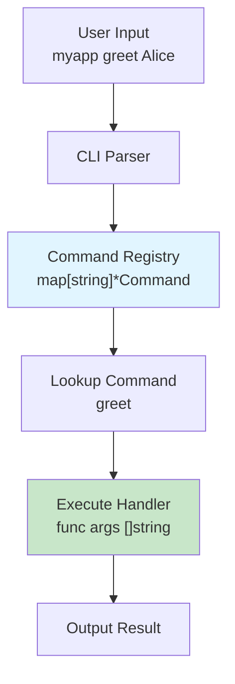
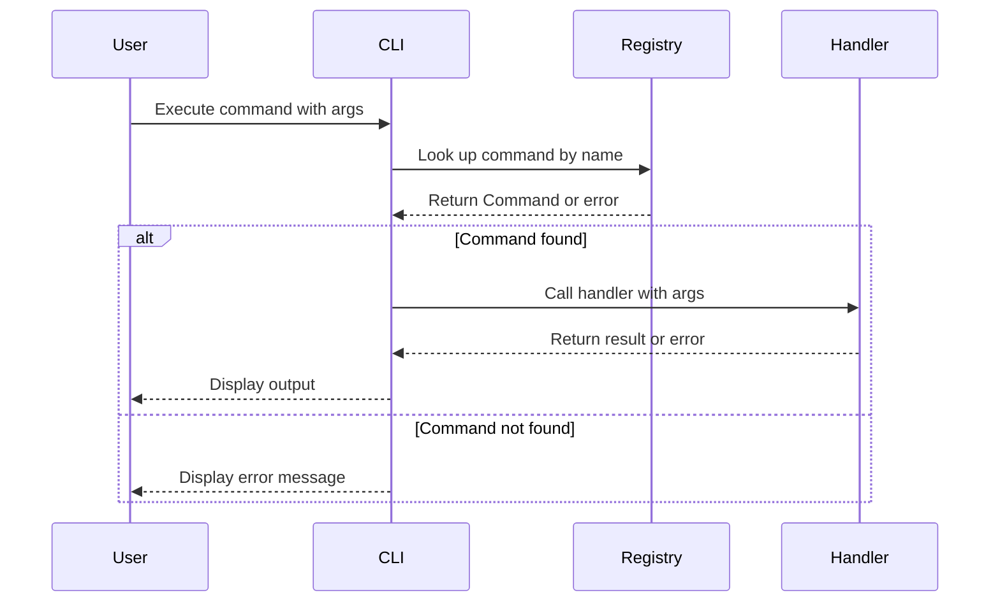
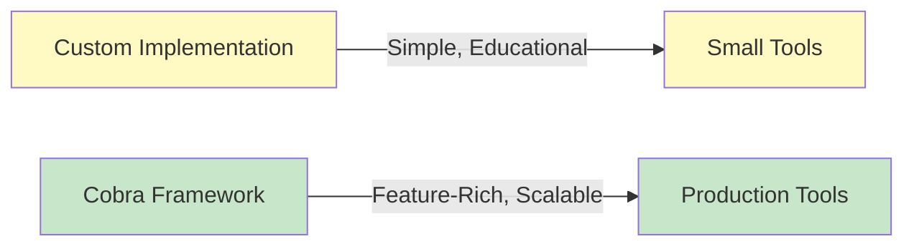

# Day 20: Command Line Applications

## Learning Objectives

- Understand the command pattern for building CLI applications
- Implement a custom command registry system
- Learn the Cobra framework for production-ready CLIs
- Parse command-line flags and arguments effectively
- Design user-friendly command-line interfaces
- Handle errors gracefully in CLI applications
- Build scalable, maintainable CLI tools

---

## 1. Introduction to CLI Applications

Command-line applications (CLIs) are programs that users interact with through text commands and arguments. They're essential for:
- **Developer tools** (git, docker, kubectl)
- **System utilities** (grep, find, sed)
- **DevOps automation** (deployment, configuration management)
- **Data processing** (batch operations, ETL pipelines)

A well-designed CLI should be:
- **Intuitive**: Clear command names and help text
- **Consistent**: Predictable behavior and flag patterns
- **Robust**: Proper error handling and validation
- **Discoverable**: Built-in help and documentation

---

## 2. The Command Pattern Architecture

### Overview

The command pattern is a behavioral design pattern that encapsulates a request as an object. In CLI applications, each command is a self-contained unit with its own handler, description, and arguments.

### Architecture Diagram



### Custom Implementation: The Command Struct

The custom implementation in `main.go` demonstrates the command pattern using a simple but effective design. See `main.go` lines 9-23 for the core structure:

- **Command struct**: Holds the command name, description, and a handler function
- **Handler function**: Takes arguments and returns an error for proper error handling
- **Registry**: A map that stores all registered commands by name

This approach is ideal for:
- Learning the fundamentals of CLI design
- Building simple tools with minimal dependencies
- Understanding how frameworks like Cobra work internally

### Registration and Execution Flow



See `main.go` lines 17-31 for the registration and execution implementation.

---

## 3. Building a Custom Command System

### Registering Commands

Commands are registered during initialization using the `registerCommand` function (see `main.go` lines 33-64). Each command includes:

1. **Name**: Unique identifier for the command
2. **Description**: Help text explaining what the command does
3. **Handler**: Function that executes the command logic

Example commands from `main.go`:
- `greet`: Takes a name argument and outputs a greeting
- `add`: Takes two numbers and outputs their sum
- `echo`: Echoes back all provided arguments
- `help`: Lists all available commands

### Error Handling

The handler function returns an `error`, allowing graceful error handling. See `main.go` lines 78-82 for error handling in action. This pattern:
- Separates error handling from command logic
- Allows callers to decide how to handle errors
- Enables consistent error reporting across all commands

### Best Practices for Custom CLIs

1. **Validate arguments early**: Check argument count and types before processing
2. **Return meaningful errors**: Use `fmt.Errorf` with context about what went wrong
3. **Provide help**: Implement a help command that lists all available commands
4. **Use consistent naming**: Keep command names lowercase and descriptive
5. **Document behavior**: Include clear descriptions for each command

---

## 4. The Cobra Framework

For production applications, the Cobra framework provides a robust, feature-rich foundation for CLI development. Cobra is used by major projects like Docker, Kubernetes, and Hugo.

### Why Cobra?

Cobra provides:
- **Automatic help generation**: `-h` and `--help` flags work out of the box
- **Flag parsing**: Supports short (`-v`) and long (`--verbose`) flags
- **Subcommand support**: Organize commands hierarchically
- **Completion scripts**: Generate bash/zsh completion for your CLI
- **Viper integration**: Easy configuration file and environment variable handling

### Basic CLI Structure

A Cobra application follows this pattern:

```
rootCmd (main command)
├── serveCmd (subcommand)
├── migrateCmd (subcommand)
└── configCmd (subcommand)
    ├── setCmd (nested subcommand)
    └── getCmd (nested subcommand)
```

### Key Cobra Components

**Command Definition**: Each command is a `*cobra.Command` with:
- `Use`: Command name and usage string
- `Short`: Brief description (shown in help)
- `Long`: Detailed description
- `Run`: Handler function executed when command is called
- `RunE`: Handler that returns an error (preferred for error handling)

**Flags**: Parameters that modify command behavior:
- **Persistent flags**: Available to command and all subcommands
- **Local flags**: Only available to that specific command
- **Required flags**: Must be provided by the user

### Cobra Advantages Over Custom Implementation



**Custom Implementation**:
- ✓ Lightweight and easy to understand
- ✓ No external dependencies
- ✗ Manual help text generation
- ✗ No built-in flag parsing
- ✗ Limited subcommand support

**Cobra Framework**:
- ✓ Automatic help and usage text
- ✓ Powerful flag parsing
- ✓ Hierarchical subcommands
- ✓ Shell completion generation
- ✓ Viper integration for configuration
- ✗ Adds external dependency
- ✗ Steeper learning curve

---

## 5. Best Practices for CLI Design

### 1. Command Organization

Structure commands logically:
- **Flat structure**: For simple tools with few commands (< 10)
- **Hierarchical structure**: For complex tools with related command groups

Example hierarchy:
```
myapp
├── server
│   ├── start
│   ├── stop
│   └── status
├── config
│   ├── get
│   ├── set
│   └── list
└── help
```

### 2. Argument and Flag Conventions

Follow standard CLI conventions:
- **Arguments**: Positional parameters (e.g., `myapp greet Alice`)
- **Flags**: Named parameters (e.g., `myapp greet --count 3`)
- **Short flags**: Single-letter versions (e.g., `-c` for `--count`)
- **Boolean flags**: No value needed (e.g., `--verbose`)

### 3. Error Handling and Exit Codes

Use appropriate exit codes:
- `0`: Success
- `1`: General error
- `2`: Misuse of command (invalid arguments)
- `3-125`: Application-specific errors

Example from `main.go` lines 78-82: Check for errors and report them clearly to the user.

### 4. Help Text and Documentation

Provide comprehensive help:
- **Short description**: One-line summary of what the command does
- **Long description**: Detailed explanation with examples
- **Usage examples**: Show common use cases
- **Flag descriptions**: Explain each flag's purpose and default value

### 5. Input Validation

Always validate user input:
- Check argument count (see `main.go` lines 35-37)
- Validate argument types (see `main.go` lines 42-45)
- Provide clear error messages when validation fails
- Suggest corrections when possible

### 6. Output Formatting

Design output for both humans and machines:
- **Human-readable**: Clear, formatted output with labels
- **Machine-parseable**: JSON or CSV options for scripting
- **Consistent**: Use the same format across all commands
- **Quiet mode**: Optional flag to suppress non-essential output

### 7. Testing CLI Applications

Test your CLI thoroughly:
- **Unit tests**: Test handler functions in isolation
- **Integration tests**: Test command execution with real arguments
- **Error cases**: Test invalid arguments and error conditions
- **Help text**: Verify help output is accurate and complete

---

## 6. Key Takeaways

1. **Command Pattern**: Encapsulates each command as a self-contained unit with handler, name, and description
2. **Custom Implementation**: Lightweight approach using a map-based registry (see `main.go`)
3. **Cobra Framework**: Production-ready solution with automatic help, flag parsing, and subcommands
4. **Error Handling**: Return errors from handlers for consistent error reporting
5. **User Experience**: Design intuitive commands with clear help text and validation
6. **Scalability**: Start with custom implementation, migrate to Cobra as complexity grows
7. **Testing**: Test commands thoroughly including error cases and edge cases
8. **Conventions**: Follow standard CLI conventions for consistency with other tools
9. **Documentation**: Provide clear help text and usage examples
10. **Validation**: Always validate user input and provide meaningful error messages

---

## 7. Further Reading

- [Cobra Documentation](https://cobra.dev/) - Official Cobra framework documentation
- [Viper Documentation](https://github.com/spf13/viper) - Configuration management with Cobra
- [CLI Best Practices](https://clig.dev/) - Comprehensive guide to CLI design
- [POSIX Command Guidelines](https://pubs.opengroup.org/onlinepubs/9699919799/basedefs/V1_chap12.html) - Standard conventions
- [12 Factor CLI Apps](https://12factor.net/) - Design principles for CLI applications
