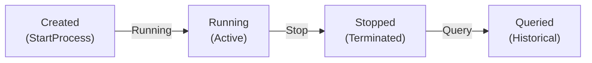
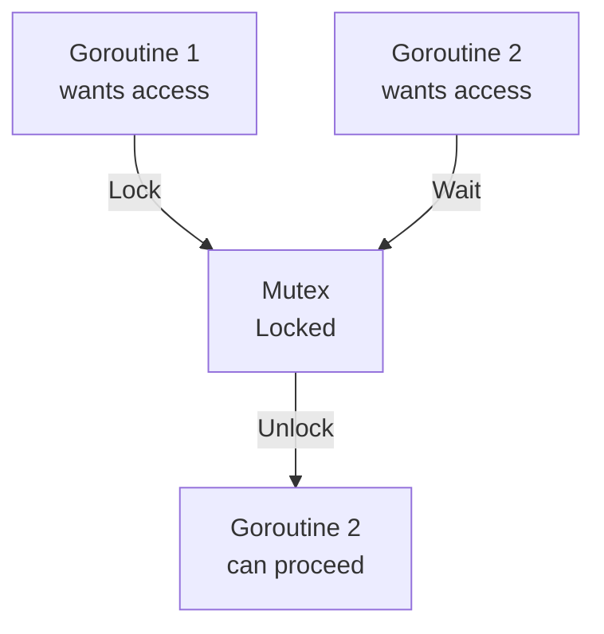
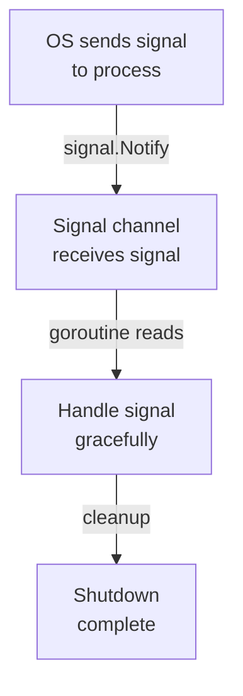
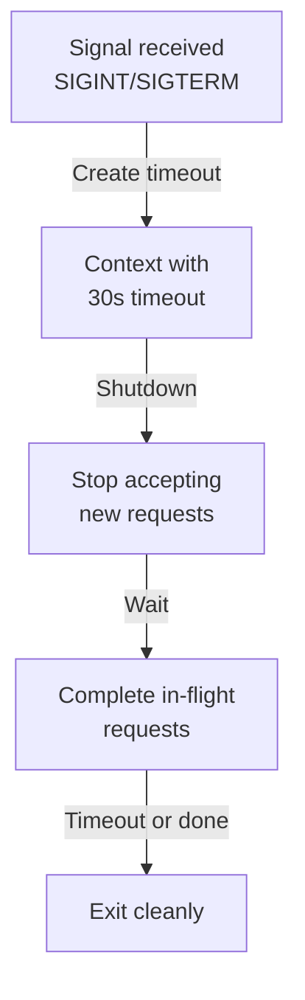

# Day 21: Signal Handling and Processes

## Learning Objectives

- Understand process management and lifecycle
- Implement thread-safe process tracking with mutexes
- Handle OS signals with os/signal package
- Implement graceful shutdown with context and timeouts
- Execute external commands with os/exec package
- Manage process information and environment variables

---

## Part 1: Core Concepts (Exercises)

### 1. Process Management Fundamentals

A **process** is an independent instance of a running program. In this lesson, we build a `ProcessManager` that simulates OS process management by tracking multiple processes, assigning them unique identifiers (PIDs), and managing their lifecycle.

#### Why Process Management Matters

Real operating systems need to:
- Track multiple running programs
- Assign unique identifiers to each
- Monitor their state and resource usage
- Allow safe termination
- Prevent conflicts when multiple processes access shared data

The `ProcessManager` in `main.go` demonstrates these core concepts in a simplified form.

#### The ProcessManager Pattern

The `ProcessManager` struct (see `main.go` lines 9-13) uses:
- **A map** to store processes by their PID
- **A mutex** to protect concurrent access
- **A counter** to generate unique PIDs

```
ProcessManager
├── processes: map[int]*ProcessInfo  (stores all processes)
├── mu: sync.RWMutex                 (protects concurrent access)
└── nextPID: int                     (generates unique IDs)
```

### 2. Process Lifecycle and State Management

Every process has a lifecycle with distinct states:



**State Transitions:**
- **Created → Running**: When `StartProcess()` is called, a new process is created with status "running"
- **Running → Stopped**: When `StopProcess()` is called, the process status changes to "stopped"
- **Stopped → Queried**: Stopped processes can still be queried for information

See `main.go` lines 27-53 for the implementation of `StartProcess()` and `StopProcess()`.

### 3. Thread Safety and Synchronization

When multiple goroutines access the same data, we need **synchronization** to prevent race conditions.

#### The Problem: Race Conditions

Without synchronization, two goroutines could simultaneously:
1. Read the same process map
2. Modify it at the same time
3. Corrupt the data or lose updates

#### The Solution: Mutexes

A **mutex** (mutual exclusion lock) ensures only one goroutine can access protected data at a time.



#### RWMutex: Read-Write Locks

The `ProcessManager` uses `sync.RWMutex` (see `main.go` line 11) which allows:
- **Multiple readers** simultaneously (for queries like `GetProcess()`, `ListProcesses()`)
- **Exclusive writer** access (for modifications like `StartProcess()`, `StopProcess()`)

This is more efficient than a regular `Mutex` because reading process information is common and doesn't modify state.

**Pattern:**
```
Write operations (StartProcess, StopProcess):
  mu.Lock()
  defer mu.Unlock()
  // modify data

Read operations (GetProcess, ListProcesses):
  mu.RLock()
  defer mu.RUnlock()
  // read data
```

See `main.go` lines 27-71 for examples of both patterns.

### 4. Process Information and Metadata

Each process stores metadata in a `ProcessInfo` struct (see `main.go` lines 15-20):

- **PID**: Unique process identifier (assigned by ProcessManager)
- **Name**: Human-readable process name
- **StartTime**: When the process was created (using `time.Now()`)
- **Status**: Current state ("running" or "stopped")

This metadata allows us to:
- Identify processes uniquely
- Track when they started
- Query their current state
- Calculate how long they've been running

### 5. Calculating Process Uptime

**Uptime** is how long a process has been running since it started.

```
Uptime = Current Time - Start Time
```

Go's `time` package provides `time.Since()` which calculates this automatically:

```go
uptime := time.Since(proc.StartTime)  // Returns a time.Duration
```

See `main.go` lines 91-94 for a working example.

**Key Points:**
- `time.Now()` returns the current time
- `time.Since(t)` returns the duration from time `t` to now
- The result is a `time.Duration` which can be formatted or converted to seconds/milliseconds

### 6. Exercise Functions Overview

The exercises in `exercise.go` require implementing wrapper functions that use the global `ProcessManager`:

- **ExerciseStartProcess()**: Call `pm.StartProcess()` and return the PID
- **ExerciseStopProcess()**: Call `pm.StopProcess()` and return success/failure
- **ExerciseGetProcessStatus()**: Call `pm.GetProcess()` and return the status
- **ExerciseListAllProcesses()**: Call `pm.ListProcesses()` and return the count
- **ExerciseGetProcessUptime()**: Calculate uptime using `time.Since()` and convert to seconds
- **ExerciseProcessExists()**: Check if a process exists in the map

---

## Part 2: Advanced Topics

### 1. Signal Handling

**Signals** are notifications sent to processes by the operating system or other processes. Common signals include:
- `SIGINT` (Ctrl+C) - Interrupt signal
- `SIGTERM` - Termination signal
- `SIGKILL` - Kill signal (cannot be caught)

#### Signal Handling Flow



#### Basic Signal Handling Pattern

To handle signals, you:
1. Create a channel to receive signals
2. Call `signal.Notify()` to register which signals to catch
3. Read from the channel in a goroutine
4. Respond appropriately when signals arrive

**Example pattern:**
```go
sigChan := make(chan os.Signal, 1)
signal.Notify(sigChan, syscall.SIGINT, syscall.SIGTERM)

go func() {
    sig := <-sigChan
    fmt.Printf("Received signal: %v\n", sig)
    // Cleanup and exit
    os.Exit(0)
}()
```

### 2. Graceful Shutdown

**Graceful shutdown** means cleaning up resources before terminating, rather than abruptly stopping.

#### Why Graceful Shutdown Matters

Without graceful shutdown:
- In-flight requests are dropped
- Database connections aren't closed properly
- Temporary files aren't cleaned up
- Data corruption can occur

With graceful shutdown:
- In-flight requests complete
- Resources are released cleanly
- Data is saved properly
- Clients get proper responses

#### Graceful Shutdown Pattern



**Key components:**
- **Signal channel**: Detects when shutdown should begin
- **Context with timeout**: Limits how long shutdown can take
- **Cleanup logic**: Closes connections, saves state, etc.

### 3. Context and Timeouts

**Context** is a Go mechanism for managing cancellation, deadlines, and timeouts across goroutines.

#### Context Types

- `context.Background()` - Base context, never cancelled
- `context.WithTimeout()` - Context that cancels after a duration
- `context.WithDeadline()` - Context that cancels at a specific time
- `context.WithCancel()` - Context that can be manually cancelled

#### Using Context for Timeouts

```go
ctx, cancel := context.WithTimeout(context.Background(), 30*time.Second)
defer cancel()

// Operations using ctx will be cancelled after 30 seconds
if err := server.Shutdown(ctx); err != nil {
    fmt.Printf("Shutdown error: %v\n", err)
}
```

**Pattern:**
1. Create a context with timeout
2. Pass it to operations that support cancellation
3. The operation respects the deadline
4. Call `cancel()` to clean up (via defer)

### 4. External Command Execution

The `os/exec` package allows Go programs to run external commands (like shell commands, other programs, etc.).

#### Basic Command Execution

```go
cmd := exec.Command("ls", "-la")
cmd.Stdout = os.Stdout
cmd.Stderr = os.Stderr
err := cmd.Run()
```

#### Capturing Command Output

```go
cmd := exec.Command("echo", "hello")
output, err := cmd.CombinedOutput()  // Captures both stdout and stderr
fmt.Println(string(output))
```

#### Commands with Timeout

```go
ctx, cancel := context.WithTimeout(context.Background(), 5*time.Second)
defer cancel()

cmd := exec.CommandContext(ctx, "sleep", "10")
err := cmd.Run()  // Will be cancelled after 5 seconds
```

### 5. Environment Variables

Processes can pass environment variables to subprocesses:

```go
cmd := exec.Command("myprogram")
cmd.Env = append(os.Environ(), "MY_VAR=value")
cmd.Run()
```

---

## Best Practices

### Process Management
1. **Always use locks when accessing shared data** - Prevents race conditions
2. **Use RWMutex for read-heavy workloads** - More efficient than regular Mutex
3. **Keep critical sections small** - Minimize time locks are held
4. **Defer unlock immediately** - Ensures locks are released even if panic occurs

### Signal Handling
1. **Handle signals in a dedicated goroutine** - Don't block main logic
2. **Use buffered channels** - Prevents signal loss
3. **Implement graceful shutdown** - Don't force-kill services
4. **Set reasonable timeouts** - Prevent hanging during shutdown

### Context Usage
1. **Always pass context to I/O operations** - Enables cancellation
2. **Respect context cancellation** - Check `ctx.Done()` in loops
3. **Use appropriate timeout values** - Too short causes failures, too long delays shutdown
4. **Call cancel() via defer** - Ensures cleanup

---

## Common Pitfalls

### Race Conditions
**Problem:** Accessing shared data without locks
```go
// WRONG - Race condition!
pm.processes[pid] = info  // No lock!
```

**Solution:** Always use locks
```go
// CORRECT
pm.mu.Lock()
defer pm.mu.Unlock()
pm.processes[pid] = info
```

### Goroutine Leaks
**Problem:** Goroutines that never exit
```go
// WRONG - Goroutine never exits if signal never comes
go func() {
    sig := <-sigChan
    // ...
}()
```

**Solution:** Ensure goroutines can exit
```go
// CORRECT - Can exit via context cancellation
go func(ctx context.Context) {
    select {
    case sig := <-sigChan:
        // handle signal
    case <-ctx.Done():
        return  // Exit cleanly
    }
}(ctx)
```

### Forgetting to Defer Unlock
**Problem:** Lock not released if function returns early
```go
// WRONG - Lock not released on error
pm.mu.Lock()
if err := someOperation(); err != nil {
    return err  // Lock still held!
}
pm.mu.Unlock()
```

**Solution:** Always defer unlock
```go
// CORRECT
pm.mu.Lock()
defer pm.mu.Unlock()
if err := someOperation(); err != nil {
    return err  // Lock is released by defer
}
```

---

## Further Reading

- [os/signal Documentation](https://pkg.go.dev/os/signal)
- [os/exec Documentation](https://pkg.go.dev/os/exec)
- [sync.Mutex Documentation](https://pkg.go.dev/sync#Mutex)
- [context Package Documentation](https://pkg.go.dev/context)
- [Graceful Shutdown Patterns](https://golang.org/doc/effective_go#concurrency)
