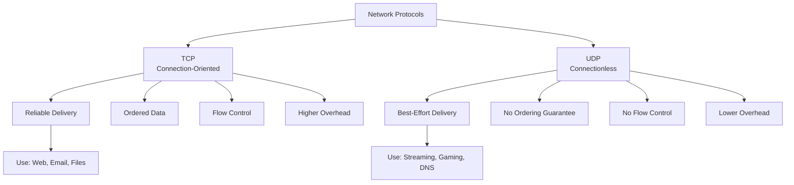
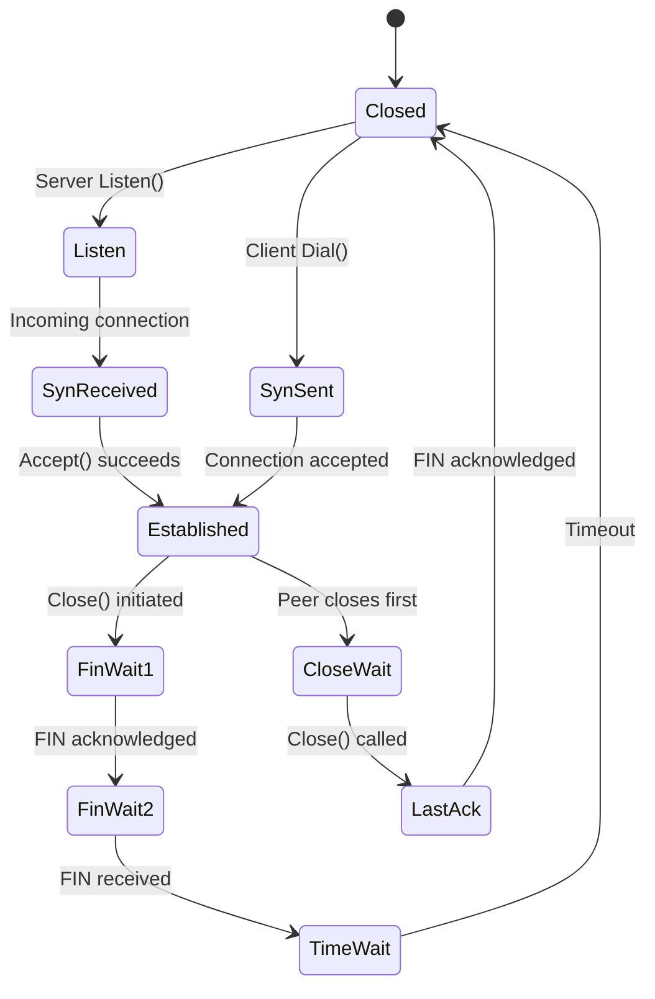
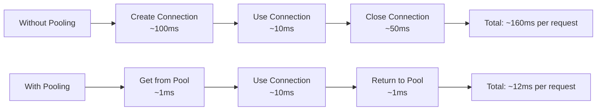
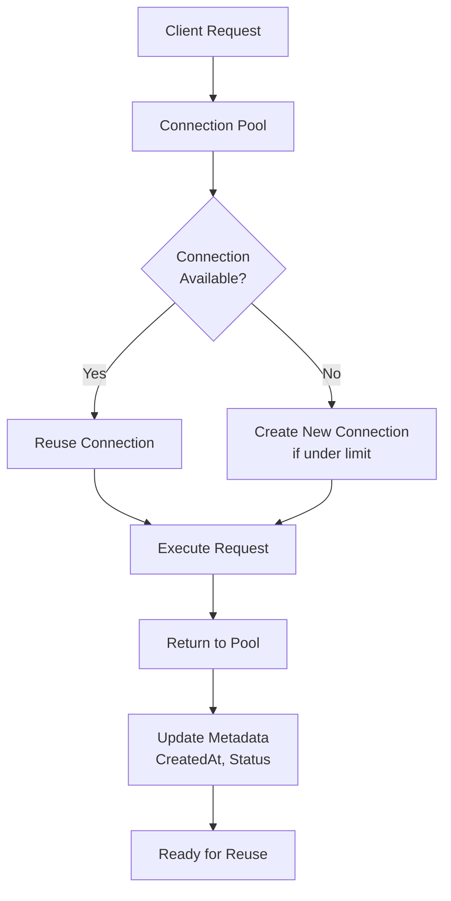
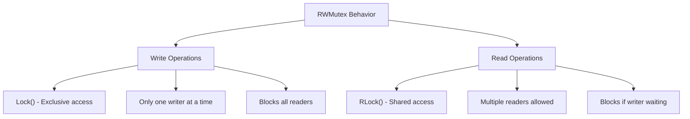
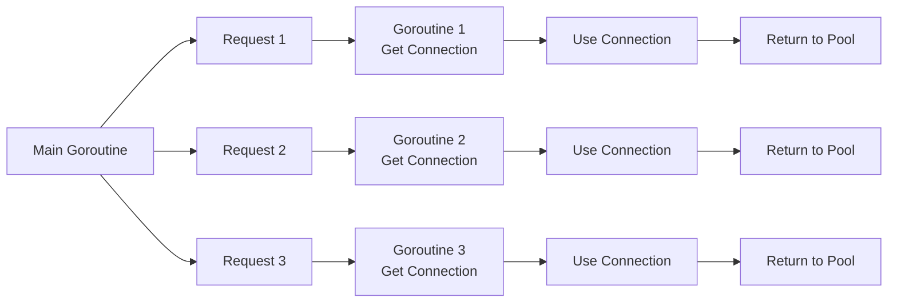

# Day 22: Networking Fundamentals

## Learning Objectives

- Understand TCP and UDP protocols and their trade-offs
- Implement network clients and servers using Go's `net` package
- Design and implement connection pooling for efficient resource management
- Handle timeouts, errors, and graceful connection closure
- Apply thread-safe patterns with mutexes for concurrent access
- Manage goroutines for handling multiple concurrent connections

---

## Introduction to Network Communication

Network communication in Go is built on the `net` package, which provides a unified interface for working with different transport protocols. This day covers two fundamental approaches: **direct protocol communication** (TCP/UDP) and **connection pooling** (managing reusable connections efficiently).

Understanding both is essential: TCP/UDP knowledge helps you understand the underlying mechanics, while connection pooling teaches you how to build scalable, resource-efficient applications.

---

## TCP and UDP Fundamentals

Go's `net` package abstracts away low-level socket details while still providing fine-grained control when needed.

### Protocol Comparison



**TCP (Transmission Control Protocol)**:
- **Connection-oriented**: Establishes a connection before data transfer via a three-way handshake
- **Reliable**: Guarantees all data arrives in order and without loss through acknowledgments and retransmission
- **Ordered**: Data is delivered in the exact sequence it was sent
- **Flow control**: Prevents overwhelming the receiver
- **Higher latency**: Due to handshake and acknowledgment overhead
- **Use cases**: Web services (HTTP), email (SMTP), file transfers (FTP), databases

**UDP (User Datagram Protocol)**:
- **Connectionless**: Sends data without establishing a connection first
- **Unreliable**: No guarantee of delivery—packets may be lost
- **Unordered**: Packets may arrive out of order
- **No flow control**: Sender can overwhelm receiver
- **Lower latency**: Minimal overhead, suitable for real-time applications
- **Use cases**: Video/audio streaming, online gaming, DNS queries, IoT sensors

### TCP Connection Lifecycle



### TCP Connection Basics

See `main.go` for a complete example of connection pooling that manages TCP connections. The basic TCP pattern involves:

1. **Server side**: Create a listener with `net.Listen("tcp", ":port")`, then accept connections in a loop
2. **Client side**: Connect with `net.Dial("tcp", "host:port")`
3. **Communication**: Use `Read()` and `Write()` methods on the connection
4. **Cleanup**: Always defer `Close()` to release resources

For detailed code examples, refer to the `ConnectionPool` struct in `main.go` (lines 16-20), which demonstrates how to manage multiple TCP connections.

### UDP Communication

UDP is simpler but requires different handling:

1. **Server side**: Create a listener with `net.ListenUDP("udp", &addr)`
2. **Client side**: Connect with `net.DialUDP("udp", nil, &serverAddr)`
3. **Communication**: Use `ReadFromUDP()` and `WriteToUDP()` to handle sender information
4. **No connection state**: Each packet is independent

UDP is useful when you need low latency and can tolerate occasional packet loss. However, the code examples in this day focus on TCP and connection pooling, which are more commonly used in production systems.

---

## Connection Pooling: Managing Network Resources Efficiently

Connection pooling is a critical pattern for building scalable network applications. Instead of creating a new connection for each request, pooling maintains a set of reusable connections, reducing overhead and improving performance.

### Why Connection Pooling Matters



**Benefits of connection pooling**:
- **Reduced latency**: Reusing connections eliminates handshake overhead
- **Lower resource usage**: Fewer simultaneous connections to maintain
- **Better throughput**: Handle more requests with fewer resources
- **Graceful degradation**: Control maximum connections to prevent resource exhaustion

### Connection Pool Architecture



### The ConnectionPool Implementation

The `ConnectionPool` struct (see `main.go` lines 16-20) demonstrates a thread-safe pool with these key components:

- **`connections` map**: Stores active connections indexed by ID
- **`mu sync.RWMutex`**: Protects concurrent access to the pool
- **`nextID` counter**: Generates unique connection identifiers

The pool provides these operations:

1. **`CreateConnection(address string)`** (lines 27-42): Creates a new connection and assigns it a unique ID
2. **`GetConnection(id int)`** (lines 55-60): Retrieves a connection without modifying state (uses read lock)
3. **`CloseConnection(id int)`** (lines 44-53): Marks a connection as inactive
4. **`ListConnections()`** (lines 62-71): Returns all connections (snapshot)
5. **`ActiveConnections()`** (lines 73-84): Counts currently active connections

### Thread Safety with RWMutex

The pool uses `sync.RWMutex` instead of a regular `Mutex` for performance:



**Why RWMutex for pools**:
- **Read-heavy workload**: `GetConnection()` is called frequently without modification
- **Exclusive writes**: `CreateConnection()` and `CloseConnection()` need exclusive access
- **Performance**: Multiple goroutines can read simultaneously, improving throughput

See the implementation in `main.go`:
- Lines 55-60: `GetConnection()` uses `RLock()` for concurrent reads
- Lines 27-42: `CreateConnection()` uses `Lock()` for exclusive write access

### Handling Concurrent Connections



The pool is designed to be used safely from multiple goroutines:
- Each goroutine can call `GetConnection()` concurrently
- The `RWMutex` ensures no data races
- Connections are never modified after creation (only marked inactive)

---

## Connection Lifecycle and State Management

### Connection States

A connection in the pool has two states:

1. **Active (`Connected: true`)**: Available for use or currently in use
2. **Inactive (`Connected: false`)**: Closed and no longer usable

See `main.go` lines 9-14 for the `Connection` struct, which tracks:
- **`ID`**: Unique identifier assigned by the pool
- **`Address`**: The remote address (e.g., "localhost:8080")
- **`Connected`**: Boolean flag indicating if the connection is active
- **`CreatedAt`**: Timestamp for monitoring connection age and uptime

### Monitoring Connection Health

The pool provides methods to monitor its state:

- **`ActiveConnections()`** (lines 73-84): Returns count of active connections
- **`ListConnections()`** (lines 62-71): Returns all connections for inspection
- **`GetConnection(id int)`** (lines 55-60): Retrieves metadata about a specific connection

Example from `main.go` (lines 107-112): Calculate uptime using `time.Since(conn.CreatedAt)` to monitor how long a connection has been active.

---

## Best Practices for Network Programming

### 1. Always Close Connections

Use `defer` to ensure cleanup:
```go
conn := pool.GetConnection(id)
if conn != nil {
    defer pool.CloseConnection(id)
    // Use connection
}
```

### 2. Handle Errors Gracefully

Network operations can fail. Always check errors:
- Connection refused (server down)
- Timeout (network latency)
- I/O errors (connection dropped)

See `main.go` lines 44-53 for error handling in `CloseConnection()`.

### 3. Use Timeouts

Prevent goroutines from hanging indefinitely:
```go
conn.SetReadDeadline(time.Now().Add(5 * time.Second))
conn.SetWriteDeadline(time.Now().Add(5 * time.Second))
```

### 4. Limit Pool Size

Prevent resource exhaustion by capping the maximum number of connections. This prevents one client from consuming all available resources.

### 5. Monitor Connection Age

Long-lived connections may become stale. Periodically close and recreate old connections to refresh the pool.

### 6. Implement Keepalives

For long-lived connections, send periodic keepalive messages to detect broken connections early:
```go
conn.SetKeepAlive(true)
conn.SetKeepAlivePeriod(30 * time.Second)
```

---

## Exercise Implementation Guide

The exercises in `exercise.go` ask you to implement functions that interact with the pool:

1. **`ExerciseCreateConnection(address string)`**: Wrapper around `pool.CreateConnection()`
2. **`ExerciseCloseConnection(id int)`**: Wrapper around `pool.CloseConnection()`
3. **`ExerciseGetConnectionAddress(id int)`**: Extract the address from a connection
4. **`ExerciseCountActiveConnections()`**: Wrapper around `pool.ActiveConnections()`
5. **`ExerciseConnectionExists(id int)`**: Check if a connection exists in the pool
6. **`ExerciseIsConnectionActive(id int)`**: Check if a specific connection is active

These exercises reinforce understanding of the pool's API and thread-safe access patterns.

---

## Key Takeaways

1. **TCP for reliability** - Use when data integrity and ordering matter
2. **UDP for speed** - Use when latency is critical and some loss is acceptable
3. **Connection pooling reduces overhead** - Reusing connections is far more efficient than creating new ones
4. **Thread safety is essential** - Use `RWMutex` to protect shared connection state
5. **RWMutex over Mutex** - When reads vastly outnumber writes, `RWMutex` provides better performance
6. **Goroutines enable concurrency** - Multiple goroutines can safely access the pool simultaneously
7. **Always defer cleanup** - Use `defer` to guarantee connection closure even if errors occur
8. **Monitor connection state** - Track active connections and connection age for operational visibility
9. **Timeouts prevent hangs** - Set read/write deadlines to avoid indefinite blocking
10. **Graceful degradation** - Limit pool size to prevent resource exhaustion

---

## Further Reading

- [net Package Documentation](https://pkg.go.dev/net)
- [sync.RWMutex Documentation](https://pkg.go.dev/sync#RWMutex)
- [TCP/IP Networking in Go](https://golang.org/doc/effective_go#concurrency)
- [Connection Pooling Patterns](https://en.wikipedia.org/wiki/Connection_pool)
