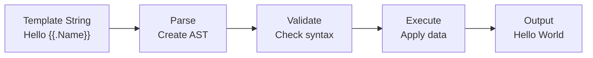
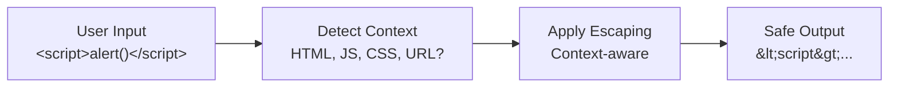
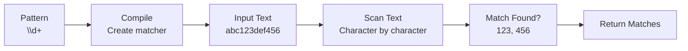
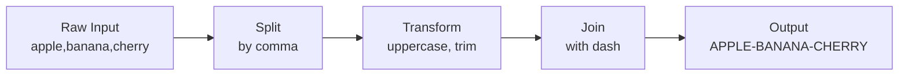
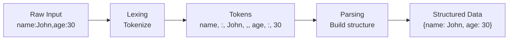

# Day 23: Parsing and Text Processing

## Learning Objectives

- Work with `text/template` for template generation and understand template execution flow
- Use `html/template` for safe HTML generation with automatic context-aware escaping
- Implement `regexp` package for pattern matching, extraction, and replacement
- Parse structured text data and understand parsing fundamentals
- Implement lexing and basic parsing techniques
- Handle text encoding and transformations using the `strings` package
- Apply best practices for performance, security, and error handling

---

## Introduction: Why Text Processing Matters

Text processing is fundamental to many real-world applications: parsing configuration files, generating reports, validating user input, transforming data formats, and building command-line tools. Go provides powerful, efficient packages for these tasks. This day covers three main approaches:

1. **Templates** - Generate text/HTML from structured data
2. **Regular Expressions** - Find, match, and extract patterns
3. **String Manipulation** - Transform and parse text

Understanding when and how to use each tool is critical for writing efficient, secure Go code.

---

## Part 1: Text Templates

### What are Templates?

Templates are a way to generate text output from structured data. Instead of concatenating strings, you define a template with placeholders, then execute it with your data. This separates the output format from the logic that produces the data.

**Key Benefits**:
- Separates presentation from logic
- Reusable across multiple data sets
- Easier to maintain and modify output format
- Supports complex transformations and conditionals

### Template Execution Flow



### Basic Text Templates

The `text/template` package provides general-purpose template generation. It parses a template string and executes it with your data.

**Core Concepts**:
- **Actions**: `{{...}}` delimit template actions
- **Dot (.)**: Represents the current data context
- **Fields**: Access struct fields or map keys with `.FieldName`
- **Pipelines**: Chain operations with `|` (e.g., `{{.Name | strings.ToUpper}}`)

See `main.go` lines 9-12 for the `matchPattern` function demonstrating basic pattern matching, and lines 39-42 for a practical example of finding numbers in text.

**Common Template Actions**:
- `{{.Field}}` - Output a field value
- `{{if .Condition}}...{{end}}` - Conditional output
- `{{range .Items}}...{{end}}` - Loop over collections
- `{{with .Value}}...{{end}}` - Set context to a value

### HTML Templates: Safe Output Generation

The `html/template` package is a variant of `text/template` that automatically escapes output to prevent injection attacks. This is critical when generating HTML from untrusted data.

### HTML Auto-Escaping Flow



**Why HTML Templates Matter**:
- Prevents XSS (Cross-Site Scripting) attacks
- Automatically escapes based on context (HTML, JavaScript, CSS, URL)
- No manual escaping needed
- Safe by default

**Key Differences from text/template**:
- Automatically escapes HTML special characters
- Prevents injection of script tags and event handlers
- Context-aware escaping (different rules for HTML, attributes, JavaScript, URLs)

### Template Best Practices

**Pattern 1: Cache Compiled Templates**
Templates should be compiled once and reused. Compiling is expensive; execution is cheap.

**Pattern 2: Use Named Templates**
For complex output, break templates into smaller, reusable pieces using named templates.

**Pattern 3: Validate Data Before Execution**
Check that required fields exist and have valid types before executing templates.

### Common Template Mistakes

**Mistake 1: Nil Pointer Dereference**
If a field is nil, accessing it with `{{.Field.SubField}}` panics. Use `{{if .Field}}{{.Field.SubField}}{{end}}` to check first.

**Mistake 2: Forgetting HTML Escaping**
Using `text/template` for HTML output leaves you vulnerable to injection attacks. Always use `html/template` for HTML.

**Mistake 3: Recompiling Templates in Loops**
Compiling a template in a loop is inefficient. Parse once, execute many times.

---

## Part 2: Regular Expressions

### What are Regular Expressions?

Regular expressions (regex) are patterns that describe sets of strings. They're powerful for finding, matching, and extracting text that follows a pattern. Go's `regexp` package uses RE2 syntax, which is safe and efficient.

**When to Use Regex**:
- Validate format (email, phone, date)
- Extract data from text (numbers, words, dates)
- Find and replace patterns
- Split text by complex delimiters

**When NOT to Use Regex**:
- Parsing structured formats (use dedicated parsers)
- Matching nested structures (regex can't handle nesting)
- Simple string operations (use `strings` package)

### Common Regex Patterns

| Pattern | Matches | Example |
|---------|---------|---------|
| `\d` | Any digit | `\d+` matches "123" |
| `\w` | Word character (letter, digit, underscore) | `\w+` matches "hello_123" |
| `\s` | Whitespace (space, tab, newline) | `\s+` matches multiple spaces |
| `.` | Any character (except newline) | `a.c` matches "abc", "adc" |
| `^` | Start of string | `^hello` matches "hello world" |
| `$` | End of string | `world$` matches "hello world" |
| `[abc]` | Any of a, b, or c | `[aeiou]` matches any vowel |
| `[^abc]` | Not a, b, or c | `[^0-9]` matches non-digits |
| `a\|b` | a or b | `cat\|dog` matches "cat" or "dog" |
| `a?` | 0 or 1 of a | `colou?r` matches "color" or "colour" |
| `a*` | 0 or more of a | `a*b` matches "b", "ab", "aab" |
| `a+` | 1 or more of a | `a+b` matches "ab", "aab" (not "b") |
| `a{2,4}` | 2 to 4 of a | `a{2,4}` matches "aa", "aaa", "aaaa" |

### Regex Matching Process



### Pattern Matching Operations

The `regexp` package provides several methods for matching:

**FindAllString**: Find all non-overlapping matches. See `main.go` lines 9-12 for implementation and lines 40-42 for usage finding numbers in text.

**FindString**: Find the first match. Returns empty string if no match.

**MatchString**: Check if pattern matches anywhere in text. See `main.go` lines 31-34 for implementation and lines 63-66 for email validation example.

### Pattern Replacement Operations

**ReplaceAllString**: Replace all matches with a replacement string. See `main.go` lines 14-17 for implementation and lines 44-46 for replacing numbers with "X".

**ReplaceAllStringFunc**: Replace matches using a function. Useful for complex replacements based on match content.

### Regex Performance Considerations

**Compile Once, Use Many Times**:
Regex compilation is expensive. In production code, compile patterns once at package initialization:

```go
var emailRegex = regexp.MustCompile(`\w+@\w+\.\w+`)

func validateEmail(email string) bool {
    return emailRegex.MatchString(email)
}
```

**Avoid Catastrophic Backtracking**:
Some patterns can cause exponential time complexity. Avoid nested quantifiers like `(a+)+` or `(a*)*`.

**Use Anchors for Efficiency**:
Anchors (`^` and `$`) help the regex engine skip unnecessary scanning.

### Common Regex Mistakes

**Mistake 1: Forgetting to Escape Special Characters**
Regex special characters (`.`, `*`, `+`, `?`, `[`, `]`, `(`, `)`, `{`, `}`, `^`, `$`, `|`, `\`) have special meaning. Escape them with backslash to match literally: `\.` matches a period.

**Mistake 2: Greedy vs Non-Greedy Matching**
By default, quantifiers are greedy: `a+` matches as many `a`s as possible. Use `a+?` for non-greedy (matches as few as possible).

**Mistake 3: Forgetting Anchors**
Without anchors, `\d+` matches digits anywhere in the string. Use `^\d+$` to match the entire string.

**Mistake 4: Performance Issues with Complex Patterns**
Complex patterns can be slow. Test performance with `go test -bench` and consider simpler alternatives.

---

## Part 3: String Manipulation

### What is the Strings Package?

The `strings` package provides simple, efficient operations for string manipulation. Use it for basic operations; reserve regex for complex patterns.

### Common String Operations

**Split**: Divide a string by a separator. See `main.go` lines 19-21 for implementation and lines 48-51 for splitting CSV data.

**Join**: Combine strings with a separator. See `main.go` lines 23-25 for implementation and lines 53-55 for joining with hyphens.

**TrimSpace**: Remove leading and trailing whitespace. See `main.go` lines 27-29 for implementation and lines 57-60 for trimming padded text.

**Contains**: Check if a substring exists. Useful for simple presence checks without regex overhead.

**Replace**: Replace all occurrences of a substring. Use for simple replacements; use regex for pattern-based replacements.

### String Transformation Pipeline



### When to Use Strings vs Regex

| Task | Tool | Reason |
|------|------|--------|
| Split by fixed delimiter | `strings.Split` | Faster, simpler |
| Find substring | `strings.Contains` | O(n) vs regex overhead |
| Replace fixed string | `strings.ReplaceAll` | Faster, simpler |
| Validate format | `regexp` | Patterns are clearer |
| Extract data | `regexp` | Patterns are necessary |
| Complex transformations | `regexp` | More powerful |

---

## Part 4: Parsing Structured Data

### What is Parsing?

Parsing is the process of converting raw input (text) into structured data that your program can work with. It involves:

1. **Lexing** (Tokenization): Break input into tokens (meaningful units)
2. **Parsing**: Analyze tokens and build a structure (usually a tree)
3. **Validation**: Check that the structure is valid

### Lexing vs Parsing

**Lexing** converts characters into tokens:
- Input: `"123 + 456"`
- Tokens: `[NUMBER(123), PLUS, NUMBER(456)]`

**Parsing** converts tokens into structure:
- Tokens: `[NUMBER(123), PLUS, NUMBER(456)]`
- AST: `BinaryOp(left=123, op=PLUS, right=456)`

### Parsing Pipeline



### Simple Parsing Patterns

**Pattern 1: Line-by-Line Parsing**
Process input line by line, extracting data from each line. Useful for log files, CSV, and line-delimited formats.

**Pattern 2: Delimiter-Based Parsing**
Split by delimiters and process fields. See `main.go` lines 19-21 for splitting by comma (CSV parsing).

**Pattern 3: State Machine Parsing**
Track state as you scan through input. Useful for complex formats with nested structures.

### Parsing Best Practices

**Pattern 1: Validate Input Format**
Check that input matches expected format before parsing. Use regex to validate format first.

**Pattern 2: Handle Edge Cases**
Empty fields, missing delimiters, extra whitespace - test all edge cases.

**Pattern 3: Provide Clear Error Messages**
When parsing fails, report what went wrong and where. Include line numbers and context.

### Common Parsing Mistakes

**Mistake 1: Assuming Well-Formed Input**
Real-world input is messy. Always validate and handle errors gracefully.

**Mistake 2: Not Handling Empty Fields**
When splitting by delimiter, empty fields produce empty strings. Check for them explicitly.

**Mistake 3: Ignoring Whitespace**
Trim whitespace from fields unless it's significant to your format.

---

## Part 5: Exercises

The exercises in `exercise.go` ask you to implement text processing functions:

- **ExerciseMatchPattern** (lines 6-9): Count pattern matches in text
- **ExerciseReplacePattern** (lines 14-17): Replace pattern matches
- **ExerciseSplitText** (lines 22-25): Count parts after splitting
- **ExerciseContainsPattern** (lines 30-33): Check if pattern matches
- **ExerciseExtractNumbers** (lines 38-41): Count numbers in text
- **ExerciseValidateEmail** (lines 46-49): Validate email format

These exercises combine regex, string operations, and pattern matching. See `exercise_test.go` for test cases that define expected behavior.

---

## Best Practices Summary

### Performance
1. **Compile regex once**: Use package-level variables for frequently-used patterns
2. **Cache templates**: Parse templates at startup, execute at runtime
3. **Choose the right tool**: Use `strings` for simple operations, `regexp` for patterns
4. **Benchmark**: Use `go test -bench` to measure performance

### Security
1. **Use html/template for HTML**: Automatic escaping prevents injection attacks
2. **Validate input**: Check format before processing
3. **Escape output**: Never trust user input in templates or regex replacements
4. **Limit regex complexity**: Avoid patterns that could cause catastrophic backtracking

### Maintainability
1. **Name patterns clearly**: Use constants for complex regex patterns
2. **Document patterns**: Explain what each regex matches
3. **Test edge cases**: Empty strings, nil values, special characters
4. **Use helper functions**: Wrap regex operations in functions with clear names

---

## Common Mistakes and Gotchas

**Mistake 1: Regex Injection**
If you build regex patterns from user input, you create a security vulnerability. Always validate and sanitize user input before using it in patterns.

**Mistake 2: Template Injection**
Using `text/template` with untrusted data allows attackers to execute arbitrary code. Always use `html/template` for HTML, and validate data before templating.

**Mistake 3: Infinite Loops in Parsing**
If your parsing logic doesn't advance through the input, you'll loop forever. Always ensure your parser makes progress.

**Mistake 4: Off-by-One Errors in Slicing**
When extracting substrings, remember that Go uses half-open ranges: `s[0:3]` includes indices 0, 1, 2 (not 3).

**Mistake 5: Assuming UTF-8 Encoding**
Go strings are UTF-8 by default, but some operations work on bytes, not runes. Use `[]rune` for character-level operations.

---

## Key Takeaways

1. **Templates** - Use for generating text/HTML from structured data; prefer `html/template` for safety
2. **Regex** - Use for pattern matching, validation, and extraction; compile once, reuse many times
3. **Strings** - Use for simple operations; faster and simpler than regex for basic tasks
4. **Parsing** - Break complex parsing into lexing and parsing phases; validate input
5. **Performance** - Cache compiled templates and regex patterns; choose the right tool for each task
6. **Security** - Use `html/template` for HTML; validate and escape all untrusted input
7. **Error Handling** - Always check for errors from parsing and template execution

---

## Further Reading

- [text/template Documentation](https://pkg.go.dev/text/template) - Complete template syntax and functions
- [html/template Documentation](https://pkg.go.dev/html/template) - HTML-safe templating
- [regexp Documentation](https://pkg.go.dev/regexp) - Regular expression API and syntax
- [strings Documentation](https://pkg.go.dev/strings) - String manipulation functions
- [Go by Example: Text Templates](https://gobyexample.com/text-templates) - Template examples
- [Go by Example: Regular Expressions](https://gobyexample.com/regular-expressions) - Regex examples
- [RE2 Syntax](https://github.com/google/re2/wiki/Syntax) - Go's regex syntax reference
- [Effective Go: Formatting](https://go.dev/doc/effective_go#formatting) - Best practices for text generation
