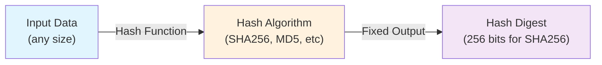
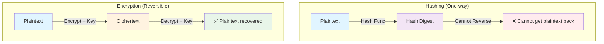
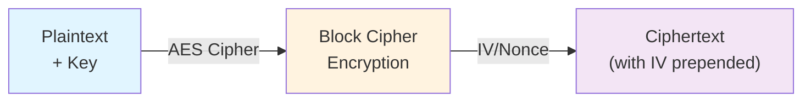
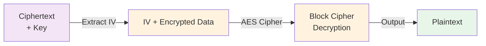
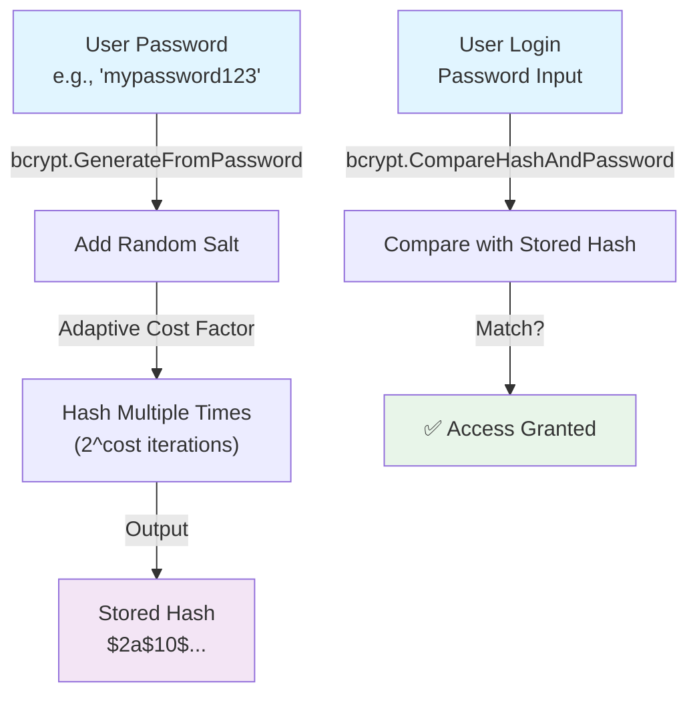
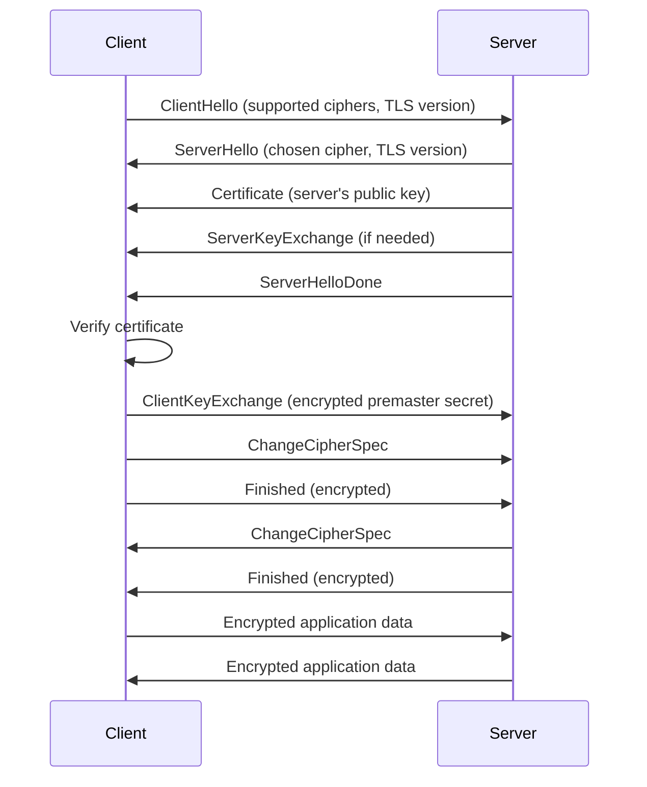
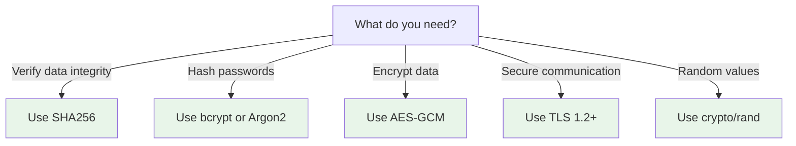

# Day 24: Cryptography and Security

## Learning Objectives

By the end of this day, you will understand:

- **Cryptographic hashing** - One-way functions for data integrity and verification
- **Encryption algorithms** - Symmetric encryption (AES) for confidentiality
- **Secure randomness** - Cryptographically secure random generation
- **TLS/SSL protocols** - Secure communication channels between clients and servers
- **Certificate management** - Authentication and identity verification
- **Password security** - Secure password hashing with bcrypt
- **Cryptographic best practices** - Security guidelines and patterns for production systems

---

## 1. Cryptographic Hashing Fundamentals

### What is Hashing?

Hashing is a **one-way cryptographic function** that transforms input data of any size into a fixed-size output called a hash. Key characteristics:

- **Deterministic**: Same input always produces the same hash
- **One-way**: Cannot reverse a hash to get the original data
- **Avalanche effect**: Tiny input changes produce completely different hashes
- **Fixed output size**: Regardless of input size, output is always the same length
- **Fast to compute**: But not so fast that brute-force attacks are trivial

### Hashing Process Flow



### Common Hash Algorithms

Go's `crypto` package provides several hashing algorithms with different security levels:

| Algorithm | Output Size | Use Case | Security Status |
|-----------|------------|----------|-----------------|
| **MD5** | 128 bits | Legacy systems only | ⚠️ Deprecated |
| **SHA1** | 160 bits | Legacy systems only | ⚠️ Deprecated |
| **SHA256** | 256 bits | Data integrity, checksums | ✅ Recommended |
| **SHA512** | 512 bits | High-security applications | ✅ Recommended |

### SHA256 Hashing

SHA256 (Secure Hash Algorithm 256-bit) is the industry standard for cryptographic hashing. See `main.go` lines 9-12 for a working example of SHA256 hashing.

**Key concepts:**
- `sha256.Sum256()` - Quick method for small data
- `sha256.New()` - Streaming method for large files (see book/day24.md for file hashing examples)
- Output is always 32 bytes (256 bits), displayed as 64 hexadecimal characters

### MD5 Hashing

MD5 produces a 128-bit hash and is faster than SHA256, but is cryptographically broken. See `main.go` lines 14-17 for MD5 implementation. **Use MD5 only for non-security purposes** like checksums for data transmission.

### Hash Verification

Hash verification confirms that data hasn't been tampered with. See `main.go` lines 27-29 for verification logic:

1. Compute hash of original data
2. Compare with stored hash using constant-time comparison
3. If hashes match, data is authentic

**Important**: Always use `crypto/subtle.ConstantTimeCompare()` for sensitive comparisons to prevent timing attacks.

### Use Cases for Hashing

- **Data integrity**: Verify files haven't been corrupted
- **Checksums**: Detect accidental data corruption
- **Commit hashes**: Git uses SHA1 (being migrated to SHA256)
- **Content addressing**: IPFS uses SHA256 for content-based addressing
- **Digital signatures**: Sign data with private key, verify with public key

---

## 2. Encryption Fundamentals

### What is Encryption?

Encryption is a **reversible transformation** that converts plaintext (readable data) into ciphertext (unreadable data) using a cryptographic key. Unlike hashing, encryption can be decrypted back to the original data if you have the key.

### Encryption vs Hashing



### Symmetric Encryption (AES)

AES (Advanced Encryption Standard) is the industry standard for symmetric encryption. Both parties use the **same secret key** to encrypt and decrypt.

#### Encryption Process



#### Decryption Process



### Block Cipher Modes

AES operates on fixed-size blocks (128 bits). For data larger than one block, we need a **mode of operation**:

- **ECB (Electronic Codebook)**: ❌ Insecure - identical plaintext blocks produce identical ciphertext blocks
- **CBC (Cipher Block Chaining)**: ✅ Secure - each block depends on previous block
- **CFB (Cipher Feedback)**: ✅ Secure - streaming mode, see book/day24.md for examples
- **CTR (Counter)**: ✅ Secure - parallelizable streaming mode
- **GCM (Galois/Counter Mode)**: ✅ **Recommended** - provides both encryption and authentication

### GCM Mode (Authenticated Encryption)

GCM mode is the **recommended approach** for modern applications because it provides:

1. **Confidentiality** - Data is encrypted
2. **Authenticity** - Detects tampering or corruption
3. **Integrity** - Ensures data hasn't been modified

See book/day24.md lines 150-184 for complete GCM encryption/decryption examples.

### Key and IV Management

- **Key**: Secret value shared between parties (32 bytes for AES-256)
- **IV (Initialization Vector)**: Random value used to ensure same plaintext produces different ciphertext each time
- **Nonce**: Number used once, similar to IV but with stricter uniqueness requirements (used in GCM)

**Critical**: Always generate a new random IV/nonce for each encryption operation.

### Secure Random Generation for Keys

See `main.go` lines 19-25 for key generation. **Important**: Use `crypto/rand` (cryptographically secure) not `math/rand` (pseudo-random).

---

## 3. Secure Random Number Generation

### Why Cryptographic Randomness Matters

`math/rand` is a pseudo-random number generator suitable for simulations and games, but **not for security**. Cryptographic operations require true randomness from `crypto/rand`.

### crypto/rand Package

The `crypto/rand` package provides cryptographically secure random numbers by reading from the operating system's entropy source:

- **Linux/Unix**: `/dev/urandom`
- **Windows**: CryptoAPI
- **macOS**: `/dev/urandom`

### Generating Random Bytes

See `main.go` lines 19-25 for secure key generation using `crypto/rand.Read()`.

**Use cases:**
- Encryption keys (32 bytes for AES-256)
- IVs and nonces for encryption
- Session tokens
- CSRF tokens
- Salt for password hashing

### Generating Random Integers

For random integers in a range, use `crypto/rand` with `math/big`:

```go
import (
    "crypto/rand"
    "math/big"
)

func randomInt(max int64) (int64, error) {
    n, err := rand.Int(rand.Reader, big.NewInt(max))
    if err != nil {
        return 0, err
    }
    return n.Int64(), nil
}
```

See book/day24.md lines 220-229 for complete example.

---

## 4. Password Security

### Why Hash Passwords?

Never store plaintext passwords. If a database is compromised, attackers gain access to all user accounts. Instead, store password hashes.

### SHA256 is NOT Enough for Passwords

While SHA256 is excellent for data integrity, it's **too fast** for password hashing. An attacker can try billions of guesses per second:

- SHA256: ~1 billion hashes/second
- bcrypt: ~10 hashes/second (with cost factor 10)

### bcrypt: Purpose-Built Password Hashing

bcrypt is specifically designed for password hashing with built-in protections:

1. **Adaptive cost factor**: Increases computation time as hardware improves
2. **Automatic salt**: Each password gets a unique salt
3. **Slow by design**: Intentionally slow to resist brute-force attacks

### Password Hashing Workflow



### Using bcrypt in Your Code

The exercise functions `ExerciseHashPassword()` and `ExerciseVerifyPassword()` in `exercise.go` lines 30-41 require bcrypt implementation.

**Key points:**
- `bcrypt.GenerateFromPassword()` - Hash a password with automatic salt
- `bcrypt.CompareHashAndPassword()` - Verify password against stored hash
- `bcrypt.DefaultCost` - Recommended cost factor (currently 10)

See book/day24.md lines 324-336 for complete bcrypt examples.

---

## 5. TLS and Secure Communication

### What is TLS?

TLS (Transport Layer Security) is the protocol that secures HTTPS connections. It provides:

1. **Encryption** - Data in transit is encrypted
2. **Authentication** - Server identity is verified
3. **Integrity** - Data cannot be tampered with in transit

### TLS Handshake

When a client connects to a TLS server, they perform a handshake to establish a secure connection:



### Creating a TLS Server

See book/day24.md lines 245-275 for complete TLS server implementation.

**Key configuration:**
- `MinVersion: tls.VersionTLS12` - Disable older, insecure TLS versions
- Certificate and key files for server authentication
- `ListenAndServeTLS()` - Start HTTPS server

### Creating a TLS Client

See book/day24.md lines 279-302 for TLS client implementation.

**Key configuration:**
- `InsecureSkipVerify: false` - Always verify server certificates in production
- Custom CA certificates if needed
- Proper error handling for certificate validation failures

### Certificate Generation

For testing, generate self-signed certificates:

```bash
openssl req -x509 -newkey rsa:4096 -keyout server.key -out server.crt -days 365 -nodes
```

For production, use certificates from trusted Certificate Authorities (Let's Encrypt, DigiCert, etc.).

---

## 6. Cryptographic Best Practices

### Key Management

**Never hardcode secrets** in your source code. Instead:

1. Store keys in environment variables
2. Use a secrets management system (HashiCorp Vault, AWS Secrets Manager)
3. Restrict file permissions: `chmod 600 server.key`
4. Rotate keys regularly

See book/day24.md lines 314-322 for key loading/saving patterns.

### Constant-Time Comparison

When comparing sensitive values (hashes, tokens), use `crypto/subtle.ConstantTimeCompare()` to prevent timing attacks:

```go
import "crypto/subtle"

if subtle.ConstantTimeCompare(hash1, hash2) == 1 {
    // Hashes match
}
```

See book/day24.md lines 338-349 for complete example.

### Algorithm Selection Guide



### Security Checklist

- ✅ Use SHA256 or stronger for hashing (not MD5 or SHA1)
- ✅ Use bcrypt or Argon2 for password hashing
- ✅ Use AES-GCM for encryption (provides authentication)
- ✅ Generate keys with `crypto/rand`
- ✅ Use TLS 1.2 or higher
- ✅ Verify server certificates in TLS clients
- ✅ Use constant-time comparison for sensitive values
- ✅ Never hardcode secrets
- ✅ Implement key rotation
- ✅ Keep dependencies updated for security patches

---

## 7. Exercise Implementation Guide

### ExerciseHashData (exercise.go line 6)

Implement SHA256 hashing. See `main.go` lines 9-12 for reference.

**Test expectations** (exercise_test.go lines 7-22):
- Returns non-empty hash
- Same input produces same hash
- Different inputs produce different hashes

### ExerciseVerifyHash (exercise.go line 14)

Verify data matches a hash. See `main.go` lines 27-29 for reference.

**Test expectations** (exercise_test.go lines 24-37):
- Returns true when data matches hash
- Returns false when data doesn't match

### ExerciseGenerateSecureKey (exercise.go line 22)

Generate cryptographically secure random bytes. See `main.go` lines 19-25 for reference.

**Test expectations** (exercise_test.go lines 39-49):
- Returns non-empty key
- Different calls generate different keys (randomness)

### ExerciseHashPassword (exercise.go line 30)

Hash a password using bcrypt. See book/day24.md lines 324-336 for bcrypt examples.

**Test expectations** (exercise_test.go lines 51-60):
- Returns non-empty hash
- Hash is different from plaintext password

### ExerciseVerifyPassword (exercise.go line 38)

Verify password against bcrypt hash. See book/day24.md lines 324-336 for reference.

**Test expectations** (exercise_test.go lines 62-75):
- Returns true when password matches hash
- Returns false when password doesn't match

### ExerciseComputeChecksum (exercise.go line 46)

Compute a checksum for data integrity. You can use SHA256 or MD5 depending on requirements.

**Test expectations** (exercise_test.go lines 77-82):
- Returns non-empty checksum

---

## Key Takeaways

1. **Hashing** - One-way function for data integrity; use SHA256 for security-critical applications
2. **Encryption** - Reversible transformation for confidentiality; use AES-GCM for authenticated encryption
3. **Secure randomness** - Always use `crypto/rand` for cryptographic operations, never `math/rand`
4. **Password security** - Use bcrypt or Argon2; never store plaintext passwords or use fast hashes
5. **TLS/SSL** - Encrypt network communication; verify certificates and use TLS 1.2+
6. **Key management** - Store keys securely outside code; restrict file permissions; rotate regularly
7. **Timing attacks** - Use constant-time comparison for sensitive values
8. **Certificate management** - Use trusted CAs in production; self-signed only for testing
9. **Defense in depth** - Combine multiple security measures for robust protection
10. **Stay updated** - Keep cryptographic libraries updated for security patches

---

## Further Reading

- [crypto Package Documentation](https://pkg.go.dev/crypto) - Cryptographic primitives
- [crypto/aes Package Documentation](https://pkg.go.dev/crypto/aes) - AES encryption
- [crypto/rand Package Documentation](https://pkg.go.dev/crypto/rand) - Secure random generation
- [crypto/tls Package Documentation](https://pkg.go.dev/crypto/tls) - TLS implementation
- [golang.org/x/crypto Package](https://pkg.go.dev/golang.org/x/crypto) - Additional crypto algorithms (bcrypt, scrypt, etc.)
- [OWASP Cryptographic Storage Cheat Sheet](https://cheatsheetseries.owasp.org/cheatsheets/Cryptographic_Storage_Cheat_Sheet.html) - Security best practices
