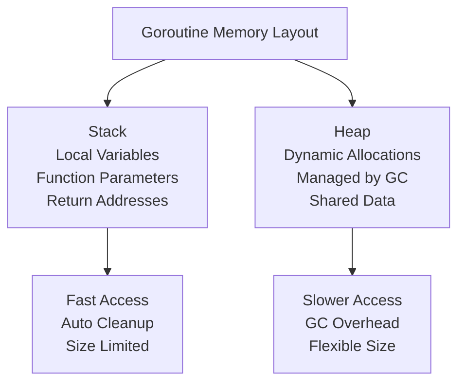
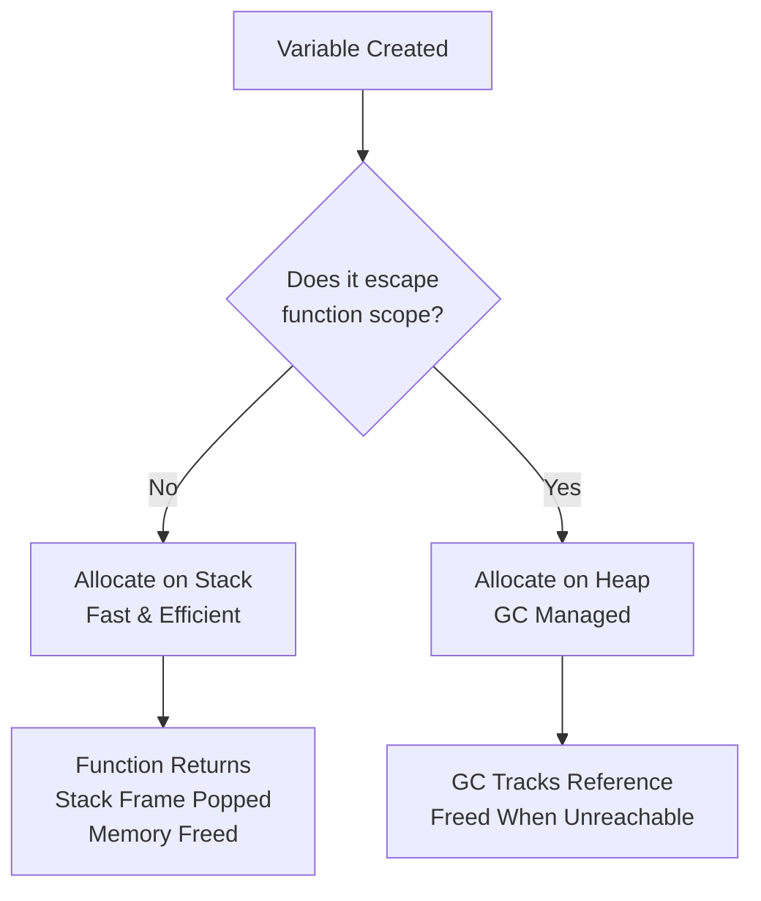
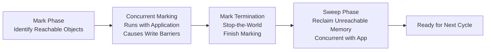
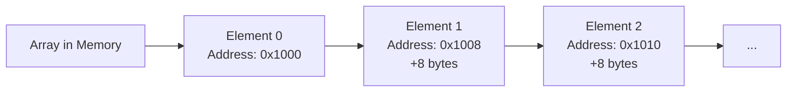
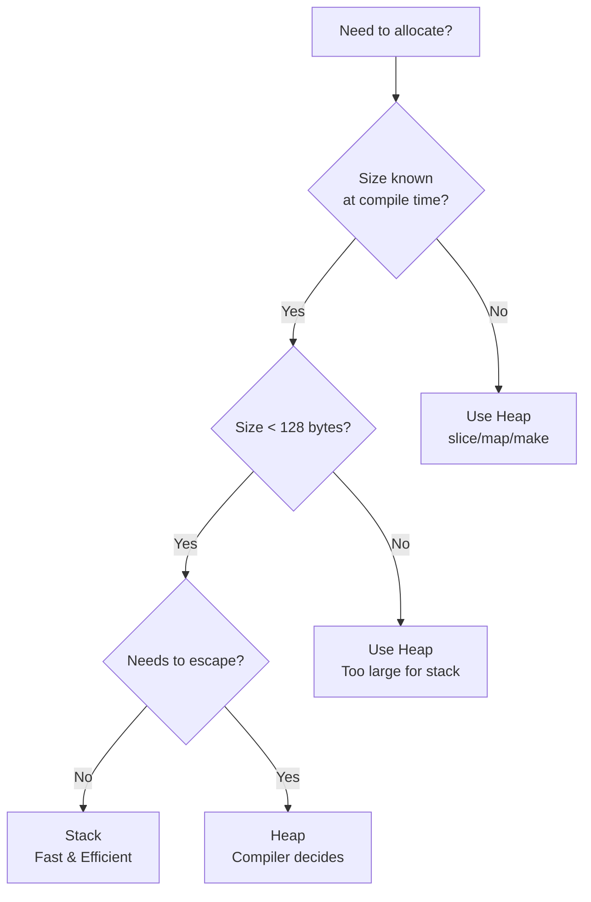

# Day 25: Memory Management and Unsafe

## Learning Objectives

- Understand Go's memory model and garbage collection
- Analyze stack vs heap allocation and their performance implications
- Use escape analysis to optimize memory allocation
- Work with the unsafe package for low-level operations
- Implement memory profiling and optimization techniques
- Understand pointer semantics vs value semantics
- Identify and prevent memory leaks and goroutine leaks

---

## 1. Memory Model: Stack vs Heap

### Understanding Memory Allocation

Go manages memory through two primary regions: the **stack** and the **heap**. Each serves different purposes and has distinct performance characteristics.

#### Stack Allocation

The stack is a LIFO (Last-In-First-Out) data structure where local variables and function parameters are stored. Stack allocation is:
- **Extremely fast** - just a pointer increment
- **Automatically freed** - when a function returns, its stack frame is popped
- **Size-limited** - typically a few MB per goroutine
- **Predictable** - no garbage collection overhead

Variables allocated on the stack include:
- Primitive types (int, float64, bool, etc.)
- Fixed-size arrays (`[5]int`)
- Structs containing only stack-allocated fields

See main.go lines 16-24 for memory allocation tracking examples.

#### Heap Allocation

The heap is a large, unstructured region of memory managed by Go's garbage collector. Heap allocation is:
- **Slower** - requires memory allocator coordination
- **Flexible** - can grow dynamically
- **Garbage collected** - automatic cleanup, but with GC pauses
- **Shared** - accessible across function boundaries

Variables allocated on the heap include:
- Pointers to stack variables that escape (see Escape Analysis below)
- Slices, maps, and channels
- Interface values
- Structs created with `new()` or `make()`

### Memory Layout Visualization



---

## 2. Escape Analysis

### What is Escape Analysis?

Escape analysis is a compiler optimization that determines whether a variable can be safely allocated on the stack or must be promoted to the heap. When a variable "escapes" the scope of its function, it must be allocated on the heap because it outlives the function's stack frame.

### When Variables Escape

A variable escapes to the heap when:
1. **Returning a pointer** - A pointer to a local variable is returned from the function
2. **Storing in heap-allocated structures** - A pointer is stored in a slice, map, or struct that outlives the function
3. **Passing to goroutines** - A variable is captured by a goroutine that may outlive the function
4. **Interface values** - A variable is assigned to an interface{} and the concrete type is not known at compile time

### Escape Analysis Flow



### Examples

**No Escape** - Variable stays on stack:
```
func noEscape() int {
    x := 10
    return x   // Value returned, not pointer
}
```
See main.go lines 68-71 for pointer operations that demonstrate escape behavior.

**Escapes** - Variable moves to heap:
```
func escapes() *int {
    x := 10
    return &x  // Pointer returned, x must be on heap
}
```

**Escapes via Slice** - Variable moves to heap:
```
func escapesViaSlice() []int {
    x := 10
    s := []int{x}
    return s   // Slice outlives function, x escapes
}
```

### Checking Escape Analysis

You can see what the compiler decides using the `-m` flag:
```bash
go build -gcflags="-m" ./...
```

This will print escape analysis decisions for your code.

---

## 3. Garbage Collection

### How Go's Garbage Collector Works

Go uses a **concurrent, tri-color mark-and-sweep garbage collector**. Understanding how it works helps you write more efficient code.

#### The GC Cycle



#### GC Phases Explained

1. **Mark Phase** - The GC walks the object graph starting from root references (globals, stack, registers) and marks all reachable objects. This runs concurrently with your application.

2. **Write Barrier** - During concurrent marking, if your code modifies a pointer, the write barrier ensures the GC sees the change. This has a small performance cost.

3. **Mark Termination** - A brief stop-the-world pause where the GC finishes marking any objects created during concurrent marking.

4. **Sweep Phase** - The GC reclaims memory from unmarked objects. This also runs concurrently with your application.

### GC Tuning

The `GOGC` environment variable controls GC frequency:
```bash
GOGC=100  # Default: GC when heap doubles (100% growth)
GOGC=50   # More frequent GC: when heap grows 50%
GOGC=200  # Less frequent GC: when heap doubles twice
```

Lower `GOGC` values reduce pause times but increase CPU overhead. Higher values reduce CPU overhead but increase pause times.

### Reducing GC Pressure

To minimize garbage collection overhead:
1. **Reuse allocations** - Use object pools or sync.Pool for frequently allocated objects
2. **Prefer stack allocation** - Write code that keeps variables on the stack
3. **Avoid unnecessary pointers** - Use value receivers and value semantics when possible
4. **Batch operations** - Allocate memory in larger chunks rather than many small allocations

---

## 4. Unsafe Package

### Why Unsafe Exists

The `unsafe` package provides low-level memory operations that bypass Go's type safety. It's called "unsafe" because:
- **No type checking** - You can reinterpret memory as different types
- **No bounds checking** - Pointer arithmetic can access invalid memory
- **No GC tracking** - The GC doesn't track unsafe pointers

Use `unsafe` only when absolutely necessary, and document why.

### Pointer Arithmetic

Pointer arithmetic allows you to navigate memory manually. See main.go lines 73-77 for array memory examples.



**Important**: Pointer arithmetic is platform-dependent. An `int` is 8 bytes on 64-bit systems but 4 bytes on 32-bit systems. Always use `unsafe.Sizeof()` to get the correct offset.

### Type Casting (Type Punning)

Type casting with `unsafe.Pointer` allows reinterpreting memory:

```go
var x int32 = 100
ptr := unsafe.Pointer(&x)
y := (*int64)(ptr)  // Dangerous: reading 8 bytes from 4-byte int
```

This is **extremely dangerous** because:
- You may read uninitialized memory
- Alignment requirements may be violated
- The behavior is undefined on different architectures

### Safe Unsafe Patterns

The only generally safe use of `unsafe` is:
1. **Getting sizes** - `unsafe.Sizeof()`, `unsafe.Alignof()`, `unsafe.Offsetof()`
2. **Converting between pointer types** - When you know the memory layout
3. **Interfacing with C code** - Via cgo

See main.go lines 30-45 for `unsafe.Sizeof()` examples used safely.

---

## 5. Memory Profiling and Optimization

### CPU Profiling

CPU profiling measures where your program spends time. It helps identify hot spots that consume CPU cycles.

```bash
go test -cpuprofile=cpu.prof ./...
go tool pprof cpu.prof
```

In pprof, use commands like:
- `top` - Show functions using most CPU
- `list <function>` - Show source code with CPU usage
- `web` - Generate a graph visualization

### Memory Profiling

Memory profiling tracks heap allocations. It helps identify:
- Functions allocating excessive memory
- Unnecessary allocations that could use the stack
- Memory leaks

```bash
go test -memprofile=mem.prof ./...
go tool pprof mem.prof
```

### Allocation Profiling

To see which allocations are happening:
```bash
go test -alloc_space -alloc_objects ./...
```

This shows:
- Total bytes allocated (alloc_space)
- Total number of allocations (alloc_objects)

### Optimization Workflow

1. **Measure** - Profile your code to find bottlenecks
2. **Understand** - Determine why allocations are happening
3. **Optimize** - Reduce allocations or move to stack
4. **Verify** - Re-profile to confirm improvement
5. **Repeat** - Focus on the next bottleneck

---

## 6. Pointer Semantics vs Value Semantics

### Value Semantics

With value semantics, you work with copies:
```go
func modify(x int) {
    x = 100  // Modifies local copy, not caller's variable
}
```

**Advantages**:
- Immutability by default
- No aliasing issues
- Easier to reason about
- Can be stack-allocated

**Disadvantages**:
- Copying large structs is expensive
- Changes don't propagate to caller

### Pointer Semantics

With pointer semantics, you work with references:
```go
func modify(x *int) {
    *x = 100  // Modifies caller's variable
}
```

**Advantages**:
- Efficient for large structs
- Changes propagate to caller
- Enables shared mutable state

**Disadvantages**:
- Aliasing complexity
- Requires careful null checking
- May escape to heap

### Choosing Between Them

Use **value semantics** (no pointers) for:
- Small types (int, string, small structs)
- Immutable data
- Function parameters that shouldn't be modified

Use **pointer semantics** for:
- Large structs (>128 bytes)
- Types that need to be modified
- Implementing methods that modify the receiver
- Implementing interfaces that require pointer receivers

---

## 7. Common Pitfalls and How to Avoid Them

### Memory Leaks

**Goroutine Leaks** - Goroutines that never exit:
```go
// BAD: Goroutine never exits
go func() {
    for {
        // Do something
    }
}()

// GOOD: Goroutine exits when context is cancelled
go func(ctx context.Context) {
    for {
        select {
        case <-ctx.Done():
            return
        default:
            // Do something
        }
    }
}(ctx)
```

**Circular References** - Objects referencing each other:
```go
// BAD: A and B reference each other
type A struct {
    b *B
}
type B struct {
    a *A
}

// GOOD: Use weak references or restructure
type A struct {
    // No reference to B
}
type B struct {
    // Reference to A is OK if A doesn't reference B
}
```

### Unintended Escapes

```go
// BAD: Variable escapes due to interface{}
func process(v interface{}) {
    // v is now on heap
}

// GOOD: Use concrete types when possible
func process(v int) {
    // v stays on stack
}
```

### Excessive Allocations

```go
// BAD: Allocates in loop
for i := 0; i < 1000; i++ {
    data := make([]byte, 1024)
    process(data)
}

// GOOD: Reuse buffer
data := make([]byte, 1024)
for i := 0; i < 1000; i++ {
    process(data)
}
```

---

## 8. Practical Memory Management

### Using sync.Pool for Object Reuse

For frequently allocated and deallocated objects:
```go
var bufferPool = sync.Pool{
    New: func() interface{} {
        return new(bytes.Buffer)
    },
}

// Get a buffer
buf := bufferPool.Get().(*bytes.Buffer)
defer bufferPool.Put(buf)
buf.Reset()
// Use buf
```

### Stack vs Heap Decision Tree



### Memory-Efficient Patterns

1. **Pre-allocate slices** - If you know the size:
   ```go
   s := make([]int, 0, 1000)  // Allocate capacity upfront
   ```

2. **Use arrays for small fixed-size data**:
   ```go
   arr := [10]int{}  // Stack allocated
   ```

3. **Avoid unnecessary pointers**:
   ```go
   // BAD
   type Point struct {
       x *int
       y *int
   }
   
   // GOOD
   type Point struct {
       x int
       y int
   }
   ```

---

## Key Takeaways

1. **Stack allocation** - Fast, automatic cleanup, size-limited
2. **Heap allocation** - Flexible, GC overhead, shared across scopes
3. **Escape analysis** - Compiler optimization that determines allocation location
4. **Garbage collection** - Concurrent, tri-color mark-and-sweep with configurable frequency
5. **Unsafe package** - Low-level memory access; use sparingly and document carefully
6. **Pointers** - Reference semantics; use for large structs and mutable state
7. **Values** - Copy semantics; use for small immutable data
8. **Memory leaks** - Prevent goroutine leaks and circular references
9. **Profiling** - Measure before optimizing; use pprof to identify bottlenecks
10. **Optimization** - Balance speed and memory; prefer stack allocation when possible

---

## Exercises

See exercise.go for memory management functions to implement. The exercise tests in exercise_test.go verify your understanding of:
- Tracking memory allocations and deallocations
- Managing memory statistics
- Resetting state for testing

---

## Further Reading

- [Go Memory Model](https://golang.org/ref/mem)
- [unsafe Package Documentation](https://pkg.go.dev/unsafe)
- [Escape Analysis](https://golang.org/doc/effective_go#allocation_new)
- [Go GC Guide](https://tip.golang.org/doc/gc-guide)
- [pprof Documentation](https://github.com/google/pprof/tree/master/doc)
