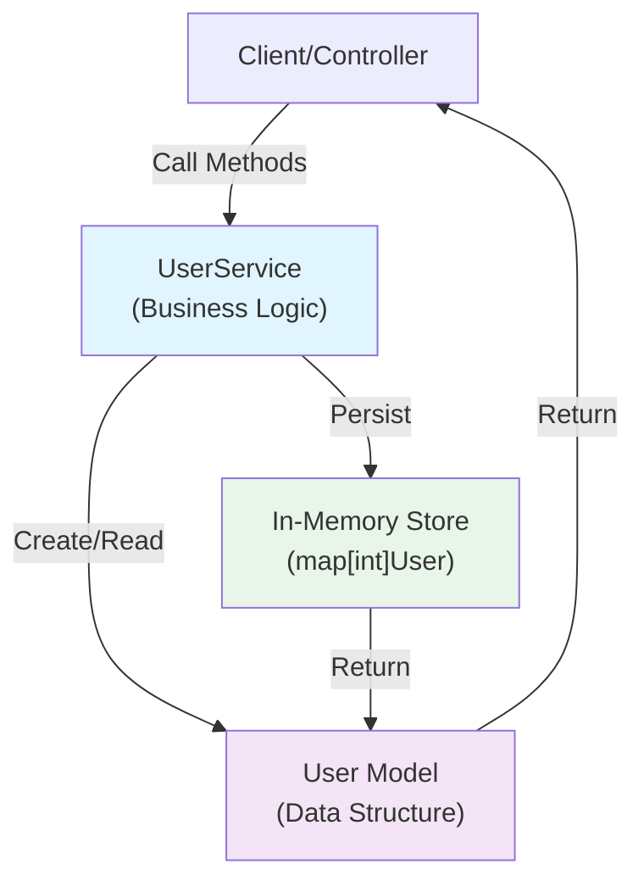
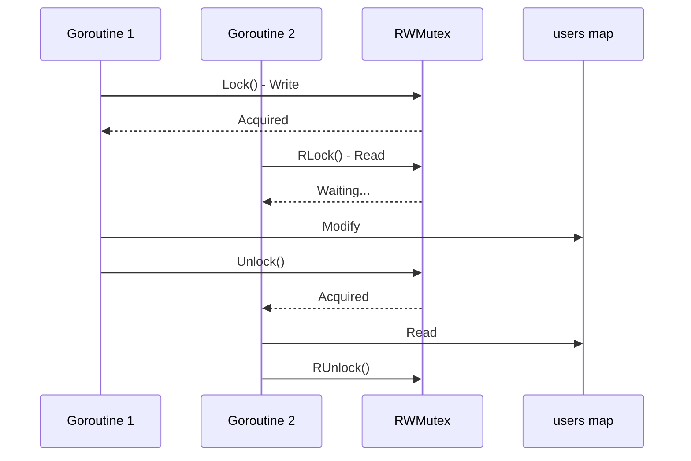
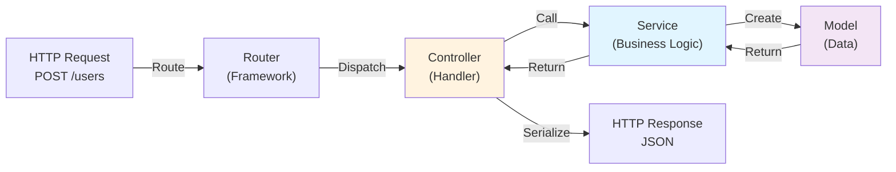

# Day 26: Web Frameworks and MVC Architecture

## Learning Objectives

- Understand and implement MVC architecture to separate concerns in applications
- Build service layers with proper concurrency control and thread safety
- Learn how to structure domain models, business logic, and data access
- Understand popular Go web frameworks (Gin, Echo, Fiber, Chi) and their use cases
- Integrate databases using GORM for data persistence
- Write tests for handlers and service methods
- Apply authentication and error handling in web applications

---

## 1. Introduction to MVC Architecture

MVC (Model-View-Controller) is an architectural pattern that separates an application into three interconnected components:

- **Model**: Represents the data and business logic of your application
- **View**: Presents data to the user (in web apps, typically JSON responses)
- **Controller**: Handles user requests, orchestrates business logic, and returns responses

In Go applications, we often extend this pattern with a **Service Layer** that encapsulates business logic and data access, sitting between the controller and model.

### Why MVC Matters

Separation of concerns makes your code:
- **Testable**: Each layer can be tested independently
- **Maintainable**: Changes to one layer don't cascade through the entire application
- **Scalable**: Easy to add new features without modifying existing code
- **Reusable**: Service logic can be used by multiple controllers (HTTP, gRPC, CLI, etc.)

---

## 2. Understanding the MVC Pattern in main.go

The `main.go` file demonstrates a complete MVC implementation with a service layer. Let's break it down:

### 2.1 The Model Layer

```
User struct (see main.go lines 8-12)
```

The `User` struct represents our domain entity. It contains:
- `ID`: Unique identifier for the user
- `Name`: User's name
- `Email`: User's email address

This is the core data structure that flows through our application. Notice the simple, focused design—each field serves a clear purpose.

### 2.2 The Service Layer

The `UserService` struct (see main.go lines 14-23) acts as the business logic layer:

```
type UserService struct {
    users  map[int]User        // In-memory data store
    mu     sync.RWMutex        // Thread-safe access
    nextID int                 // Auto-increment ID generator
}
```

The service layer is responsible for:
- Managing the data store (in this case, an in-memory map)
- Enforcing business rules
- Handling concurrent access safely
- Providing a clean API for controllers to use

### 2.3 CRUD Operations

The service implements five core operations:

#### Create (lines 25-33)
`CreateUser` adds a new user to the service. It:
1. Acquires a write lock to ensure thread-safe access
2. Generates a unique ID
3. Stores the user in the map
4. Returns the ID to the caller

#### Read (lines 35-43)
`GetUser` retrieves a user by ID. It:
1. Uses a read lock (RLock) for concurrent read access
2. Safely checks if the user exists
3. Returns a pointer to the user or nil

#### Update (lines 45-54)
`UpdateUser` modifies an existing user. It:
1. Acquires a write lock
2. Verifies the user exists
3. Updates the user data
4. Returns success/failure status

#### Delete (lines 56-65)
`DeleteUser` removes a user. It:
1. Acquires a write lock
2. Checks if the user exists
3. Removes the user from the map
4. Returns success/failure status

#### List (lines 67-76)
`ListUsers` returns all users. It:
1. Uses a read lock for safe concurrent access
2. Creates a new slice to avoid exposing internal state
3. Copies all users into the slice
4. Returns the slice

### 2.4 Architecture Diagram



---

## 3. Concurrency and Thread Safety

One of the most important aspects of the `UserService` is how it handles concurrent access. Go's concurrency model makes it easy to write programs that access shared data from multiple goroutines, but this requires careful synchronization.

### 3.1 Understanding sync.RWMutex

The `UserService` uses `sync.RWMutex` (see main.go line 16) to protect the `users` map:

```go
type UserService struct {
    users map[int]User
    mu    sync.RWMutex  // Protects concurrent access
    nextID int
}
```

`RWMutex` (Read-Write Mutex) provides two types of locks:
- **Read Lock (RLock)**: Multiple goroutines can hold read locks simultaneously
- **Write Lock (Lock)**: Only one goroutine can hold a write lock at a time

### 3.2 When to Use Each Lock Type

| Operation | Lock Type | Why |
|-----------|-----------|-----|
| GetUser | RLock | Multiple goroutines can read simultaneously |
| ListUsers | RLock | Multiple goroutines can read simultaneously |
| CreateUser | Lock | Must prevent concurrent writes to nextID and map |
| UpdateUser | Lock | Must prevent concurrent modifications |
| DeleteUser | Lock | Must prevent concurrent modifications |

### 3.3 The Defer Pattern

Every lock acquisition uses `defer` to ensure the lock is released (see main.go lines 26-27):

```go
func (us *UserService) CreateUser(name, email string) int {
    us.mu.Lock()
    defer us.mu.Unlock()
    // ... rest of function
}
```

This pattern guarantees that even if the function panics or returns early, the lock will be released. Without `defer`, a deadlock could occur.

### 3.4 Concurrency Flow Diagram



---

## 4. Exposing the Service via HTTP

While `main.go` demonstrates the service layer in isolation, real web applications expose this service through HTTP endpoints. Here's how the MVC pattern extends to web frameworks:

### 4.1 Controller Layer

A controller would wrap the service and handle HTTP requests:

```go
// Pseudo-code showing how a controller would use the service
func handleCreateUser(w http.ResponseWriter, r *http.Request) {
    var req CreateUserRequest
    json.NewDecoder(r.Body).Decode(&req)
    
    id := userService.CreateUser(req.Name, req.Email)
    
    json.NewEncoder(w).Encode(map[string]int{"id": id})
}
```

The controller:
1. Parses the HTTP request
2. Calls the service method
3. Formats the response
4. Writes it back to the client

### 4.2 View Layer

The view layer defines the response format:

```go
type CreateUserResponse struct {
    ID    int    `json:"id"`
    Name  string `json:"name"`
    Email string `json:"email"`
}
```

JSON tags tell Go how to serialize the struct to JSON.

### 4.3 Complete Request Flow



---

## 5. Web Frameworks Overview

Go has several excellent web frameworks, each with different philosophies:

### 5.1 Gin

**Gin** is a lightweight, high-performance framework focused on speed and simplicity.

**Characteristics:**
- Fast routing with radix tree
- Built-in middleware support
- Automatic JSON validation
- Good for RESTful APIs

**When to use:** Building fast APIs with minimal overhead

**Resources:** [Gin Documentation](https://gin-gonic.com/)

### 5.2 Echo

**Echo** is a flexible, high-performance framework with a comprehensive middleware ecosystem.

**Characteristics:**
- Excellent performance
- Rich middleware ecosystem
- Built-in validation and binding
- Good for both APIs and web applications

**When to use:** Building scalable web applications with complex middleware needs

**Resources:** [Echo Documentation](https://echo.labstack.com/)

### 5.3 Chi

**Chi** is a lightweight, idiomatic router that emphasizes composability.

**Characteristics:**
- Minimal core, maximum composability
- Excellent for middleware chains
- Works well with standard library
- Great for microservices

**When to use:** Building modular applications with custom middleware

**Resources:** [Chi Documentation](https://github.com/go-chi/chi)

### 5.4 Fiber

**Fiber** is inspired by Express.js and focuses on developer experience.

**Characteristics:**
- Familiar API for Node.js developers
- Fast performance
- Rich built-in features
- Good for rapid development

**When to use:** Quick prototyping or teams familiar with Express.js

**Resources:** [Fiber Documentation](https://docs.gofiber.io/)

---

## 6. Database Integration with GORM

The service layer in `main.go` uses an in-memory map for storage. In production, you'd use a database. GORM is Go's most popular ORM.

### 6.1 Replacing the In-Memory Store

Instead of:
```go
users map[int]User
```

You'd use:
```go
db *gorm.DB
```

### 6.2 Service Methods with GORM

The service methods would change minimally:

```go
// Instead of map operations
func (us *UserService) CreateUser(name, email string) int {
    user := User{Name: name, Email: email}
    result := us.db.Create(&user)
    return user.ID
}

func (us *UserService) GetUser(id int) *User {
    var user User
    us.db.First(&user, id)
    return &user
}
```

### 6.3 Benefits of GORM

- **Automatic migrations**: Schema management
- **Query builder**: Type-safe queries
- **Associations**: Handle relationships between models
- **Hooks**: Execute code at specific lifecycle points
- **Multiple database support**: PostgreSQL, MySQL, SQLite, etc.

**Resources:** [GORM Documentation](https://gorm.io/)

---

## 7. Testing the Service Layer

The service layer is designed to be testable. Each method can be tested independently:

```go
func TestCreateUser(t *testing.T) {
    service := &UserService{
        users:  make(map[int]User),
        nextID: 1,
    }
    
    id := service.CreateUser("Alice", "alice@example.com")
    if id != 1 {
        t.Errorf("Expected ID 1, got %d", id)
    }
}
```

Benefits of this approach:
- No HTTP setup required
- Fast test execution
- Easy to mock dependencies
- Clear test intent

See `exercise_test.go` for comprehensive test examples.

---

## 8. Error Handling in Services

The current implementation uses simple return values (bool, nil). In production, you'd use explicit error returns:

```go
func (us *UserService) CreateUser(name, email string) (int, error) {
    if name == "" {
        return 0, fmt.Errorf("name cannot be empty")
    }
    // ... rest of implementation
}
```

This allows:
- Detailed error messages
- Error type checking
- Proper error propagation
- Better debugging

---

## 9. Key Takeaways

1. **MVC separates concerns** - Model, View, Controller each have distinct responsibilities
2. **Service layer encapsulates logic** - Business rules live in one place
3. **Thread safety is critical** - Use RWMutex for concurrent access
4. **Defer ensures cleanup** - Always defer lock releases
5. **Read locks enable concurrency** - Use RLock when multiple goroutines read simultaneously
6. **Controllers bridge HTTP and services** - They translate requests to service calls
7. **Frameworks provide routing** - Gin, Echo, Chi, Fiber each have different strengths
8. **Databases replace in-memory stores** - GORM simplifies database integration
9. **Services are testable** - No HTTP setup needed for unit tests
10. **Error handling improves reliability** - Return explicit errors from service methods

---

## Further Reading

- [Gin Documentation](https://gin-gonic.com/)
- [Echo Documentation](https://echo.labstack.com/)
- [Chi Documentation](https://github.com/go-chi/chi)
- [Fiber Documentation](https://docs.gofiber.io/)
- [GORM Documentation](https://gorm.io/)
- [Go Concurrency Patterns](https://go.dev/blog/pipelines)
- [Effective Go - Concurrency](https://go.dev/doc/effective_go#concurrency)
