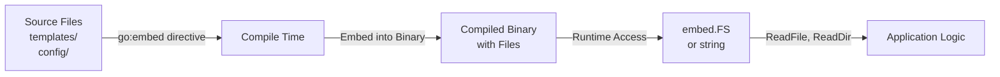
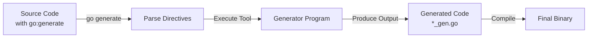
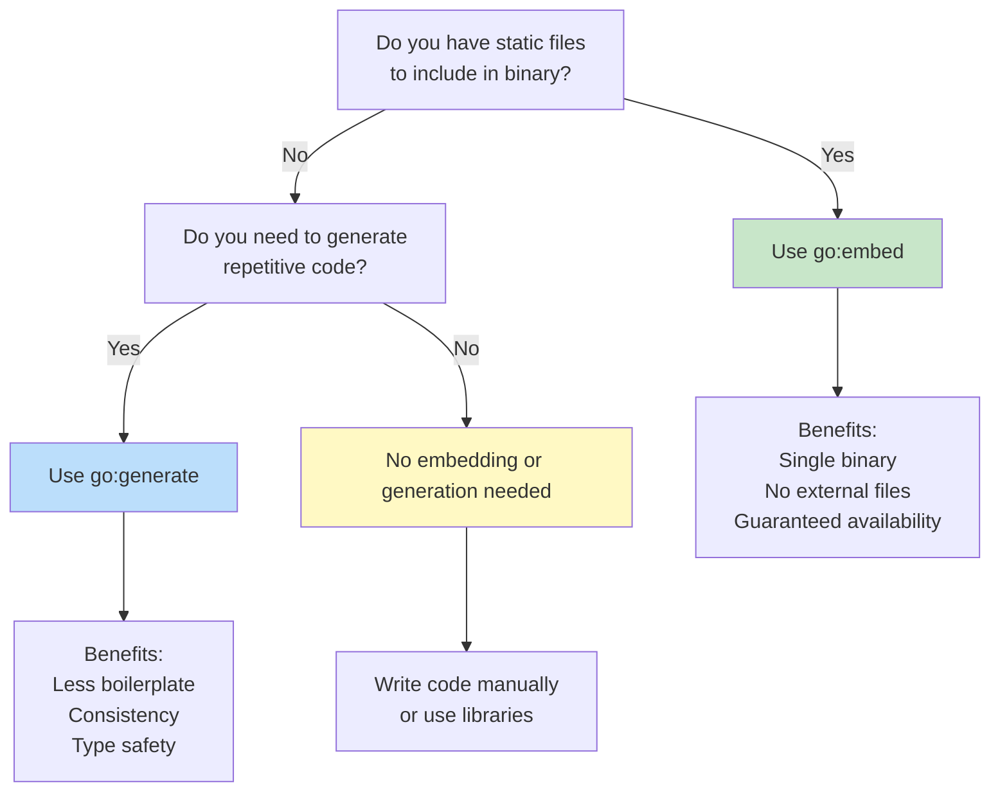

# Day 27: Embedding and Code Generation

## Learning Objectives

- Understand compile-time file embedding with `go:embed` directive
- Work with `embed.FS` for runtime file system access
- Master `go:generate` for automating code generation
- Use built-in tools like `stringer` for enum generation
- Implement custom code generators for domain-specific needs
- Apply code generation best practices and patterns
- Recognize real-world use cases and avoid common pitfalls

---

## 1. File Embedding

### What is File Embedding?

File embedding allows you to include static files (templates, configuration, assets) directly into your compiled Go binary at compile time. This eliminates the need to distribute separate files with your application and ensures consistency across deployments.

**Key benefits**:
- Single binary distribution (no external files needed)
- Guaranteed file availability (no missing files at runtime)
- Improved security (files can't be modified after deployment)
- Simplified deployment (no directory structure to maintain)

### Embedding Workflow



### Basic Embedding Patterns

**Single file as string**:
See `main.go` lines 33-36 for examples of embedding configuration and template files as strings. This pattern is ideal for small files that you want to access as a single string value.

**Directory as embed.FS**:
For multiple files or directory structures, use `embed.FS` to access them like a file system. This allows you to:
- Read individual files with `ReadFile()`
- List directory contents with `ReadDir()`
- Walk the directory tree with `WalkDir()`

**Multiple embed directives**:
You can have multiple `//go:embed` directives in the same file to organize different types of assets:
```go
//go:embed templates/*
var templates embed.FS

//go:embed static/*
var static embed.FS

//go:embed config.json
var config string
```

### Practical Use Cases

**1. Web Application Templates**
Embed HTML templates directly into your web server binary. No need to deploy separate template files.

**2. Configuration Files**
Bundle default configuration with your application. Users can override with environment variables or command-line flags.

**3. Static Assets**
Include CSS, JavaScript, and images in your binary for serving static content without external dependencies.

**4. Documentation**
Embed markdown or HTML documentation that can be served or printed at runtime.

**5. Migration Scripts**
For database applications, embed SQL migration scripts to ensure schema consistency.

### Best Practices for Embedding

- **Keep embedded files small**: Large files increase binary size. Consider external storage for large assets.
- **Use meaningful paths**: Organize embedded files in logical directory structures (e.g., `templates/`, `static/`, `config/`).
- **Document embedded files**: Make it clear what files are embedded and why.
- **Consider compression**: For large text files, consider compressing before embedding.
- **Version control**: Commit embedded files to version control; they're part of your source code.

---

## 2. Code Generation

### What is Code Generation?

Code generation is the process of automatically creating Go code at compile time. Instead of writing repetitive code by hand, you define a generator that produces it for you. This is particularly useful for:
- Reducing boilerplate code
- Ensuring consistency across similar implementations
- Generating code from specifications (schemas, interfaces, etc.)
- Creating type-safe helpers for enums and constants

### Code Generation Workflow



### The go:generate Command

The `go:generate` directive is a special comment that tells Go to run a tool during the build process:

```go
//go:generate stringer -type=Color
//go:generate mockgen -destination=mocks/mock_service.go github.com/example/pkg Service
```

**How it works**:
1. You add `//go:generate` comments in your source code
2. Run `go generate ./...` before building
3. Go parses the directives and executes the specified commands
4. Tools generate new code files (typically `*_gen.go`)
5. The generated code is compiled with your application

**Environment variables available to generators**:
- `$GOFILE` - Name of the file containing the directive
- `$GOLINE` - Line number of the directive
- `$GOPACKAGE` - Name of the package
- `$GOARCH` - Target architecture
- `$GOOS` - Target operating system

### Built-in Code Generation Tools

**stringer** - Generate String() methods for enums:
```bash
go install golang.org/x/tools/cmd/stringer@latest
//go:generate stringer -type=Status
```

**mockgen** - Generate mock implementations for testing:
```bash
go install github.com/golang/mock/mockgen@latest
//go:generate mockgen -destination=mocks/mock_service.go github.com/example/pkg Service
```

**sqlc** - Generate type-safe SQL code:
```bash
go install github.com/sqlc-dev/sqlc/cmd/sqlc@latest
//go:generate sqlc generate
```

**protoc** - Generate code from Protocol Buffer definitions:
```bash
protoc --go_out=. *.proto
```

### Custom Code Generators

You can write your own code generator for domain-specific needs. A generator is simply a Go program that:
1. Reads input (source code, configuration, or command-line arguments)
2. Generates Go code
3. Writes output to stdout or a file

**Basic generator structure**:
```go
package main

import (
    "flag"
    "fmt"
    "log"
    "os"
)

func main() {
    // Parse flags
    typeName := flag.String("type", "", "type to generate for")
    flag.Parse()
    
    if *typeName == "" {
        log.Fatal("type flag is required")
    }
    
    // Generate code
    fmt.Println("// Code generated by custom generator. DO NOT EDIT.")
    fmt.Printf("package %s\n", os.Getenv("GOPACKAGE"))
    fmt.Printf("// Generated methods for %s\n", *typeName)
}
```

**Generator best practices**:
- Always output a "DO NOT EDIT" comment at the top
- Use `os.Getenv("GOPACKAGE")` to get the package name
- Write to stdout or a file with a clear naming convention (`*_gen.go`)
- Handle errors gracefully and exit with non-zero status on failure
- Make generators deterministic (same input = same output)
- Document what the generator does and how to use it

### Code Generation Patterns

**1. Enum String Methods**
Generate `String()` methods for enums so they print nicely:
```go
//go:generate stringer -type=Status
type Status int
const (
    Pending Status = iota
    Active
    Completed
)
```

**2. Builder Pattern**
Generate builder methods for complex struct construction:
```go
// Generated code creates fluent API
user := NewUserBuilder().
    WithName("Alice").
    WithEmail("alice@example.com").
    Build()
```

**3. Factory Methods**
Generate factory functions for creating instances:
```go
// Generated from interface definitions
factory := NewServiceFactory()
service := factory.CreateService("type1")
```

**4. Serialization Helpers**
Generate JSON/XML marshaling code for better performance than reflection:
```go
// Generated MarshalJSON and UnmarshalJSON methods
data, _ := json.Marshal(myStruct)
```

---

## 3. Real-World Use Cases

### Web Application with Embedded Templates

A web server can embed HTML templates and serve them without external files:
```go
//go:embed templates/*
var templates embed.FS

func renderTemplate(name string) (string, error) {
    data, err := templates.ReadFile("templates/" + name)
    return string(data), err
}
```

### Configuration Management

Embed default configuration and allow runtime overrides:
```go
//go:embed config/defaults.json
var defaultConfig string

func loadConfig() Config {
    // Parse embedded defaults
    // Override with environment variables
    // Override with config file if present
}
```

### API Client Generation

Generate type-safe API clients from OpenAPI specifications:
```bash
go install github.com/deepmap/oapi-codegen/cmd/oapi-codegen@latest
//go:generate oapi-codegen -package=api -generate=client openapi.yaml
```

### Database Schema Management

Embed SQL migrations and run them at startup:
```go
//go:embed migrations/*.sql
var migrations embed.FS

func runMigrations(db *sql.DB) error {
    files, _ := migrations.ReadDir("migrations")
    for _, file := range files {
        data, _ := migrations.ReadFile("migrations/" + file.Name())
        db.Exec(string(data))
    }
}
```

### Mock Generation for Testing

Generate mocks from interfaces for unit testing:
```bash
//go:generate mockgen -destination=mocks/mock_service.go . Service
```

### Resource Registry

See `main.go` lines 7-31 for a resource registry pattern that could be generated from a manifest file, eliminating manual registration.

---

## 4. Best Practices

### Organization

**File structure**:
```
myproject/
├── main.go
├── types.go
├── types_gen.go          # Generated code
├── service.go
├── mocks/
│   └── mock_service.go   # Generated mocks
├── templates/
│   ├── index.html
│   └── layout.html
└── config/
    └── defaults.json
```

**Naming conventions**:
- Generated files: `*_gen.go` or `*_generated.go`
- Generated directories: `mocks/`, `generated/`
- Generator tools: `cmd/generators/` or `internal/generators/`

### Version Control

**What to commit**:
- Source code with `//go:generate` directives
- Embedded files (templates, config, migrations)
- Generator source code

**What to ignore**:
- Generated code files (add to `.gitignore`)
- Build artifacts and binaries

**Example .gitignore**:
```
*_gen.go
*_generated.go
mocks/
*.exe
```

### Reproducibility

- Document all generators and their versions
- Use `go.mod` to pin generator tool versions
- Create a `Makefile` or script to run `go generate` consistently
- Test generated code in CI/CD pipeline

**Example Makefile**:
```makefile
generate:
    go generate ./...

build: generate
    go build -o myapp

test: generate
    go test ./...
```

### Performance Considerations

**Compile time vs binary size**:
- Embedding large files increases binary size
- Code generation increases compile time
- Balance convenience with deployment size

**Optimization strategies**:
- Compress large embedded files
- Use code generation only for frequently-used code
- Consider lazy loading for optional features

---

## 5. Common Pitfalls

### Forgetting to Run go generate

**Problem**: You add `//go:generate` directives but forget to run `go generate ./...` before building.

**Solution**: 
- Make `go generate` part of your build process
- Add it to CI/CD pipelines
- Create a Makefile or build script

### Generated Code in Version Control

**Problem**: Committing generated files makes diffs noisy and causes merge conflicts.

**Solution**:
- Add generated files to `.gitignore`
- Regenerate during build, not version control
- Document how to regenerate

### Circular Dependencies in Generators

**Problem**: A generator depends on code that depends on the generator.

**Solution**:
- Put generators in separate packages or modules
- Use `go:build ignore` to exclude generator code from builds
- Keep generator logic independent

### Large Embedded Files

**Problem**: Embedding large files (images, videos) bloats your binary.

**Solution**:
- Keep embedded files small (< 1MB)
- Use external storage for large assets
- Consider compression for text files

### Generator Errors Not Caught

**Problem**: A generator fails silently, producing incomplete or invalid code.

**Solution**:
- Always exit with non-zero status on error
- Use `go generate -x` to see command execution
- Test generators thoroughly

---

## 6. Embedding vs Code Generation Decision Tree



---

## Key Takeaways

1. **go:embed** - Include static files in your binary at compile time
2. **embed.FS** - Access embedded files as a virtual file system
3. **go:generate** - Automate code generation as part of the build process
4. **Built-in tools** - Use stringer, mockgen, sqlc, protoc for common tasks
5. **Custom generators** - Write domain-specific generators for your needs
6. **Deterministic generation** - Generators should produce consistent output
7. **Organization** - Keep generated code separate and clearly marked
8. **Version control** - Commit source and embedded files, ignore generated code
9. **Performance** - Balance binary size and compile time with convenience
10. **Testing** - Test generators and generated code thoroughly
11. **Documentation** - Document what's embedded and why code is generated
12. **Reproducibility** - Make generation part of your build process

---

## Practice Exercises

To solidify your understanding, implement the functions in `exercise.go`:

1. **ExerciseRegisterResource** - Register a resource with name and content
2. **ExerciseGetResource** - Retrieve a resource by name
3. **ExerciseResourceExists** - Check if a resource exists
4. **ExerciseCountResources** - Count total registered resources
5. **ExerciseDeleteResource** - Delete a resource by name
6. **ExerciseGetResourceSize** - Get the size of a resource in bytes

See `main.go` lines 7-31 for the resource management patterns these exercises build upon.

Run tests with: `go test -v`

---

## Further Reading

- [embed Package Documentation](https://pkg.go.dev/embed) - Official embed package reference
- [go:generate Documentation](https://golang.org/pkg/cmd/go/internal/generate/) - How go:generate works
- [stringer Tool](https://pkg.go.dev/golang.org/x/tools/cmd/stringer) - Generate String() methods
- [mockgen Tool](https://github.com/golang/mock) - Generate mocks for testing
- [sqlc](https://sqlc.dev/) - Generate type-safe SQL code
- [oapi-codegen](https://github.com/deepmap/oapi-codegen) - Generate API clients from OpenAPI
- [Code Generation Best Practices](https://go.dev/blog/generate) - Official Go blog on code generation
