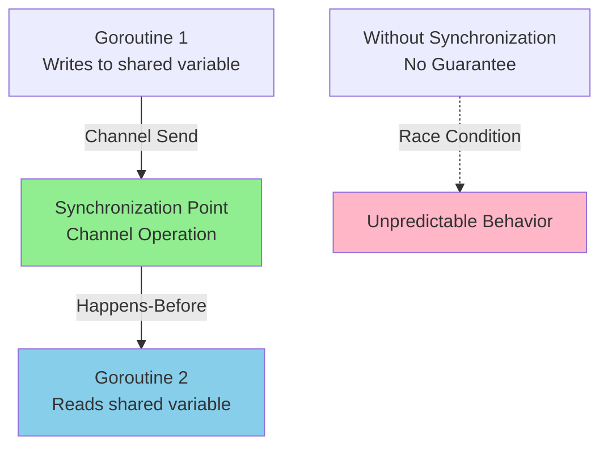
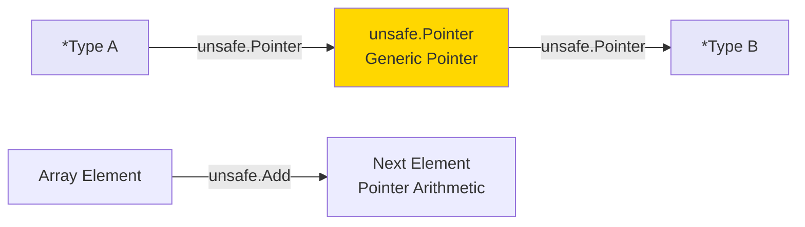
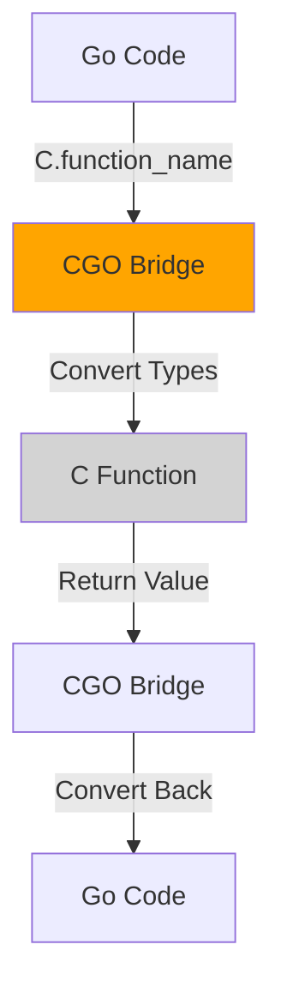
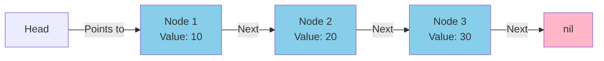
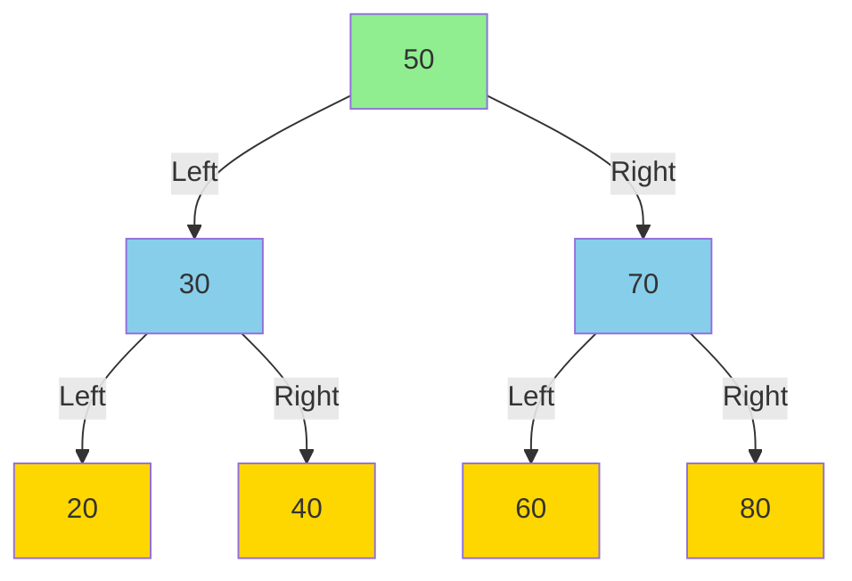
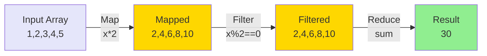
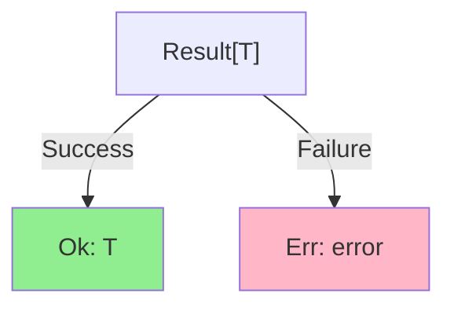
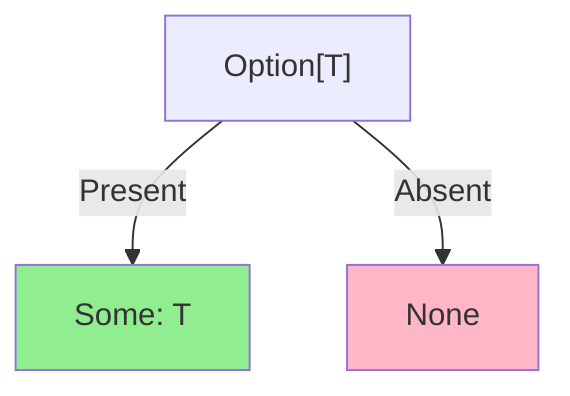

# Day 28: Advanced Go - Memory, Unsafe, CGO, Data Structures, and Functional Patterns

## Learning Objectives

- Master Go's memory model and understand happens-before relationships for safe concurrent programming
- Use channels to synchronize goroutines and ensure data visibility across threads
- Work with `unsafe.Pointer` for low-level memory operations and pointer arithmetic
- Integrate C code with CGO and manage memory across language boundaries
- Implement custom data structures including linked lists and binary search trees
- Apply functional programming patterns: Map, Filter, Reduce, currying, and composition
- Implement generic Result and Option types for robust error handling

---

## 1. Memory Model and Synchronization

### Understanding the Memory Model

Go's memory model defines the conditions under which reads and writes to shared memory can be guaranteed to be observed by other goroutines in a predictable order. Without proper synchronization, concurrent access to shared data can lead to race conditions and unpredictable behavior.

The key concept is **happens-before**, which establishes a partial order of memory operations. If operation A happens-before operation B, then A's effects are guaranteed to be visible to B.

#### Happens-Before Relationships

Without explicit synchronization, there is no guarantee that one goroutine will observe writes from another. Consider this scenario:

```
Goroutine 1: Write variable a
Goroutine 2: Read variable a
```

Without synchronization, Goroutine 2 might read the old value, the new value, or even see a partially-written value. Go provides several synchronization primitives to establish happens-before relationships.

**Mermaid Diagram: Memory Synchronization with Channels**



### Channel Synchronization

Channels provide a safe way to communicate between goroutines and establish happens-before relationships. A send on a channel happens-before the corresponding receive on that channel completes.

**Key Principle**: When you send a value on a channel, all memory writes before the send are visible to the goroutine that receives the value.

See `main.go` lines 72-103 for a complete example demonstrating channel synchronization with linked lists and functional patterns.

**Best Practices**:
- Use channels to synchronize access to shared data
- Close channels only from the sender side
- Avoid sending on closed channels (will panic)
- Use buffered channels carefully; buffer size doesn't guarantee ordering

### Mutex Synchronization

While not shown in main.go, mutexes provide another synchronization mechanism:

```go
var mu sync.Mutex
var sharedData int

func increment() {
    mu.Lock()
    defer mu.Unlock()
    sharedData++
}
```

**When to use**:
- **Channels**: For goroutine communication and simple synchronization
- **Mutexes**: For protecting shared state with multiple concurrent readers/writers

---

## 2. Unsafe Pointers

### Understanding unsafe.Pointer

The `unsafe` package provides low-level memory operations that bypass Go's type safety. While powerful, unsafe operations can break memory safety guarantees and should be used sparingly.

`unsafe.Pointer` is a special pointer type that can be converted to/from any pointer type. This allows:
- Type casting between different pointer types
- Pointer arithmetic
- Direct memory access

**Warning**: Misuse of unsafe pointers can cause crashes, memory corruption, and undefined behavior.

**Mermaid Diagram: Unsafe Pointer Operations**



### Common Use Cases

**1. Type Casting** (Dangerous - only if you know what you're doing):
```go
type User struct {
    ID   int
    Name string
}

user := User{ID: 1, Name: "Alice"}
ptr := unsafe.Pointer(&user)
userPtr := (*User)(ptr)  // Cast back to User
```

**2. Pointer Arithmetic**:
```go
arr := [3]int{1, 2, 3}
ptr := unsafe.Pointer(&arr[0])
ptr = unsafe.Add(ptr, unsafe.Sizeof(int(0)))  // Move to next element
val := *(*int)(ptr)  // Dereference: val = 2
```

**3. Accessing Unexported Fields** (Anti-pattern):
```go
type private struct {
    secret int
}

p := private{secret: 42}
ptr := unsafe.Pointer(&p)
secretPtr := (*int)(ptr)
println(*secretPtr)  // 42 - but breaks encapsulation!
```

**Best Practices**:
- Avoid unsafe pointers unless absolutely necessary
- Document why unsafe operations are needed
- Test thoroughly on all target platforms
- Consider that unsafe code may break with Go version updates
- Use `unsafe.Sizeof()` to ensure correct pointer arithmetic

---

## 3. CGO (C Interoperability)

### What is CGO?

CGO allows Go programs to call C functions and vice versa. This is useful for:
- Integrating with existing C libraries
- Performance-critical operations written in C
- System-level operations not available in Go

### Basic CGO Usage

CGO code is written in comments before the import statement:

```go
package main

/*
#include <stdio.h>

int add(int a, int b) {
    return a + b;
}
*/
import "C"

func main() {
    result := C.add(5, 3)
    println(result)  // 8
}
```

**Mermaid Diagram: CGO Call Flow**



### Memory Management Across Boundaries

When passing Go data to C, you must manage memory carefully:

```go
import "C"
import "unsafe"

func callCFunction(goStr string) {
    cStr := C.CString(goStr)      // Allocate C string
    defer C.free(unsafe.Pointer(cStr))  // Free after use
    
    C.process_string(cStr)
}
```

**Key Points**:
- `C.CString()` allocates memory in C heap; must be freed with `C.free()`
- Go strings are immutable; convert to C strings for modification
- C pointers received by Go must be freed by C code or Go's `C.free()`
- CGO calls have overhead; batch operations when possible

**Best Practices**:
- Minimize CGO calls in hot paths
- Use `defer` to ensure cleanup
- Document memory ownership (who allocates, who frees)
- Test on target platforms (CGO is platform-dependent)

---

## 4. Custom Data Structures

### Linked Lists

A linked list is a dynamic data structure where each node contains a value and a pointer to the next node. Unlike arrays, linked lists don't require contiguous memory and can grow/shrink efficiently.

**Mermaid Diagram: Linked List Structure**



**Operations**:

1. **Push** (Add to front): O(1) time complexity
   - Create new node with value
   - Set new node's Next to current Head
   - Update Head to new node
   - See `main.go` lines 16-18 for implementation

2. **Pop** (Remove from front): O(1) time complexity
   - Save Head's value
   - Move Head to Head.Next
   - Return saved value
   - See `main.go` lines 20-27 for implementation

3. **Size** (Count nodes): O(n) time complexity
   - Traverse from Head to nil, counting nodes
   - See `main.go` lines 36-44 for implementation

4. **Peek** (View front value): O(1) time complexity
   - Return Head's value without removing
   - See `main.go` lines 29-34 for implementation

**Use Cases**:
- Implementing stacks and queues
- Undo/redo functionality
- Efficient insertions/deletions at known positions

**Trade-offs**:
- ✓ O(1) insertion/deletion at front
- ✓ Dynamic size
- ✗ O(n) access to arbitrary elements
- ✗ Extra memory for pointers

### Binary Search Trees

A binary search tree (BST) is a hierarchical data structure where each node has at most two children (left and right). The key property: all values in the left subtree are less than the node's value, and all values in the right subtree are greater.

**Mermaid Diagram: Binary Search Tree Structure**



**Operations**:

1. **Insert**: O(log n) average, O(n) worst case
   - Compare value with node
   - Go left if smaller, right if larger
   - Recursively insert in subtree

2. **Search**: O(log n) average, O(n) worst case
   - Compare value with node
   - Return true if match
   - Recursively search appropriate subtree

3. **In-order Traversal**: O(n)
   - Visit left subtree, node, right subtree
   - Produces sorted output

**Use Cases**:
- Sorted data with frequent insertions/deletions
- Database indexing
- Expression parsing

**Trade-offs**:
- ✓ O(log n) search/insert/delete (balanced)
- ✓ Sorted iteration
- ✗ More complex than arrays
- ✗ Unbalanced trees degrade to O(n)

---

## 5. Functional Programming Patterns

Functional programming treats computation as the evaluation of functions, avoiding mutable state and side effects. Go supports functional patterns through first-class functions and higher-order functions.

### Higher-Order Functions: Map, Filter, Reduce

These three functions form the foundation of functional data transformation:

**Mermaid Diagram: Functional Pipeline**



#### Map

Applies a function to each element, returning a new collection with transformed values.

**Signature**: `Map(fn func(T) U, items []T) []U`

**Example**: See `main.go` lines 46-52 for `MapInt` implementation.

```go
nums := []int{1, 2, 3, 4, 5}
doubled := MapInt(func(x int) int { return x * 2 }, nums)
// doubled = [2, 4, 6, 8, 10]
```

**Time Complexity**: O(n) where n is the length of the input

#### Filter

Selects elements that satisfy a predicate, returning a new collection with matching elements.

**Signature**: `Filter(fn func(T) bool, items []T) []T`

**Example**: See `main.go` lines 54-62 for `FilterInt` implementation.

```go
nums := []int{1, 2, 3, 4, 5}
evens := FilterInt(func(x int) bool { return x%2 == 0 }, nums)
// evens = [2, 4]
```

**Time Complexity**: O(n) where n is the length of the input

#### Reduce

Combines all elements into a single value using an accumulator function.

**Signature**: `Reduce(fn func(T, T) T, items []T, initial T) T`

**Example**: See `main.go` lines 64-70 for `ReduceInt` implementation.

```go
nums := []int{1, 2, 3, 4, 5}
sum := ReduceInt(func(acc, x int) int { return acc + x }, nums, 0)
// sum = 15
product := ReduceInt(func(acc, x int) int { return acc * x }, nums, 1)
// product = 120
```

**Time Complexity**: O(n) where n is the length of the input

### Currying

Currying transforms a function that takes multiple arguments into a sequence of functions, each taking a single argument. This enables partial application and function composition.

**Example**:
```go
func Add(a int) func(int) int {
    return func(b int) int {
        return a + b
    }
}

addFive := Add(5)
result := addFive(3)  // 8
```

**Benefits**:
- Partial application: create specialized functions from general ones
- Function composition: combine functions more easily
- Cleaner API design

### Function Composition

Composition combines multiple functions into a single function. The output of one function becomes the input to the next.

**Example**:
```go
func Compose(f, g func(int) int) func(int) int {
    return func(x int) int {
        return f(g(x))
    }
}

double := func(x int) int { return x * 2 }
addOne := func(x int) int { return x + 1 }

composed := Compose(double, addOne)
result := composed(5)  // (5 + 1) * 2 = 12
```

**Best Practices**:
- Use composition to build complex operations from simple functions
- Keep functions pure (no side effects)
- Document function order in composition
- Consider readability vs. cleverness

---

## 6. Result and Option Types

### Result Type

The Result type represents a computation that can either succeed (with a value) or fail (with an error). This is an alternative to Go's traditional error return pattern.

**Mermaid Diagram: Result Type States**



**Generic Implementation** (Go 1.18+):
```go
type Result[T any] struct {
    value T
    err   error
}

func Ok[T any](value T) *Result[T] {
    return &Result[T]{value: value}
}

func Err[T any](err error) *Result[T] {
    return &Result[T]{err: err}
}

func (r *Result[T]) IsOk() bool {
    return r.err == nil
}

func (r *Result[T]) Value() (T, error) {
    return r.value, r.err
}
```

**Usage**:
```go
func divide(a, b int) *Result[int] {
    if b == 0 {
        return Err[int](errors.New("division by zero"))
    }
    return Ok(a / b)
}

result := divide(10, 2)
if result.IsOk() {
    val, _ := result.Value()
    println(val)  // 5
}
```

### Option Type

The Option type represents a value that may or may not exist. It's safer than using nil pointers.

**Mermaid Diagram: Option Type States**



**Generic Implementation** (Go 1.18+):
```go
type Option[T any] struct {
    value T
    some  bool
}

func Some[T any](value T) *Option[T] {
    return &Option[T]{value: value, some: true}
}

func None[T any]() *Option[T] {
    return &Option[T]{some: false}
}

func (o *Option[T]) IsSome() bool {
    return o.some
}

func (o *Option[T]) Value() (T, bool) {
    return o.value, o.some
}
```

**Usage**:
```go
func findUser(id int) *Option[string] {
    users := map[int]string{1: "Alice", 2: "Bob"}
    if name, exists := users[id]; exists {
        return Some(name)
    }
    return None[string]()
}

user := findUser(1)
if user.IsSome() {
    name, _ := user.Value()
    println(name)  // Alice
}
```

**When to Use**:
- **Result**: When an operation can fail with an error
- **Option**: When a value may not exist (safer than nil)
- **Traditional Go errors**: For simple error handling

---

## Key Takeaways

1. **Memory model** - Synchronization ensures predictable concurrent behavior
2. **Happens-before** - Establishes order of memory operations
3. **Channels** - Primary synchronization mechanism in Go
4. **Unsafe pointers** - Low-level memory access; use sparingly
5. **CGO** - Bridge between Go and C; manage memory carefully
6. **Linked lists** - O(1) push/pop; O(n) access
7. **Binary trees** - O(log n) search/insert (balanced); sorted iteration
8. **Map/Filter/Reduce** - Functional transformations on collections
9. **Currying** - Partial function application for flexibility
10. **Composition** - Combine functions for complex operations
11. **Result/Option** - Type-safe error and optional value handling

---

## Best Practices Summary

- **Concurrency**: Use channels for goroutine synchronization; prefer channels over mutexes for communication
- **Memory Safety**: Avoid unsafe pointers; if necessary, document thoroughly and test extensively
- **CGO**: Minimize CGO calls in performance-critical code; always manage memory correctly
- **Data Structures**: Choose based on access patterns (linked lists for frequent insertions, BSTs for sorted data)
- **Functional Programming**: Keep functions pure; use composition to build complex operations
- **Error Handling**: Use Result/Option types for explicit error and optional value handling

---

## Further Reading

- [Go Memory Model](https://go.dev/ref/mem) - Detailed memory guarantees
- [unsafe Package Documentation](https://pkg.go.dev/unsafe) - Low-level operations
- [CGO Documentation](https://pkg.go.dev/cmd/cgo) - C interoperability
- [Go Generics Tutorial](https://go.dev/doc/tutorial/generics) - Type parameters for Result/Option
- [Effective Go](https://go.dev/doc/effective_go) - Best practices and idioms
