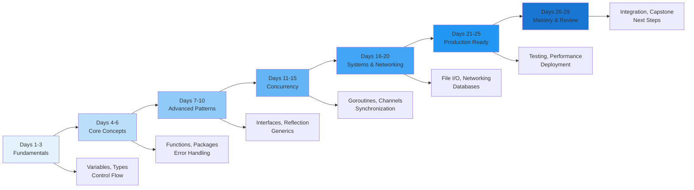
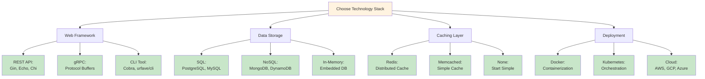
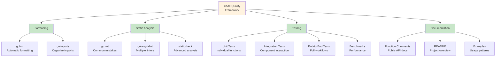
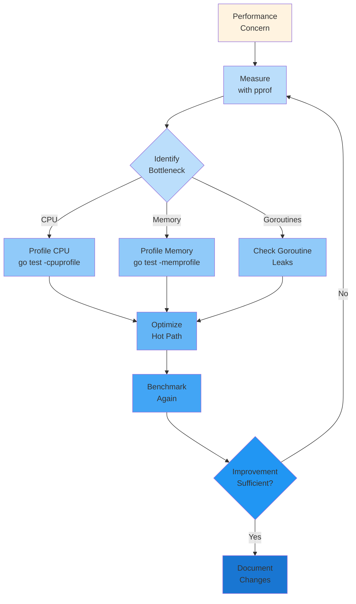
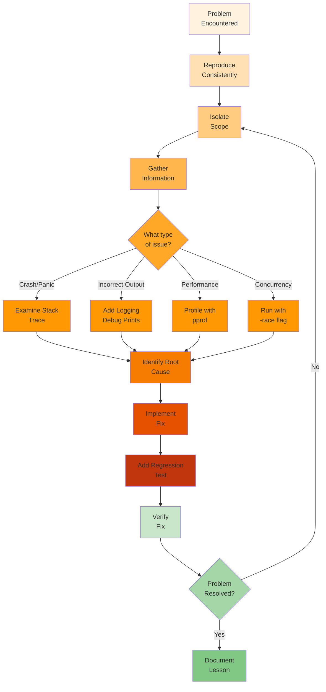
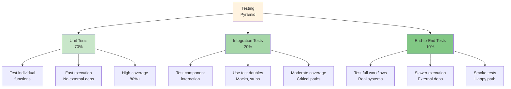
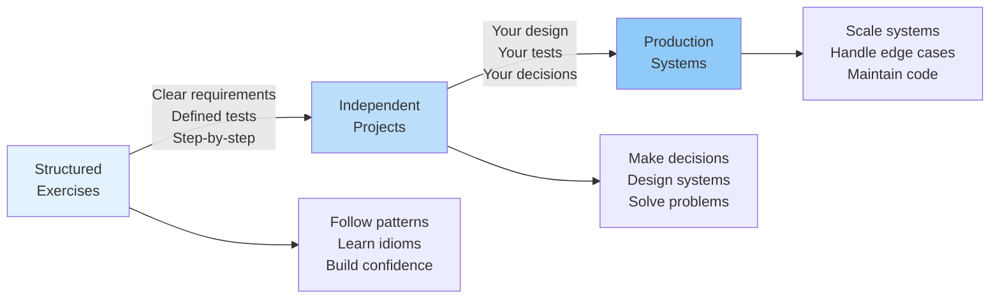
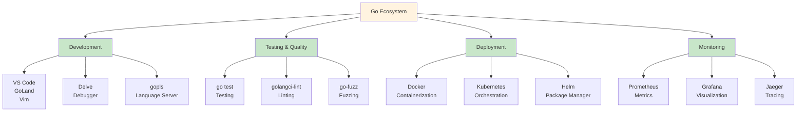

# Day 29: Final Review and Next Steps

## Learning Objectives

- Consolidate learning from all 28 days into a cohesive understanding
- Review key concepts and best practices across the entire curriculum
- Master debugging and troubleshooting techniques for production code
- Plan and architect a capstone project using learned concepts
- Understand the Go ecosystem and available tools
- Explore resources for continued learning and growth
- Engage with the Go community and contribute to open source
- Transition from structured exercises to independent development

---

## Part 1: Learning Consolidation

### The 29-Day Journey: From Fundamentals to Systems Programming

You've completed a comprehensive journey through Go development. Here's how the curriculum builds progressively:



### Key Concept Clusters

**Foundations (Days 1-3)**: Variables, types, control structures, and basic Go syntax form the bedrock of all Go programs.

**Core Competencies (Days 4-6)**: Functions, packages, and error handling establish professional code organization and robust error management.

**Advanced Patterns (Days 7-10)**: Interfaces, reflection, and generics enable flexible, reusable code that scales with complexity.

**Concurrency Mastery (Days 11-15)**: Goroutines, channels, and synchronization primitives unlock Go's most powerful feature—lightweight concurrency.

**Systems Programming (Days 16-20)**: File I/O, networking, and databases connect your code to the real world.

**Production Readiness (Days 21-25)**: Testing, performance profiling, and deployment strategies ensure your code is reliable and maintainable.

**Mastery & Integration (Days 26-29)**: Capstone projects and community engagement solidify your expertise.

---

## Part 2: Capstone Project Planning

### Understanding Your Capstone Project

Your capstone project is the culmination of 29 days of learning. It should demonstrate:
- Mastery of Go fundamentals and idioms
- Proper project structure and organization
- Comprehensive error handling and logging
- Concurrent programming patterns
- Testing and quality assurance
- Production-ready code

### Project Scope Definition

Before writing code, define your project clearly:

**Define Clear Objectives**:
- **Problem Statement**: What real problem does your project solve?
- **Target Users**: Who will use this project?
- **Core Features**: What are the 3-5 essential features?
- **Success Criteria**: How will you measure success?
- **Scope Boundaries**: What's in scope? What's explicitly out of scope?

**Example Scope Definition**:
```
Project: Task Management API
Problem: Teams need a simple, fast API for collaborative task management
Users: Small teams (5-50 people) using REST clients
Core Features:
  1. Create, read, update, delete tasks
  2. Assign tasks to team members
  3. Track task status and completion
  4. List tasks with filtering and sorting
Success: API handles 1000 req/sec with <100ms latency
Out of Scope: Web UI, mobile apps, real-time notifications
```

### Technology Stack Decision Matrix



**Framework Selection Guide**:
- **Gin**: High performance, minimal overhead, great for REST APIs
- **Echo**: Balanced features and performance, excellent middleware support
- **Chi**: Lightweight, idiomatic, excellent for microservices
- **Cobra**: CLI applications with subcommands and flags

### Standard Go Project Structure

The layout below follows Go conventions and scales from small to large projects:

```
capstone-project/
├── cmd/                           # Executable entry points
│   ├── api/
│   │   └── main.go               # API server entry point
│   └── cli/
│       └── main.go               # CLI tool entry point
├── internal/                      # Private packages (not importable)
│   ├── config/
│   │   └── config.go             # Configuration loading
│   ├── handler/
│   │   ├── task.go               # HTTP handlers
│   │   └── user.go
│   ├── service/
│   │   ├── task.go               # Business logic
│   │   └── user.go
│   ├── repository/
│   │   ├── task.go               # Data access layer
│   │   └── user.go
│   ├── model/
│   │   ├── task.go               # Domain models
│   │   └── user.go
│   ├── middleware/
│   │   ├── auth.go               # HTTP middleware
│   │   └── logging.go
│   └── database/
│       └── db.go                 # Database initialization
├── pkg/                           # Public packages (importable)
│   ├── logger/
│   │   └── logger.go             # Logging utilities
│   └── errors/
│       └── errors.go             # Custom error types
├── test/                          # Test utilities
│   ├── fixtures/
│   │   └── testdata.go           # Test data
│   └── mocks/
│       └── mock_repository.go    # Mock implementations
├── migrations/                    # Database migrations
│   └── 001_initial_schema.sql
├── docs/                          # Documentation
│   ├── API.md                    # API documentation
│   └── ARCHITECTURE.md           # Architecture decisions
├── .env.example                   # Environment variables template
├── docker-compose.yml             # Local development environment
├── Dockerfile                     # Production container
├── Makefile                       # Build automation
├── go.mod                         # Module definition
├── go.sum                         # Dependency checksums
├── .gitignore                     # Git ignore rules
├── README.md                      # Project documentation
└── LICENSE                        # License file
```

**Directory Purposes**:
- **`cmd/`**: Entry points for different executables. Each subdirectory is a separate binary.
- **`internal/`**: Private packages that cannot be imported from outside your module. Use for implementation details.
- **`pkg/`**: Public packages that can be imported by other projects. Use for reusable functionality.
- **`test/`**: Test utilities, fixtures, and mocks shared across tests.
- **`migrations/`**: Database schema changes, versioned and ordered.
- **`docs/`**: Architecture decisions, API documentation, design documents.

### Capstone Project Ideas by Difficulty

**Beginner**: 1-2 weeks, single service, basic features
- **Task Manager API**: Create, list, update, delete tasks with file-based storage
- **URL Shortener**: Generate short URLs, redirect to originals
- **Weather CLI**: Fetch and display weather data from an API
- **Expense Tracker**: Track personal expenses with categories and reports

**Intermediate**: 2-4 weeks, multiple services, database integration
- **Blog Platform**: Posts, comments, user authentication, markdown support
- **Chat Application**: Real-time messaging with WebSockets, user management
- **Inventory Management**: Track products, stock levels, orders
- **Analytics Dashboard**: Collect metrics, visualize trends, export reports

**Advanced**: 4-8 weeks, distributed systems, complex architecture
- **Microservices E-Commerce**: Order, payment, inventory, notification services
- **Real-Time Collaboration Tool**: Shared documents, presence awareness, conflict resolution
- **Distributed Cache**: Implement a Redis-like caching system
- **Message Queue**: Build a RabbitMQ-like message broker

---

## Part 3: Best Practices Review

### Code Quality Framework

Maintaining high code quality is essential for professional Go development. Here's a comprehensive approach:



**Formatting & Style**:
- Run `gofmt` before every commit: `go fmt ./...`
- Use `goimports` to organize imports: `goimports -w .`
- Follow Go naming conventions (mixedCaps for functions, CONSTANT_CASE for constants)
- See main.go lines 28-59 for examples of proper function organization and naming

**Static Analysis**:
- Run `go vet ./...` to catch common mistakes
- Use `golangci-lint` for comprehensive linting: `golangci-lint run ./...`
- Address all warnings before committing code
- Configure `.golangci.yml` for project-specific rules

**Testing Strategy**:
- Write tests alongside implementation (test-driven development)
- Aim for >80% code coverage on critical paths
- Use table-driven tests for multiple input/output combinations
- See main.go lines 61-100 for examples of progress tracking and testing patterns

**Documentation**:
- Write function comments for all exported functions
- Document non-obvious implementation decisions
- Provide examples in `_test.go` files
- Keep README up-to-date with setup and usage instructions

### Performance Optimization Workflow



**Performance Best Practices**:
- **Profile before optimizing**: Use `pprof` to identify actual bottlenecks
- **Benchmark critical functions**: `go test -bench=. -benchmem`
- **Use appropriate data structures**: Maps for lookups, slices for sequences
- **Manage allocations**: Reuse buffers, preallocate slices when size is known
- **Optimize hot paths**: Focus on code that runs frequently
- **Monitor in production**: Use metrics and profiling in live systems

**Common Performance Issues**:
- Excessive allocations: Use `sync.Pool` for frequently allocated objects
- String concatenation: Use `strings.Builder` instead of `+` operator
- Inefficient algorithms: O(n²) algorithms become problematic at scale
- Goroutine leaks: Ensure all goroutines terminate
- Lock contention: Use fine-grained locking or lock-free algorithms

### Security Best Practices

```mermaid
graph TD
    A["Security<br/>Checklist"] --> B["Input Validation"]
    A --> C["Data Protection"]
    A --> D["Authentication"]
    A --> E["Authorization"]
    A --> F["Dependency Management"]
    
    B --> B1["Validate all inputs<br/>Reject invalid data"]
    B --> B2["Sanitize strings<br/>Prevent injection"]
    B --> B3["Check boundaries<br/>Prevent overflow"]
    
    C --> C1["Use HTTPS/TLS<br/>Encrypt in transit"]
    C --> C2["Hash passwords<br/>Never store plaintext"]
    C --> C3["Encrypt sensitive data<br/>At rest"]
    
    D --> D1["Implement auth<br/>JWT, OAuth2, etc"]
    D --> D2["Secure tokens<br/>Expiration, rotation"]
    
    E --> E1["Role-based access<br/>RBAC"]
    E --> E2["Check permissions<br/>Every operation"]
    
    F --> F1["Keep dependencies<br/>Updated"]
    F --> F2["Audit dependencies<br/>go list -u -m all"]
    F --> F3["Use go mod tidy<br/>Remove unused"]
    
    style A fill:#ffebee
    style B fill:#ffcdd2
    style C fill:#ffcdd2
    style D fill:#ffcdd2
    style E fill:#ffcdd2
    style F fill:#ffcdd2
```



**Security Implementation**:
- **Input Validation**: Always validate and sanitize user input
- **Parameterized Queries**: Use prepared statements to prevent SQL injection
- **Password Hashing**: Use `golang.org/x/crypto/bcrypt` for password hashing
- **HTTPS/TLS**: Always use HTTPS in production
- **Dependency Updates**: Regularly update dependencies: `go get -u ./...`
- **Secrets Management**: Use environment variables or secret management systems
- **Logging**: Log security events but never log sensitive data

---

## Part 4: Debugging and Troubleshooting

### Debugging Workflow

When you encounter a problem, follow this systematic approach:



### Common Go Issues and Solutions

**Race Conditions**:
- **Detection**: Run tests with `-race` flag: `go test -race ./...`
- **Cause**: Multiple goroutines accessing shared data without synchronization
- **Solution**: Use `sync.Mutex`, channels, or atomic operations
- **Prevention**: Always use `-race` during development and CI/CD

**Memory Leaks**:
- **Detection**: Profile memory: `go test -memprofile=mem.prof -run TestName`
- **Cause**: Goroutines that never exit, unclosed resources, circular references
- **Solution**: Ensure goroutines have exit conditions, close files and connections
- **Prevention**: Use `defer` for cleanup, monitor goroutine count

**Deadlocks**:
- **Detection**: Program hangs indefinitely, no output
- **Cause**: Goroutines waiting for each other in circular dependency
- **Solution**: Use `context.Context` for timeouts, design communication patterns carefully
- **Prevention**: Use channels for communication, avoid nested locks

**Panics**:
- **Detection**: Stack trace in output or logs
- **Cause**: Nil pointer dereference, index out of bounds, type assertion failure
- **Solution**: Add nil checks, validate indices, use type assertions safely
- **Prevention**: Use defensive programming, validate assumptions

**Performance Issues**:
- **Detection**: Benchmarks show degradation, high CPU/memory usage
- **Cause**: Inefficient algorithms, excessive allocations, lock contention
- **Solution**: Profile to identify bottleneck, optimize hot path
- **Prevention**: Benchmark critical functions, monitor metrics in production

### Debugging Tools Reference

| Tool | Purpose | Command |
|------|---------|---------|
| **Delve** | Interactive debugger | `dlv debug ./cmd/app` |
| **pprof** | CPU/memory profiling | `go test -cpuprofile=cpu.prof` |
| **Race Detector** | Find race conditions | `go test -race ./...` |
| **go vet** | Static analysis | `go vet ./...` |
| **golangci-lint** | Comprehensive linting | `golangci-lint run ./...` |
| **Goroutine Dump** | Analyze goroutines | `curl localhost:6060/debug/pprof/goroutine` |
| **Trace** | Execution tracing | `go test -trace=trace.out` |

---

## Part 5: Testing Strategy and Quality Assurance

### Testing Pyramid



**Unit Testing**:
- Test individual functions in isolation
- Use table-driven tests for multiple cases
- Mock external dependencies
- Aim for >80% coverage on critical code
- Run frequently during development

**Integration Testing**:
- Test interaction between components
- Use test databases or in-memory alternatives
- Test error paths and edge cases
- Run before committing code

**End-to-End Testing**:
- Test complete workflows from user perspective
- Use real or staging environments
- Focus on critical user journeys
- Run in CI/CD pipeline

**Benchmarking**:
- Benchmark critical functions: `go test -bench=. -benchmem`
- Compare before/after optimization
- Track performance over time
- Use in CI/CD to detect regressions

---

## Part 6: From Exercises to Independent Development

### Transitioning to Capstone Projects

The shift from structured exercises to independent projects requires new skills:



**Key Differences**:
- **Requirements**: You define them, not given to you
- **Testing**: You write tests for your own code
- **Design**: You choose architecture and patterns
- **Debugging**: You find and fix your own bugs
- **Iteration**: You refactor and improve continuously

**Strategies for Success**:
1. **Start small**: Build a minimal viable product first
2. **Write tests early**: Test-driven development ensures quality
3. **Design before coding**: Sketch architecture on paper
4. **Iterate frequently**: Build, test, refactor, repeat
5. **Seek feedback**: Share code with others for review
6. **Document decisions**: Record why you made architectural choices
7. **Measure quality**: Track test coverage, performance, and bugs

### Project Checklist

Before considering your capstone complete:

**Code Quality**:
- [ ] All code formatted with `gofmt`
- [ ] All tests passing: `go test ./...`
- [ ] No warnings from `go vet`
- [ ] No warnings from `golangci-lint`
- [ ] >80% test coverage on critical code
- [ ] All exported functions documented

**Functionality**:
- [ ] All core features implemented
- [ ] Error handling for all failure cases
- [ ] Input validation on all user inputs
- [ ] Graceful shutdown and cleanup
- [ ] Logging for debugging and monitoring

**Performance**:
- [ ] Benchmarks for critical functions
- [ ] No obvious performance issues
- [ ] Memory usage reasonable
- [ ] No goroutine leaks

**Deployment**:
- [ ] Dockerfile for containerization
- [ ] Environment configuration via `.env`
- [ ] Database migrations included
- [ ] README with setup instructions
- [ ] License file included

**Documentation**:
- [ ] API documentation (if applicable)
- [ ] Architecture decisions documented
- [ ] Setup and running instructions
- [ ] Examples of common usage
- [ ] Troubleshooting guide

---

## Part 7: Go Ecosystem and Tools

### Essential Go Tools



**Development Tools**:
- **VS Code**: Lightweight, excellent Go extension, free
- **GoLand**: Full-featured IDE, paid but powerful
- **Delve**: Interactive debugger for stepping through code
- **gopls**: Language server for IDE integration

**Testing & Quality**:
- **go test**: Built-in testing framework
- **golangci-lint**: Comprehensive linter combining multiple tools
- **go-fuzz**: Fuzzing for finding edge cases
- **go-cover**: Coverage analysis

**Deployment**:
- **Docker**: Containerize applications for consistent deployment
- **Kubernetes**: Orchestrate containers at scale
- **Helm**: Package manager for Kubernetes

**Monitoring**:
- **Prometheus**: Metrics collection and alerting
- **Grafana**: Visualization and dashboards
- **Jaeger**: Distributed tracing
- **ELK Stack**: Logging, searching, visualization

### Popular Go Frameworks and Libraries

**Web Frameworks**:
- **Gin**: High-performance REST API framework
- **Echo**: Lightweight framework with excellent middleware
- **Chi**: Idiomatic router for microservices
- **Fiber**: Express.js-inspired framework

**Databases**:
- **GORM**: ORM for SQL databases
- **sqlc**: Type-safe SQL code generation
- **mongo-go-driver**: MongoDB driver
- **redis**: Redis client

**CLI Tools**:
- **Cobra**: Command-line interface framework
- **urfave/cli**: Simpler CLI framework
- **pflag**: POSIX-style flags

**Utilities**:
- **logrus**: Structured logging
- **zap**: High-performance logging
- **viper**: Configuration management
- **testify**: Testing assertions and mocks

---

## Part 8: Resources for Continued Learning

### Learning Resources by Topic

**Go Fundamentals**:
- [Effective Go](https://golang.org/doc/effective_go) - Official idioms and best practices
- [Go Code Review Comments](https://github.com/golang/go/wiki/CodeReviewComments) - Code review guidelines
- [Go by Example](https://gobyexample.com/) - Interactive examples for every concept
- [Tour of Go](https://tour.golang.org/) - Interactive introduction to Go

**Advanced Topics**:
- [Concurrency in Go](https://www.oreilly.com/library/view/concurrency-in-go/9781491941294/) - Deep dive into goroutines and channels
- [High Performance Go](https://github.com/dgryski/go-perfbook) - Performance optimization guide
- [Go Memory Model](https://golang.org/ref/mem) - Understanding memory semantics
- [Generics in Go](https://go.dev/doc/tutorial/generics) - Using type parameters

**Web Development**:
- [Building Web Applications with Go](https://www.golang-book.com/) - Web development patterns
- [REST API Best Practices](https://restfulapi.net/) - API design principles
- [gRPC Documentation](https://grpc.io/docs/) - High-performance RPC framework

**Systems Programming**:
- [Linux Programming Interface](https://man7.org/tlpi/) - System calls and APIs
- [Go Networking](https://golang.org/pkg/net/) - Network programming
- [File I/O in Go](https://golang.org/pkg/os/) - File operations

**Community**:
- [Go Forum](https://forum.golangbridge.org/) - Official discussion forum
- [Go Slack](https://gophers.slack.com/) - Real-time chat community
- [Go Reddit](https://www.reddit.com/r/golang/) - Community discussions
- [Go GitHub Discussions](https://github.com/golang/go/discussions) - Official discussions

**Open Source Projects to Study**:
- [Kubernetes](https://github.com/kubernetes/kubernetes) - Large-scale distributed system
- [Docker](https://github.com/moby/moby) - Container runtime
- [Prometheus](https://github.com/prometheus/prometheus) - Monitoring system
- [etcd](https://github.com/etcd-io/etcd) - Distributed key-value store
- [Hugo](https://github.com/gohugoio/hugo) - Static site generator

---

## Part 9: Comprehensive Key Takeaways

### Fundamentals (Days 1-3)
1. **Master Go syntax**: Variables, types, control structures are the foundation
2. **Understand zero values**: Every type has a default value
3. **Use appropriate types**: Choose the right type for the job (int vs int64, string vs []byte)
4. **Follow naming conventions**: mixedCaps for functions, CONSTANT_CASE for constants

### Core Competencies (Days 4-6)
5. **Organize with packages**: Packages are the unit of code organization
6. **Handle errors explicitly**: Check errors immediately after function calls
7. **Wrap errors with context**: Use `fmt.Errorf()` with `%w` to preserve error chains
8. **Use interfaces for abstraction**: Interfaces enable flexible, testable code

### Advanced Patterns (Days 7-10)
9. **Leverage reflection carefully**: Reflection is powerful but adds complexity
10. **Use generics for type safety**: Type parameters reduce code duplication
11. **Implement custom types**: Create types that represent domain concepts
12. **Design for composition**: Embed types to build complex behavior

### Concurrency (Days 11-15)
13. **Goroutines are lightweight**: Use them liberally for concurrent tasks
14. **Channels for communication**: Goroutines should communicate via channels
15. **Synchronize carefully**: Use `sync.Mutex` for shared state, channels for coordination
16. **Avoid deadlocks**: Design communication patterns that can't deadlock
17. **Prevent goroutine leaks**: Ensure all goroutines have exit conditions

### Systems Programming (Days 16-20)
18. **File I/O requires cleanup**: Always close files with `defer`
19. **Network programming is error-prone**: Handle timeouts and connection errors
20. **Databases need connection pooling**: Reuse connections for efficiency
21. **Understand buffering**: Buffered channels and I/O have different semantics

### Production Readiness (Days 21-25)
22. **Test everything**: Unit tests, integration tests, benchmarks
23. **Profile before optimizing**: Use pprof to find actual bottlenecks
24. **Log strategically**: Structured logging for debugging and monitoring
25. **Deploy with confidence**: Docker, Kubernetes, and CI/CD pipelines

### Mastery & Integration (Days 26-29)
26. **Design systems thoughtfully**: Architecture decisions have long-term impact
27. **Code reviews improve quality**: Seek feedback from other developers
28. **Documentation matters**: Good docs make code maintainable
29. **Security is not optional**: Validate inputs, use HTTPS, hash passwords
30. **Continuous improvement**: Refactor, optimize, and learn from mistakes

---

## Part 10: Your Next Steps

### Immediate Actions (This Week)

1. **Complete your capstone project**:
   - Define scope and objectives
   - Choose technology stack
   - Set up project structure
   - Implement core features
   - Write comprehensive tests

2. **Set up development environment**:
   - Install Delve debugger
   - Configure golangci-lint
   - Set up Docker for local development
   - Create Makefile for common tasks

3. **Establish quality practices**:
   - Run `go fmt` before every commit
   - Run tests with `-race` flag
   - Achieve >80% test coverage
   - Document all exported functions

### Short-term Goals (Next 1-3 Months)

1. **Contribute to open source**:
   - Find a Go project you use
   - Start with documentation or small bugs
   - Submit pull requests
   - Learn from code reviews

2. **Deepen expertise in one area**:
   - Web development (REST APIs, gRPC)
   - Systems programming (databases, networking)
   - Concurrency patterns (distributed systems)
   - DevOps (containers, orchestration)

3. **Build additional projects**:
   - CLI tools for automation
   - Microservices for learning
   - Libraries for code reuse
   - Tools for your own needs

### Long-term Goals (Next 6-12 Months)

1. **Become a Go expert**:
   - Read and understand large codebases
   - Contribute meaningfully to open source
   - Mentor others learning Go
   - Speak at meetups or conferences

2. **Specialize in a domain**:
   - Backend development
   - DevOps and infrastructure
   - Systems programming
   - Data processing

3. **Build a portfolio**:
   - 3-5 polished projects
   - Open source contributions
   - Blog posts about Go
   - Speaking engagements

---

## Part 11: Engaging with the Go Community

### Community Channels

**Real-time Communication**:
- **Gophers Slack**: Join #general, #help, and topic-specific channels
- **Discord Servers**: Go Discord community for real-time chat
- **IRC**: Freenode #go-nuts for traditional IRC users

**Asynchronous Discussion**:
- **Go Forum**: forum.golangbridge.org for threaded discussions
- **Reddit**: r/golang for community discussions
- **GitHub Discussions**: golang/go for official discussions

**Events and Conferences**:
- **GopherCon**: Annual Go conference (multiple locations)
- **Go Meetups**: Local user groups in most cities
- **Virtual Meetups**: Online talks and workshops
- **Workshops**: Hands-on training from experts

### Contributing to Open Source

**Finding Projects**:
- **Awesome Go**: https://awesome-go.com/ - Curated list of Go projects
- **GitHub Trending**: Find trending Go repositories
- **Good First Issue**: Look for issues labeled "good first issue"
- **Help Wanted**: Issues labeled "help wanted" are explicitly seeking contributors

**Contribution Types**:
- **Bug fixes**: Fix reported issues
- **Features**: Implement requested features
- **Documentation**: Improve README and comments
- **Tests**: Add test coverage
- **Performance**: Optimize hot paths

**Best Practices for Contributing**:
1. Read the project's CONTRIBUTING.md
2. Start with small, focused changes
3. Write clear commit messages
4. Add tests for your changes
5. Be respectful and patient with feedback
6. Follow the project's code style

---

## Part 12: Final Wisdom

### The Go Philosophy

Go was designed with specific principles:

**Simplicity**: Go favors explicit, readable code over clever abstractions. If something can be done in two ways, Go chooses the simpler one.

**Concurrency**: Goroutines and channels make concurrent programming accessible. Go's concurrency model is one of its greatest strengths.

**Productivity**: Go compiles quickly, has a simple syntax, and a powerful standard library. You can be productive immediately.

**Reliability**: Go's error handling, type system, and tooling make it easy to write reliable code.

**Efficiency**: Go compiles to fast, efficient binaries. No runtime overhead, no garbage collection pauses (usually).

### Avoiding Common Pitfalls

**Premature Optimization**: Don't optimize before profiling. Most optimizations are unnecessary.

**Over-engineering**: Don't build for scalability you don't need. Start simple, refactor when needed.

**Ignoring Errors**: Never use `_` to ignore errors. Handle them explicitly.

**Goroutine Leaks**: Always ensure goroutines have exit conditions. Monitor goroutine count.

**Panic for Control Flow**: Use panic only for unrecoverable errors, not for normal error handling.

**Global State**: Avoid global variables. Pass dependencies explicitly.

### Continuous Learning

Go evolves constantly. Stay current with:
- **Release notes**: Read what's new in each Go release
- **Blog posts**: Follow golang.org/blog for official updates
- **Community projects**: Learn from how others solve problems
- **Your own projects**: Build things and learn from experience

---

## Part 13: Capstone Project Checklist

Use this checklist to ensure your capstone is production-ready:

### Planning & Design
- [ ] Problem statement clearly defined
- [ ] Target users identified
- [ ] Core features listed
- [ ] Success criteria established
- [ ] Technology stack chosen
- [ ] Architecture documented

### Implementation
- [ ] Project structure follows Go conventions
- [ ] All code formatted with `gofmt`
- [ ] All functions have comments
- [ ] Error handling comprehensive
- [ ] Input validation on all user inputs
- [ ] Graceful shutdown implemented

### Testing
- [ ] Unit tests written for all functions
- [ ] Integration tests for workflows
- [ ] >80% code coverage achieved
- [ ] All tests passing
- [ ] Race detector passes: `go test -race ./...`
- [ ] Benchmarks for critical functions

### Quality
- [ ] `go vet` passes with no warnings
- [ ] `golangci-lint` passes with no warnings
- [ ] No hardcoded secrets or credentials
- [ ] Logging implemented
- [ ] Error messages are helpful

### Documentation
- [ ] README with setup instructions
- [ ] API documentation (if applicable)
- [ ] Architecture decision document
- [ ] Examples of common usage
- [ ] Troubleshooting guide
- [ ] License file included

### Deployment
- [ ] Dockerfile created
- [ ] Environment variables documented
- [ ] Database migrations included
- [ ] Health checks implemented
- [ ] Metrics exposed
- [ ] Graceful shutdown tested

### Performance
- [ ] No obvious performance issues
- [ ] Memory usage reasonable
- [ ] No goroutine leaks
- [ ] Benchmarks show acceptable performance
- [ ] Database queries optimized

---

## Further Reading and Resources

**Official Go Resources**:
- [golang.org](https://golang.org/) - Official website
- [go.dev](https://go.dev/) - Go documentation portal
- [Effective Go](https://golang.org/doc/effective_go) - Idioms and best practices
- [Go Blog](https://golang.org/blog/) - Official announcements and articles

**Books**:
- "The Go Programming Language" by Donovan & Kernighan
- "Concurrency in Go" by Katherine Cox-Buday
- "Building Microservices with Go" by Nic Jackson

**Online Courses**:
- [A Tour of Go](https://tour.golang.org/) - Interactive introduction
- [Go by Example](https://gobyexample.com/) - Annotated examples
- [Udemy Go Courses](https://www.udemy.com/) - Comprehensive courses

**Tools and Frameworks**:
- [Gin Web Framework](https://gin-gonic.com/) - REST API development
- [GORM](https://gorm.io/) - Object-relational mapping
- [Cobra](https://cobra.dev/) - CLI framework
- [Prometheus](https://prometheus.io/) - Monitoring and alerting

---

## Conclusion

You've completed a comprehensive 29-day journey through Go development. You now understand:
- Go fundamentals and idioms
- Professional code organization
- Concurrent programming patterns
- Systems programming concepts
- Testing and quality assurance
- Debugging and troubleshooting
- Production deployment strategies

The next chapter is yours to write. Take what you've learned, build amazing projects, contribute to the community, and continue growing as a developer. The Go community is welcoming and supportive—don't hesitate to ask questions and share your work.

**Remember**: The best way to learn is by building. Start your capstone project today, and let your curiosity guide you toward mastery.

Happy coding! 🚀
