# Day 3: Functions, Structs, and Design Patterns

## Learning Objectives
- Declare and call functions with parameters and return values
- Understand named return values and multiple return values
- Learn variadic functions and how to use them
- Master the `defer` statement for cleanup operations
- Work with function values and anonymous functions
- Understand function scope and closures
- Master higher-order functions: map, filter, reduce patterns
- Learn function composition, currying, and partial application
- Understand decorator pattern and advanced functional techniques
- Apply best practices for error handling and resource management

---

## What are Functions?

Functions are reusable blocks of code that perform specific tasks. In Go, functions are **first-class values**, meaning they can be assigned to variables, passed as arguments, and returned from other functions. This makes Go's functional programming capabilities powerful and flexible.

**Key Characteristics of Go Functions**:
- **Explicit return types** - No implicit returns or type inference for return values
- **Multiple return values** - Functions can return multiple values (perfect for error handling)
- **Named return values** - Return values can be named for clarity
- **Variadic parameters** - Functions can accept variable numbers of arguments
- **First-class values** - Functions can be stored, passed, and returned
- **Closures** - Functions can capture variables from their enclosing scope

---

## Part 1: Functions

### Topics Covered

### 1. Function Declarations and Syntax

Function declarations specify parameters, return types, and the function body. See `main.go` lines 9-16 for examples of simple functions, functions with no return values, and functions with multiple parameters of the same type.

**Function Call Flow Diagram**:
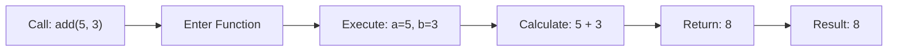

---

### 2. Multiple Return Values

Go's ability to return multiple values is one of its most distinctive features. This is commonly used for returning both a result and an error. See `main.go` lines 19-24 for the divide function example and lines 316-329 for usage patterns.

**Why Multiple Returns Matter**:
- **Error handling**: No exceptions in Go; errors are returned as values
- **Clarity**: Explicit about what can go wrong
- **Simplicity**: No try-catch blocks needed
- **Idiomatic**: The Go way of handling errors

**Multiple Return Values Flow**:
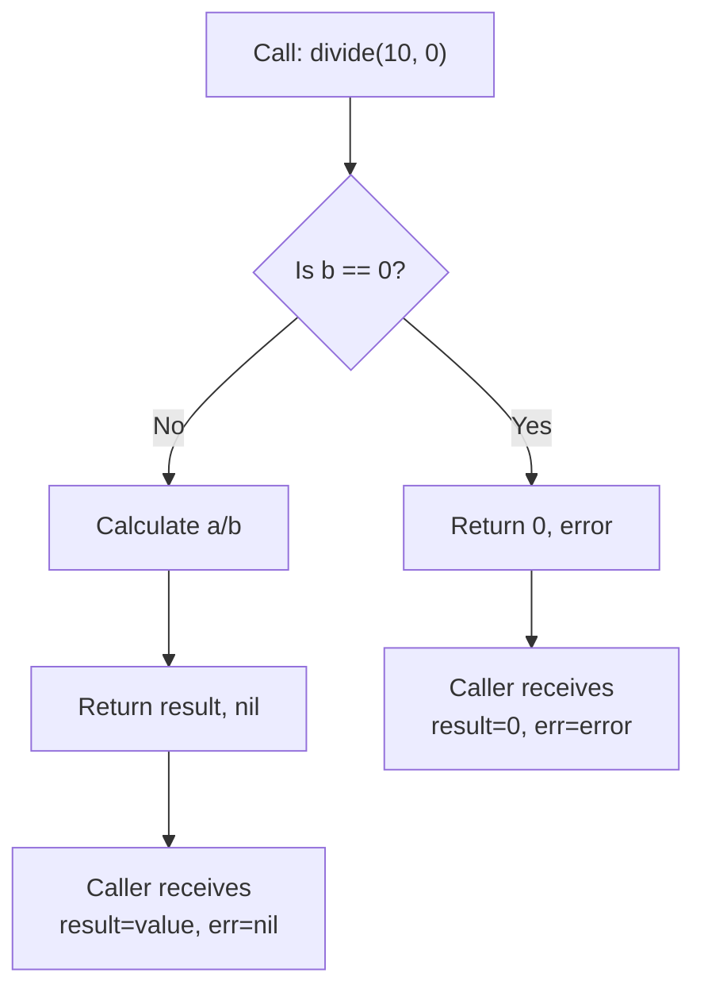

**Common Patterns** (see `main.go` lines 316-329 for working examples):
- **Pattern 1**: Check error immediately after function call
- **Pattern 2**: Ignore error using blank identifier `_`
- **Pattern 3**: Ignore result and only check error

---

### 3. Named Return Values

Named return values make code more readable and self-documenting. They also allow for implicit returns. See `main.go` lines 27-31 for the swap function example and lines 274-278 for the getCoordinates example.

**Benefits**:
- Self-documenting code (readers know what each return value represents)
- Implicit returns are cleaner
- Named returns are automatically zero-valued

See `main.go` lines 332-334 for usage of named return values in action.

---

### 4. Variadic Functions

Variadic functions accept a variable number of arguments of the same type. The variadic parameter must be the last parameter. See `main.go` lines 34-40 for the sum function and lines 43-52 for printStrings with mixed parameters.

**Variadic Argument Collection Flow**:
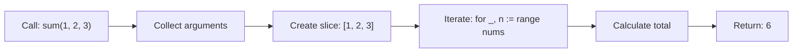

See `main.go` lines 337-344 for usage examples including unpacking slices with `...`.

**Important Rules**:
- Variadic parameter must be the last parameter
- Only one variadic parameter per function
- Variadic parameter is a slice inside the function
- Can pass zero arguments to variadic parameter

---

### 5. Defer Statement

The `defer` statement schedules a function call to execute after the surrounding function returns. Deferred calls are executed in **LIFO order** (Last In, First Out). See `main.go` lines 55-67 for basic defer examples and lines 360-365 for LIFO order demonstration.

**Defer Execution Order (LIFO)**:
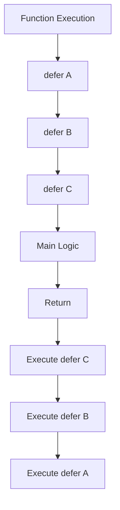

**Common Use Cases**:

Common use cases for defer include resource cleanup (file closing), unlocking mutexes, and panic recovery. See `main.go` lines 452-463 for panic recovery with defer.

**Important: Defer Captures Values at Definition Time**:

Deferred function calls capture the values of their arguments at the time the defer statement is executed, not when the deferred function runs. This is a critical distinction when working with variables that change.

---

### 6. Function Values and Anonymous Functions

Functions are first-class values in Go. You can assign them to variables, pass them as arguments, and return them from other functions. See `main.go` lines 369-377 for anonymous function examples and lines 70-72 for higher-order functions that take functions as parameters.

**Function Values Flow**:
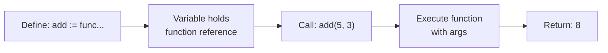

See `main.go` lines 75-79 for functions that return functions (makeMultiplier) and lines 388-394 for usage examples.

---

### 7. Closures and Variable Capture

A closure is a function that captures variables from its enclosing scope. The captured variables persist across multiple calls. See `main.go` lines 82-88 for the counter function example and lines 397-406 for usage demonstrating variable persistence.

**Closure Variable Capture Diagram**:
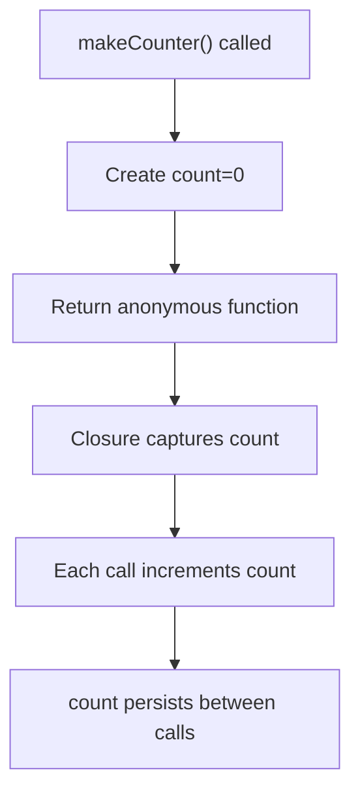

A critical gotcha: loop variables in closures all reference the same variable. The solution is to shadow the variable in each iteration. See the "Common Mistakes" section below for details.

**Closure Scope Visualization**:
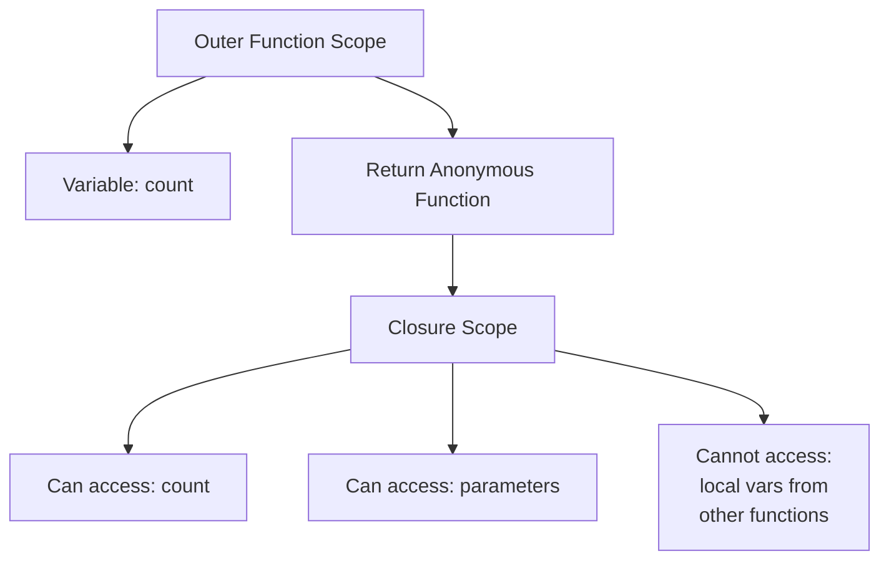

---

### 8. Higher-Order Functions: Map, Filter, and Reduce

Higher-order functions are functions that operate on other functions by taking them as arguments or returning them. These patterns enable functional programming style in Go. See `main.go` lines 109-135 for the implementations and lines 466-493 for usage examples.

**Map, Filter, Reduce Flow**:
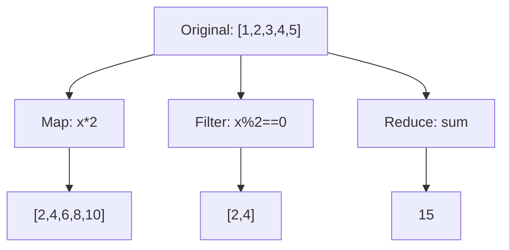

---

### 9. Function Composition

Function composition combines multiple functions into a single function, applying them in sequence. This creates new functions from existing ones without modifying the originals.

**Composition Flow**:
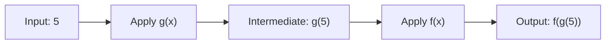

**Right-to-Left vs Left-to-Right**:
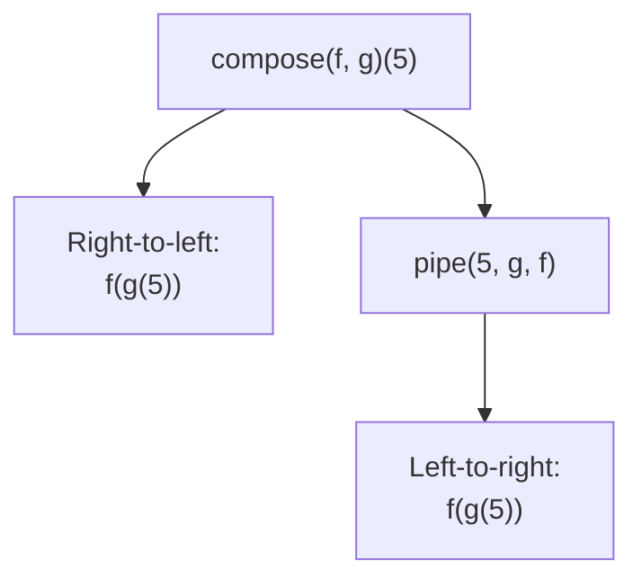

See `main.go` lines 137-151 for the `composeFunc` (right-to-left) and `pipe` (left-to-right) implementations, and lines 727-798 for usage examples showing both approaches.

---

### 10. Currying and Partial Application

Currying converts a multi-argument function into a chain of single-argument functions. Partial application fixes some arguments of a function, returning a new function with fewer parameters.

**Currying Flow**:
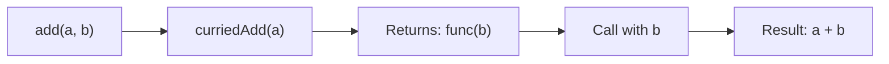

**Currying vs Partial Application**:
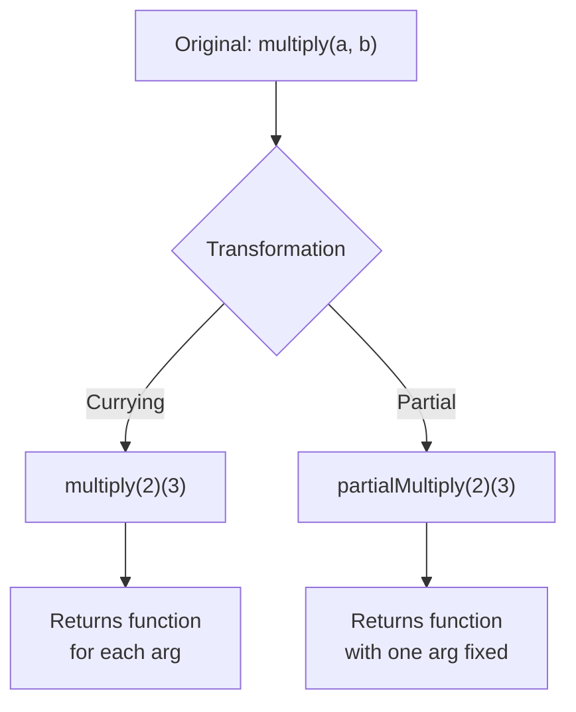

See `main.go` lines 155-172 for implementations of `curriedAdd`, `curriedMultiply`, and `partialMultiply`, with usage examples at lines 800-816.

---

### 11. Decorators and Middleware Pattern

A decorator wraps a function to add behavior before/after execution without modifying the original function. This enables cross-cutting concerns like logging, timing, and caching.

**Decorator Pattern Flow**:
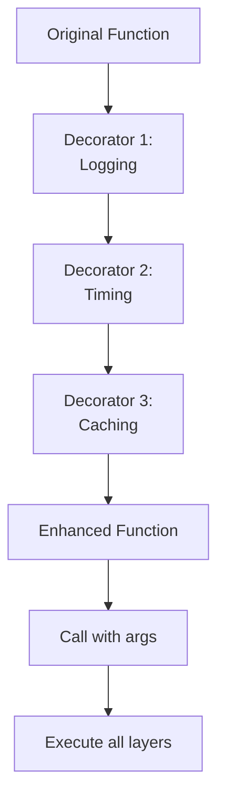

**Chaining Decorators**:
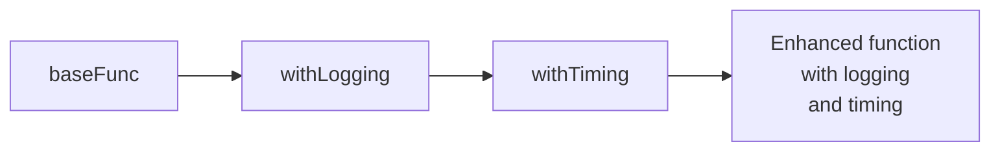

See `main.go` lines 176-217 for implementations of `withLogging`, `withTiming`, `withCache`, and `chainDecorators`, with usage examples at lines 818-850.

---

### 12. Advanced Patterns: Practical Examples

**Pipeline Processing**: Data flows through a series of transformations. Each stage receives the output of the previous stage.

**Pipeline Flow**:
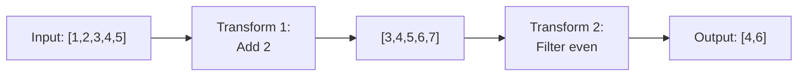

See `main.go` lines 221-227 for the `pipeline` function implementation and lines 852-863 for a practical example of data transformation through multiple stages.

**Strategy Pattern with Higher-Order Functions**: Different algorithms can be swapped at runtime through function types.

**Strategy Selection**:
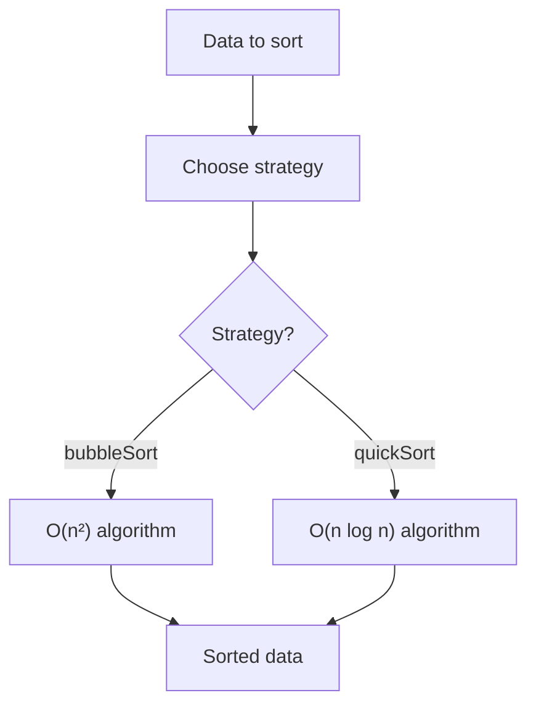

See `main.go` lines 230-272 for the `SortStrategy` type definition with `bubbleSort` and `quickSort` implementations, and lines 865-870 for usage examples.

---

## Best Practices

### Error Handling Pattern
```go
// Always check errors immediately
value, err := someFunction()
if err != nil {
    // log or handle error
    return err
}
// use value
```

### Defer for Resource Management
```go
// Always use defer for cleanup
func processResource() error {
    resource, err := acquireResource()
    if err != nil {
        return err
    }
    defer releaseResource(resource)
    
    // use resource
    return nil
}
```

### Closure Variable Capture
```go
// Always shadow loop variables in closures
for i := 0; i < n; i++ {
    i := i  // shadow to capture value
    go func() {
        // now safe to use i
    }()
}
```

### Function Naming
```go
// Exported functions start with uppercase
func ExportedFunction() { }

// Unexported functions start with lowercase
func unexportedFunction() { }

// Use clear, descriptive names
func calculateTotalPrice(items []Item) float64 { }
func validateEmail(email string) error { }
```

---

## Common Mistakes

### Mistake 1: Forgetting Defer Executes in Reverse Order
```go
// WRONG: Expecting execution order
defer fmt.Println("A")
defer fmt.Println("B")
defer fmt.Println("C")
// Prints: C, B, A (not A, B, C)
```

### Mistake 2: Capturing Loop Variables in Closures
```go
// WRONG: All closures reference the same variable
for i := 0; i < 3; i++ {
    go func() { fmt.Println(i) }()  // all print 3
}

// RIGHT: Shadow the variable
for i := 0; i < 3; i++ {
    i := i
    go func() { fmt.Println(i) }()  // prints 0, 1, 2
}
```

### Mistake 3: Variadic Parameter Not Last
```go
// WRONG: Variadic not last
func process(items ...string, count int) { }

// RIGHT: Variadic must be last
func process(count int, items ...string) { }
```

### Mistake 4: Ignoring Multiple Return Values
```go
// WRONG: Ignoring error
value := someFunction()  // error is ignored

// RIGHT: Check error
value, err := someFunction()
if err != nil {
    // handle error
}
```

### Mistake 5: Writing to Nil Function Variable
```go
// WRONG: Calling nil function
var fn func()
fn()  // panic: runtime error

// RIGHT: Initialize function
fn := func() { fmt.Println("Hello") }
fn()  // OK
```

---

## Part 2: Structs and Methods

### What are Structs?

Structs are the foundation of Go's object-oriented programming. They group multiple fields of different types into a single composite type, allowing you to organize related data together. Unlike traditional OOP languages, Go uses composition and methods on types rather than classes and inheritance.

### 1. Creating Struct Instances

Structs can be instantiated using named fields (recommended) or positional arguments. See `main.go` lines 287-291 for the `Person` struct definition and lines 887-893 for creation examples.

**Key Concepts**:
- **Named fields** - Recommended for clarity and maintainability
- **Positional arguments** - Less readable but valid
- **Zero values** - Uninitialized fields get zero values (empty string, 0, false, nil)

**Struct Creation Flow**:
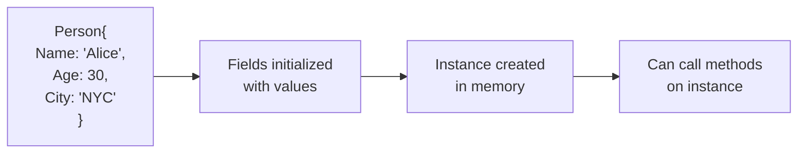

---

### 2. Methods: Functions with Receivers

Methods are functions attached to a type. They have a **receiver** between the `func` keyword and the method name. This allows you to define behavior on your types. See `main.go` lines 294-301 for examples of value and pointer receiver methods.

**Method Syntax**:
```go
func (receiver ReceiverType) MethodName(params) ReturnType {
    // method body
}
```

**Why Methods Matter**:
- Encapsulate behavior with data
- Enable polymorphism through interfaces
- Make code more readable and organized
- Allow Go to feel object-oriented without classes

---

### 3. Value vs Pointer Receivers

This is one of the most important concepts in Go. The choice between value and pointer receivers fundamentally affects how your methods behave and whether they can modify the receiver.

**Decision Guide**:
- **Does the method modify the receiver?** → Use **Pointer Receiver** `func (p *Type)`
- **Is the struct large?** → Consider **Pointer Receiver** to avoid copy overhead
- **Otherwise** → Use **Value Receiver** `func (p Type)`

**Value vs Pointer Receivers Comparison**:
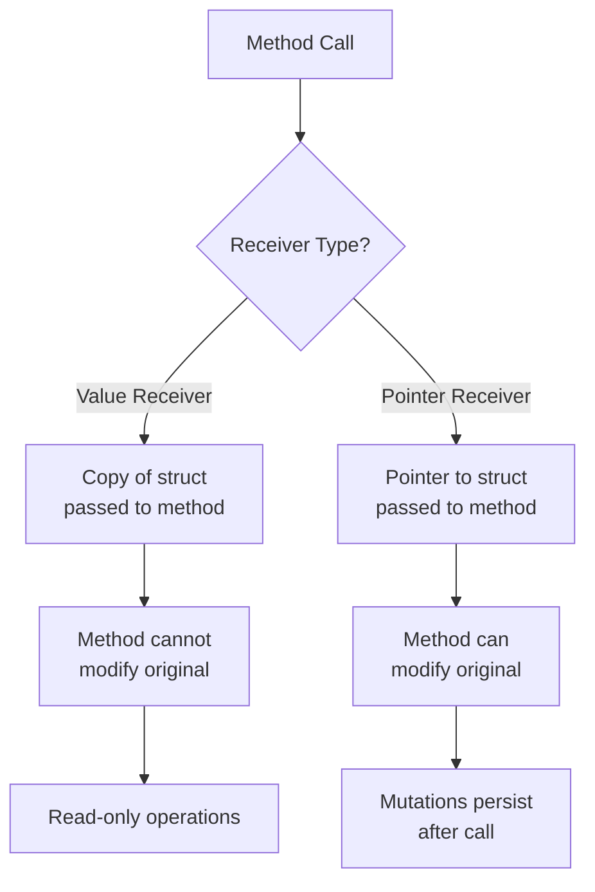

See `main.go` lines 294-301: `Greet()` uses value receiver (read-only), `HaveBirthday()` uses pointer receiver (modifies age). Lines 896-899 show the difference in action.

**Key Insight**: Go automatically handles conversion between values and pointers when calling methods, making the syntax cleaner. You can call a pointer method on a value and vice versa.

---

### 4. Struct Embedding and Composition

Struct embedding allows you to compose types by including one struct inside another. This provides a form of inheritance-like behavior while maintaining Go's simplicity and explicit composition.

**Benefits**:
- **Field promotion** - Embedded struct fields are promoted to the outer type
- **Method promotion** - Embedded struct methods are promoted to the outer type
- **Composition over inheritance** - Go's philosophy for code reuse

**Embedding Flow**:
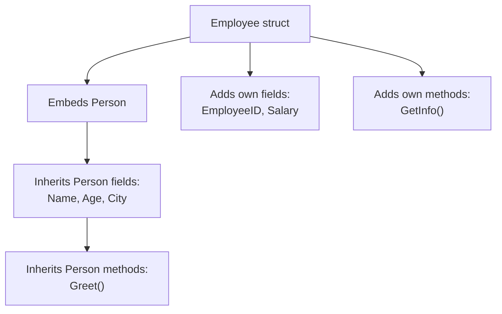

See `main.go` lines 304-308 for the `Employee` struct that embeds `Person`, and lines 902-913 for usage showing field and method promotion.

---

### 5. Struct Tags: Metadata for Serialization

Struct tags provide metadata about fields that can be used by packages like `encoding/json`, `encoding/xml`, and database libraries. Tags are strings that appear after field types and are processed by reflection.

**Common Tags**:
- `json:"fieldname"` - Maps to JSON field name
- `json:"fieldname,omitempty"` - Omits field if empty
- `json:"-"` - Completely ignored during marshaling/unmarshaling
- Multiple tags: `json:"name" db:"person_name" xml:"name"`

See `main.go` lines 316-321 for the `User` struct with JSON tags.

**Tag Processing**:
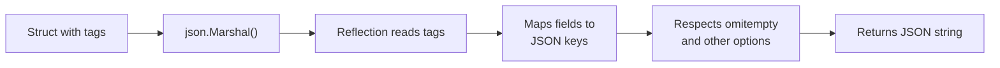

---

### 6. JSON Serialization: Marshaling and Unmarshaling

JSON serialization converts Go structs to/from JSON format. This is essential for APIs, file storage, and data interchange.

**JSON Marshaling** (Struct → JSON):
- Use `json.Marshal()` for compact JSON
- Use `json.MarshalIndent()` for pretty-printed JSON
- Only **exported fields** (capitalized) are marshaled
- See `main.go` lines 916-924 for marshaling example

**JSON Unmarshaling** (JSON → Struct):
- Use `json.Unmarshal()` to populate a struct from JSON
- Requires a pointer to the struct
- Always check errors from json.Unmarshal()
- See `main.go` lines 926-929 for unmarshaling example

**Serialization Flow**:
```mermaid
graph LR
    A["Go Struct<br/>Person{...}"] --> B["json.Marshal()"]
    B --> C["JSON String<br/>'{...}'"]
    C --> D["json.Unmarshal()"]
    D --> E["Go Struct<br/>Person{...}"]
```

---

## Part 3: Core Best Practices

### Error Handling Pattern
Always check errors immediately after function calls. Multiple return values are Go's idiomatic way to handle errors.

### Defer for Resource Management
Use defer to guarantee resource cleanup even when errors occur.

### Closure Variable Capture
Shadow loop variables in closures to capture values correctly.

### Receiver Consistency
Choose pointer or value receivers consistently within a type's method set.

### Interface-Based Design
Depend on interfaces, not concrete types, to enable testing and flexibility.

### Composition Over Inheritance
Use struct embedding to compose types rather than relying on inheritance hierarchies.

---

## Part 4: Design Patterns in Go

Design patterns are reusable solutions to common programming problems. Go's simplicity and focus on interfaces make certain patterns particularly elegant.

### 1. Dependency Injection

**Purpose**: Decouple components by passing dependencies as parameters rather than having components create their own dependencies.

**When to use**: When you need flexibility, testability, or want to swap implementations.

**Pattern Flow**:
```mermaid
graph LR
    A["Service needs<br/>Logger"] --> B["Pass Logger<br/>as parameter"]
    B --> C["Service receives<br/>Logger interface"]
    C --> D["Can use any<br/>Logger implementation"]
    D --> E["Easy to test<br/>with mock Logger"]
```

See `main.go` lines 327-348: `UserService` receives a `Logger` interface, allowing different logger implementations without changing the service.

---

### 2. Builder Pattern

**Purpose**: Construct complex objects step by step with a fluent API, making code more readable and maintainable.

**When to use**: When creating objects with many optional fields or complex initialization logic.

**Pattern Flow**:
```mermaid
graph LR
    A["NewQueryBuilder()"] --> B["Where()"]
    B --> C["Limit()"]
    C --> D["Offset()"]
    D --> E["Build()"]
    E --> F["Complete query<br/>string"]
```

See `main.go` lines 350-386: `QueryBuilder` allows chaining methods to build a SQL query incrementally.

---

### 3. Functional Options Pattern

**Purpose**: Provide flexible configuration without breaking existing APIs. Each option is a function that modifies a config struct.

**When to use**: When you need many optional parameters or want to add new options without changing function signatures.

**Pattern Flow**:
```mermaid
graph TD
    A["NewServer(opts...)"] --> B["Create default<br/>config"]
    B --> C["For each option"]
    C --> D["Call option function"]
    D --> E["Option modifies<br/>config"]
    E --> F["Return configured<br/>server"]
```

See `main.go` lines 388-427: `NewServer()` accepts option functions like `WithPort()` and `WithHost()` to configure the server flexibly.

---

### 4. Singleton Pattern

**Purpose**: Ensure a type has only one instance throughout the application lifetime.

**When to use**: For shared resources like database connections, configuration managers, or loggers.

**Pattern Flow**:
```mermaid
graph TD
    A["GetInstance()"] --> B["sync.Once ensures<br/>single execution"]
    B --> C{Instance exists?}
    C -->|No| D["Create instance"]
    D --> E["Store globally"]
    C -->|Yes| F["Return existing<br/>instance"]
    E --> F
```

See `main.go` lines 429-444: `GetInstance()` uses `sync.Once` to guarantee only one `Singleton` instance is created.

---

### 5. Factory Pattern

**Purpose**: Create objects without specifying their concrete types. The factory decides which concrete type to instantiate.

**When to use**: When you have multiple implementations of an interface and need to choose which one to create.

**Pattern Flow**:
```mermaid
graph TD
    A["NewDatabase(dbType)"] --> B{dbType?}
    B -->|postgres| C["Create PostgresDB"]
    B -->|mysql| D["Create MySQLDB"]
    C --> E["Return Database<br/>interface"]
    D --> E
```

See `main.go` lines 446-474: `NewDatabase()` factory creates different database implementations based on the type string.

---

### 6. Observer Pattern

**Purpose**: Define a one-to-many relationship where multiple observers listen for events from a subject.

**When to use**: For event-driven architectures, pub-sub systems, or when multiple components need to react to state changes.

**Pattern Flow**:
```mermaid
graph TD
    A["Subject"] --> B["Attach observers"]
    B --> C["Observer 1"]
    B --> D["Observer 2"]
    B --> E["Observer 3"]
    A --> F["Notify event"]
    F --> C
    F --> D
    F --> E
```

See `main.go` lines 476-501: `Subject` maintains a list of observers and notifies them when events occur.

---

### 7. Strategy Pattern

**Purpose**: Encapsulate interchangeable algorithms so they can be selected at runtime.

**When to use**: When you have multiple ways to accomplish a task and need to choose between them dynamically.

**Pattern Flow**:
```mermaid
graph TD
    A["Order"] --> B["Set payment<br/>strategy"]
    B --> C{Strategy?}
    C -->|CreditCard| D["Process credit<br/>card payment"]
    C -->|PayPal| E["Process PayPal<br/>payment"]
    D --> F["Execute payment"]
    E --> F
```

See `main.go` lines 503-532: `Order` uses different `PaymentStrategy` implementations to process payments.

---

### 8. Repository Pattern

**Purpose**: Abstract data access logic behind an interface, decoupling business logic from data storage implementation.

**When to use**: When you want to switch data sources (database, file, cache) without changing business logic.

**Pattern Flow**:
```mermaid
graph TD
    A["Business Logic"] --> B["UserRepository<br/>interface"]
    B --> C{Implementation?}
    C -->|InMemory| D["In-memory storage"]
    C -->|Database| E["SQL database"]
    C -->|Cache| F["Redis cache"]
    D --> G["Return User"]
    E --> G
    F --> G
```

See `main.go` lines 534-566: `UserRepository` interface abstracts data access, with `InMemoryUserRepository` as one implementation.

---

### SOLID Principles

These principles guide good design in Go:

- **Single Responsibility**: Each type should have one reason to change
- **Open/Closed**: Open for extension, closed for modification
- **Liskov Substitution**: Subtypes should be substitutable for their base types
- **Interface Segregation**: Depend on small, focused interfaces
- **Dependency Inversion**: Depend on abstractions, not concrete types

---

## Further Reading
- [Go by Example: Functions](https://gobyexample.com/functions) - Function declaration and calls
- [Go by Example: Multiple Return Values](https://gobyexample.com/multiple-return-values) - Error handling patterns
- [Go by Example: Variadic Functions](https://gobyexample.com/variadic-functions) - Variable argument functions
- [Go by Example: Closures](https://gobyexample.com/closures) - Function closures and variable capture
- [Go by Example: Defer](https://gobyexample.com/defer) - Deferred function calls
- [Go by Example: Structs](https://gobyexample.com/structs) - Struct definition and usage
- [Go by Example: Methods](https://gobyexample.com/methods) - Methods on types
- [JSON and Go](https://go.dev/blog/json) - JSON serialization best practices
- [Effective Go: Interfaces](https://go.dev/doc/effective_go#interfaces_and_other_types) - Interface design patterns
- [Effective Go: Functions](https://go.dev/doc/effective_go#functions) - Function idioms and best practices
- [Go Blog: Defer, Panic, and Recover](https://go.dev/blog/defer-panic-and-recover) - Advanced defer patterns
