# Day 4: Pointers and Interfaces

## Learning Objectives

- Understand pointers and pointer syntax (`&` and `*`)
- Learn when to use pointers vs values
- Understand the `new` and `make` functions
- Grasp Go's garbage collection basics
- Work with pointers to structs and slices
- Understand pointer receivers and method receivers
- Define and implement interfaces
- Work with the empty interface (`interface{}`)
- Perform type assertions and type switches
- Understand the `error` interface
- Use interfaces for polymorphism and abstraction
- Organize code into packages and manage dependencies
- Understand exported/unexported identifiers

---

## Part 1: Pointers and Memory Management

### What is a Pointer? (Beginner's Guide)

Think of a pointer as a **forwarding address**. When you have a variable like `x := 42`, that value lives somewhere in your computer's memory at a specific address. A pointer is simply a variable that holds that address.

In real life:
- **Variable**: A mailbox with a value inside (e.g., the number 42)
- **Pointer**: A note that says "the mailbox is at address 0x1234"
- **Address-of (`&`)**: Getting the address of the mailbox
- **Dereference (`*`)**: Opening the mailbox to see what's inside

This is powerful because it allows you to:
1. **Modify values in functions** - Pass the address, not a copy
2. **Share data efficiently** - Multiple pointers can reference the same value
3. **Build complex data structures** - Like linked lists and trees

### 1. Pointer Basics

Every variable in Go lives at a specific memory address. You can get that address with the `&` (address-of) operator. A pointer is simply a variable that stores this address.

See `main.go` lines 128-142 for a working example of pointer basics.

**Key Concepts**:
- **Pointer declaration**: `var p *int` (pointer to int)
- **Address-of operator**: `&x` (get address of x)
- **Dereference operator**: `*p` (get value at address p)
- **Nil pointer**: `var p *int` (uninitialized, equals nil)

**Memory Model Diagram**:

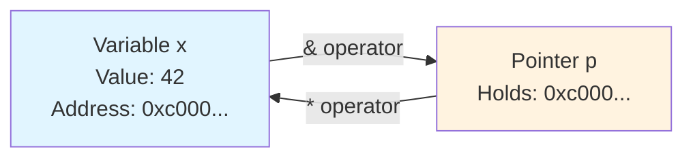

This diagram shows how a variable `x` lives at a memory address, and a pointer `p` holds that address. The `&` operator gets the address, and the `*` operator dereferences it to access the value.

### 2. The `&` and `*` Operators

These two operators are the foundation of pointer work in Go. They form a complementary pair: `&` creates pointers, and `*` dereferences them.

**The `&` Operator (Address-of)** gets the memory address of a variable. When you write `&x`, you're saying "give me the memory address where `x` is stored."

**The `*` Operator (Dereference)** accesses the value at a memory address. When you write `*p`, you're saying "give me the value stored at the address that `p` points to."

See `main.go` lines 131-141 for practical examples of these operators in action.

**Operator Flow Diagram**:

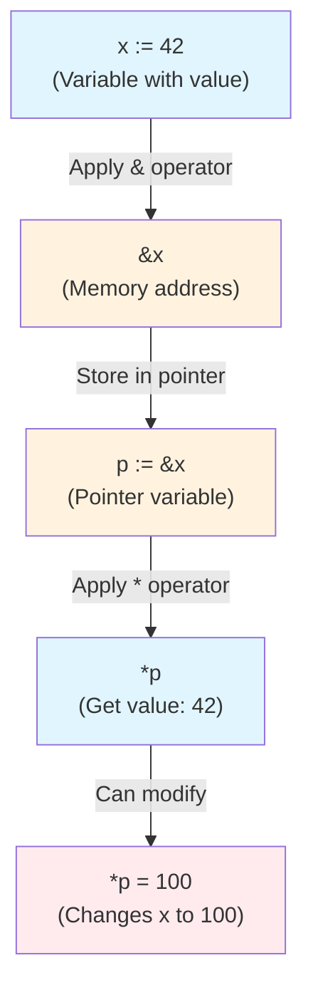

**Key Patterns**:

1. **Declaring pointers to different types**: `var pInt *int`, `var pStr *string`, `var pBool *bool`
2. **Declaring and initializing**: `x := 10; p := &x`
3. **Modifying through pointer**: `*p = 20` changes the original variable
4. **Comparing pointers**: `pA == pB` checks if they point to the same address; `*pA == *pB` checks if the values are equal

See `main.go` lines 131-141 for these patterns demonstrated.

### 3. Pointers to Structs

Pointers to structs are extremely common in Go. One of Go's conveniences is that it automatically dereferences struct pointers when accessing fields—you don't need to write `(*p).Name`, you can just write `p.Name`.

See `main.go` lines 145-156 for a working example of pointers to structs.

**Why Pointers to Structs Matter**:
- **Efficiency**: Large structs can be expensive to copy. Passing a pointer avoids copying the entire struct.
- **Modification**: If you want a function to modify a struct, you must pass a pointer.
- **Shared state**: Multiple pointers can reference the same struct, allowing shared data.

**Auto-Dereference Behavior**:

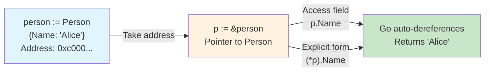

Go's auto-dereference feature makes working with struct pointers feel natural and readable.

### 4. The `new` Function

The `new` function allocates memory for a type and returns a pointer to it. The allocated memory is initialized to the type's zero value (0 for integers, empty string for strings, nil for pointers, etc.).

See `main.go` lines 160-173 for examples of using `new()`.

**When to Use new()**:
- Allocating a single value of a primitive type
- Creating a pointer to a struct
- When you want a pointer but don't have an existing variable to take the address of

**new() vs Literal Initialization**:

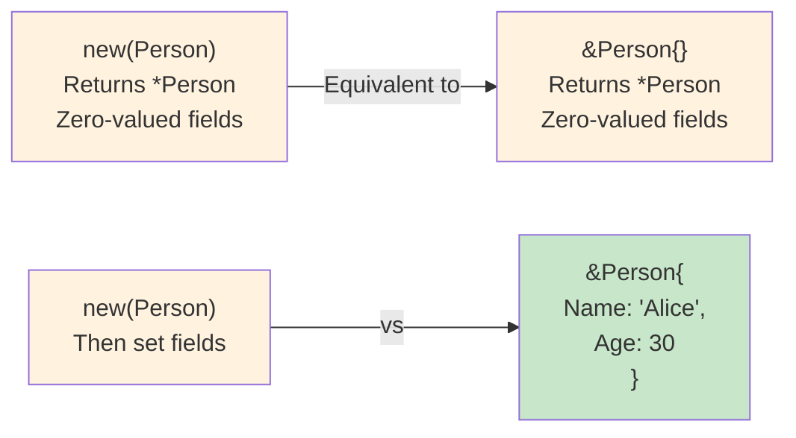

Using literal initialization (`&Person{...}`) is generally preferred when you have values to set, as it's more concise and clear. Use `new()` when you need a pointer but will set fields later.

### 5. The `make` Function

The `make` function allocates and initializes slices, maps, and channels. Unlike `new()`, `make()` returns the value itself, not a pointer. It also fully initializes the data structure (unlike `new()` which just zero-values it).

See `main.go` lines 177-190 for examples of using `make()` with slices, maps, and channels.

**Key Differences Between new() and make()**:

| Aspect | new() | make() |
|--------|-------|--------|
| **Returns** | Pointer (*T) | Value (T) |
| **Initialization** | Zero-valued | Fully initialized |
| **Use cases** | Structs, primitives | Slices, maps, channels |
| **Example** | `new(int)` → `*int` | `make([]int, 5)` → `[]int` |

**Decision Tree**:

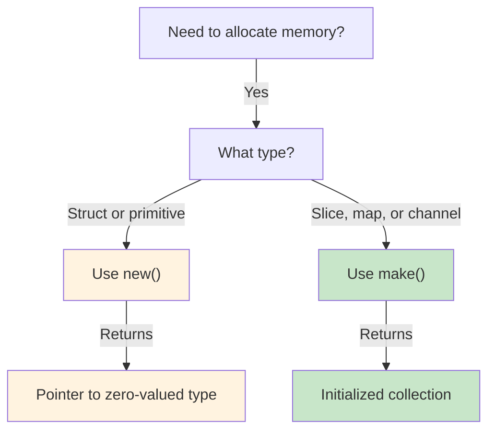

This decision tree helps you choose the right allocation function for your use case.

### 6. Garbage Collection

Go's garbage collector automatically manages memory, freeing values that are no longer referenced. This means you don't need to manually free memory like in C/C++.

**Key Points**:
- **Stack allocation**: Fast, automatically freed
- **Heap allocation**: Slower, managed by GC
- **Escape analysis**: Compiler decides automatically
- **No manual memory management**: GC handles cleanup

### 7. When to Use Pointers

Choosing between pointers and values is a key design decision. Here's a practical guide:

**Use Pointers When**:
1. **Modifying values in functions** - If a function needs to change the caller's data, use a pointer parameter
2. **Large structs** - Avoid copying overhead by passing a pointer instead of the entire struct
3. **Implementing methods that modify state** - Use pointer receivers for methods that change the receiver's fields
4. **Shared references** - When multiple parts of your code need to reference the same data

**Use Values When**:
1. **Small, immutable data** - Copying small values (integers, strings, small structs) is efficient
2. **You want to prevent accidental modification** - Value receivers ensure the original can't be changed
3. **Semantically a copy** - When the function logically works with a copy, not the original

See `main.go` lines 194-204 for examples of pointer receivers in action with the `Counter` type.

**Pointer Receiver vs Value Receiver Decision**:

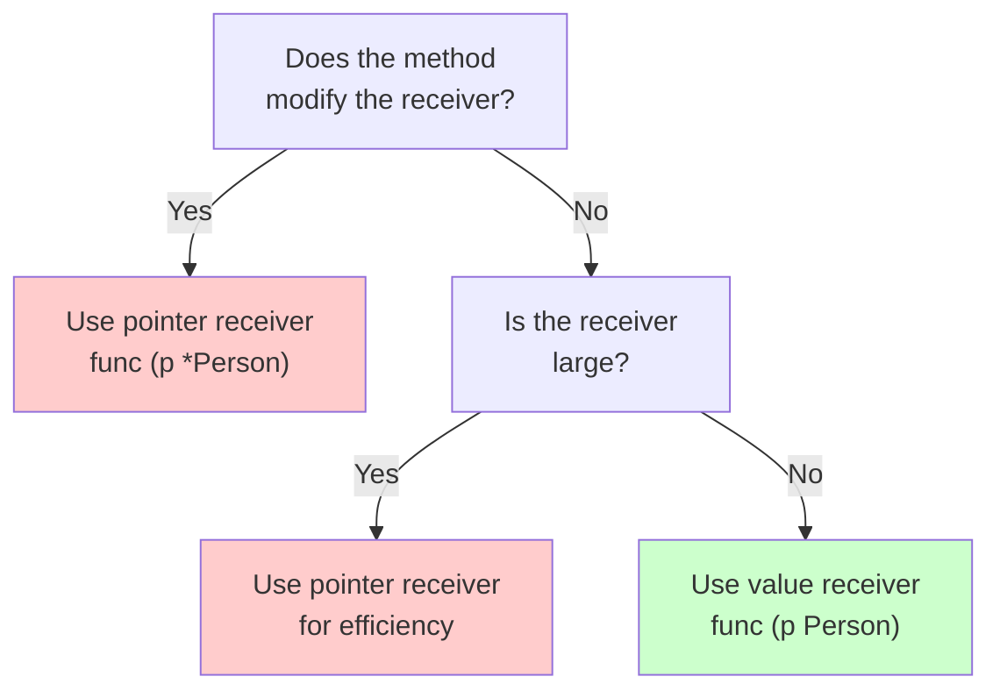

This decision tree helps you choose the right receiver type for your methods.

### 8. Common Mistakes

**Dereferencing Nil Pointers**: This causes a panic—always check before dereferencing:

A nil pointer is a pointer that doesn't point to any valid memory. Dereferencing it (trying to access the value) will crash your program.

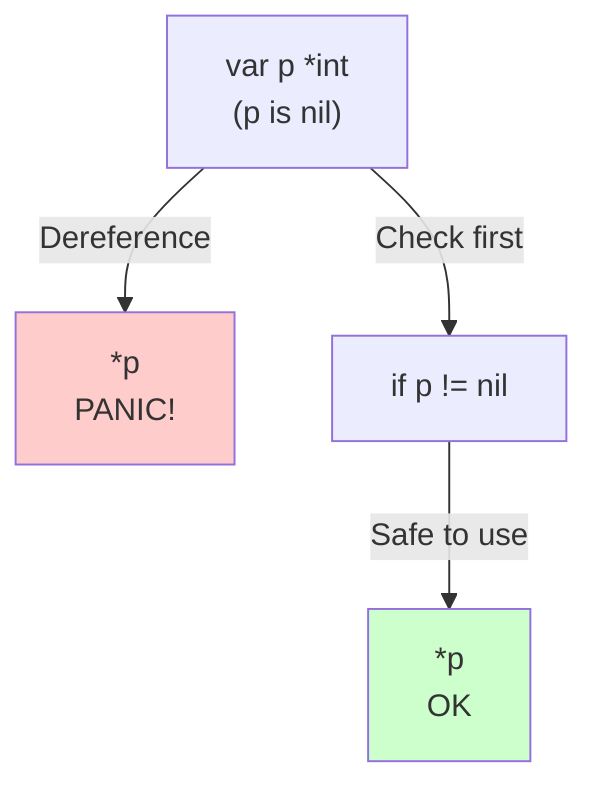

Always validate pointers before using them, especially when they come from function returns or external sources.

**Confusing new() and make()**: Remember the rule: `new()` for types, `make()` for slices/maps/channels.

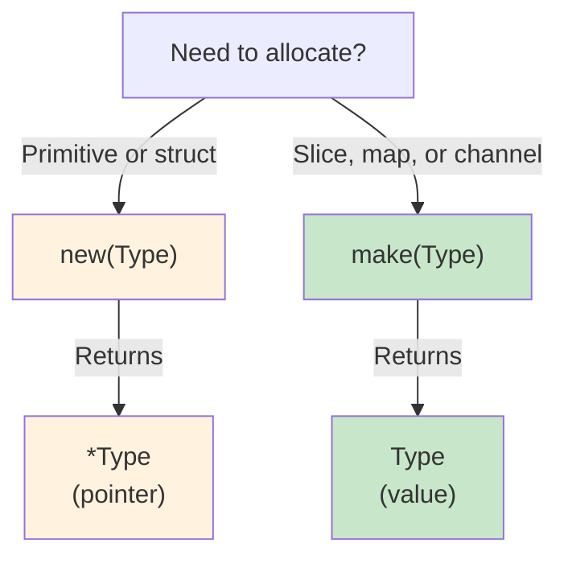

Using the wrong function will either cause a compile error or create an uninitialized value.

---

## Part 2: Interfaces

### What is an Interface? (Beginner's Guide)

Think of an interface as a **contract** or **promise**. It says: "If you implement these methods, you can be used wherever I expect this interface."

In Go, you don't explicitly say "I implement this interface." Instead, Go automatically recognizes that your type implements an interface if it has all the required methods. This is called **implicit implementation**.

### 1. Interface Definition

Interfaces define a set of method signatures. An interface is just a contract—a list of methods that a type must have to satisfy the interface. Any type that has all the required methods automatically implements the interface.

See `main.go` lines 24-44 for interface definitions and implementations.

**Interface Implementation Diagram**:

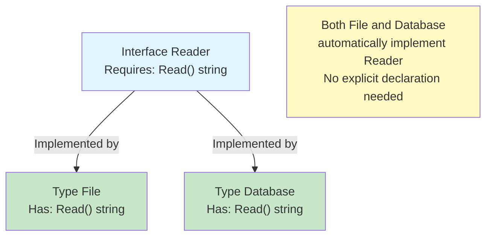

This is Go's **implicit implementation**—one of its most powerful features. You don't need to explicitly say "I implement this interface." If your type has the required methods, it automatically implements the interface.

### 2. Implicit Implementation - How It Works

Go's implicit implementation means that any type with the required methods automatically satisfies an interface, without needing an explicit declaration.

See `main.go` lines 24-44 for concrete examples:
- `File` type with `Read()` method (line 28-35)
- `Database` type with `Read()` method (line 37-44)

Both types automatically implement the `Reader` interface because they both have a `Read()` method that returns a string. No explicit declaration is needed.

### 3. Using Interfaces

A function that accepts an interface parameter can work with **any type that implements that interface**. This is the power of interfaces—you write code that works with many different types without knowing their specific details.

See `main.go` lines 46-48 for the `printContent()` function that accepts a `Reader` interface, and lines 219-223 for how it's used with different types.

**Polymorphism Through Interfaces**:

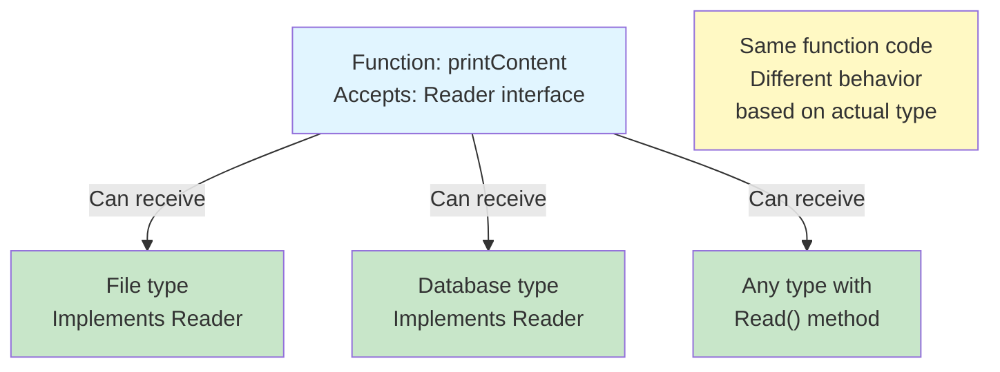

**Why is this powerful?**
- The function doesn't need to know about specific types like `File` or `Database`
- You can add new types (like `API`, `Cache`, `Network`, etc.) that implement `Reader`, and `printContent()` works with them automatically
- This is called **polymorphism**—one function works with many different types
- It enables loose coupling and makes code more maintainable and extensible

See `main.go` lines 219-223 for practical examples of polymorphism in action.

### 4. Interface Composition

Interfaces can be composed of other interfaces. This allows you to build larger interfaces from smaller, focused ones—a principle called **interface segregation**.

See `main.go` lines 79-101 for examples of interface composition with `Reader`, `Writer`, and `ReadWriter` interfaces.

**Interface Composition Diagram**:

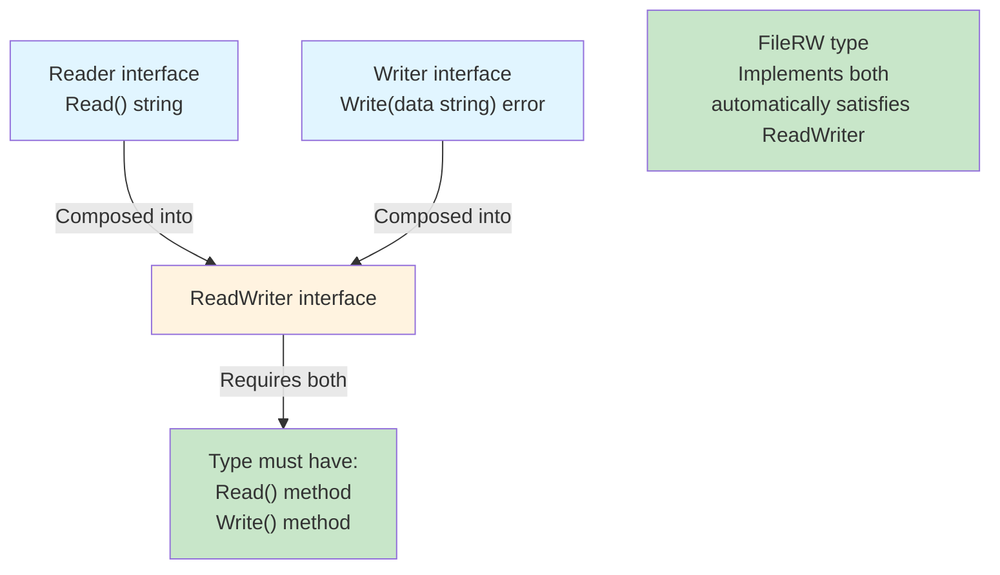

`ReadWriter` requires both `Read()` and `Write()` methods. Any type that implements both `Reader` and `Writer` automatically implements `ReadWriter`. This composition approach makes interfaces more flexible and reusable.

### 5. Empty Interface

The empty interface `interface{}` can hold **any value** because it has no methods to implement. Every type in Go implements the empty interface, making it a universal container.

See `main.go` lines 227-243 for examples of storing different types in an empty interface.

**Empty Interface Flexibility**:

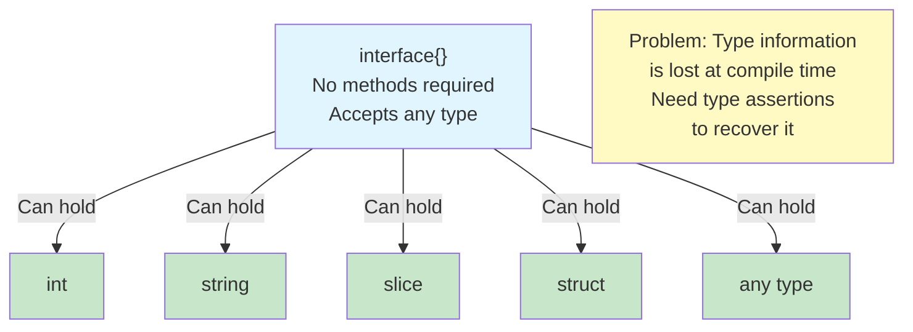

**Trade-off**: While the empty interface is flexible, you lose type safety. You must use type assertions or type switches to recover the actual type and use the value safely.

### 6. Type Assertions - Getting the Real Type Back

When you have a value in an `interface{}`, you can extract the concrete type using a **type assertion**. The syntax is `value.(Type)`, which returns two values: the extracted value and a boolean indicating success.

See `main.go` lines 247-261 for examples of type assertions in action.

**Type Assertion Decision Flow**:

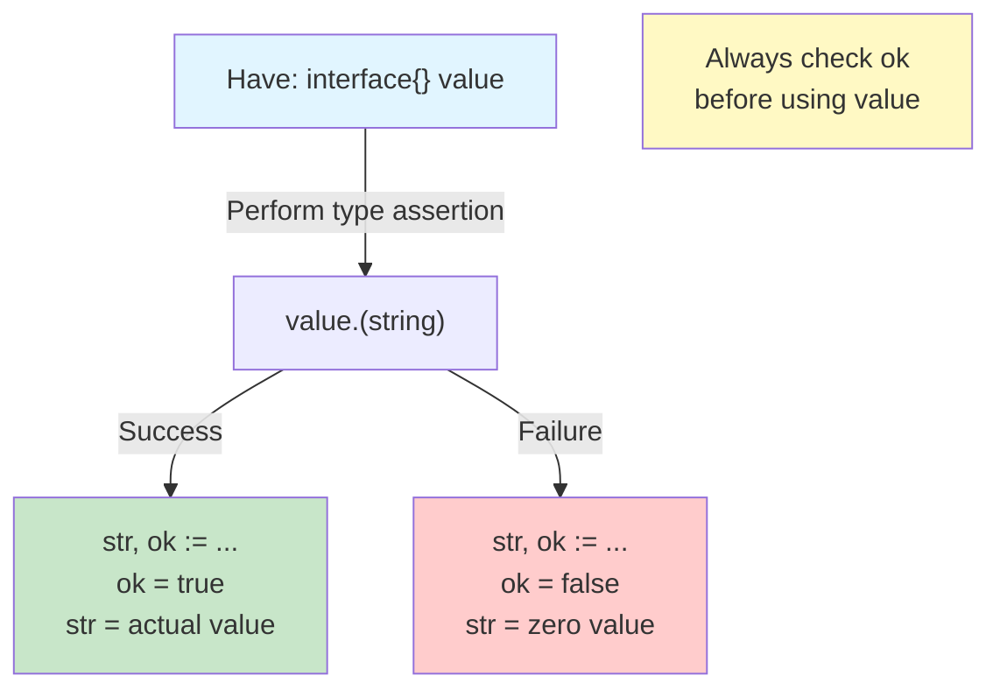

**Best Practice**: Always use the two-value form (`value, ok := i.(Type)`) to safely check if the assertion succeeded. Never use the single-value form without checking, as it will panic if the type is wrong.

### 7. Type Switches - Handling Multiple Types

A **type switch** lets you handle different types in one place using a switch statement on the type. The syntax is `switch val := v.(type)`, which extracts the type and value simultaneously.

See `main.go` lines 50-61 for the `describe()` function and lines 265-271 for how it's called with different types.

**Type Switch Flow**:

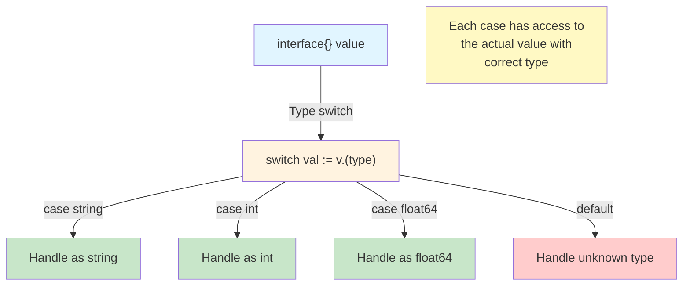

Type switches are more convenient than multiple type assertions when you need to handle many different types. They're cleaner and more readable than a series of `if ok` checks.

### 8. The Error Interface

Go has a built-in `error` interface that's central to Go's error handling philosophy:

```go
type error interface {
    Error() string
}
```

Any type with an `Error()` method that returns a string automatically implements the `error` interface. This allows you to create custom error types that provide more context than simple strings.

See `main.go` lines 63-77 for examples of custom error types and how they're used.

**Custom Error Implementation**:

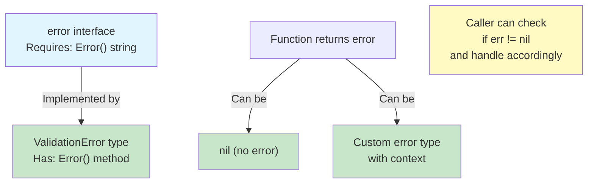

Custom errors allow you to:
- Provide detailed error messages with context
- Include structured data about what went wrong
- Enable callers to inspect error details if needed
- Maintain Go's idiomatic error handling pattern

### 9. Practical Example: Polymorphism in Action

Here's a real-world example showing how interfaces enable flexible, extensible code. A payment system that works with multiple payment methods:

See `main.go` lines 103-325 for a complete payment system example with:
- `PaymentMethod` interface (line 103-105)
- `CreditCard` type implementing `PaymentMethod` (lines 107-114)
- `PayPal` type implementing `PaymentMethod` (lines 116-123)
- Using multiple payment methods in a loop (lines 318-325)

**Polymorphic Payment Processing**:

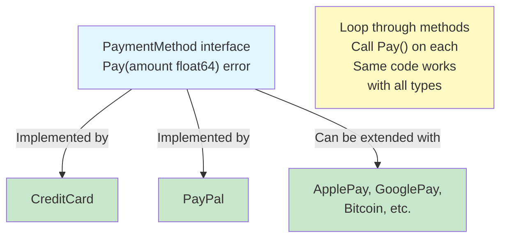

**Why This Design is Powerful**:
- **Extensibility**: Add new payment methods (Apple Pay, Bitcoin, etc.) without changing the loop code
- **Decoupling**: The payment processing code doesn't know about specific payment types
- **Testability**: Easy to create mock payment methods for testing
- **Maintainability**: Each payment method is isolated in its own type

### 10. Common Gotchas

**Pointer Receivers vs Value Receivers in Interfaces**:

This is a subtle but important distinction. When you define a method with a pointer receiver, only pointers to that type satisfy an interface requiring that method. Value receivers work with both values and pointers.

See `main.go` lines 88-101 for examples of `FileRW` with both value receiver (`Read()`) and pointer receiver (`Write()`).

**Receiver Type Impact on Interface Satisfaction**:

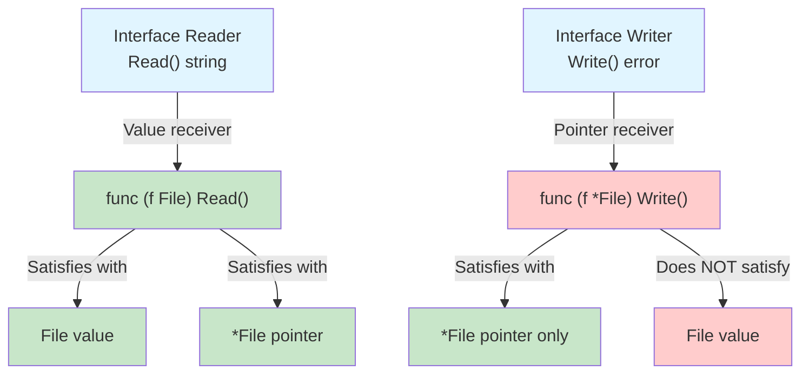

**Rule of thumb**: If a method modifies the receiver, use a pointer receiver. If it only reads, use a value receiver. This ensures the interface is satisfied by the types that can actually use it.

**Interface Segregation Principle**:

Design interfaces to be small and focused, not large and monolithic. Small interfaces are easier to implement, test, and compose.

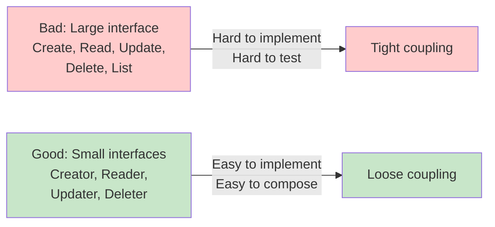

See the `Reader` and `Writer` interfaces in `main.go` lines 24-86 as examples of focused, segregated interfaces.

---

## Part 3: Packages and Modules

### What is a Package?

A package is a directory containing Go source files. All files in the same directory must belong to the same package. Packages are Go's primary mechanism for organizing code and controlling visibility.

### Exported vs Unexported: Visibility and Encapsulation

Go uses a simple rule for visibility: **capitalization**. This is one of Go's most elegant design decisions—no need for `public`, `private`, or `protected` keywords.

- **Exported**: Starts with uppercase (e.g., `Println`, `Add`, `User`)
  - Accessible from other packages
  - Part of the public API
  - Should be documented
  
- **Unexported**: Starts with lowercase (e.g., `helper`, `calculate`, `user`)
  - Only accessible within the same package
  - Implementation details
  - Not part of the public API

See `main.go` lines 301-311 for examples of exported and unexported identifiers.

**Visibility Decision Diagram**:

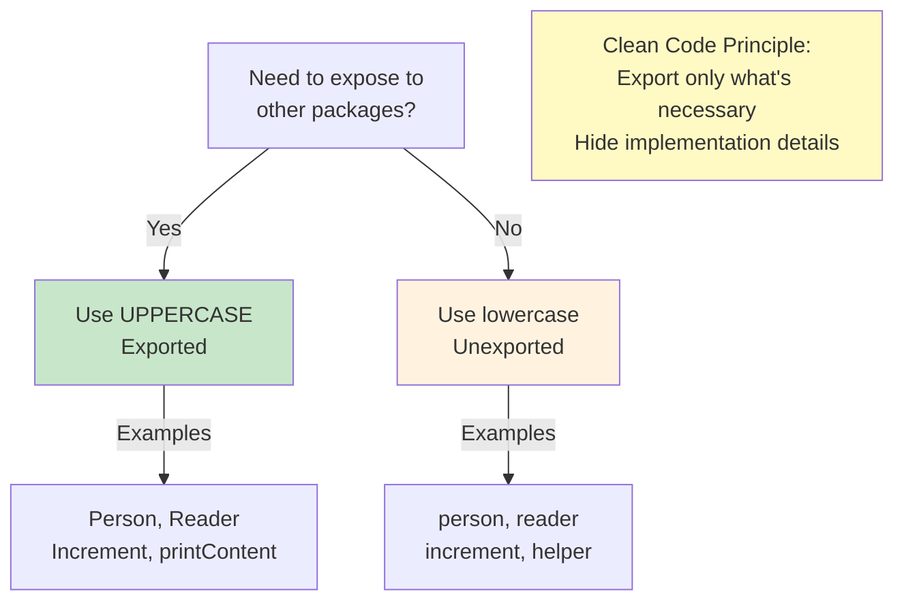

**Best Practice**: Use unexported identifiers as your default. Only export what's necessary for your public API. This keeps your API surface small and makes it easier to maintain backward compatibility.

### Go Modules: Modern Dependency Management

Go Modules provide a standardized way to manage dependencies and versions. They replaced the older GOPATH system and are now the standard way to organize Go projects.

**Module Structure**:

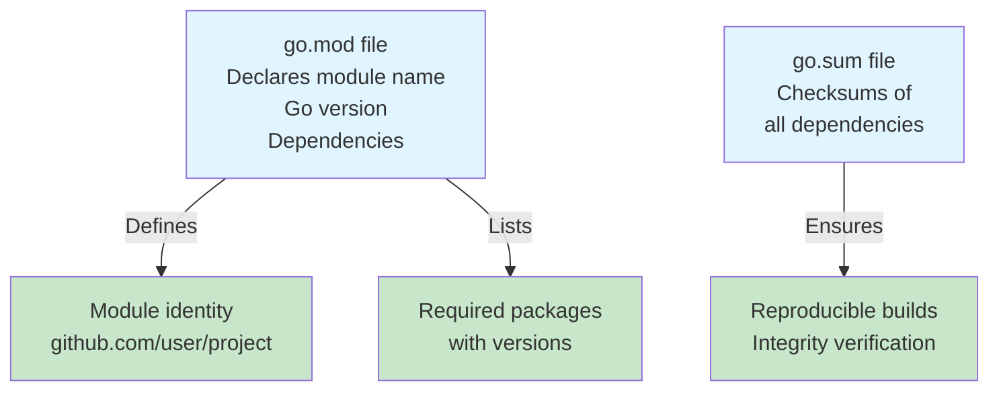

**Common Module Commands**:
- `go mod init github.com/username/projectname` - Initialize a new module
- `go mod tidy` - Add missing and remove unused dependencies
- `go mod download` - Download dependencies to local cache
- `go get github.com/user/package@v1.2.3` - Get a specific version
- `go get -u ./...` - Update all dependencies

### Importing Packages

Packages are imported using their full module path. Go's import system is straightforward and hierarchical.

**Import Organization Best Practice**:

```mermaid
graph TD
    A["Import statement"] -->|"Standard library"| B["fmt, io, os"]
    A -->|"Third-party"| C["github.com/user/package"]
    A -->|"Local packages"| D["./internal/util"]
    
    E["Group imports:<br/>1. Standard library<br/>2. Third-party<br/>3. Local<br/>Separate with blank lines"]
    
    style B fill:#c8e6c9
    style C fill:#c8e6c9
    style D fill:#c8e6c9
    style E fill:#fff9c4
```

**Import Aliases** allow you to rename packages to avoid conflicts or improve readability:
```go
import (
    f "fmt"
    m "math"
)
// Usage: f.Println("Hello"), result := m.Sqrt(16)
```

This is useful when two packages have the same name or when you want shorter names for frequently used packages.

---

## Key Takeaways

**Memory and Pointers**:
1. **Pointers hold memory addresses** - Use `&` to get an address, `*` to dereference and access the value
2. **Pointer receivers enable modification** - Methods with pointer receivers can modify the receiver's state
3. **new() vs make()** - Use `new()` for structs/primitives (returns pointer), `make()` for slices/maps/channels (returns value)
4. **Always check for nil** - Dereferencing a nil pointer causes a panic; validate before use

**Interfaces and Polymorphism**:
5. **Interfaces define contracts** - Any type with the required methods automatically implements the interface
6. **Implicit implementation** - No explicit "implements" declaration needed; Go checks method signatures
7. **Interface composition** - Build larger interfaces from smaller, focused ones for flexibility
8. **Empty interface** - `interface{}` accepts any value but loses type safety; use type assertions to recover types
9. **Type assertions and switches** - Extract concrete types from interface values safely

**Code Organization**:
10. **Capitalization controls visibility** - Uppercase = exported (public API), lowercase = unexported (internal)
11. **Interface segregation** - Design small, focused interfaces that are easy to implement and compose
12. **Packages and modules** - Organize code into packages; use `go.mod` for dependency management

See `main.go` for working examples of all these concepts in action.

---

## Further Reading

- [Go by Example: Pointers](https://gobyexample.com/pointers) - Pointer basics and usage
- [Go by Example: Interfaces](https://gobyexample.com/interfaces) - Interface definition and implementation
- [Effective Go: Interfaces](https://go.dev/doc/effective_go#interfaces) - Interface design principles
- [Effective Go: Allocation with new](https://go.dev/doc/effective_go#allocation_new) - Memory allocation patterns
- [Effective Go: Allocation with make](https://go.dev/doc/effective_go#allocation_make) - Slice, map, and channel initialization
