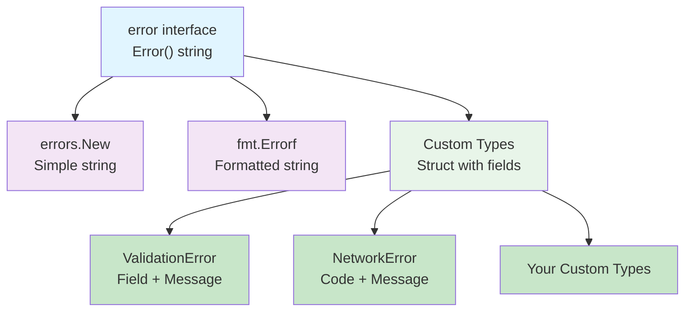
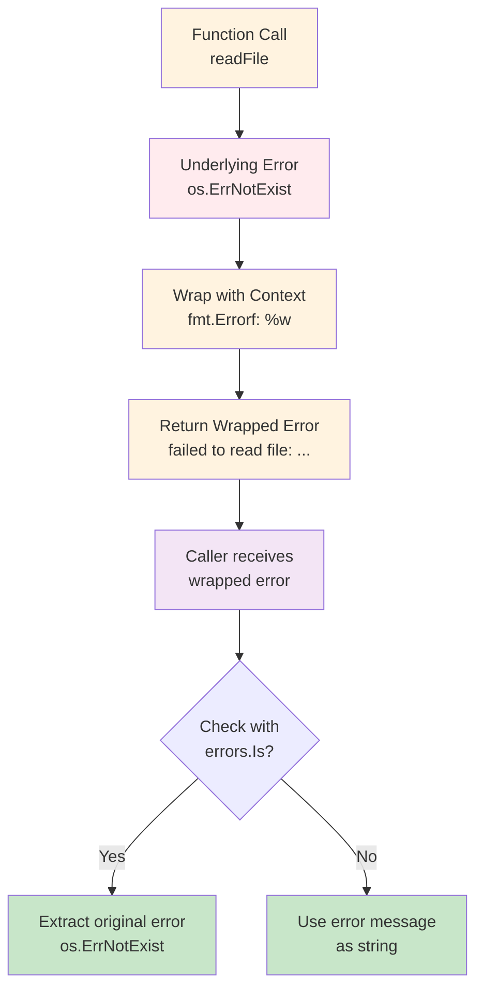
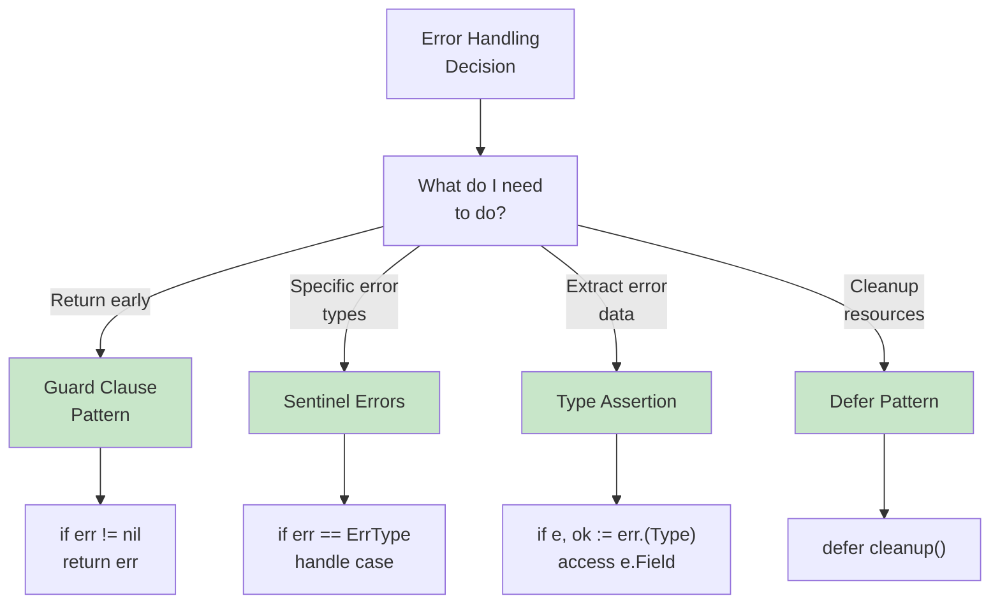
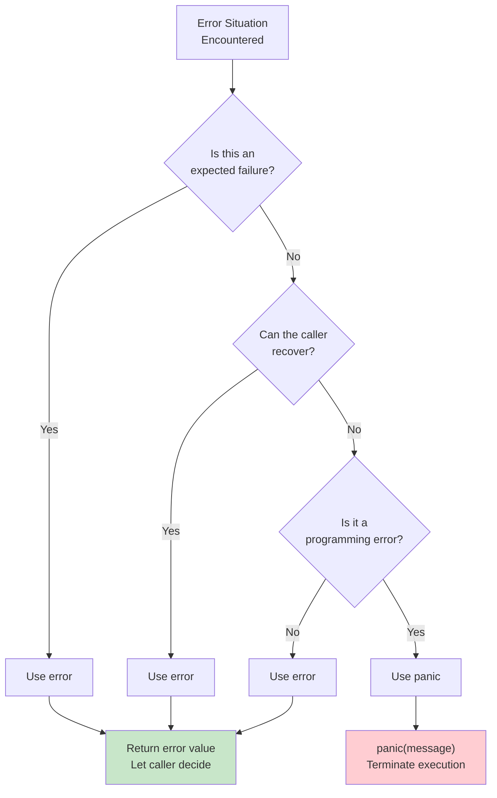
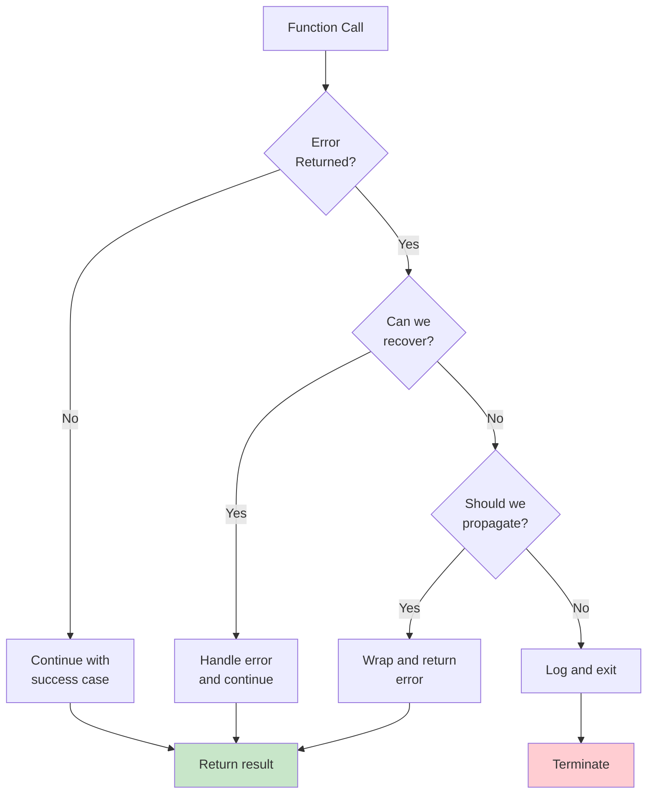

# Day 5: Error Handling, Logging and Project Structure

## Learning Objectives

### Error Handling Fundamentals
- Master idiomatic error handling with multiple return values
- Understand the `error` interface and implement custom error types
- Distinguish between errors (expected failures) and panics (unrecoverable errors)

### Error Patterns & Best Practices
- Implement error wrapping and context for better debugging
- Apply practical error handling patterns (guard clauses, sentinel errors, custom types)
- Use `panic` and `recover` appropriately for unrecoverable scenarios
- Write robust, maintainable error handling code following Go idioms

### Project Structure
- Understand project structure and best practices
- Organize code into packages effectively

### Observability
- Implement structured logging for better observability and configure log levels
- Collect and expose metrics using Prometheus
- Implement distributed tracing with OpenTelemetry
- Set up health checks for service readiness and liveness
- Configure alerting rules for monitoring and anomaly detection

---

## Part 1: Fundamentals

### What Are Errors in Go?

Errors are a fundamental part of Go's design philosophy. Unlike many languages that use exceptions, Go treats errors as **values** that are returned from functions. This approach makes error handling explicit and encourages developers to think about failure cases.

In Go, errors are not exceptional—they're expected. A function that might fail returns an error value alongside its normal return value. The caller must explicitly check and handle this error.

**Key Philosophy**:
- Errors are values, not exceptions
- Error handling is explicit, not implicit
- Errors should be checked immediately after function calls
- Errors can be wrapped with context for better debugging

This philosophy has profound implications for how you write Go code. Rather than using try-catch blocks that hide error handling, Go forces you to be explicit about every failure point. This makes code more predictable and easier to reason about.

---

## 1. The Error Interface

### 1.1 Understanding the Error Interface

The `error` interface is the foundation of Go's error handling. It's one of the simplest interfaces in the standard library:

```go
type error interface {
    Error() string
}
```

Any type that implements the `Error()` method automatically satisfies the `error` interface. This means:
- You can return any type that has an `Error()` method as an error
- The standard library provides `errors.New()` for simple errors
- You can create custom error types with additional information

**Why This Design?**
- **Simplicity**: The interface is minimal and focused
- **Flexibility**: Any type can be an error
- **Composability**: Errors can wrap other errors
- **Type Safety**: You can use type assertions to extract specific error information

This elegant design is one of Go's greatest strengths. By defining errors as a simple interface, Go allows any type to be an error without special syntax or keywords. This encourages a consistent approach to error handling across the entire ecosystem.

### 1.2 Nil vs Non-Nil Errors

In Go, the zero value of an error is `nil`, which means "no error occurred". This is crucial to understand because it shapes how you check for errors:

**Important Pattern**:
```go
// IDIOMATIC: Check if error is nil
if err != nil {
    // Handle error
    return err
}
// Continue with success case
```

This pattern is so common in Go that it's considered idiomatic. Always check `if err != nil` immediately after calling a function that returns an error. See `main.go` lines 15-21 for a demonstration of nil vs non-nil errors.

**Why nil checks work**: In Go, `nil` is the zero value for interface types. When a function returns `(result, error)`, if no error occurred, the error value is `nil`. This allows you to use a simple boolean check rather than exception handling.

---

## 2. Multiple Return Values for Errors

### 2.1 The Error Return Pattern

Go's convention is to return the error as the **last return value**. This allows functions to return both a result and an error. See `main.go` lines 25-30 for the `divide` function implementation.

**Pattern**:
- Success case: `return result, nil`
- Error case: `return zeroValue, error`

The reason error is always last is consistency. This convention makes it easy to scan code and immediately identify where error checking should happen. When you see a function call, you know the last return value is the error.

### 2.2 Calling Functions with Error Returns

Always check the error immediately after calling a function. See `main.go` lines 32-47 for a complete example of calling functions with error returns.

The pattern is straightforward:
1. Call the function and capture both return values
2. Check `if err != nil` on the next line
3. Handle the error or return it up the call stack
4. Continue with the success case

This explicit checking makes error handling visible in your code, which is a core Go principle.

### 2.3 Multiple Return Values with Errors

Functions can return multiple values along with an error. The error should always be the last return value, regardless of how many other values are returned. This maintains consistency across your codebase and makes error handling predictable.

---

## 3. Creating Custom Error Types

### 3.1 Simple Errors with errors.New()

For simple error messages, use `errors.New()`. See `main.go` lines 50-55 for the `validateAge` function example.

Use `errors.New()` when:
- The error message is static and doesn't need dynamic content
- You don't need to attach additional data to the error
- You want the simplest possible error representation

### 3.2 Formatted Errors with fmt.Errorf()

For errors with dynamic content, use `fmt.Errorf()`. See `main.go` lines 57-63 for the `parseAge` function that uses `fmt.Errorf()` with `%w` to wrap errors.

Use `fmt.Errorf()` when:
- Your error message includes dynamic values (like the input that failed)
- You want to wrap another error while adding context
- You need to format error messages like you would with `fmt.Printf()`

### 3.3 Custom Error Types

For errors that need additional information, create a custom type that implements the `error` interface. See `main.go` lines 65-82 for the `ValidationError` type and `validateEmail` function.

Custom error types are powerful because:
- They allow you to attach structured data to errors
- Callers can use type assertions to extract that data
- They provide type safety for error handling
- They make your error handling more explicit and intentional

**Error Type Hierarchy**:


### 3.4 Error Wrapping with Context

Use `fmt.Errorf()` with `%w` to wrap errors and preserve the original error. See `main.go` lines 109-131 for a complete error wrapping example with `readFile`.

**Error Wrapping Benefits**:
- Preserves the original error for inspection with `errors.Is()`
- Adds context about what operation failed
- Allows callers to check underlying errors
- Creates a chain of errors that shows the full context

**Error Wrapping Flow**:


**When to wrap errors**:
- When an error occurs in a helper function and you're returning it to a caller
- When you want to add context about what operation failed
- When you want to preserve the original error for inspection

**When NOT to wrap**:
- When you're just passing an error through without adding context
- When the error message is already clear to the caller

---

## Part 2: Practical Patterns

## 4. Error Handling Patterns

### 4.1 Guard Clause Pattern

The guard clause pattern is the most common error handling approach in Go. Return early when errors occur, allowing the happy path to be at the top level of indentation.

See `main.go` lines 163-183 for the `demonstrateGuardClauses` function that shows this pattern in action.

**Benefits of guard clauses**:
- Reduces nesting and improves readability
- Makes the happy path obvious
- Prevents errors from being silently ignored
- Keeps error handling close to where errors occur

**Pattern structure**:
1. Call a function that might return an error
2. Check `if err != nil` immediately
3. Return or handle the error
4. Continue with the success case at the same indentation level

### 4.2 Defer for Cleanup on Error

Use `defer` to ensure cleanup happens even when errors occur. See `main.go` lines 252-279 for the `processFile` function that demonstrates defer cleanup.

`defer` is essential for resource management because:
- It guarantees cleanup code runs, even if an error occurs
- It keeps cleanup code near the resource acquisition
- It prevents resource leaks from forgotten cleanup
- It works correctly even with multiple return paths

**Common cleanup scenarios**:
- Closing files
- Closing database connections
- Releasing locks
- Flushing buffers

### 4.3 Sentinel Errors

Define specific error values at the package level for comparison. See `main.go` lines 134-161 for the sentinel error definitions and usage.

Sentinel errors are useful when:
- You want callers to handle specific error cases differently
- The error type itself carries meaning
- You want to avoid string comparisons
- You need type safety for error handling

**Sentinel error pattern**:
```go
var (
    ErrNotFound      = errors.New("not found")
    ErrInvalidInput  = errors.New("invalid input")
    ErrUnauthorized  = errors.New("unauthorized")
)

// Usage: compare with ==
if err == ErrNotFound {
    // Handle not found case
}
```

**Advantages over string comparison**:
- Type-safe and refactoring-friendly
- Faster comparison (pointer equality vs string comparison)
- Clear intent in code
- Easier to document and discover

### 4.4 Error Handling with Type Assertion

Extract additional information from custom errors using type assertions. When you have custom error types with fields, you can use type assertions to access that structured data.

**Type Assertion Pattern**:
```go
if err != nil {
    if customErr, ok := err.(CustomErrorType); ok {
        // Access fields from customErr
        fmt.Println(customErr.Field)
    }
}
```

See `main.go` lines 99-105 for an example of type assertion with `ValidationError`.

**Error Handling Patterns Comparison**:


---

## Part 3: Advanced Topics

## 5. Panic and Recover

### 5.1 Understanding Panic

`panic` is used for unrecoverable errors that should terminate the program. See `main.go` lines 186-192 for the `mustParseInt` function that demonstrates panic.

Panic is a mechanism for signaling that something has gone catastrophically wrong and the program cannot continue. When a panic occurs:
1. The program stops executing the current function
2. Deferred functions are executed in reverse order
3. The panic propagates up the call stack
4. If not recovered, the program terminates with a panic message

**When to Use Panic**:
- Programming errors (e.g., accessing invalid array index)
- Initialization failures that prevent the program from running
- Unrecoverable system errors
- Assertions that should never fail in correct code

**When NOT to Use Panic**:
- Expected failures (use errors instead)
- User input validation (use errors instead)
- Network or I/O failures (use errors instead)
- Any situation where the caller might want to recover

### 5.2 Recover from Panic

`recover` allows you to catch a panic and continue execution. See `main.go` lines 194-217 for the `safeDivide` function that demonstrates panic recovery.

**Important**: `recover` only works inside a `defer` function. This is because:
- `defer` functions are guaranteed to run even during a panic
- `recover` needs to be called in the execution context of the panicking goroutine
- Any other location, `recover` will return `nil`

**Recovery Pattern**:
```go
defer func() {
    if r := recover(); r != nil {
        // Handle the panic
        // r contains the panic value
    }
}()
```

**Use cases for recovery**:
- Preventing a single goroutine panic from crashing the entire server
- Graceful degradation in long-running services
- Cleanup before termination
- Logging panic information for debugging

### 5.3 Panic vs Error: Decision Guide



**Decision framework**:
- **Expected failures** → Always use `error`
- **Unexpected but recoverable** → Use `error`
- **Programming errors** → Use `panic`
- **Initialization failures** → Use `panic`
- **Unrecoverable system errors** → Use `panic`

---

## 6. Project Structure and Best Practices

### 6.1 Standard Go Project Layout

```
myproject/
├── go.mod                  # Module definition
├── go.sum                  # Dependency checksums
├── README.md               # Project documentation
├── LICENSE                 # License file
├── main.go                 # Entry point (if applicable)
├── cmd/                    # Command-line applications
│   └── myapp/
│       └── main.go
├── internal/               # Private packages
│   ├── config/
│   │   └── config.go
│   ├── service/
│   │   └── service.go
│   └── repository/
│       └── repository.go
├── pkg/                    # Public packages
│   ├── models/
│   │   └── models.go
│   └── utils/
│       └── utils.go
└── test/                   # Test utilities
    └── fixtures/
```

**Directory Purposes**:
- **`cmd/`**: Entry points for executables. Each subdirectory is a separate binary.
- **`internal/`**: Private packages that cannot be imported from outside your module. Use this for implementation details.
- **`pkg/`**: Public packages that can be imported by other projects. Use this for reusable functionality.
- **`test/`**: Test utilities and fixtures shared across tests.

### 6.2 Package Organization

**Good Package Design**:
- Small, focused packages with single responsibility
- Clear, descriptive names
- Minimal exported API
- Well-documented public functions
- Unexported helpers for internal implementation

**Package naming conventions**:
- Use singular names: `user`, not `users`
- Use descriptive names: `repository`, not `repo`
- Avoid generic names: `util`, `helper`, `common`
- Match the main type in the package: package `user` contains type `User`

### 6.3 Error Handling Best Practices in Project Structure

Apply error handling patterns consistently throughout your project:
- **Check errors immediately** (section 2) - Don't let errors propagate silently
- **Wrap errors with context** (section 3.4) - Add information about what operation failed
- **Use sentinel errors** (section 4.3) - Define package-level error variables for specific cases
- **Create custom error types** (section 3.3) - When you need to attach structured data
- **Use type assertions** (section 4.4) - To extract information from custom errors

**Error handling at package boundaries**:
- Public functions should return errors, not panic
- Internal functions can be stricter about error handling
- Document what errors a function can return
- Use consistent error messages across your package

---

## 7. Common Mistakes and Gotchas

### 7.1 Ignoring Errors

Never use the blank identifier `_` to ignore errors. This hides failures and makes debugging difficult.

**Wrong approach**: Using `_` to ignore errors
```go
file, _ := os.Open("file.txt")
data, _ := ioutil.ReadAll(file)
```

**Right approach**: Always check and handle errors
```go
file, err := os.Open("file.txt")
if err != nil {
    return fmt.Errorf("failed to open file: %w", err)
}
defer file.Close()

data, err := ioutil.ReadAll(file)
if err != nil {
    return fmt.Errorf("failed to read file: %w", err)
}
```

See `main.go` lines 282-307 for examples of proper error handling.

### 7.2 Panic for Expected Errors

Use `panic` only for unrecoverable errors, not for expected failures. Expected failures should return errors.

**Wrong approach**: Panicking on expected errors
```go
func parseAge(s string) int {
    age, err := strconv.Atoi(s)
    if err != nil {
        panic(err)  // wrong!
    }
    return age
}
```

**Right approach**: Return errors for expected failures
```go
func parseAge(s string) (int, error) {
    age, err := strconv.Atoi(s)
    if err != nil {
        return 0, fmt.Errorf("invalid age: %w", err)
    }
    return age, nil
}
```

See `main.go` lines 57-63 for the correct `parseAge` implementation.

### 7.3 Losing Error Context

Always wrap errors with context using `fmt.Errorf()` with `%w`. This preserves the original error while adding information about what operation failed.

**Wrong approach**: Creating new error without context
```go
if err != nil {
    return errors.New("operation failed")
}
```

**Right approach**: Wrapping with context
```go
if err != nil {
    return fmt.Errorf("operation failed: %w", err)
}
```

This allows callers to use `errors.Is()` to check the underlying error.

### 7.4 Not Checking Errors from Defer

Even cleanup operations can fail. If the error is important, check it.

**Wrong approach**: Ignoring defer errors
```go
defer file.Close()
```

**Right approach**: Checking defer errors when important
```go
defer func() {
    if err := file.Close(); err != nil {
        log.Printf("failed to close file: %v", err)
    }
}()
```

See `main.go` lines 252-279 for the `processFile` function that demonstrates proper defer usage.

---

## 8. Error Handling Flow



This flow diagram shows the decision process when handling errors. The key insight is that at each level, you decide whether to handle the error locally, propagate it up, or terminate the program.

---

## Part 4: Observability

## 9. Structured Logging

Structured logging means logging data as key-value pairs instead of unstructured strings. This makes logs easier to parse, search, and analyze.

### Using zap Logger

The `zap` logger from Uber is a high-performance structured logging library:

```go
import "go.uber.org/zap"

func main() {
    logger, _ := zap.NewProduction()
    defer logger.Sync()
    
    logger.Info("Server starting",
        zap.String("host", "localhost"),
        zap.Int("port", 8080),
    )
    
    logger.Error("Failed to connect",
        zap.Error(fmt.Errorf("connection refused")),
        zap.String("database", "postgres"),
    )
}
```

**Benefits of structured logging**:
- Logs are machine-readable (JSON format)
- Easy to search and filter in log aggregation tools
- Type-safe field logging
- Better performance than string formatting

### Using logrus Logger

The `logrus` logger is another popular choice with a simpler API:

```go
import "github.com/sirupsen/logrus"

func main() {
    log := logrus.New()
    log.SetFormatter(&logrus.JSONFormatter{})
    log.SetLevel(logrus.InfoLevel)
    
    log.WithFields(logrus.Fields{
        "user": "alice",
        "action": "login",
    }).Info("User logged in")
    
    log.WithError(err).Error("Operation failed")
}
```

---

## 10. Log Levels

Log levels control which messages are recorded. Use appropriate levels for different types of messages:

**Log Level Hierarchy** (from most to least verbose):
1. **DEBUG** - Detailed information for debugging (variable values, function calls)
2. **INFO** - General informational messages (server started, request received)
3. **WARN** - Warning messages (deprecated API usage, unusual conditions)
4. **ERROR** - Error messages (operation failed, exception occurred)
5. **FATAL** - Fatal errors that cause program termination

**When to use each level**:
- **DEBUG**: Development and troubleshooting only
- **INFO**: Important application events
- **WARN**: Potential issues that don't prevent operation
- **ERROR**: Failures that need attention
- **FATAL**: Unrecoverable errors

**Log Level Configuration Example**:
```go
import "go.uber.org/zap"

func getLogger(level string) (*zap.Logger, error) {
    cfg := zap.NewProductionConfig()
    
    switch level {
    case "debug":
        cfg.Level = zap.NewAtomicLevelAt(zap.DebugLevel)
    case "info":
        cfg.Level = zap.NewAtomicLevelAt(zap.InfoLevel)
    case "warn":
        cfg.Level = zap.NewAtomicLevelAt(zap.WarnLevel)
    case "error":
        cfg.Level = zap.NewAtomicLevelAt(zap.ErrorLevel)
    }
    
    return cfg.Build()
}
```

---

## Part 5: Monitoring & Operations

## 11. Metrics Collection

Metrics are quantitative measurements of your application's behavior. Unlike logs (which are events), metrics are time-series data that shows trends.

### Using Prometheus

Prometheus is the industry standard for metrics collection. Common metric types:

- **Counter**: Always increases (e.g., total requests)
- **Gauge**: Can go up or down (e.g., current memory usage)
- **Histogram**: Measures distribution (e.g., request latency)
- **Summary**: Similar to histogram but with percentiles

**Prometheus metrics example**:
```go
import "github.com/prometheus/client_golang/prometheus"

var (
    httpRequestsTotal = prometheus.NewCounterVec(
        prometheus.CounterOpts{
            Name: "http_requests_total",
            Help: "Total HTTP requests",
        },
        []string{"method", "endpoint", "status"},
    )
    
    httpRequestDuration = prometheus.NewHistogramVec(
        prometheus.HistogramOpts{
            Name: "http_request_duration_seconds",
            Help: "HTTP request duration",
        },
        []string{"method", "endpoint"},
    )
)

func init() {
    prometheus.MustRegister(httpRequestsTotal)
    prometheus.MustRegister(httpRequestDuration)
}
```

**Exposing metrics**:
```go
import "github.com/prometheus/client_golang/prometheus/promhttp"

func main() {
    mux := http.NewServeMux()
    mux.Handle("/metrics", promhttp.Handler())
    http.ListenAndServe(":8080", mux)
}
```

---

## 12. Distributed Tracing

Distributed tracing tracks requests as they flow through your system. This is essential for understanding performance in microservices architectures.

### OpenTelemetry Integration

OpenTelemetry is the standard for observability (logs, metrics, traces):

```go
import (
    "go.opentelemetry.io/otel"
    "go.opentelemetry.io/otel/exporters/jaeger"
    "go.opentelemetry.io/otel/sdk/trace"
)

func initTracer() (*trace.TracerProvider, error) {
    exporter, err := jaeger.New(
        jaeger.WithAgentHost("localhost"),
        jaeger.WithAgentPort("6831"),
    )
    if err != nil {
        return nil, err
    }
    
    tp := trace.NewTracerProvider(
        trace.WithBatcher(exporter),
    )
    
    otel.SetTracerProvider(tp)
    return tp, nil
}

func tracedHandler(w http.ResponseWriter, r *http.Request) {
    tracer := otel.Tracer("my-service")
    ctx, span := tracer.Start(r.Context(), "handle-request")
    defer span.End()
    
    // Handle request
}
```

**Benefits of distributed tracing**:
- See the full path of a request through your system
- Identify performance bottlenecks
- Understand dependencies between services
- Debug complex issues in production

---

## 13. Health Checks

Health checks allow orchestration systems (like Kubernetes) to know if your service is healthy.

### Liveness and Readiness Probes

- **Liveness**: Is the service running? (restart if not)
- **Readiness**: Is the service ready to handle requests? (remove from load balancer if not)

**Health check implementation**:
```go
type HealthChecker struct {
    db *sql.DB
}

func (hc *HealthChecker) IsLive() bool {
    // Check if service is running
    return true
}

func (hc *HealthChecker) IsReady() bool {
    // Check if service is ready to handle requests
    if err := hc.db.Ping(); err != nil {
        return false
    }
    return true
}

func main() {
    hc := &HealthChecker{db: db}
    
    mux := http.NewServeMux()
    
    mux.HandleFunc("/live", func(w http.ResponseWriter, r *http.Request) {
        if hc.IsLive() {
            w.WriteHeader(http.StatusOK)
        } else {
            w.WriteHeader(http.StatusServiceUnavailable)
        }
    })
    
    mux.HandleFunc("/ready", func(w http.ResponseWriter, r *http.Request) {
        if hc.IsReady() {
            w.WriteHeader(http.StatusOK)
        } else {
            w.WriteHeader(http.StatusServiceUnavailable)
        }
    })
}
```

---

## 14. Alerting

Alerting notifies you when something goes wrong. Prometheus AlertManager handles alerting rules.

### Alert Rules (Prometheus)

```yaml
groups:
  - name: application
    rules:
      - alert: HighErrorRate
        expr: rate(http_requests_total{status="500"}[5m]) > 0.05
        for: 5m
        annotations:
          summary: "High error rate detected"
          
      - alert: ServiceDown
        expr: up{job="myapp"} == 0
        for: 1m
        annotations:
          summary: "Service is down"
```

**Alert best practices**:
- Set meaningful thresholds (not too sensitive, not too loose)
- Include context in alert messages
- Route alerts to appropriate teams
- Test alerts regularly

---

## Part 6: Reference

## 15. Key Takeaways

### Error Handling Fundamentals
1. **Errors are values** - Not exceptions; check them explicitly
2. **Check errors immediately** - Use `if err != nil` pattern right after function calls
3. **Return errors as last value** - Consistent with Go conventions for predictability

### Error Patterns & Best Practices
4. **Wrap errors with context** - Use `fmt.Errorf()` with `%w` to preserve original errors
5. **Create custom error types** - For errors that need to carry additional information
6. **Use sentinel errors** - Define package-level error variables for specific, comparable cases
7. **Panic for unrecoverable errors** - Only when the program cannot continue
8. **Recover only in defer** - The only way to catch panics safely
9. **Document error cases** - Make it clear what errors a function can return

### Project Structure
10. **Organize code into packages** - Use `cmd/`, `internal/`, `pkg/` directories appropriately
11. **Keep packages focused** - Single responsibility, clear boundaries
12. **Use consistent error handling** - Apply patterns uniformly across your project

### Observability
13. **Structured logging** - Use JSON format for machine-readable logs
14. **Log levels appropriately** - Debug, info, warn, error for different severity
15. **Collect metrics** - Track application behavior with counters, gauges, histograms
16. **Implement distributed tracing** - Track requests across services
17. **Set up health checks** - Liveness and readiness probes for orchestration
18. **Configure alerting** - Notify on anomalies and critical issues

---

## 16. Further Reading

**Error Handling**:
- [Effective Go: Errors](https://go.dev/doc/effective_go#errors) - Error handling idioms
- [Go Blog: Error Handling and Go](https://go.dev/blog/error-handling-and-go) - Error handling philosophy
- [Go Blog: Defer, Panic, and Recover](https://go.dev/blog/defer-panic-and-recover) - Advanced error handling
- [Go Code Review Comments: Error Strings](https://github.com/golang/go/wiki/CodeReviewComments#error-strings) - Error message conventions

**Project Structure**:
- [Standard Go Project Layout](https://github.com/golang-standards/project-layout) - Project structure best practices
- [Effective Go: Package Names](https://go.dev/doc/effective_go#package-names) - Naming conventions

**Observability**:
- [Zap Logger Documentation](https://pkg.go.dev/go.uber.org/zap) - Structured logging library
- [Logrus Documentation](https://github.com/sirupsen/logrus) - Alternative logging library
- [Prometheus Documentation](https://prometheus.io/docs/) - Metrics collection and monitoring
- [OpenTelemetry](https://opentelemetry.io/) - Unified observability framework
- [Jaeger](https://www.jaegertracing.io/) - Distributed tracing backend

---

## Learning Path

This day covers the essential skills for writing production-ready Go code:

1. **Start with fundamentals** (Sections 1-3) - Understand how errors work
2. **Learn practical patterns** (Sections 4-5) - Apply patterns to real code
3. **Understand project structure** (Section 6) - Organize code properly
4. **Avoid common mistakes** (Section 7) - Learn from others' errors
5. **Add observability** (Sections 9-14) - Make your code visible in production

As you progress through the exercises, apply these concepts consistently. Good error handling and observability are hallmarks of professional Go code.
