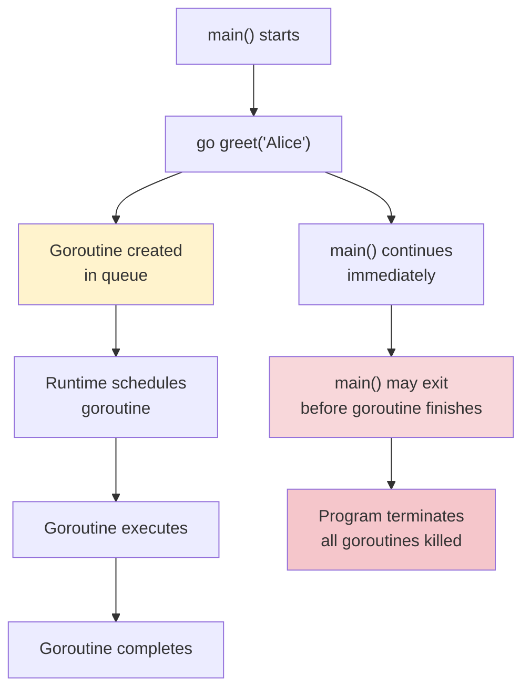
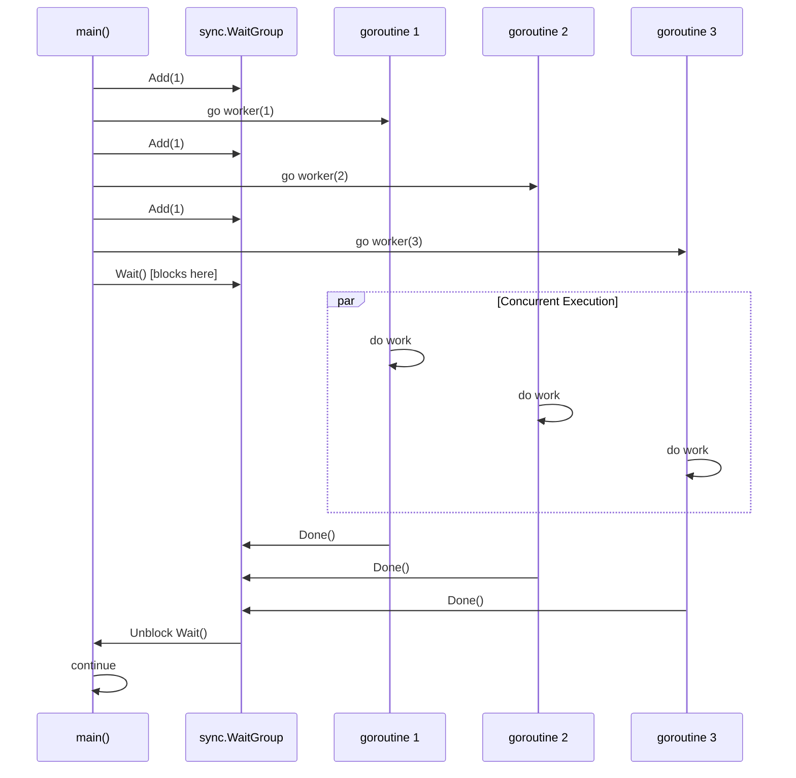
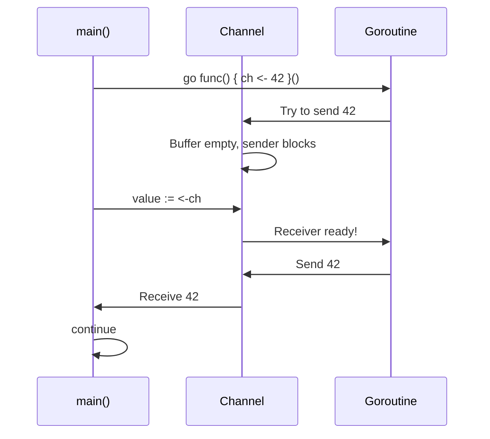
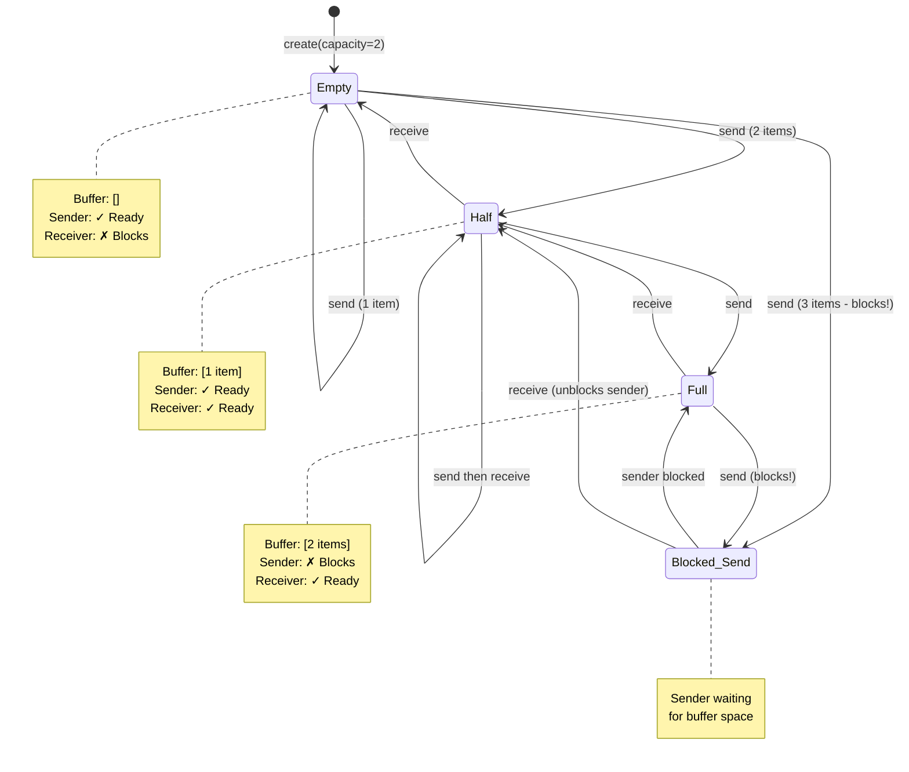
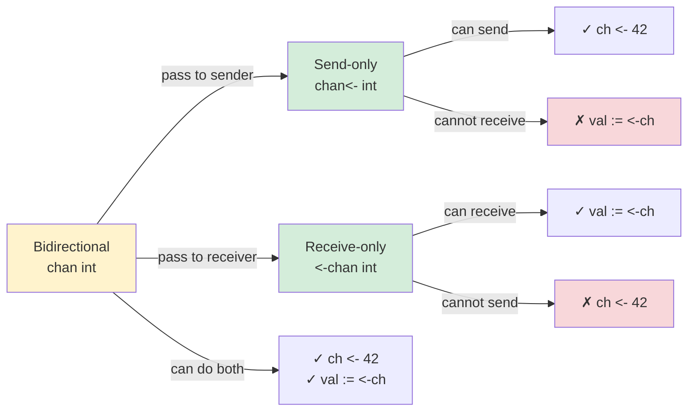
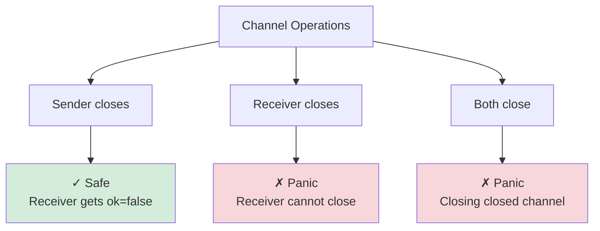
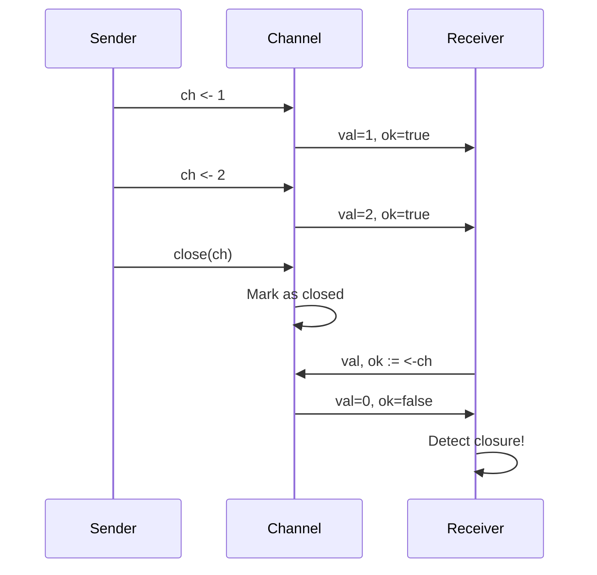
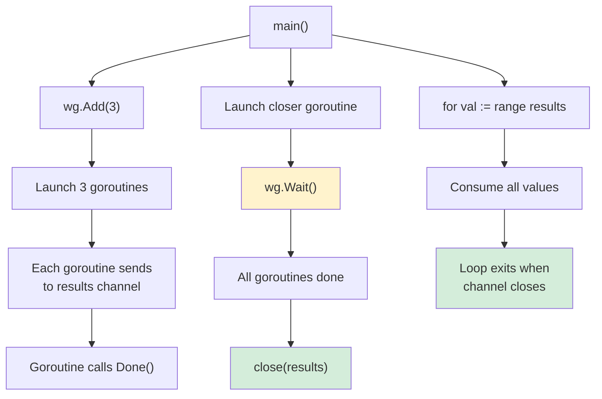
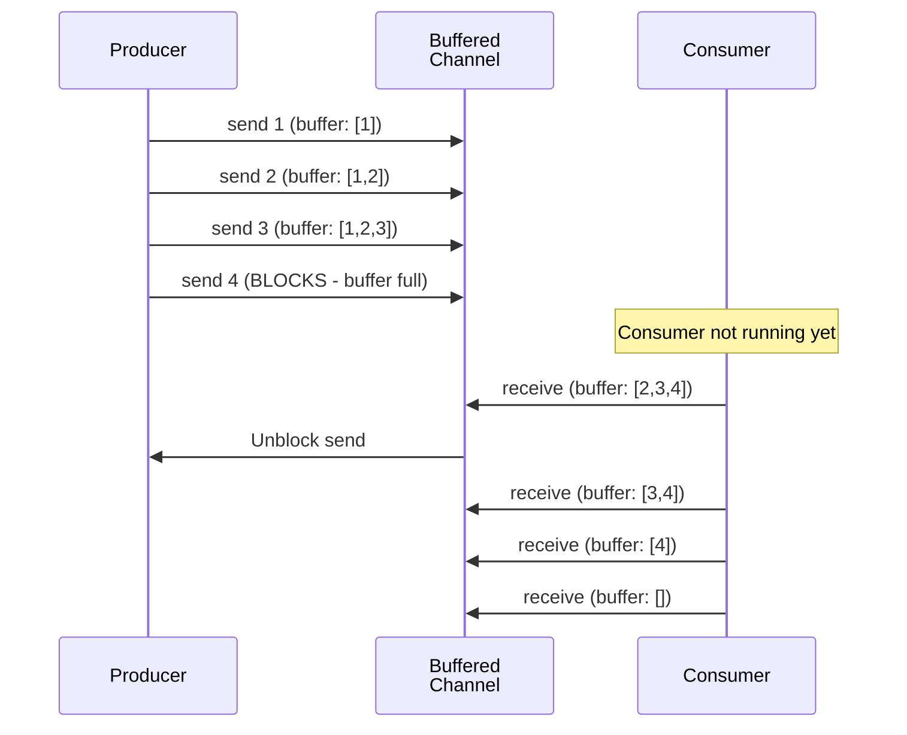
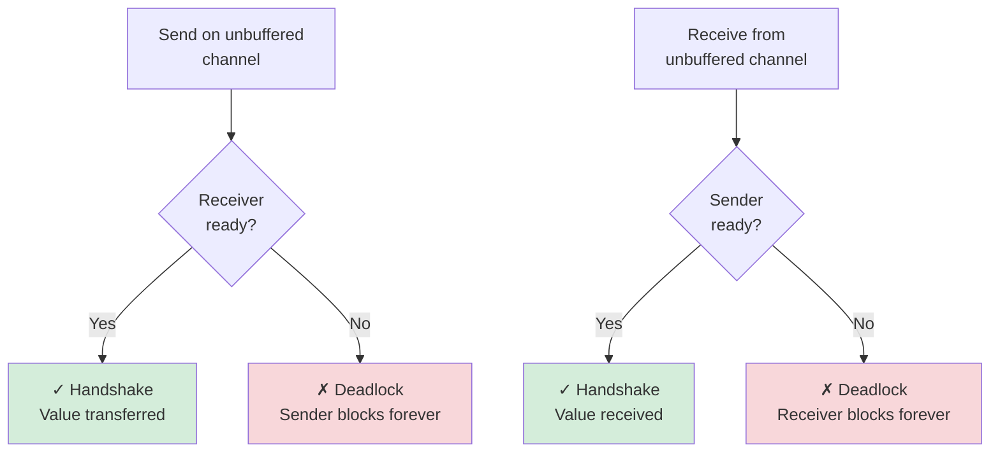

# Day 6: Concurrency Fundamentals

## Learning Objectives

- Understand goroutines and how they differ from OS threads
- Launch goroutines with the `go` keyword and manage their lifecycle
- Synchronize goroutines using `sync.WaitGroup`
- Understand channels as Go's primary synchronization primitive
- Master unbuffered and buffered channels for different use cases
- Implement safe send, receive, and close operations on channels
- Use directional channels for type safety
- Avoid common concurrency pitfalls (deadlocks, goroutine leaks, race conditions)
- Implement semaphores to limit concurrent access
- Use `sync.Once` for one-time initialization
- Apply condition variables (`sync.Cond`) for complex synchronization
- Implement resource pools for efficient resource management
- Use barrier synchronization to coordinate multiple goroutines
- Build concurrent pipelines and merge patterns

---

## Part 1: Goroutines: Lightweight Concurrency

### What is Concurrency?

Concurrency is the ability to execute multiple tasks independently and potentially simultaneously. Go makes concurrency a first-class citizen with lightweight goroutines and built-in synchronization primitives.

**Key Distinction**: Concurrency is not parallelism. Concurrency is about structuring your program to handle multiple independent tasks, while parallelism is about executing those tasks simultaneously on multiple cores.

### What Are Goroutines?

Goroutines are lightweight threads managed by the Go runtime. They are **not** OS threads—they are abstractions that the Go runtime multiplexes onto a smaller number of OS threads.

**Key Characteristics**:
- **Lightweight**: Thousands or millions of goroutines can run in a single program
- **Managed by Go runtime**: No direct OS thread creation overhead
- **Cheap to create**: Starting a goroutine costs only a few kilobytes of memory
- **Scheduled cooperatively**: The Go runtime schedules goroutines efficiently

**Comparison: Goroutines vs OS Threads**:

| Feature | Goroutine | OS Thread |
|---------|-----------|-----------|
| Memory overhead | ~2 KB | ~1-2 MB |
| Creation time | Microseconds | Milliseconds |
| Context switching | Managed by Go runtime | Managed by OS |
| Quantity | Millions feasible | Thousands max |
| Synchronization | Channels, sync primitives | Locks, semaphores |

### Launching Goroutines

To launch a goroutine, use the `go` keyword before a function call. See `main.go` lines 161-164 for a working example.

**Important**: The `main` function is itself a goroutine. When `main` returns, the entire program exits, regardless of whether other goroutines have finished. This is a critical distinction—you cannot rely on goroutines completing after `main` exits.

#### Why This Matters

Without proper synchronization, goroutines may not complete before the program terminates. This leads to lost work, incomplete operations, and unpredictable behavior. The Go runtime doesn't wait for goroutines; it only waits for the `main` goroutine.

#### Goroutine Lifecycle Diagram



### Anonymous Functions as Goroutines

Goroutines are often launched with anonymous functions. See `main.go` lines 161-164 for examples with the `greet` function, and lines 105-108 in `main.go` for anonymous functions with parameters.

**Key Point**: Parameters to anonymous goroutines are evaluated immediately in the calling goroutine, not when the goroutine executes. This prevents subtle bugs with variable capture.

#### Why Parameter Passing Matters

Consider this common mistake:
```go
// WRONG - all goroutines see the final value of i
for i := 1; i <= 3; i++ {
    go func() {
        fmt.Println(i)  // All print 4
    }()
}

// RIGHT - parameter is evaluated immediately
for i := 1; i <= 3; i++ {
    go func(n int) {
        fmt.Println(n)  // Prints 1, 2, 3
    }(i)
}
```

The first approach captures the variable `i` by reference, so all goroutines see the final value after the loop completes. The second approach passes `i` as a parameter, which is evaluated immediately and each goroutine gets its own copy.

### Synchronizing Goroutines with sync.WaitGroup

Instead of using `time.Sleep()`, use `sync.WaitGroup` to properly synchronize goroutines. See `main.go` lines 84-95 for a complete working example, and `exercise.go` for the `ExerciseWaitGroupCounter` function to implement.

#### Why WaitGroup is Essential

`sync.WaitGroup` provides **deterministic synchronization**—your program waits for all goroutines to complete before continuing. This is far superior to `time.Sleep()` because:
- **Reliable**: No guessing how long to sleep
- **Efficient**: No wasted CPU cycles waiting
- **Predictable**: Exact synchronization point

#### WaitGroup Pattern

The pattern is simple but critical:
1. Create a `sync.WaitGroup`
2. Call `Add(n)` for each goroutine you're launching
3. Call `Done()` in each goroutine when it completes (usually with `defer`)
4. Call `Wait()` to block until all goroutines finish

#### WaitGroup Synchronization Diagram



#### Common Mistake: Forgetting to Add

```go
// WRONG - counter never incremented
var wg sync.WaitGroup
go worker(1, &wg)  // No Add() call!
wg.Wait()  // Returns immediately, worker may not have started

// RIGHT - Add before launching
var wg sync.WaitGroup
wg.Add(1)
go worker(1, &wg)
wg.Wait()  // Blocks until worker calls Done()
```

---

## Part 2: Channels: Safe Communication Between Goroutines

### What Are Channels?

Channels are Go's primary mechanism for **safe communication between goroutines**. Unlike traditional shared-memory concurrency (mutexes, locks), channels provide **synchronization** and **data transfer** without explicit locking.

Think of a channel as a **typed pipe**: senders put data into one end, receivers take data from the other end, and synchronization happens automatically.

**Key Characteristics**:
- **Type-safe**: Channels carry values of a specific type
- **Synchronous by default**: Unbuffered channels block until both sender and receiver are ready
- **Safe**: No race conditions when used correctly
- **Closeable**: Senders can signal "no more data" by closing
- **Directional**: Can be restricted to send-only or receive-only

### Creating Channels

**Syntax**:
```go
ch := make(chan T)           // Unbuffered channel of type T
ch := make(chan T, capacity) // Buffered channel with capacity
```

See `main.go` lines 25, 41, 55, and 101 for working examples of both unbuffered and buffered channels.

### Unbuffered Channels

Unbuffered channels require both sender and receiver to be ready simultaneously. See `main.go` lines 23-36 for a working example, and `exercise.go` for the `ExerciseSimpleGoroutine` function to implement.

#### Why Unbuffered Channels Synchronize

Unbuffered channels have **zero capacity**—they cannot hold any values. This forces strict synchronization:
- A sender blocks until a receiver is waiting
- A receiver blocks until a sender has data
- Both operations must happen at the same time

This is Go's way of enforcing **handshake synchronization** between goroutines.

#### Unbuffered Channel Communication Diagram



**Behavior**:
- Send blocks until a receiver is ready
- Receive blocks until a sender has data
- Perfect for synchronization and ensuring work completes

### Buffered Channels

Buffered channels can hold a fixed number of values. See `main.go` lines 39-50 for a working example, and `exercise.go` for the `ExerciseBufferedChannelSum` function to implement.

#### Why Buffered Channels Decouple

Buffered channels have **capacity**—they can hold multiple values without a receiver waiting. This decouples sender and receiver:
- A sender only blocks when the buffer is **full**
- A receiver only blocks when the buffer is **empty**
- Sender and receiver can operate at different speeds

This is useful for producer-consumer patterns where production and consumption rates differ.

#### Buffered Channel State Diagram



**Behavior**:
- Send blocks only when buffer is full
- Receive blocks only when buffer is empty
- Useful for decoupling sender and receiver speeds

### Channel Direction

Channels can be **directional** for type safety. See `main.go` lines 70-81 for a working example with directional channels, and `exercise.go` for the `ExerciseDirectionalChannels` function to implement.

#### Why Directional Channels Matter

Directional channels enforce **compile-time safety** by restricting what operations are allowed:
- **Send-only** (`chan<- T`): Prevents accidental receives
- **Receive-only** (`<-chan T`): Prevents accidental sends
- **Bidirectional** (`chan T`): Default, allows both operations

This prevents bugs where a function accidentally sends when it should only receive, or vice versa.

#### Channel Direction Type Safety



### Closing Channels

Only the sender should close a channel. See `main.go` lines 53-67 for a working example with channel closure, and `exercise.go` for the `ExerciseChannelRange` function to implement.

#### Why This Rule Matters

The "only sender closes" rule prevents **critical bugs**:
- **Sending to closed channel**: Panics the entire program
- **Closing a closed channel**: Panics the entire program
- **Multiple senders**: Impossible to know who should close

By enforcing that only the sender closes, Go ensures predictable, safe channel behavior.

#### Channel Closure Rules



**Important Rules**:
- Only senders close channels
- Receiving from a closed channel returns zero value and `ok=false`
- Sending to a closed channel panics
- Closing a closed channel panics

### Detecting Channel Closure

Use the `ok` flag to detect if a channel is closed. See `main.go` lines 122-140 for a working example, and `exercise.go` for the `ExerciseDetectChannelClosure` function to implement.

#### The `ok` Flag Pattern

When receiving from a channel, you get two values:
```go
val, ok := <-ch
```

- `val`: The received value (or zero value if channel is closed)
- `ok`: Boolean indicating if the channel is still open
  - `ok = true`: Value is valid
  - `ok = false`: Channel is closed, value is zero value

#### Channel Closure Detection Diagram



### Iterating Over Channels

Use `for range` to iterate until a channel is closed. See `main.go` lines 53-67 for a working example.

#### Why `for range` is Idiomatic

The `for range` loop is Go's idiomatic way to consume channel values because:
- **Automatic closure detection**: Loop exits when channel closes
- **Cleaner code**: No need for manual `ok` flag checking
- **Less error-prone**: Impossible to forget to check for closure

This is the preferred pattern for consuming all values from a channel.

---

## Common Patterns

### Pattern 1: Simple Communication

See `main.go` lines 23-36 for a simple unbuffered channel example where a goroutine sends a value to the main goroutine.

**When to use**: When you need to synchronize a single value transfer between two goroutines.

### Pattern 2: Multiple Goroutines with WaitGroup and Channel

See `main.go` lines 98-119 for a complete example combining WaitGroup and channels. This pattern:
1. Launches multiple goroutines that send results to a channel
2. Uses WaitGroup to track completion
3. Closes the channel when all senders are done
4. Consumes results with `for range`

**When to use**: When multiple goroutines produce results that need to be collected and consumed.

#### Multiple Producer Pattern Diagram



### Pattern 3: Buffered Channel for Decoupling

See `main.go` lines 39-50 for a buffered channel example where a producer sends values without waiting for a consumer.

**When to use**: When producer and consumer operate at different speeds, or when you want to decouple their timing. The buffer allows the producer to send multiple values before the consumer starts receiving.

#### Producer-Consumer Decoupling



---

## Common Mistakes

### Mistake 1: Sending to a Closed Channel

**The Problem**: Sending to a closed channel causes a panic that crashes your program.

```go
// WRONG - panics
ch := make(chan int)
close(ch)
ch <- 1  // panic: send on closed channel

// RIGHT - only sender closes
go func() {
    ch <- 1
    close(ch)
}()
```

**Why it matters**: This is a runtime panic that terminates the entire program. The rule "only sender closes" prevents this by ensuring the sender controls the channel's lifecycle.

### Mistake 2: Goroutine Leaks

**The Problem**: Goroutines that block forever consume resources and prevent the program from terminating cleanly.

```go
// WRONG - goroutine never finishes
ch := make(chan int)
go func() {
    <-ch  // Blocks forever, waiting for a value that never comes
}()
// Function returns, but goroutine is still waiting

// RIGHT - ensure goroutines complete
ch := make(chan int)
go func() {
    val := <-ch
    fmt.Println(val)
}()
ch <- 1  // Send value, goroutine completes
```

**Why it matters**: Goroutine leaks waste memory and can cause resource exhaustion. Every goroutine must have a clear exit path. See `main.go` lines 143-154 for an example of leak prevention.

### Mistake 3: Deadlock from Unbuffered Channel

**The Problem**: Trying to send on an unbuffered channel without a receiver causes a deadlock—the program hangs forever.

```go
// WRONG - deadlock
ch := make(chan int)
ch <- 1  // Blocks forever, no receiver ready
val := <-ch  // Never reached

// RIGHT - use goroutine or buffered channel
ch := make(chan int, 1)
ch <- 1  // No block, buffer has space
val := <-ch  // Receive from buffer
```

**Why it matters**: Deadlocks are silent failures—the program doesn't panic, it just hangs. Always ensure both sender and receiver are ready for unbuffered channels.

#### Deadlock Detection Diagram



---

## Key Takeaways

1. **Goroutines are lightweight** - Create thousands without worry; they're managed by the Go runtime and cost only ~2KB each
2. **Channels enable safe communication** - Prefer channels over shared memory and locks; they provide both synchronization and data transfer
3. **WaitGroup synchronizes goroutines** - Use for deterministic coordination; never rely on `time.Sleep()` for synchronization
4. **Unbuffered channels synchronize** - Both sender and receiver must be ready simultaneously; perfect for handshake patterns
5. **Buffered channels decouple** - Sender and receiver can operate at different speeds; buffer size determines decoupling capacity
6. **Only senders close channels** - This rule prevents panics and ensures predictable channel lifecycle management
7. **Use `for range` idiomatically** - Automatically detects channel closure; cleaner than manual `ok` flag checking
8. **Avoid deadlocks** - Always ensure both sender and receiver are ready for unbuffered channels; use goroutines or buffered channels when needed
9. **Goroutine leaks are dangerous** - Every goroutine must have a clear exit path; leaks waste memory and prevent clean shutdown
10. **Use directional channels** - Restrict to send-only or receive-only for compile-time safety and clearer intent
11. **Parameter passing prevents capture bugs** - Pass loop variables as parameters to goroutines, not captured by reference
12. **Test with race detector** - Run `go test -race` to detect data races and synchronization bugs

---

## Further Reading

- [Go by Example: Goroutines](https://gobyexample.com/goroutines) - Goroutine basics
- [Go by Example: Channels](https://gobyexample.com/channels) - Channel usage
- [Effective Go: Concurrency](https://go.dev/doc/effective_go#concurrency) - Concurrency best practices
- [Go Memory Model](https://go.dev/ref/mem) - Understanding synchronization
- [Concurrency is not Parallelism](https://go.dev/blog/pipelines) - Rob Pike's talk on concurrency patterns
