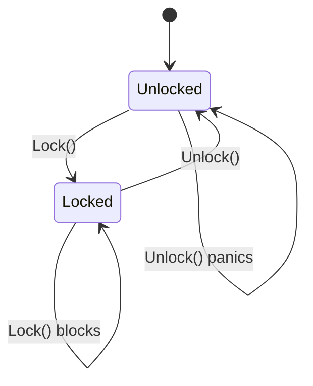
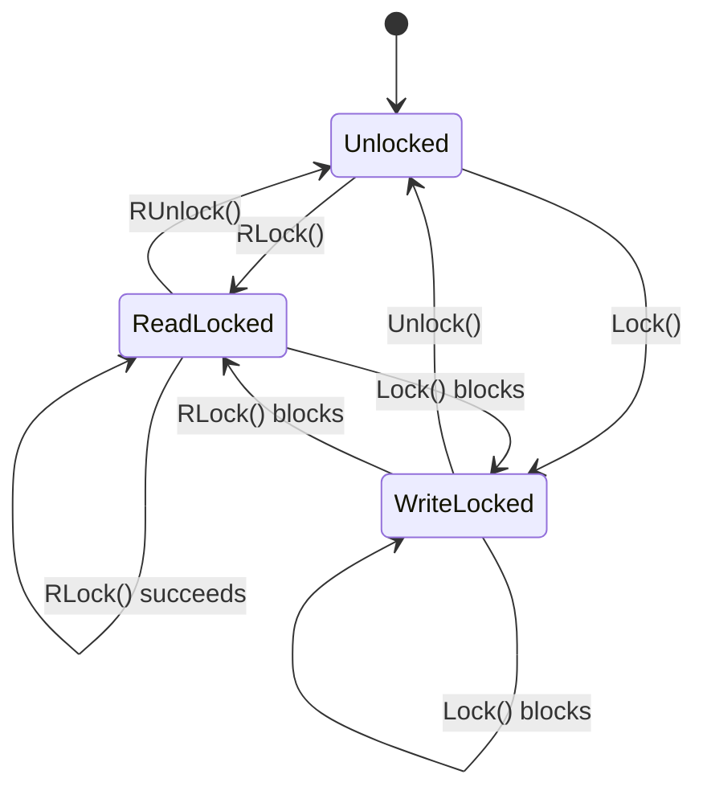
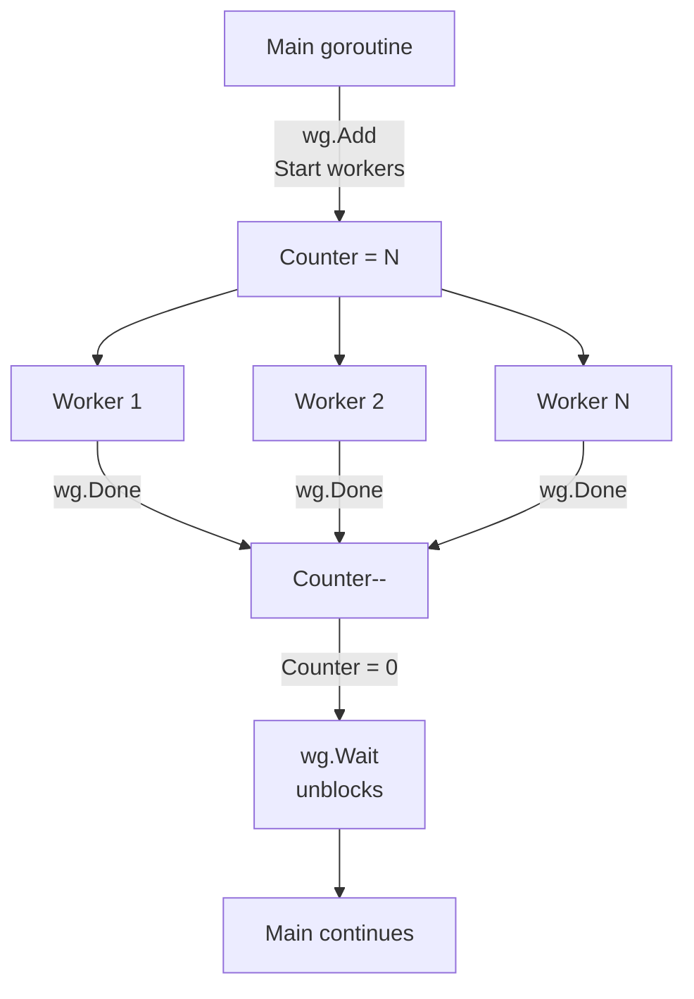
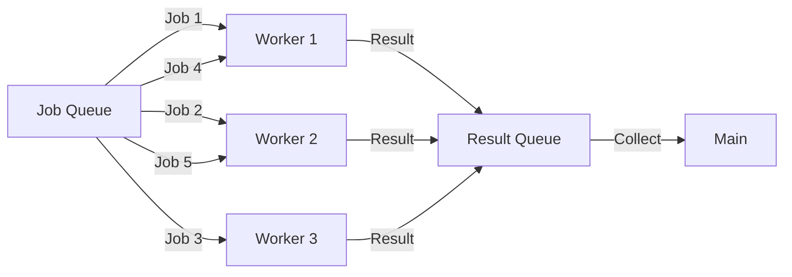
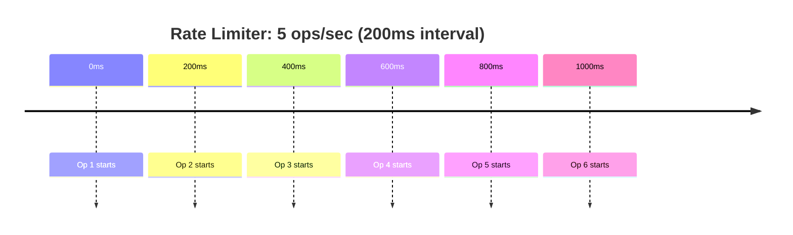
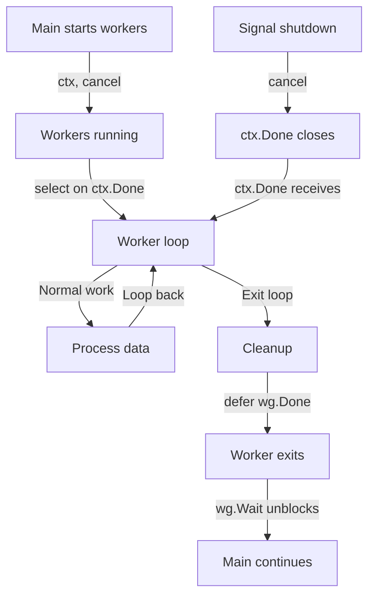
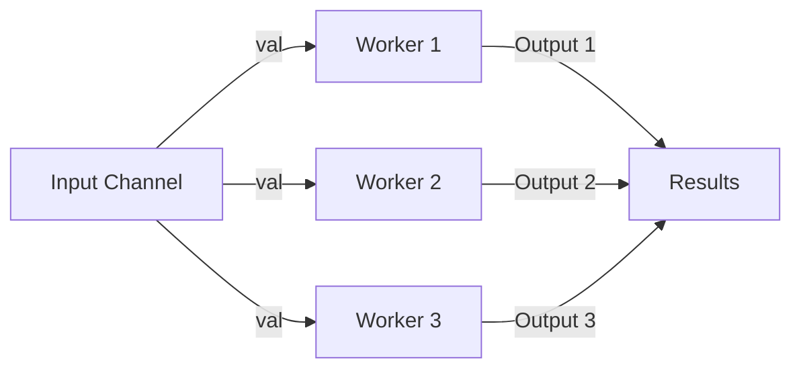
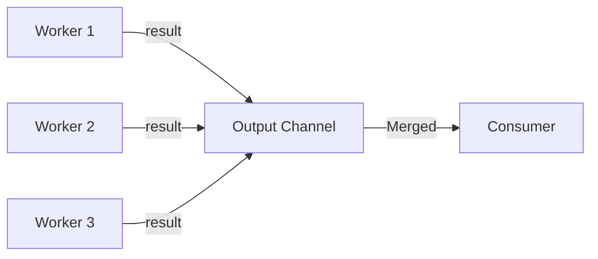

# Day 7: Synchronization Patterns

## Learning Objectives

- Understand sync.Mutex and sync.RWMutex for protecting shared state
- Use sync.WaitGroup for goroutine coordination
- Implement atomic operations for lock-free programming
- Apply worker pool, rate limiter, and graceful shutdown patterns
- Implement fan-out, fan-in, and pipeline concurrency patterns
- Identify and avoid deadlocks, race conditions, and goroutine leaks

---

## Introduction: Why Synchronization Matters

When multiple goroutines access shared data simultaneously, race conditions occur—unpredictable behavior where the final result depends on timing. Go provides several synchronization primitives to safely coordinate goroutines:

1. **Mutexes** - For protecting shared state with locks
2. **Atomic operations** - For lock-free counters and flags
3. **Channels** - For passing data between goroutines
4. **WaitGroup** - For coordinating goroutine completion
5. **Context** - For cancellation and timeouts

This day focuses on the first four, building patterns that scale from simple counters to complex worker pools.

---

## 1. Mutex: Protecting Shared State

### What is a Mutex?

A mutex (mutual exclusion) is a synchronization primitive that ensures only one goroutine can access a critical section at a time. Think of it as a lock on a bathroom door—only one person can be inside at once.

**State Diagram:**



### How Mutex Works

When a goroutine calls `Lock()`, it either acquires the lock immediately (if unlocked) or blocks until another goroutine calls `Unlock()`. This ensures only one goroutine executes the critical section at a time.

**Implementation Pattern** (see `main.go` lines 10-26):

The Counter type demonstrates the standard pattern:
1. Embed `sync.Mutex` as a field
2. Wrap all access to shared data with `Lock()` and `Unlock()`
3. Use `defer` to guarantee `Unlock()` is called, even if panic occurs
4. Keep the critical section as small as possible

**Key Best Practices**:
- Always use `defer` to ensure `Unlock()` is called
- Lock the smallest critical section possible—don't hold locks during I/O or network operations
- Never call `Lock()` recursively (Go mutexes are not reentrant)
- Avoid holding a lock while waiting for another goroutine

### RWMutex: Read-Write Locks

RWMutex is an optimization for read-heavy workloads. It allows **multiple concurrent readers** but only **one writer** at a time. This is more efficient than a regular Mutex when reads vastly outnumber writes.

**State Diagram:**



### When to Use RWMutex

- **Read-heavy workloads** - Many readers, few writers
- **Cache implementations** - Frequent lookups, infrequent updates
- **Configuration** - Read often, update rarely
- **Performance-critical code** - Where lock contention is a bottleneck

**Implementation Pattern** (see `main.go` lines 28-48):

The Cache type shows the pattern:
- Use `RLock()` / `RUnlock()` for read-only operations
- Use `Lock()` / `Unlock()` for write operations
- Multiple goroutines can hold read locks simultaneously
- A write lock blocks all readers and writers

**Comparison: Mutex vs RWMutex**

| Scenario | Mutex | RWMutex |
|----------|-------|---------|
| 10 readers, 1 writer | All block each other | Readers run concurrently |
| 1 reader, 1 writer | Simple, no overhead | Unnecessary complexity |
| 100 readers, 1 writer | Significant contention | Excellent performance |

---

## 2. Atomic Operations

### Lock-Free Synchronization

Atomic operations provide lock-free synchronization for simple values. Instead of using a mutex, atomic operations use CPU-level instructions to ensure thread-safe access without blocking.

**Key Insight**: Atomics are faster than mutexes for simple operations because they don't require acquiring/releasing locks. However, they only work with specific types (int32, int64, uint32, uint64, uintptr, pointers).

### Common Atomic Operations

**Implementation Pattern** (see `main.go` lines 50-61):

The AtomicCounter demonstrates lock-free counting:
- `atomic.LoadInt64()` - Safely read the current value
- `atomic.StoreInt64()` - Safely write a new value
- `atomic.AddInt64()` - Atomically increment/decrement
- `atomic.CompareAndSwapInt64()` - Conditional update (only change if current value matches expected)
- `atomic.SwapInt64()` - Atomically exchange values

### When to Use Atomics vs Mutexes

| Use Case | Atomic | Mutex |
|----------|--------|-------|
| Simple counter | Preferred | Works, but slower |
| Multiple fields | Can't protect together | Preferred |
| Complex logic | Limited operations | Preferred |
| High contention | Better performance | Works, but slower |
| Conditional updates | CompareAndSwap | Works |

**Best Practice**: Use atomics for simple counters and flags; use mutexes for protecting complex shared state.

---

## 3. WaitGroup: Goroutine Coordination

### What is WaitGroup?

WaitGroup is a synchronization primitive that allows the main goroutine to wait for a group of worker goroutines to complete. It maintains an internal counter:
- `Add(n)` - Increment counter by n
- `Done()` - Decrement counter by 1
- `Wait()` - Block until counter reaches zero

### Goroutine Lifecycle with WaitGroup



### Common Pattern

**Implementation Pattern** (see `main.go` lines 105-118):

The standard pattern for using WaitGroup:
1. Create a WaitGroup variable
2. Call `Add(n)` before starting n goroutines
3. Start goroutines; each calls `defer wg.Done()` before returning
4. Call `wg.Wait()` to block until all goroutines complete

**Key Points**:
- Call `Add()` before starting goroutines, not inside them
- Always use `defer wg.Done()` to handle panics
- `Wait()` blocks until counter reaches zero
- Do not reuse WaitGroup after `Wait()` returns
- Never call `Add()` after `Wait()` has been called

### Common Mistake: Race Between Add and Wait

```go
// WRONG: Add called after Wait might have started
var wg sync.WaitGroup
wg.Wait()  // Might return immediately
wg.Add(1)  // Panic: Add called on completed WaitGroup

// CORRECT: All Add calls before any goroutines start
var wg sync.WaitGroup
wg.Add(1)
go func() {
    defer wg.Done()
    // work
}()
wg.Wait()
```

---

## 4. Worker Pool Pattern

### Problem: Creating Too Many Goroutines

Creating one goroutine per job is wasteful. If you have 10,000 jobs, creating 10,000 goroutines consumes significant memory and CPU. The solution: reuse a fixed pool of worker goroutines.

### Architecture



### How It Works

1. **Create N worker goroutines** - Each waits for jobs on a shared channel
2. **Send jobs** - Main goroutine sends jobs to the channel
3. **Workers process** - Each worker processes jobs as they arrive
4. **Collect results** - Results are sent to a results channel
5. **Shutdown** - Close the jobs channel; workers exit when channel is empty

### Implementation Pattern (see `main.go` lines 63-174)

The pattern combines:
- **Job and Result types** - Define what workers process and return
- **Worker function** - Reads from jobs channel, writes to results channel
- **WaitGroup** - Tracks when all workers finish
- **Channels** - Communicate jobs and results safely

**Key Design Points**:
- Workers read from a shared `jobs` channel using `range`
- When the channel closes, `range` exits, triggering `wg.Done()`
- A separate goroutine closes the results channel after all workers finish
- Buffered channels reduce blocking (optional but common)

### Advantages

- **Memory efficient** - Reuse goroutines instead of creating thousands
- **Throughput control** - Number of workers limits concurrent processing
- **Backpressure** - Job queue naturally limits how many jobs are queued
- **Graceful shutdown** - Close jobs channel; workers finish naturally

---

## 5. Rate Limiter Pattern

### Why Rate Limiting?

Rate limiting controls how fast operations execute. Common use cases:
- **API clients** - Respect rate limits from external APIs
- **Resource protection** - Prevent overwhelming databases or services
- **Fair resource sharing** - Ensure no single client monopolizes resources
- **Backpressure** - Slow down producers when consumers can't keep up

### How It Works

A rate limiter uses a ticker channel that emits a value at regular intervals. By receiving from this channel before each operation, you enforce a maximum rate.



### Implementation Pattern (see `main.go` lines 85-183)

The RateLimiter uses `time.Tick()` to create a channel that emits a value every `1 second / rps`:
- `time.Tick(interval)` returns a channel that receives a value at regular intervals
- Receiving from the channel blocks until the next interval
- This naturally throttles the rate of operations

**Example**: `NewRateLimiter(5)` creates a ticker with 200ms intervals (1000ms / 5 ops).

### Variations

**Token Bucket** - More sophisticated rate limiting:
- Accumulate tokens over time
- Each operation consumes tokens
- Allows bursts when tokens are available
- Better for variable workloads

**Leaky Bucket** - Smooth rate limiting:
- Jobs enter a queue
- Fixed rate of processing
- Excess jobs are dropped or queued
- Good for preventing spikes

---

## 6. Graceful Shutdown Pattern

### Problem: Abrupt Termination

When you want to stop goroutines, you can't forcefully kill them. Instead, you must signal them to stop gracefully. This allows them to:
- Finish current work
- Clean up resources (close files, flush buffers)
- Return cleanly without panics

### Solution: Context Cancellation

Go's `context` package provides a way to signal cancellation. A context can be cancelled, and all goroutines listening to it receive the signal via `ctx.Done()`.

### Shutdown Flow



### Implementation Pattern

The graceful shutdown pattern uses:
1. **context.WithCancel()** - Create a cancellable context
2. **select with ctx.Done()** - Check for cancellation signal
3. **WaitGroup** - Wait for all workers to finish
4. **defer cleanup** - Ensure resources are released

**Key Points**:
- `ctx.Done()` returns a channel that closes when context is cancelled
- `cancel()` signals all goroutines listening to the context
- Workers should check `ctx.Done()` regularly in their loops
- Use `defer wg.Done()` to ensure counter is decremented even if panic occurs

### Variations

**Timeout-based shutdown**:
```go
ctx, cancel := context.WithTimeout(context.Background(), 5*time.Second)
defer cancel()
// Workers automatically stop after 5 seconds
```

**Deadline-based shutdown**:
```go
deadline := time.Now().Add(10 * time.Second)
ctx, cancel := context.WithDeadline(context.Background(), deadline)
defer cancel()
```

---

## 7. Common Concurrency Patterns

### Fan-Out Pattern

Fan-out distributes work from a single source to multiple workers. Each worker receives every value from the input channel.

**Use Case**: Broadcast the same work to multiple processors (e.g., send a message to all subscribers).



**Pattern**:
1. Create multiple output channels
2. Each worker goroutine reads from the shared input channel
3. Each worker sends results to its own output channel
4. Close output channels when input is exhausted

**Key Insight**: All workers receive the same input values. Use this when you need to process the same data in parallel (e.g., applying multiple transformations).

### Fan-In Pattern

Fan-in combines results from multiple sources into a single output channel. Multiple goroutines send to one channel.

**Use Case**: Merge results from multiple workers into a single stream (e.g., collect responses from multiple API calls).



**Pattern**:
1. Create a single output channel
2. Multiple goroutines send results to the same output channel
3. Use WaitGroup to track when all senders finish
4. Close the output channel after all senders complete

**Key Insight**: Synchronize closing the output channel using WaitGroup. Only the last sender should close it, preventing "send on closed channel" panic.

### Combining Patterns: Pipeline

A pipeline chains fan-out and fan-in stages:

```
Input → [Fan-Out] → [Stage 1] → [Fan-In] → [Stage 2] → [Fan-Out] → Output
```

Each stage processes data and passes results to the next stage. This enables efficient multi-stage processing where each stage can run in parallel.

---

## 8. Common Pitfalls and How to Avoid Them

### Deadlock: Circular Wait

**Problem**: Two goroutines wait for each other, neither can proceed.

```go
// DEADLOCK: goroutine 1 waits for ch2, goroutine 2 waits for ch1
ch1 := make(chan int)
ch2 := make(chan int)

go func() {
    ch1 <- 1
    <-ch2  // Waits forever
}()

go func() {
    ch2 <- 2
    <-ch1  // Waits forever
}()
```

**Solution**: Establish a clear ordering for channel operations. Use buffered channels or ensure one goroutine always sends before receiving.

### Race Condition: Unsynchronized Access

**Problem**: Multiple goroutines access shared data without synchronization.

```go
// RACE: counter accessed without mutex
var counter int
go func() { counter++ }()
go func() { counter++ }()
// Final value is unpredictable (1 or 2)
```

**Solution**: Always protect shared data with mutexes or use atomic operations.

**Detection**: Run tests with `go test -race` to detect race conditions.

### Goroutine Leak: Forgotten Goroutines

**Problem**: Goroutines that never exit consume memory indefinitely.

```go
// LEAK: goroutine blocks forever on channel receive
ch := make(chan int)
go func() {
    <-ch  // Never receives, goroutine never exits
}()
// Function returns, but goroutine is still running
```

**Solution**: Ensure all goroutines have an exit condition. Use context cancellation or close channels to signal shutdown.

### Send on Closed Channel: Panic

**Problem**: Sending to a closed channel causes a panic.

```go
// PANIC: send on closed channel
ch := make(chan int)
close(ch)
ch <- 1  // Panic!
```

**Solution**: Only close channels from the sender side. Establish clear ownership of who closes what.

### Mutex Deadlock: Recursive Lock

**Problem**: Calling Lock() twice from the same goroutine deadlocks.

```go
// DEADLOCK: recursive lock
var mu sync.Mutex
mu.Lock()
mu.Lock()  // Deadlock! Go mutexes are not reentrant
```

**Solution**: Go mutexes are not reentrant. Refactor to avoid recursive locking, or use sync.RWMutex if appropriate.

### WaitGroup Panic: Add After Wait

**Problem**: Calling Add() after Wait() has started causes a panic.

```go
// PANIC: Add called after Wait
var wg sync.WaitGroup
wg.Add(1)
go func() { defer wg.Done(); }()
wg.Wait()
wg.Add(1)  // Panic!
```

**Solution**: Call all Add() calls before starting any goroutines.

---

## Debugging Concurrency Issues

### Tools and Techniques

1. **Race detector**: `go test -race` detects data races
2. **Logging**: Add timestamps to trace goroutine execution order
3. **Deadlock detection**: Set timeouts on blocking operations
4. **Goroutine profiling**: `runtime.NumGoroutine()` to check for leaks
5. **Channel inspection**: Use `len(ch)` and `cap(ch)` to debug channel state

### Testing Concurrent Code

- Use `time.Sleep()` sparingly; prefer synchronization primitives
- Test with `-race` flag enabled
- Run tests multiple times to expose race conditions
- Use table-driven tests for different concurrency scenarios

---

## Key Takeaways

1. **Mutexes protect shared state** - Use for critical sections; always use `defer Unlock()`
2. **RWMutex for read-heavy workloads** - Multiple readers, single writer
3. **Atomics for simple counters** - Lock-free synchronization; faster than mutexes
4. **Worker pools for job processing** - Reuse goroutines efficiently; scale to thousands of jobs
5. **Rate limiters control throughput** - Prevent overwhelming systems; use time.Tick()
6. **Graceful shutdown with context** - Clean termination; use context.WithCancel()
7. **Fan-out/fan-in patterns** - Distribute and combine work across goroutines
8. **Avoid deadlocks, races, and leaks** - Use race detector, establish clear ownership, test thoroughly

---

## Further Reading

- [Go by Example: Mutexes](https://gobyexample.com/mutexes) - Mutex usage
- [Go by Example: Atomic Counters](https://gobyexample.com/atomic-counters) - Atomic operations
- [Go by Example: Goroutines](https://gobyexample.com/goroutines) - Goroutine basics
- [Effective Go: Concurrency](https://go.dev/doc/effective_go#concurrency) - Concurrency best practices
- [Go Memory Model](https://go.dev/ref/mem) - Understanding synchronization semantics
- [Context Package](https://pkg.go.dev/context) - Context for cancellation and timeouts
