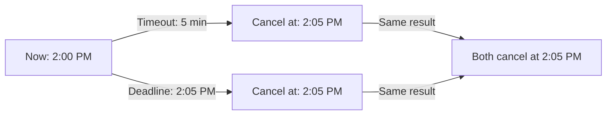
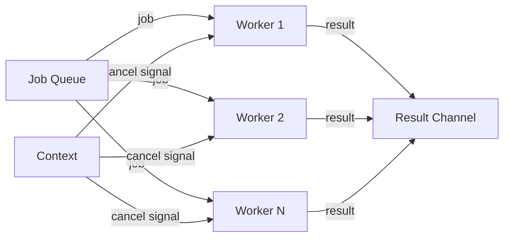
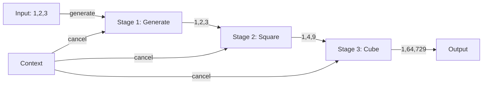
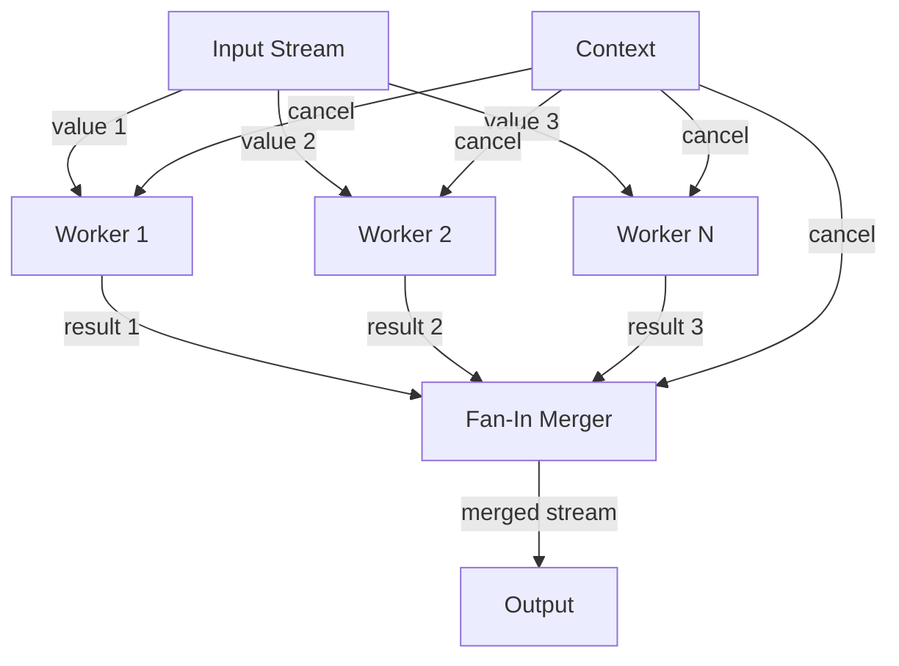

# Day 8: Context and Advanced Concurrency

## Learning Objectives

- Master the context package for cancellation and timeouts
- Implement context propagation across goroutines
- Use context for deadline management
- Implement worker pools and pipeline patterns
- Manage goroutine lifecycles with context
- Avoid goroutine leaks and resource exhaustion

---

## 1. The Context Package

### What is Context?

The `context` package provides a way to manage cancellation, timeouts, and deadlines across goroutines and API boundaries. A context is a request-scoped value that carries deadlines, cancellation signals, and other request-scoped data through a call stack and across goroutines.

Think of context as a control mechanism that allows a parent goroutine to signal to all its child goroutines that they should stop working. This is essential in concurrent programs to prevent goroutine leaks—situations where goroutines continue running indefinitely even after they're no longer needed.

**Key Uses**:
- **Cancellation**: Stop all goroutines when a parent is cancelled
- **Timeouts**: Automatically cancel operations after a duration
- **Deadlines**: Cancel at a specific time
- **Values**: Pass request-scoped data (e.g., user ID, request ID)

### Context Lifecycle

Understanding how contexts are created and propagate is crucial for managing concurrent operations effectively:

```mermaid
graph TD
    A["context.Background()"] -->|WithCancel| B["Cancellable Context"]
    A -->|WithTimeout| C["Timeout Context"]
    A -->|WithDeadline| D["Deadline Context"]
    A -->|WithValue| E["Value Context"]
    B -->|cancel()| F["Context Cancelled"]
    C -->|timeout expires| F
    D -->|deadline reached| F
    B -->|child context| G["Child Context"]
    G -->|inherits cancellation| F
```

When you create a child context from a parent, the child automatically inherits the parent's cancellation signal. If the parent is cancelled, all children are cancelled too. This hierarchical structure ensures proper cleanup of all goroutines.

### Creating Contexts

The `context` package provides several factory functions to create different types of contexts:

```go
import "context"

// Background context (never cancelled)
ctx := context.Background()

// Cancellable context
ctx, cancel := context.WithCancel(context.Background())
defer cancel()

// Context with timeout
ctx, cancel := context.WithTimeout(context.Background(), 5*time.Second)
defer cancel()

// Context with deadline
deadline := time.Now().Add(5 * time.Second)
ctx, cancel := context.WithDeadline(context.Background(), deadline)
defer cancel()

// Context with value
ctx := context.WithValue(context.Background(), "key", "value")
```

**Important**: Always call `defer cancel()` immediately after creating a cancellable context. This ensures resources are cleaned up even if your function returns early or panics.

### Context Cancellation

Cancellation is the most fundamental use of context. When you call `cancel()`, it signals all goroutines using that context to stop their work. This is done through the `ctx.Done()` channel, which closes when cancellation occurs.

See main.go lines 11-25 for the `demonstrateCancellation` function, which shows how workers listen for cancellation signals in a select statement. The pattern is:

```go
select {
case <-ctx.Done():
    // Handle cancellation
    return
case <-someOtherChannel:
    // Handle other events
}
```

This select statement allows a goroutine to respond immediately to cancellation while still processing other work. When `ctx.Done()` receives a signal, the goroutine can clean up and exit gracefully.

See main.go lines 195-209 for a complete example showing how to create a context, spawn multiple workers, and cancel them all at once.

### Context Timeouts

A timeout is a deadline relative to the current time. When you create a context with a timeout, it automatically cancels after the specified duration. This is invaluable for preventing operations from hanging indefinitely—a common problem in network I/O and other blocking operations.

Timeouts work by internally creating a deadline equal to `now + duration`. The context will automatically cancel itself when the time expires, without requiring you to manually call `cancel()`.

See main.go lines 28-35 for the `fetchDataWithTimeout` function. This demonstrates how to use the same select pattern to handle both successful completion and timeout. The function simulates a network request that takes 2 seconds, but the caller can impose a timeout of 1 second.

See main.go lines 213-221 for the timeout usage example in main.

### Context Deadlines

A deadline is an absolute time at which a context must be cancelled. Unlike timeouts (which are relative durations), deadlines are useful when multiple operations need to complete by the same absolute time, or when coordinating with external systems that specify fixed deadlines.

#### Understanding Deadline vs Timeout



The key difference: timeouts are relative (5 minutes from now), while deadlines are absolute (2:05 PM). In practice, they achieve the same effect—cancellation at a specific point in time.

#### Implementation Details

- Create a deadline context with `context.WithDeadline(context.Background(), deadline)`.
- Calculate the deadline as an absolute time: `time.Now().Add(duration)`.
- Use the same `select` pattern as timeout to check for deadline exceeded.
- Call `ctx.Deadline()` to retrieve the deadline time from a context.

See main.go lines 38-46 for the `operationWithDeadline` function and lines 225-232 for usage.

### Context Values

Context can carry request-scoped data (like user IDs, request IDs, or authentication tokens) through a call chain. This is useful for passing metadata without adding parameters to every function.

**Important**: Use context values sparingly and only for request-scoped data. Never use context to replace function parameters for core logic.

To use context values safely:
1. Define a custom type for your context key to avoid collisions: `type contextKey string`
2. Create unexported constants for your keys: `const userKey contextKey = "user"`
3. Extract values with type assertion: `user := ctx.Value(userKey).(string)`

See main.go for the exercise implementations that demonstrate context value usage.

---

## 2. Worker Pool with Context

### What is a Worker Pool?

A worker pool is a concurrency pattern that maintains a fixed number of goroutines (workers) that process jobs from a shared queue. Instead of creating a new goroutine for each job (which can exhaust system resources), you reuse a limited set of workers.

**Why use worker pools?**
- **Resource control**: Limit the number of concurrent goroutines to prevent system overload
- **Efficiency**: Reuse goroutines instead of creating/destroying them for each task
- **Backpressure**: Jobs queue up if all workers are busy, preventing memory exhaustion
- **Graceful shutdown**: Cancel all workers at once using context

### Worker Pool Architecture



Each worker listens on the same job channel and processes jobs independently. When context is cancelled, all workers receive the signal simultaneously and shut down cleanly.

### Implementation

See main.go lines 49-58 for the `Job` and `Result` type definitions. These define the structure of work items and their results.

See main.go lines 61-83 for the `worker` function. This function demonstrates the key pattern:
1. Check for context cancellation before accepting a new job
2. Receive a job from the channel (blocking if none available)
3. Check for cancellation again before processing
4. Send the result back
5. Loop to accept the next job

The double cancellation check is important: one before blocking on the job channel, and one during processing. This ensures workers can exit quickly even if they're blocked waiting for work.

See main.go lines 235-264 for a complete worker pool example in main. This shows:
- Creating a context for the pool
- Spawning multiple workers
- Feeding jobs into the queue
- Collecting results
- Graceful shutdown via context cancellation

---

## 3. Pipeline Pattern with Context

### What is a Pipeline?

A pipeline is a series of stages where each stage processes data and passes it to the next stage. Each stage runs in its own goroutine, allowing multiple stages to process different data items concurrently. This pattern is powerful for breaking complex data transformations into modular, reusable components.

**Benefits of pipelines:**
- **Modularity**: Each stage has a single responsibility
- **Concurrency**: Multiple stages process different data simultaneously
- **Composability**: Stages can be easily combined in different ways
- **Resource efficiency**: Backpressure naturally limits memory usage

### Pipeline Flow



Each stage:
1. Reads from an input channel
2. Processes the data
3. Sends results to an output channel
4. Respects context cancellation

### Implementation

See main.go lines 86-99 for the `generate` function. This is the source stage that produces initial values.

See main.go lines 102-115 for the `square` function. This is a transformation stage that reads from an input channel, transforms the data, and sends to an output channel.

See main.go lines 118-131 for the `cube` function. This demonstrates how stages can be chained—it reads from the output of `square`.

The key pattern in each stage:
```go
for n := range in {
    select {
    case out <- n * n:
    case <-ctx.Done():
        return
    }
}
```

This pattern ensures that:
- Data flows through the pipeline
- Cancellation is respected during sending
- The channel is properly closed when the stage exits

See main.go lines 267-277 for a complete pipeline example showing how to chain stages together: `generate` → `square` → `cube`.

---

## 4. Fan-Out/Fan-In Pattern

### What are Fan-Out and Fan-In?

**Fan-Out** distributes a single stream of work to multiple workers, allowing parallel processing of independent items. **Fan-In** merges results from multiple sources back into a single stream. Together, they enable scalable concurrent processing patterns.

**Use cases:**
- **Fan-Out**: Distribute API requests to multiple workers, process items in parallel
- **Fan-In**: Collect results from multiple sources, aggregate data from concurrent operations

### Fan-Out/Fan-In Flow



### Fan-Out Implementation

Fan-Out takes a single input channel and creates multiple output channels, each processed by a separate goroutine. This allows the same input to be processed by multiple workers in parallel.

See main.go lines 134-151 for the `fanOut` function. This function:
1. Creates N output channels (one per worker)
2. Spawns a goroutine for each output channel
3. Each goroutine reads from the input and forwards to its output channel
4. Respects context cancellation

The key insight: each worker gets its own output channel, so they can process items independently without blocking each other.

### Fan-In Implementation

Fan-In merges multiple input channels into a single output channel. It uses a `sync.WaitGroup` to track when all input channels are exhausted, then closes the output channel.

See main.go lines 154-188 for the `fanIn` function. This function:
1. Creates an output channel
2. Spawns a goroutine for each input channel
3. Each goroutine forwards values from its input to the output
4. Uses `sync.WaitGroup` to wait for all inputs to finish
5. Closes the output channel when all inputs are done
6. Respects context cancellation

The `WaitGroup` is crucial: without it, the output channel would never close, and consumers would block forever waiting for more data.

### Complete Example

See main.go lines 280-297 for a complete fan-out/fan-in example showing:
- Creating an input stream
- Distributing to 2 workers with `fanOut`
- Merging results with `fanIn`
- Consuming the merged output

---

## 5. Graceful Shutdown Pattern

### Why Graceful Shutdown Matters

Graceful shutdown ensures that all goroutines finish their current work and clean up resources before the program exits. Without it, goroutines may be terminated mid-operation, leading to:
- Incomplete transactions or data corruption
- Resource leaks (unclosed files, database connections)
- Lost in-flight data
- Unpredictable behavior

A graceful shutdown gives goroutines a chance to finish cleanly and release resources properly.

### Shutdown Mechanisms

Go provides two main ways to signal shutdown:

1. **Context Cancellation**: Using `context.WithCancel()` and calling `cancel()` to signal all goroutines
2. **Done Channel**: Using a `done` channel that all goroutines listen on; closing it broadcasts the signal to all

Both approaches work similarly—they broadcast a signal to all goroutines simultaneously.

### Implementation Pattern

The graceful shutdown pattern typically follows these steps:

1. Create a context or done channel for shutdown signaling
2. Spawn goroutines that listen for the shutdown signal
3. Each goroutine performs cleanup when the signal is received
4. Use `sync.WaitGroup` to wait for all goroutines to finish
5. Only exit the program after all goroutines have completed

See main.go lines 300-325 for a complete graceful shutdown example using a done channel. This demonstrates:
- Creating a done channel
- Spawning goroutines that check the done channel
- Signaling shutdown by closing the done channel
- Waiting for all goroutines to finish with `sync.WaitGroup`

The key pattern in each goroutine:
```go
select {
case <-done:
    // Perform cleanup
    return
default:
    // Do work
}
```

When `done` is closed, all goroutines receive the signal immediately and can exit cleanly.

### Context vs Done Channel

Both approaches achieve the same goal:
- **Context**: More idiomatic in modern Go; integrates with timeouts and deadlines
- **Done Channel**: Simpler for basic shutdown; doesn't require context package

For most new code, prefer context-based shutdown as it's more flexible and composable.

---

## Key Takeaways

### Core Concepts

1. **Context for cancellation** - Propagate cancellation signals to all goroutines hierarchically. Child contexts inherit parent cancellation.

2. **Timeouts prevent hangs** - Automatically cancel operations after a duration. Essential for network I/O and other blocking operations that might hang indefinitely.

3. **Deadlines for coordination** - Use absolute time deadlines when multiple operations must complete by the same time, or when coordinating with external systems.

4. **Always defer cancel()** - Prevent resource leaks by immediately deferring the cancel function after creating a cancellable context. This ensures cleanup even if your function returns early or panics.

5. **Check ctx.Done()** - Respect cancellation in all goroutines by checking `ctx.Done()` in select statements. This allows graceful exit when cancellation is signalled.

### Best Practices

6. **Pass context as first parameter** - Follow Go convention by making context the first parameter in function signatures. This makes the API clear and consistent.

7. **Worker pools limit concurrent goroutines** - Prevent resource exhaustion by maintaining a fixed number of workers instead of creating a goroutine per job. This controls memory usage and system load.

8. **Pipelines enable modular, concurrent data processing** - Break complex transformations into stages, each running in its own goroutine. This improves code organization and enables concurrent processing.

9. **Fan-out distributes work, fan-in collects results** - Use fan-out to parallelize independent work items, and fan-in to merge results back into a single stream.

10. **Double-check cancellation** - In worker pools and long-running operations, check for cancellation both before blocking (e.g., before reading from a channel) and during processing.

11. **Use sync.WaitGroup for coordination** - Wait for all goroutines to finish before exiting. This ensures graceful shutdown and prevents race conditions.

12. **Always test concurrent code with the race detector** - Run `go test -race` to detect data races. Concurrency bugs are subtle and race detection catches many of them automatically.

### Common Pitfalls to Avoid

- **Forgetting to defer cancel()** - This leaks resources and can cause goroutine leaks
- **Not checking ctx.Done()** - Goroutines won't respond to cancellation signals
- **Closing channels from multiple goroutines** - Only the sender should close a channel
- **Sending on closed channels** - This causes a panic; ensure the channel is still open
- **Ignoring context cancellation in loops** - Always check for cancellation in long-running loops
- **Using context values for core logic** - Context values are for request-scoped metadata only, not for passing function parameters

---

## Further Reading

- [Context Package Documentation](https://pkg.go.dev/context) - Official docs
- [Go by Example: Context](https://gobyexample.com/context) - Context usage examples
- [Effective Go: Context](https://go.dev/doc/effective_go#context) - Best practices
- [Effective Go: Concurrency](https://golang.org/doc/effective_go.html#concurrency)
- [Go Concurrency Patterns](https://golang.org/doc/effective_go.html#concurrency)
- [Race Detector](https://golang.org/doc/race_detector)