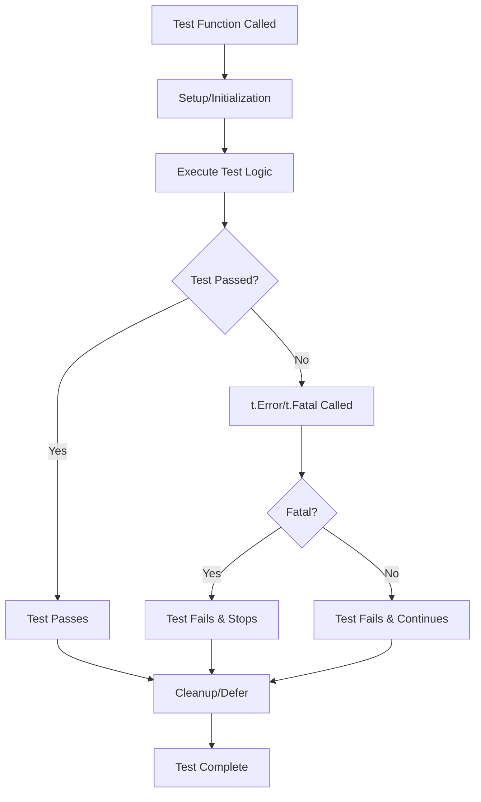
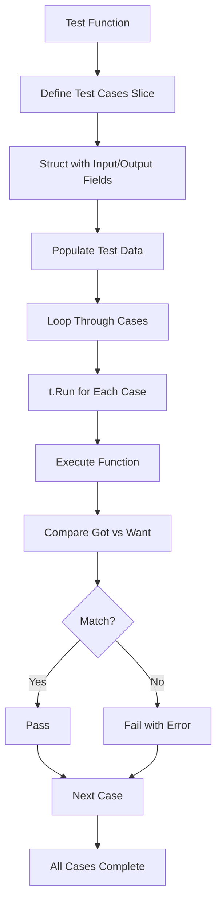
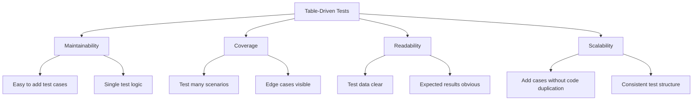
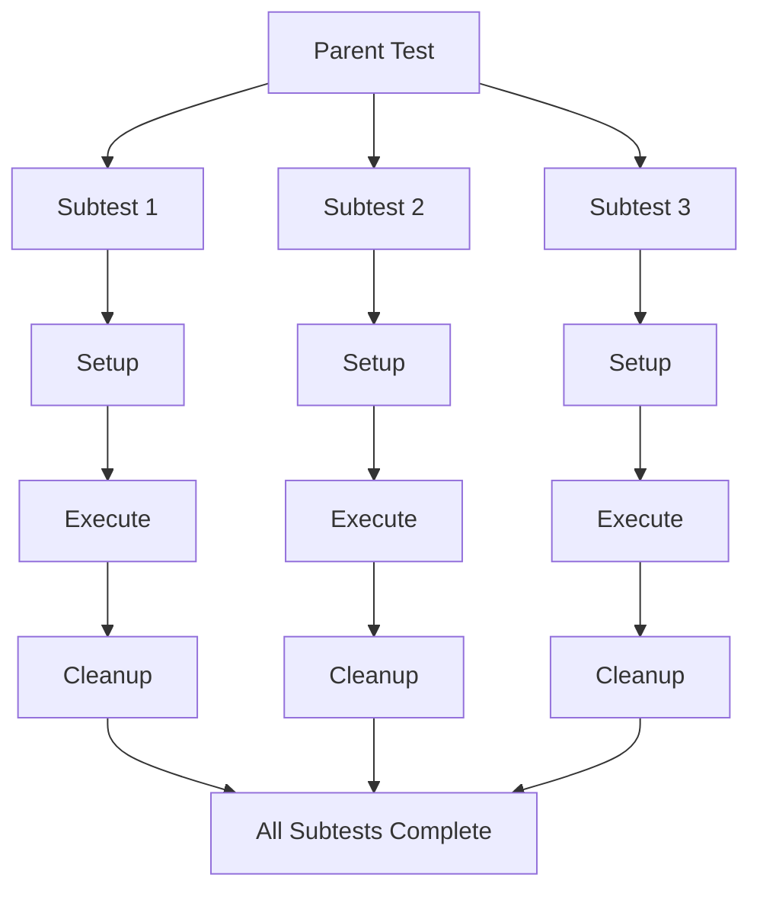
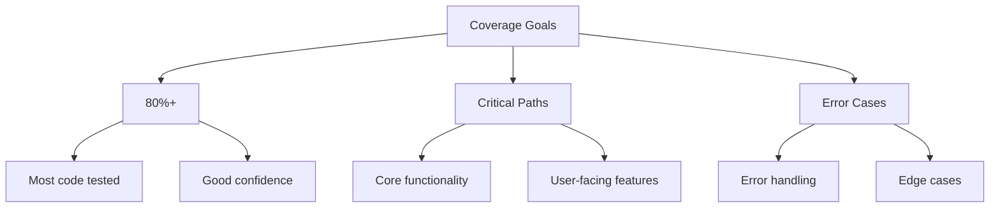

# Day 09: Testing and Benchmarking

## Learning Objectives

- Master the Go testing package and its features
- Write unit tests using the `testing` package and understand test function signatures
- Implement table-driven tests for comprehensive test coverage
- Use subtests with `t.Run()` for organized and parallel testing
- Implement mocking techniques for dependency isolation
- Detect race conditions with the race detector
- Measure test coverage with `go test -cover` and analyze coverage reports
- Write benchmarks to measure performance using `testing.B`
- Use profiling tools to identify bottlenecks
- Apply testing best practices in real-world scenarios

## Topics Covered

- Testing package fundamentals
- Table-driven tests
- Subtests and test organization
- Mocking techniques
- Race detection
- Test coverage analysis
- Benchmarking
- Profiling tools
- Best practices for effective testing

---

## 1. Testing Package Fundamentals

### What is Testing?

Testing is the practice of writing code to verify that other code behaves as expected. In Go, testing is a first-class citizen with built-in support through the `testing` package.

**Why Testing Matters**:
- **Confidence**: Verify code works before deployment
- **Regression Prevention**: Catch bugs when refactoring
- **Documentation**: Tests show how code should be used
- **Design**: Writing tests first improves code design
- **Maintenance**: Tests make code easier to modify safely

### Basic Test Structure

Go tests are simple functions that start with `Test` and take a `*testing.T` parameter.

### Test Function Signature

Test functions must start with `Test`, take `*testing.T` as a parameter, and be located in `*_test.go` files.

### Test Helper Methods

The `testing` package provides several helper methods:
- `t.Error(args ...)` - Log error and continue
- `t.Errorf(format, args ...)` - Log formatted error and continue
- `t.Fatal(args ...)` - Log error and stop test
- `t.Fatalf(format, args ...)` - Log formatted error and stop test
- `t.Log(args ...)` - Log message (verbose mode only)
- `t.Logf(format, args ...)` - Log formatted message (verbose mode only)
- `t.Skip(args ...)` - Skip test
- `t.Skipf(format, args ...)` - Skip test with reason
- `t.SkipNow()` - Skip test immediately

### Test Execution Flow



### Running Tests

Common test commands:
- `go test` - Run all tests in the current package
- `go test -v` - Run tests with verbose output
- `go test -v -run TestHelloWorld` - Run a specific test by name
- `go test -v -run TestHello` - Run tests matching a pattern

---

## 2. Table-Driven Tests

Table-driven tests separate test data from test logic, making it easy to add new test cases, see all test scenarios at once, maintain consistent test logic, and reduce code duplication.

### Why Table-Driven Tests?

- **Maintainability**: Easy to add test cases with single test logic
- **Coverage**: Test many scenarios with edge cases visible
- **Readability**: Test data clear and expected results obvious
- **Scalability**: Add cases without code duplication

### Basic Table-Driven Test Structure

A table-driven test organizes test cases in a slice of structs, then iterates through them with a consistent test logic. See `exercise_test.go` lines 7-29 for the `TestExerciseIsPalindrome` implementation.

### Table-Driven Test Anatomy



### Advantages of Table-Driven Tests



### When to Use Table-Driven Tests

Table-driven tests are ideal when:
- Testing a function with multiple input/output combinations
- Edge cases need to be visible and easy to add
- The same logic applies to all test cases
- You want to avoid code duplication

Examples in the exercises: `TestExerciseCalculateAverage` (lines 31-51), `TestExerciseFormatName` (lines 53-73)

---

## 3. Subtests and Test Organization

Subtests allow you to organize tests hierarchically and run them independently or in parallel.

### Using t.Run for Organization

`t.Run()` allows you to create named subtests that can be run independently. Each subtest receives its own `*testing.T` parameter and can have separate setup/cleanup logic.

### Combining Table-Driven Tests with Subtests

Combining table-driven tests with subtests provides excellent organization and is the recommended pattern. See `exercise_test.go` for examples:
- Lines 7-29: `TestExerciseIsPalindrome` - table-driven with subtests
- Lines 31-51: `TestExerciseCalculateAverage` - table-driven with subtests
- Lines 53-73: `TestExerciseFormatName` - table-driven with subtests

This pattern separates test data from test logic and provides clear, hierarchical test organization.

### Parallel Subtests

To run subtests in parallel, call `t.Parallel()` at the start of each subtest function. This marks the subtest as safe to run concurrently with other parallel subtests. Run tests with `go test -parallel N` to control the number of parallel goroutines.

**Important**: Only use `t.Parallel()` when subtests don't share mutable state or when state is properly synchronized.

### Subtest Execution Flow



---

## 4. Test Fixtures and Setup/Teardown

Test fixtures are pre-configured objects or state used in tests. Setup and teardown manage test initialization and cleanup.

### Setup and Teardown with defer

```go
func TestWithSetup(t *testing.T) {
    // Setup
    resource := createResource()
    
    // Cleanup with defer (runs even if test fails)
    defer func() {
        resource.Close()
    }()
    
    // Test code
    if !resource.IsValid() {
        t.Error("resource should be valid")
    }
}
```

### Test Fixtures as Helper Functions

```go
func createTestUser() *User {
    return &User{
        Name: "John Doe",
        Age: 30,
        Email: "john@example.com",
    }
}

func TestUserValidation(t *testing.T) {
    user := createTestUser()
    if err := user.Validate(); err != nil {
        t.Errorf("valid user should not error: %v", err)
    }
}
```

---

## 5. Mocking Techniques

### Interface-Based Mocking

The best way to mock in Go is by using interfaces:

```go
// Real implementation
type Database struct{}

func (d *Database) Query(query string) ([]string, error) {
    // Actual database query
}

// Interface for mocking
type Queryable interface {
    Query(string) ([]string, error)
}

// Function that depends on the interface
func GetUserData(q Queryable, userID string) (string, error) {
    rows, err := q.Query("SELECT * FROM users WHERE id = " + userID)
    if err != nil {
        return "", err
    }
    // Process rows...
}

// Mock implementation
type MockDatabase struct {
    QueryFunc func(string) ([]string, error)
}

func (m *MockDatabase) Query(query string) ([]string, error) {
    return m.QueryFunc(query)
}

// Test with mock
func TestGetUserData(t *testing.T) {
    mockDB := &MockDatabase{
        QueryFunc: func(query string) ([]string, error) {
            if query == "SELECT * FROM users WHERE id = 123" {
                return []string{"123", "John Doe", "john@example.com"}, nil
            }
            return nil, fmt.Errorf("unexpected query: %s", query)
        },
    }
    
    user, err := GetUserData(mockDB, "123")
    if err != nil {
        t.Fatalf("Unexpected error: %v", err)
    }
    if user != "John Doe" {
        t.Errorf("Expected John Doe, got %s", user)
    }
}
```

### Spy Pattern

```go
type SpyLogger struct {
    callCount int
    lastMsg   string
}

func (sl *SpyLogger) Log(msg string) {
    sl.callCount++
    sl.lastMsg = msg
}

func TestLoggerCalls(t *testing.T) {
    spy := &SpyLogger{}
    ProcessData("test", spy)
    
    if spy.callCount != 1 {
        t.Errorf("expected 1 call, got %d", spy.callCount)
    }
}
```

---

## 6. Race Detection

### The Race Detector

Go's race detector identifies data races in concurrent code:

```bash
# Run tests with race detection
go test -race ./...

# Run a specific program with race detection
go run -race main.go
```

### Common Race Conditions

```go
// BAD: Unsynchronized access to shared variable
var counter int

func increment() {
    counter++ // RACE CONDITION
}

// GOOD: Using mutex for synchronization
var (
    counter int
    mu      sync.Mutex
)

func increment() {
    mu.Lock()
    defer mu.Unlock()
    counter++
}

// GOOD: Using atomic operations
var counter int64

func increment() {
    atomic.AddInt64(&counter, 1)
}
```

### Race Detector Output

When a race is detected, the output shows:
1. The race description
2. Stack traces of the conflicting goroutines
3. Memory address involved
4. Timestamp information

---

## 7. Test Coverage

Test coverage measures what percentage of code is executed by tests.

### Measuring Coverage

```bash
go test -cover              # Show coverage percentage
go test -coverprofile=coverage.out  # Generate coverage profile
go tool cover -html=coverage.out    # View coverage in browser
```

### Coverage Report Example

```
coverage: 85.2% of statements
ok      mypackage  0.234s
```

### Analyzing Coverage Profiles

```bash
# Generate coverage profile
go test -coverprofile=coverage.out ./...

# View in HTML (shows which lines are covered)
go tool cover -html=coverage.out

# Show coverage for specific function
go tool cover -func=coverage.out | grep FunctionName
```

### Coverage Goals



### Best Practices

- Aim for high coverage but don't sacrifice test quality
- Focus on testing complex logic and edge cases
- Use coverage to identify untested code, not as a quality metric
- Remember that 100% coverage doesn't mean bug-free code

---

## 8. Benchmarking

Benchmarks measure code performance. They run a function many times and measure execution time.

### Basic Benchmark Structure

Benchmarks are similar to tests but start with `Benchmark` and use `*testing.B`:

```go
func BenchmarkIsPalindrome(b *testing.B) {
    for i := 0; i < b.N; i++ {
        IsPalindrome("racecar")
    }
}
```

### How Benchmarks Work

- `b.N` is the number of iterations to run
- The testing framework adjusts `b.N` to get a reliable measurement
- Reports time per operation (ns/op)

### Running Benchmarks

```bash
go test -bench=.           # Run all benchmarks
go test -bench=BenchmarkAdd # Run specific benchmark
go test -bench=. -benchmem  # Include memory allocation stats
go test -bench=. -benchtime=10s # Run for 10 seconds
```

### Benchmark Examples

```go
func BenchmarkStringConcat(b *testing.B) {
    for i := 0; i < b.N; i++ {
        _ = "hello" + "world"
    }
}

func BenchmarkStringBuilder(b *testing.B) {
    var sb strings.Builder
    for i := 0; i < b.N; i++ {
        sb.Reset()
        sb.WriteString("hello")
        sb.WriteString("world")
        _ = sb.String()
    }
}
```

### Benchmark with Setup

Use `b.ResetTimer()` to exclude setup time from the benchmark measurement:

```go
func BenchmarkWithSetup(b *testing.B) {
    // Setup code (not included in timing)
    data := setupData()
    
    b.ResetTimer()
    
    for i := 0; i < b.N; i++ {
        processData(data)
    }
}
```

### Benchmark Results

```
goos: darwin
goarch: amd64
pkg: github.com/username/project
BenchmarkStringConcat-8          12345678          95.2 ns/op
BenchmarkStringBuilder-8         45678901          28.7 ns/op
PASS
ok  	github.com/username/project	0.123s
```

### Benchmark Output Interpretation

```
BenchmarkAdd-8              1000000000   1.23 ns/op   0 B/op   0 allocs/op
│                           │            │             │        │
│                           │            │             │        └─ Allocations per operation
│                           │            │             └────────── Bytes allocated per operation
│                           │            └─────────────────────── Nanoseconds per operation
│                           └──────────────────────────────────── Iterations
└─────────────────────────────────────────────────────────────── Benchmark name and GOMAXPROCS
```

### Benchmark Tips

- Keep benchmarks deterministic
- Avoid allocating memory in the loop if measuring pure computation
- Use `b.ResetTimer()` to exclude setup time
- Use `b.StopTimer()` and `b.StartTimer()` to exclude cleanup
- Run benchmarks multiple times for consistency
- Be aware of CPU caching effects

---

## 9. Profiling

### CPU Profiling

```bash
# Run test with CPU profile
go test -cpuprofile=cpu.out ./...

# Analyze the profile
go tool pprof -http=:8080 cpu.out
```

### Memory Profiling

```bash
# Run test with memory profile
go test -memprofile=mem.out ./...

# Analyze the profile
go tool pprof -http=:8080 mem.out
```

### Block Profiling

```bash
# Run test with block profile (synchronization)
go test -blockprofile=block.out ./...

# Analyze the profile
go tool pprof -http=:8080 block.out
```

### Profiling Commands in pprof

- `top`: Show top functions
- `list function_name`: Show source code for a function
- `web`: Generate SVG call graph (requires graphviz)
- `png`: Generate PNG call graph

---

## 10. Test Helpers and Utilities

Helper functions reduce duplication and improve test readability.

### Assertion Helpers

```go
func assertEqual(t *testing.T, got, want interface{}) {
    t.Helper()  // Mark as helper (improves error reporting)
    if got != want {
        t.Errorf("got %v, want %v", got, want)
    }
}

func TestWithHelper(t *testing.T) {
    result := Add(2, 3)
    assertEqual(t, result, 5)
}
```

### Table-Driven Test Helpers

```go
type TestCase struct {
    name string
    input string
    want string
}

func runTests(t *testing.T, tests []TestCase, fn func(string) string) {
    for _, tt := range tests {
        t.Run(tt.name, func(t *testing.T) {
            got := fn(tt.input)
            if got != tt.want {
                t.Errorf("got %q, want %q", got, tt.want)
            }
        })
    }
}
```

---

## 11. Best Practices

### Test Organization

1. Place test files alongside the code they test (`*_test.go`)
2. Use clear, descriptive test names
3. Group related tests in table-driven formats
4. Use subtests for logical grouping
5. Keep test functions focused on one thing

### Test Quality

1. Test behavior, not implementation details
2. Test edge cases and error conditions
3. Keep tests independent and isolated
4. Make tests fast and reliable
5. Use table-driven tests for multiple scenarios
6. Test the public API, not internal details

### Do's

- ✅ Use table-driven tests for multiple cases
- ✅ Name tests clearly and descriptively
- ✅ Test error cases and edge cases
- ✅ Use subtests for organization
- ✅ Keep tests independent and isolated
- ✅ Use `t.Helper()` for helper functions
- ✅ Clean up resources with `defer`
- ✅ Test interfaces, not implementations
- ✅ Use benchmarks to track performance
- ✅ Aim for 80%+ code coverage

### Don'ts

- ❌ Don't test implementation details
- ❌ Don't create test interdependencies
- ❌ Don't ignore test failures
- ❌ Don't write tests that are harder to understand than the code
- ❌ Don't skip error case testing
- ❌ Don't use `time.Sleep()` in tests
- ❌ Don't hardcode file paths
- ❌ Don't test multiple concerns in one test
- ❌ Don't ignore benchmark results
- ❌ Don't leave TODO tests in production code

### Performance Testing

1. Benchmark critical paths
2. Benchmark before and after optimizations
3. Profile to find bottlenecks
4. Don't optimize without measuring
5. Consider real-world usage patterns

### Continuous Integration

1. Run tests on every commit
2. Include race detection in CI
3. Monitor test coverage trends
4. Fail builds on test failures
5. Cache dependencies for faster test runs

---

## 12. Common Testing Patterns

### Arrange-Act-Assert Pattern

```go
func TestTransfer(t *testing.T) {
    // Arrange
    account1 := NewAccount(100)
    account2 := NewAccount(50)
    
    // Act
    err := Transfer(account1, account2, 30)
    
    // Assert
    if err != nil {
        t.Errorf("unexpected error: %v", err)
    }
    if account1.Balance() != 70 {
        t.Errorf("account1 balance = %d, want 70", account1.Balance())
    }
    if account2.Balance() != 80 {
        t.Errorf("account2 balance = %d, want 80", account2.Balance())
    }
}
```

### Given-When-Then Pattern

```go
func TestUserCreation(t *testing.T) {
    // Given
    userData := UserData{Name: "John", Age: 30}
    
    // When
    user, err := CreateUser(userData)
    
    // Then
    if err != nil {
        t.Fatalf("unexpected error: %v", err)
    }
    if user.Name != "John" {
        t.Errorf("name = %q, want %q", user.Name, "John")
    }
}
```

---

## Summary

Effective testing is crucial for building reliable Go applications. By mastering the testing package, table-driven tests, mocking techniques, race detection, coverage analysis, benchmarking, and profiling, you can create a robust test suite that catches bugs early, documents expected behavior, and helps optimize performance.

In the exercises, you'll practice writing table-driven tests, implementing mocks, detecting race conditions, measuring coverage, writing benchmarks, and using profiling tools to analyze your code.

---

## Key Takeaways

1. **Table-driven tests reduce duplication** - Separate test data from test logic for maintainability and scalability
2. **Subtests enable organization and parallelization** - Use `t.Run()` to group related tests and run them concurrently
3. **Mock via interfaces, not concrete types** - Design code to depend on interfaces for easy testing and isolation
4. **Race detector catches concurrency bugs** - Always run `go test -race` to detect unsafe concurrent access
5. **Coverage identifies untested code** - Use `go test -cover` to find gaps, but don't optimize for percentage alone
6. **Benchmarks measure real performance** - Use `testing.B` to track performance regressions and optimize hotspots
7. **Profiling reveals bottlenecks** - Use CPU, memory, and block profiling with `go tool pprof` to find optimization targets
8. **Test helpers improve readability** - Use `t.Helper()` to mark helper functions and improve error reporting
9. **Arrange-Act-Assert clarifies intent** - Structure tests with setup, execution, and verification for clarity
10. **Test in CI/CD pipelines** - Automate testing, coverage checks, and race detection in continuous integration

---

## Further Reading

- [Testing Package Documentation](https://pkg.go.dev/testing) - Official Go testing package reference
- [Table-Driven Tests](https://github.com/golang/go/wiki/TableDrivenTests) - Go wiki guide on table-driven testing
- [Effective Go: Testing](https://go.dev/doc/effective_go#testing) - Best practices for Go testing
- [Go by Example: Testing](https://gobyexample.com/testing) - Practical testing examples
- [Race Detector](https://golang.org/doc/articles/race_detector) - Detecting data races in concurrent code
- [Benchmarking Go Code](https://dave.cheney.net/2013/06/30/how-to-write-benchmarks-in-go) - Comprehensive benchmarking guide
- [Profiling Go Programs](https://go.dev/blog/profiling-go-programs) - Using pprof for performance analysis
- [Go Testing Best Practices](https://golang.org/doc/effective_go#testing) - Official best practices
- [Testify Package](https://github.com/stretchr/testify) - Popular assertion and mocking library
- [Go Test Coverage](https://golang.org/cmd/cover/) - Coverage tool documentation
